# Grafana & Prometheus 的 Springboot 应用程序监控

> 原文：<https://medium.com/javarevisited/springboot-app-monitoring-with-grafana-prometheus-7c723f0dec15?source=collection_archive---------0----------------------->

伴随着微服务的优势，我们也遇到了很多挑战。其中一个挑战是为我们的应用程序建立一个可靠的监控系统。在这里，让我们尝试用 Grafana 仪表板和 Prometheus 设置一个基本的 Springboot 应用程序监控。

[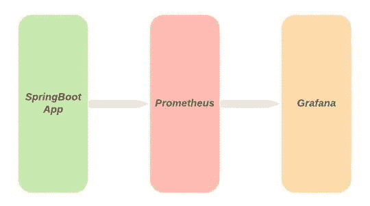](https://medium.com/javarevisited/5-best-courses-to-learn-spring-cloud-and-microservices-1ddea1af7012)

## 先决条件

*   [Java](/javarevisited/top-5-java-online-courses-for-beginners-best-of-lot-1e1e240a758)
*   [码头工人](/javarevisited/5-best-docker-courses-for-java-and-spring-boot-developers-bbf01c5e6542)
*   Springboot 应用程序的基础知识

## SpringBoot 应用

使用 [Spring Boot 的首字母](https://start.spring.io/)创建一个简单的 Springboot Maven 应用程序。生成 app 时添加依赖 *Spring Boot 执行器*和 *Spring Boot Web* 。

[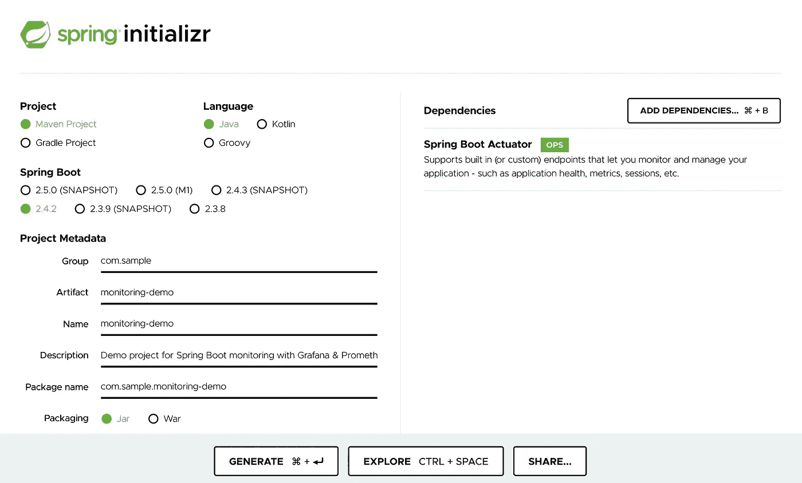](https://www.java67.com/2017/11/top-5-free-core-spring-mvc-courses-learn-online.html)

从 Springboot Initializr 页面提取使用 *Generate* 创建的 zip 文件。在 *pom.xml* 文件中添加下面的依赖关系，用于公开普罗米修斯格式的度量数据

```
<dependency>
   <groupId>io.micrometer</groupId>
   <artifactId>micrometer-registry-prometheus</artifactId>
   <version>1.6.3</version>
</dependency>
```

最终的 pom.xml 应该如下所示。

```
<?xml version="1.0" encoding="UTF-8"?>
<project  xmlns:xsi="http://www.w3.org/2001/XMLSchema-instance"
   xsi:schemaLocation="http://maven.apache.org/POM/4.0.0 https://maven.apache.org/xsd/maven-4.0.0.xsd">
   <modelVersion>4.0.0</modelVersion>
   <parent>
      <groupId>org.springframework.boot</groupId>
      <artifactId>spring-boot-starter-parent</artifactId>
      <version>2.4.2</version>
      <relativePath/> <!-- lookup parent from repository -->
   </parent>
   <groupId>com.sample</groupId>
   <artifactId>monitoring-demo</artifactId>
   <version>0.0.1-SNAPSHOT</version>
   <name>monitoring-demo</name>
   <description>Demo project for Spring Boot monitoring with Grafana &amp; Prometheus</description>
   <properties>
      <java.version>11</java.version>
   </properties>
   <dependencies>
      <dependency>
         <groupId>org.springframework.boot</groupId>
         <artifactId>spring-boot-starter-web</artifactId>
      </dependency>
      <dependency>
         <groupId>org.springframework.boot</groupId>
         <artifactId>spring-boot-starter-actuator</artifactId>
      </dependency>
      <dependency>
         <groupId>io.micrometer</groupId>
         <artifactId>micrometer-registry-prometheus</artifactId>
         <version>1.6.3</version>
      </dependency>
      <dependency>
         <groupId>org.springframework.boot</groupId>
         <artifactId>spring-boot-starter-test</artifactId>
         <scope>test</scope>
      </dependency>
   </dependencies>

   <build>
      <plugins>
         <plugin>
            <groupId>org.springframework.boot</groupId>
            <artifactId>spring-boot-maven-plugin</artifactId>
         </plugin>
      </plugins>
   </build>

</project>
```

现在将下面的配置添加到您的 *application.yml* 文件*中。*spring*initializr*创建一个 *application.properties* 文件，我更喜欢 YAML 因此有了 *yml* 文件，但是如果你是属性文件格式的粉丝。请放心使用。

```
management:
  endpoint:
    metrics:
      enabled: true
    prometheus:
      enabled: true
  endpoints:
    web:
      exposure:
        include: prometheus
```

这将暴露普罗米修斯格式的数据。现在是时候启动你的 Springboot 应用程序了。一旦应用程序启动，尝试点击下面的网址，看看指标暴露。

[http://localhost:8080/actuator/Prometheus](http://localhost:8080/actuator/prometheus)

输出应该如下所示，带有关于 JVM 的指标。

[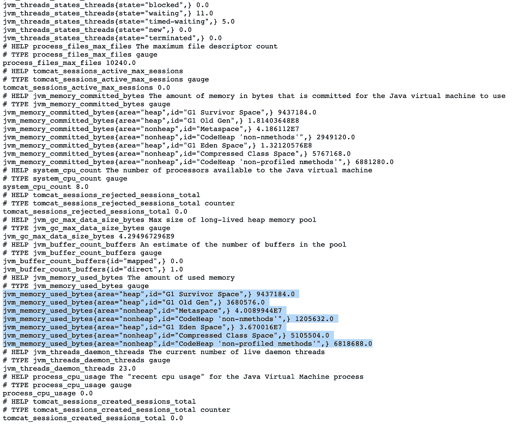](https://www.java67.com/2020/09/how-to-increasing-heap-size-in-java.html)

## 普罗米修斯

既然应用程序公开了度量数据，让我们设置 Prometheus 来使用它。我们将使用普罗米修斯码头形象提出普罗米修斯。为此，让我们确保我们有所需的配置集。用下面的内容创建一个名为 *prometheus.yml* 的文件。该文件可以在任何地方创建，但我们需要在启动 Prometheus 时将文件的路径传递给 docker。请确保用您的系统 IP 替换 SYSTEM_IP。

```
global:
  scrape_interval:     15s *# Default scrape interval* scrape_configs:
  - job_name: 'prometheus' *# Job to scrape Prometheus metrics* scrape_interval: 5s
    static_configs:
      - targets: ['localhost:9090']

  - job_name: 'spring-actuator'
    metrics_path: '/actuator/prometheus' *# Job to scrape application metrics* scrape_interval: 5s
    static_configs:
      - targets: ['SYSTEM_IP:8080']
```

从终端使用下面的 docker 命令打开 Prometheus。

```
docker run -d -p 9090:9090 -v \<absolute_path_to_your_prometheus_file>:/etc/prometheus/prometheus.yml prom/prometheusexample: docker run -d -p 9090:9090 -v \ /mydisk/monitoring/src/main/resources/prometheus.yml:/etc/prometheus/prometheus.yml prom/prometheus
```

一旦映像启动并运行，尝试点击 URL[http://localhost:9090/](http://localhost:9090/)。应加载以下页面。

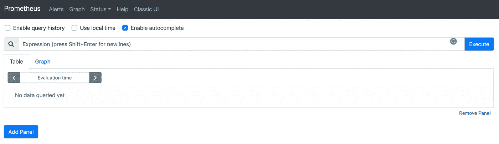

导航到 UI 标题栏中*状态*下的*目标*。

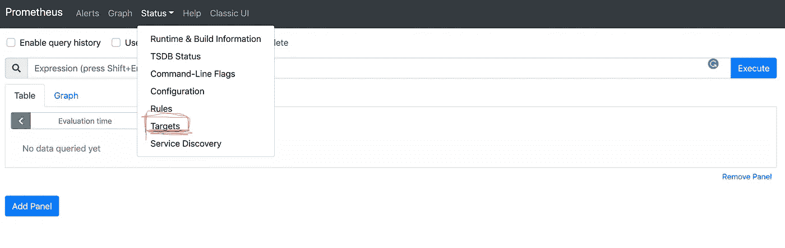

在 targets 下，我们应该能够看到我们在状态为`UP`的 *prometheus.yml* 文件中定义的两个端点。

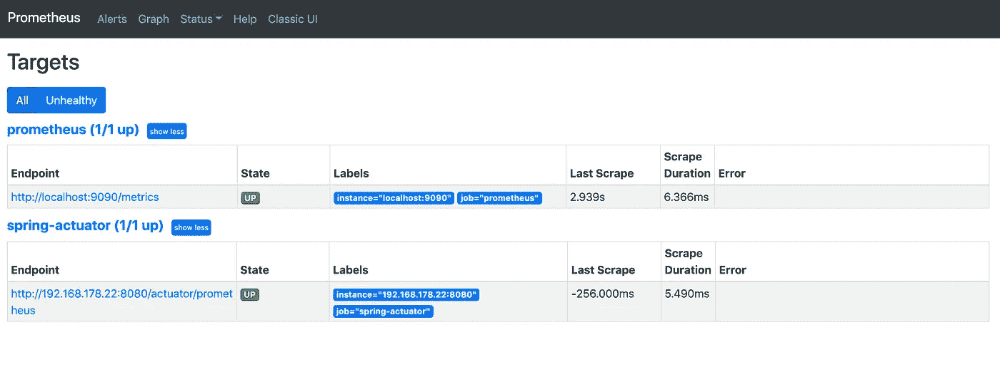

Prometheus 还有一个 *graph* 选项，可以用来创建一些度量的图形表示。但是这里让我们将 Prometheus 连接到 Grafana，以便创建一些很酷的监控仪表板。

## 格拉夫纳

现在，系统的最后一部分，让我们打开 Grafana 并将其连接到我们现在创建的 Prometheus 实例。这里我们也将使用 docker 来调出 Grafana。使用下面的 docker 命令来启动 Grafana。

```
docker run -d -p 3000:3000 grafana/grafana
```

一旦映像启动并运行，点击 URL[http://localhost:3000](http://localhost:3000/login)访问 Garafana。您需要提供用户名和密码才能登录。Grafana 的默认用户名和密码是`admin`。用它登录。

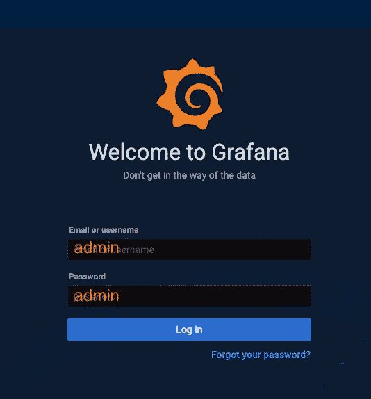

登录后，点击配置*数据源*将普罗米修斯添加为`Datasource`

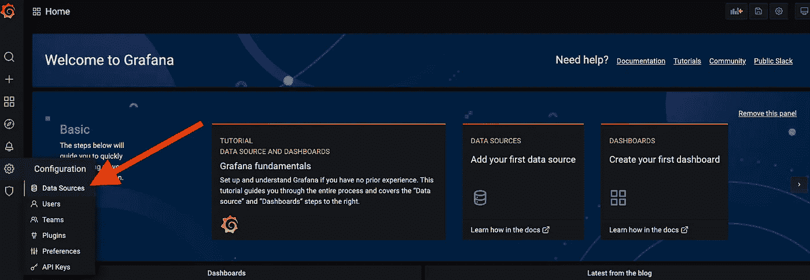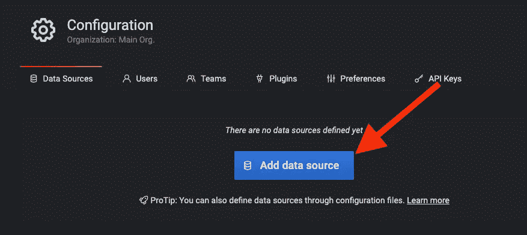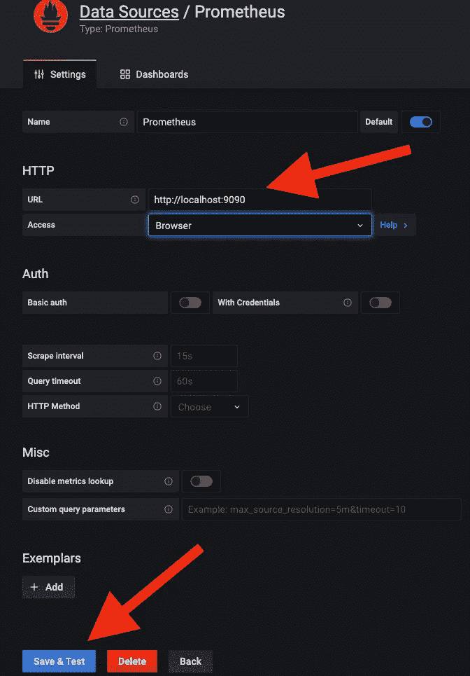

我们现在已经添加了数据源。下一步是导入一个仪表板，以深入了解我们从应用程序推送给 Prometheus 的指标。首先，让我们导入一个由 Micrometer 提供的现有仪表板。

你可以在 Grafana 网站[https://grafana.com/grafana/dashboards/4701](https://grafana.com/grafana/dashboards/4701)找到关于这个仪表板的更多细节。为了导入仪表板，点击侧边栏中*创建*下的*导入*选项。

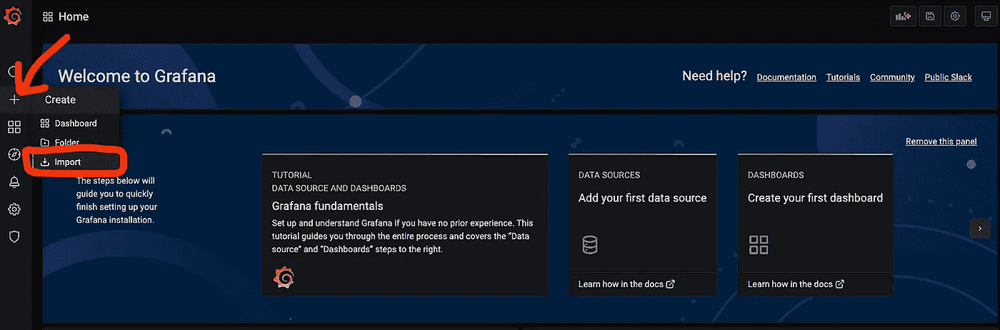

然后导入带有Prometheus 数据源的千分尺 JVM 仪表板 *4701* ，如下图截图所示。

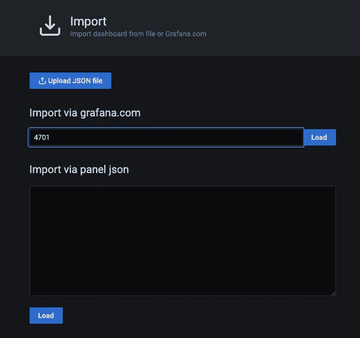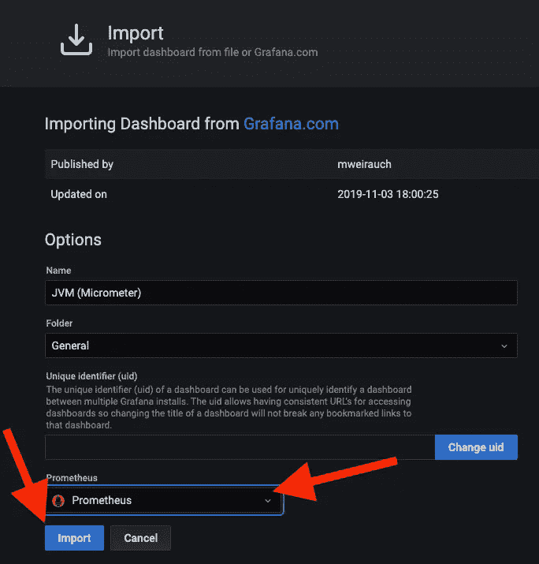

万岁！您已经启动并运行了 JVM 仪表板。

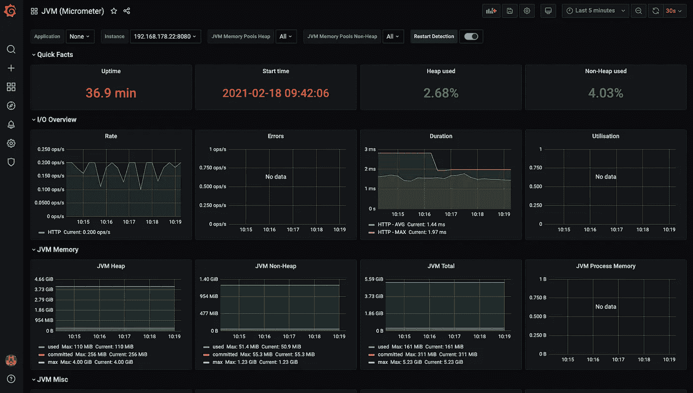

在这篇博客中，我们用 Grafana over Prometheus 建立了一个基本的仪表板，它与 Springboot 应用程序相连。这仅仅是个开始，您还可以尝试使用 [Java Micrometer](https://micrometer.io/docs/concepts) 创建自定义指标，或者使用已经可用的指标在 Garafana 中创建自定义仪表板。

## 参考

如果你需要更多关于我们使用的工具的信息，你可以在下面的链接中找到

[](https://prometheus.io/) [## 普罗米修斯监测系统和时间序列数据库

### 利用领先的开源监控解决方案增强您的指标和警报能力。普罗米修斯作者 2014-2021 |…

普罗米修斯](https://prometheus.io/) [](https://grafana.com/) [## Grafana:开放观察平台

### Grafana 是适用于所有数据库的开源分析和监控解决方案。

grafana.com](https://grafana.com/) 

> 免责声明:这篇博客/文章中提到的观点是我自己的，并不反映我现在工作的组织或我以前工作的组织。