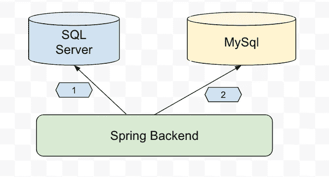
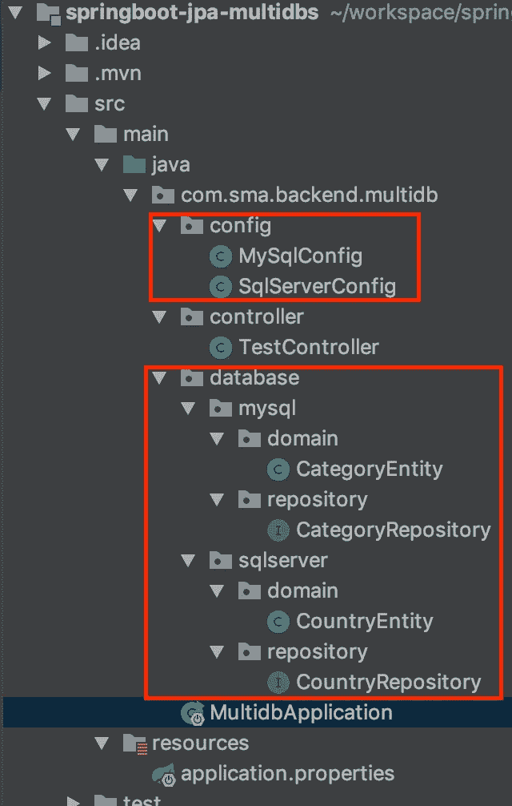

# SpringBoot 与 spring data JPA 使用多数据源数据库 MySql + SQLServer

> 原文：<https://medium.com/javarevisited/springboot-with-spring-data-jpa-using-multi-data-source-databases-mysql-sqlserver-3ce5f69559?source=collection_archive---------0----------------------->



在大多数情况下，项目是通过连接单个数据库实例和后面的从属实例来构建和设计的。很少在互联网上看到在生产环境中使用多个数据库的项目样本。

在本文中，我将指导您完成构建后端应用程序的过程，该应用程序将 Spring Data JPA 与多个关系数据库结合使用。在这种情况下，我们将连接到 SQL Server 和 MySql 数据库。

# 概观

**JPA** — Java 持久性 API 提供了一个规范，用于将数据从 Java 对象持久化、读取和管理到数据库的关系表中。

**Spring Data JPA** 是用于访问数据层的 Spring 框架的核心部分之一。Spring Data JPA 的主要目标是显著减少为 RDMS 或 NoSQL 的各种持久性存储实现数据访问层所需的样板代码行的数量。

<https://spring.io/projects/spring-data-jpa>  

# 先决条件

在开始之前，您可能需要具备以下一些基本知识

```
- Java8
- Spring framework
- Maven build
- Database SQL Statement
- IDE ( eclipse / IDEA / STS / other tools)
```

# 技术

在本项目中，我们将使用以下主要技术

> -spring boot 2
> -spring data JPA
> -databases(MySQL+SQL server)
> -lombok

# **结构**



项目结构

# 属国

在这个例子中，我们使用 maven 作为构建工具

```
<parent>
<groupId>org.springframework.boot</groupId>
    <artifactId>spring-boot-starter-parent</artifactId>
    <version>**2.2.4.RELEASE**</version>
    <relativePath/> <!-- lookup parent from repository -->
</parent>
......<dependency>
    <groupId>org.springframework.boot</groupId>
    <artifactId>**spring-boot-starter-web**</artifactId>
</dependency>
<dependency>
    <groupId>org.springframework.boot</groupId>
    <artifactId>**spring-boot-starter-data-jpa**</artifactId>
</dependency>

<dependency>
    <groupId>com.microsoft.sqlserver</groupId>
    <artifactId>**mssql-jdbc**</artifactId>
    <scope>runtime</scope>
</dependency>
<dependency>
    <groupId>mysql</groupId>
    <artifactId>**mysql-connector-java**</artifactId>
    <scope>runtime</scope>
</dependency>
<dependency>
    <groupId>org.projectlombok</groupId>
    <artifactId>lombok</artifactId>
    <optional>true</optional>
</dependency>
```

# Springboot MySql 数据库配置

数据库 1:带有 spring JPA 注释的 MySql 配置，该数据库是该项目的主要数据库。

MySQL 数据库配置

**@Primary** 注释用于在有多个相同类型的 bean(data source properties)时给 bean 更高的优先级。 [@Primary](http://twitter.com/Primary) 注释可以用在任何直接或间接用 [**@Component**](http://twitter.com/Component) 注释的类上，或者用 [**@Bean**](http://twitter.com/Bean) **注释的方法上。**

# 带 spring boot 配置的 SqlServer 数据库

连接数据库 2: SQL_SERVER

SQL 数据库配置

# 应用程序.属性

```
##MySql
spring.datasource.url=jdbc:mysql://localhost/jpa?createDatabaseIfNotExist=true&autoReconnect=true&useSSL=false
spring.datasource.username=root
spring.datasource.password=password

spring.jpa.database=*default* spring.jpa.hibernate.ddl-auto=update
spring.jpa.generate-ddl=**true** spring.jpa.show-sql=**true** ##SQL Server
sqlserver.datasource.url=jdbc:sqlserver://127.0.0.1;databaseName=jpa_test
sqlserver.datasource.username=sa
sqlserver.datasource.password=jEe8BUkAta32sA
```

<https://javarevisited.blogspot.com/2018/02/top-5-restful-web-services-with-spring-courses-for-experienced-java-programmers.html#axzz61O27yGjY>  

# 休息控制器

在这个例子中，我们公开了三个 API 来处理从数据库中插入和检索数据。

1.  创建新的类别 API
2.  创建新的国家 API
3.  从两个数据库中检索所有数据 API

# DAO 知识库

这是我们定义映射到数据库的接口类 spring JPA 数据访问层的地方。

1.  **Mysql 数据库**

```
package **com.sma.backend.multidb.database.mysql.repository**;

import com.sma.backend.multidb.database.mysql.domain.CategoryEntity;
import org.springframework.data.jpa.repository.JpaRepository;
import org.springframework.stereotype.Repository;

@Repository
public interface **CategoryRepository** extends JpaRepository<CategoryEntity, Long> {

}
```

*   **SqlServer 存储库**

```
package **com.sma.backend.multidb.database.sqlserver.repository;**

import com.sma.backend.multidb.database.sqlserver.domain.CountryEntity;
import org.springframework.data.jpa.repository.JpaRepository;
import org.springframework.stereotype.Repository;

@Repository()
public interface CountryRepository extends JpaRepository<CountryEntity, Long> {

}
```

# **域实体**

我们定义 Java POJO 类来映射到数据库表数据模型。

*   MySQL 域名实体:CategoryEntity.java

```
package **com.sma.backend.multidb.database.mysql.domain**;

import lombok.Data;
import javax.persistence.*;

@Entity
@Table(name = "category")
@Data
public class CategoryEntity {

    @Id
    @GeneratedValue(strategy = GenerationType.*IDENTITY*)
    private long id;

    @Column
    private String name;

    @Column
    private String description;

}
```

*   sqlServer 域实体:**CountryEntity.java**

```
package com.sma.backend.multidb.database.sqlserver.domain;

import lombok.Data;
import javax.persistence.*;

@Entity
@Table(name = "country")
@Data
public class CountryEntity {

    @Id
    @GeneratedValue(strategy = GenerationType.*IDENTITY*)
    private long id;

    @Column
    private String name;

    @Column
    private String isoCode;

}
```

<https://javarevisited.blogspot.com/2018/06/top-6-spring-framework-online-courses-Java-programmers.html>  

# 数据库

如果您的本地或其他服务器上已经有数据库实例，则可以通过更改 application.properties 数据源来连接到它们。

否则，为了在本地开发中进行测试，您可以使用 docker 并在 [**Docker 引擎**](https://www.docker.com/) 中安装数据库(Mysql 和 SqlServer)

*   在 docker 模式下安装 SQL Server DB

```
> docker run --name sqlserver1  -e 'ACCEPT_EULA=Y' -e 'MSSQL_SA_PASSWORD=jEe8BUkAta32sA' -e 'MSSQL_PID=Enterprise' -p 1433:1433 -d microsoft/mssql-server-linux

#create first database name: jpa_test

> docker exec -it sqlserver1 /opt/mssql-tools/bin/sqlcmd -S localhost -U sa -P 'jEe8BUkAta32sA' -Q "CREATE DATABASE jpa_test" 
```

*   用 docker 安装 Mysql 数据库

```
 > docker run --name  mysql -p 3306:3306 -e MYSQL_ROOT_PASSWORD=password -d mysql:5.7

*#### create database only first time* 
> docker exec -it mysql bash
mysql -uroot -ppassword -h127.0.0.1
create database jpa  CHARACTER SET utf8 COLLATE utf8_general_ci; 
```

# 构建可执行的 JAR

```
# build and run application with spring-boot development
> mvn spring-boot:run# or run jar file as stand alone
> mvn clean package && java -jar target/multidb-0.0.1-SNAPSHOT.jar
```

# **测试 REST-API**

```
# create a new category

curl -X POST \
  http://localhost:8080/api/category \
  -H 'content-type: application/json' \
  -d '{"name":"category1","description":"description1"}'

#create a new country

curl -X POST \
  http://localhost:8080/api/country \
  -H 'content-type: application/json' \
  -d '{ "name":"camboida", "isoCode":"kh"}'

#get all data

curl -X GET http://localhost:8080/api/all

{
"country":[{"id":1,"name":"camboida","isoCode":"kh"}],
"category"[{"id":1,"name":"category1","description":"description1"}]
}
```

# 摘要

希望这篇文章能对你有所帮助，增长你的见识。

如果这篇文章有帮助，请支持按下**按钮**👏按钮，并帮助与其他读者分享这个故事。

完整的源代码可以在 GitHub 上找到。

</javarevisited/10-advanced-spring-boot-courses-for-experienced-java-developers-5e57606816bd>  </javarevisited/top-5-courses-to-learn-microservices-in-java-and-spring-framework-e9fed1ba804d>  </javarevisited/5-best-spring-data-jpa-courses-for-java-developers-45e6438be3c9> 