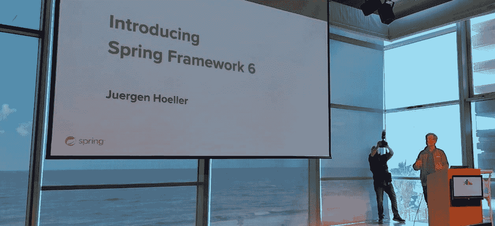
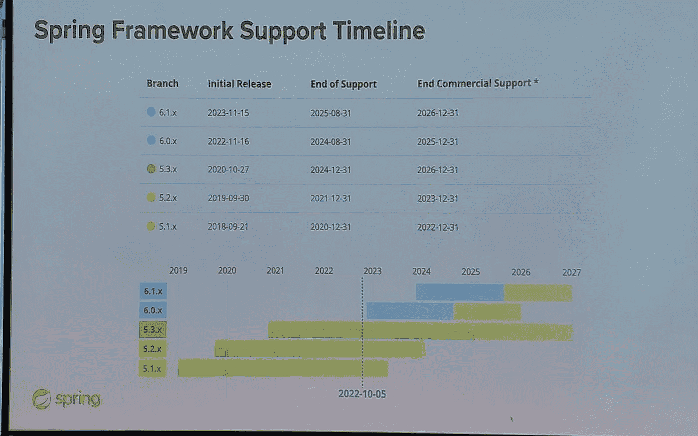
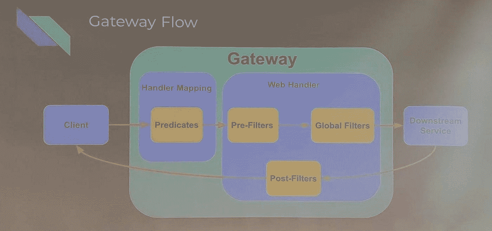
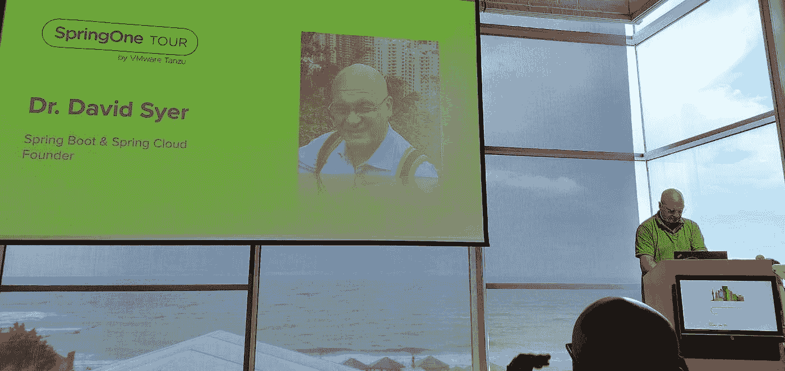

# SpringOne TLV 世界巡回赛旅行报告

> 原文：<https://medium.com/javarevisited/springone-tlv-world-tour-trip-report-90419bce55c4?source=collection_archive---------4----------------------->

我的演讲被旧金山的 SpringOne 接受了。我从未去过那个会议，但我真的很期待。今年，Spring 6.0 和 Spring Boot 3.0 的发布可能会令人惊讶。如此多的突破性变化。不幸的是，我在 Lightrun 的旅行预算被削减了，我最终离开了。这意味着我不得不取消旅行，我会支付旅费，但旧金山既远又贵。我将不得不改天。

这并不完全是一种替代，但一个骨干的春季团队正在进行“世界巡演”，上周到达特拉维夫，我参加了。地点是一个我从未去过的地方，佩雷斯创新中心。它在雅法海滩上，你可以从主舞台上看到海浪拍打海滩。看看下面的照片，你可以在其中一些照片中看到海滩上的人们。那是一个奇妙的场地。唯一的缺点是离我居住的特拉维夫市中心很远。但是和美国的距离相比，这算不了什么…

该活动有来自 80 多个组织的 600 多名注册者。这是第一次在北美以外的地方春游，很酷。会谈是用我喜欢的英语进行的，但是以色列口音有时很难理解(是的，我知道)。不幸的是，我不得不早点离开，因为我得去接孩子。

在我们继续之前，我想说一些关于 Twitter 的事情。在过去的一个月里，我搬到了乳齿象馆，那里非常棒。甚至还有列出乳齿象上杰出社区成员的 [Java Bubble](https://javabubble.org/) 。Foojay [添加了自己的实例](https://foojay.io/today/foojay-mastodon-service-here-it-is/)并且兴趣很高。

我认为没有理由继续留在 Twitter 上。它是有毒的，而且越来越毒。我仍然有我的账户，我有一个桥梁来发布我的乳齿象帖子。所以如果你跟着我，你不会错过任何东西。但是我不会经常去那里，也不会在那里发帖。这篇文章和以后的文章中的所有链接都将引用其他网络，无论是 LinkedIn 还是乳齿象。

# juergen ho eller——Spring Framework 6 简介

Spring Framework 6 是框架的重新对齐。Juergen 精心挑选作品，注重春季版本的保守性和与以往版本的兼容性。Spring Framework 5.3.x 在很大程度上基于 JDK 8。它耦合到了 [Java EE](/javarevisited/top-7-online-courses-to-learn-java-ee-jakarta-ee-in-2020-216c1a5eea99) 和旧的 javax 名称空间。它在 2024 年之前一直受到开源支持，这意味着我们需要制定迁移计划…

Spring Framework 6.x 做了一些改变:

*   JDK 17 岁以上
*   Jakarta EE 而不是 Java EE 和 javax 名称空间
*   AOT 支持
*   虚拟线程(织机)

这将是 Spring Boot 3.x 的基础。我预见最大的挑战是 JDK 17 的要求。这可能会给一些迁移带来挑战。当我们进行这些迁移时，我们可能会使用更多的集装箱。理想情况下，这将使未来的迁移更加容易。JDK 17 号有一些奇妙的功能。Juergen 在语言特性上花了很多精力，但是在容器方面有一些很好的 GC 改进，这使得升级在企业中是值得的。

迁移到 Jakarta API 是不可避免的，因为旧 API 的包不再更新。这将是迁移的痛苦，但这是不可避免的。这将需要任何依赖这些 API 的人来移动这些代码。整个 Java 生态系统转向了快速发布周期，像 Tomcat 这样的框架的更新速度也更快了。于尔根建议跳过雅加达 EE 9 直接上 10。

Spring Framework 6.1 仍将支持 JDK 17，但它也将增加对 JDK 21 的支持，届时该版本应该会推出。Jakarta EE 10 将是该版本的首选框架。

AOT 是一种折衷:额外的构建设置和运行时灵活性的降低。减少生产中的启动时间和内存占用。GraalVM 是本机可执行文件的事实上的标准。它有一个强大的封闭世界的假设，没有运行时适应。构建时间非常长。就我个人而言，我不认为一个构建 AOT JVM 的人有那么长的时间。

OpenJDK 静态图像(莱登项目)。 [Spring 的](/javarevisited/top-10-free-courses-to-learn-spring-framework-for-java-developers-639db9348d25) AOT 战略正与莱顿的 JVM 战略保持一致。从预热的 JVM 映像( [CRaC](https://foojay.io/today/introducing-the-openjdk-coordinated-restore-at-checkpoint-project/) )开始也是快速 Spring 应用程序引导的一个有前途的选择。预计 Spring Framework 6.1 将提供对 CRaC 的一流支持。

Project Loom 是 JDK 19 中的一个预览版特性，支持 Java 线程的高吞吐量。他们期望数据库驱动的 web 应用程序具有显著的可伸缩性优势。它也非常适合消息传递和日程安排应用程序。这意味着 WebFlux 和反应式风格不再主要是为了可伸缩性，因为 Loom 会提供“免费”的可伸缩性。

其他特性包括快速 bean 属性确定。完整的 CGLIB fork，支持捕获生成的类。基于 NIO 的类路径扫描。6.1 中的一级模块扫描和进一步的模块系统支持(可能)。基于`@HttpExchange`服务的 HTTP 接口客户端。JDK HttpClient 与 WebClient 的集成，但对我来说最有趣的是基于微米的对 RestTemplate 和 WebClient 的可观察性。

在休息期间，我有时间与奥列格·舍拉耶夫和于尔根交谈。会谈最初涉及了 CRaC 的未来。Jurgen 非常乐观地认为它有可能成为 [JVM](/javarevisited/7-best-courses-to-learn-jvm-garbage-collection-and-performance-tuning-for-experienced-java-331705180686) 的未来功能，并有可能将其集成到一个合理的工作流程中。我问了他对 GraalVM 的理解，目前对新版本的兴趣集中在其他特性上。GraalVM 令人兴奋，但它不是一个杀手级特性。还没有。我对此有一些想法，我会在文章的最后分享。

# DaShaun Carter—Spring Boot 3.0 简介

[DaShaun](https://mastodon.online/@dashaun) 展示了一个使用 GraalVM 构建的现场演示，并对比了 GraalVM 中的本机映像所实现的亚秒启动时间。然后，他展示了 RAM 是全尺寸 JVM 映像的三分之一。演示的另一部分展示了执行器的正常工作，这很好，因为 GraalVM 本机映像在当前版本中不支持代理 API。

观众要求看图像的大小，图像的大小是原始图像的一半。演示很好，但我过去曾在 Spring Boot 上使用过 GraalVM，所以对我来说并不陌生。我询问了他们对 GraalVM 原生映像的接受度和关注度。许多开发人员都在等待 Spring Boot 迁移到 GraalVM，我很好奇他们是否已经在 Spring Initializer 统计中看到了这一点。我想知道 Spring 的人是否看到了大量的兴趣。达肖恩说，如果不是因为 GraalVM，他不会去旅行。但他邀请我稍后再谈。我最终和于尔根通了话，得到了我“想要”的答案。

之后他指着 https://calendar.spring.io/，我没注意到(或者忘记了)。11 月份的发行规模令人惊讶。

# Cora Iberkleid —使用 Spring Cloud Gateway 保护您的微服务

[科拉](https://www.linkedin.com/in/ciberkleid/)开始了她的演讲，讨论网关的许多用例。她强调，传统上网关有很多用例。Spring cloud gateway 是一个轻量级的方法，它引入了一个在 Spring 生态系统中非常容易接近的网关。他们将它构建在反应式堆栈上，由于它是非阻塞的，因此速度快，吞吐量高。

网关在处理程序映射中使用谓词，并且可以过滤请求/响应。在过滤器中，您可以动态地过滤、应用规则和处理请求，然后将过滤器应用于响应，从而为客户端提供灵活性。

Cora 展示了 YAML 的路由配置和到 web 服务的加权路由。然后，她使用请求限制器来中断电路。请求速率限制器基于 Redis，可以通过补充速率和突发容量来限制发送到 API 的请求数量，以阻止 API 的过度使用。这对于限制滥用和限制试用用户非常有用。

到目前为止，一切都是在纯 YAML 配置下完成的。演示以一个定制的路由过滤器结束，该过滤器动态地改变请求。

# David Syer 博士——使用 WebAssembly 在 Spring 中运行不受信任的代码

在很多情况下，我们可能想要运行不受信任的代码。有很多方法可以做到这一点，正如【Syer 博士所说，WebAssembly 是最好的方法之一。虽然浏览器支持托管 WebAssembly，但谈话的重点是关于服务器端托管。

WebAssembly 是一个多语言环境，这使得它在某些情况下非常有吸引力。你可以在 MDN 的 Mozilla 游乐场直接体验 WASM。在演讲中，他讨论了可以用来生成 WASM 的各种编译器，从 C 编译器到汇编脚本等等。参见[https://github.com/dsyer/hello-as](https://github.com/dsyer/hello-as)

他提供了一个有趣的链接，链接到一个在爪哇冲洗 WASM 的项目:[https://github.com/kawamuray/wasmtime-java](https://github.com/kawamuray/wasmtime-java)。

与 WASM 交换数据似乎很痛苦，有点像是来回通信和复制数据的倒退。他提供了两个有趣的链接:[https://github.com/dsyer/spring-wasm-demo·https://github.com/dsyer/async-wasm](https://github.com/dsyer/spring-wasm-demo)

演讲结束后，我有时间和 Syer 博士聊了一会儿，他人非常好。我的根本问题是，我从来没有“得到”WASM。怎么比在沙盒里运行 Java 好？他提到的两个用例是在嵌入式和边缘计算中运行不受信任的代码。作为一个在 Sun/Oracle 移动和嵌入式部门工作的人，这有点刺痛。我明白为什么这是我们所处的位置，但是我们有 JVM 在非常受限的环境中运行，具有 MVM 和 for Java 功能。它仍然存在，只是没有获得 WASM 正在获得的牵引力。

另一个方面是多语言支持。能够为 C 或 Rust 代码做到这一点。但是我对此并不感兴趣，对于我能想到的大多数用例来说也是如此。显然，我们在 JVM 中有很好的多语言选项，但主要是在更高级的 GC 语言中，在 Rust 或 c 等语言中并不多见。另一方面，我们有许多其他功能，如 GC、深度本机集成、精细的内存模型等。

我和许多聪明的人讨论过这个问题，他们看到了 WASM 在服务器方面的巨大潜力。请注意，这不是关于 WASM 有一个有效用例的浏览器。它可能仅仅因为思想共享而成功，但是现在看来，WASM 似乎比我们在 JVM 世界中所拥有的落后了几十年。

# 最后

不幸的是，我不得不去学校接我的孩子，并且不得不提前离开，所以我没有时间去看 Oleg elajev 关于测试容器的演讲或者其他许多 T2 有趣的演讲。我确实读了关于[测试容器](https://www.atomicjar.com/2022/11/testcontainers-testing-with-real-dependencies/)的帖子，但我猜这个演讲会更有趣。

我需要参加更多这样的活动。似乎我在国外参加会议时认识的人比我在国内参加会议时认识的人多。正如我之前提到的。我有一些想法，为什么 GraalVM 没有在一夜之间接管一切。有几大原因。

# 这是工作

迁移到 GraalVM 需要开发人员做大量的工作。随着时间的推移越来越少。但是仍然有很多事情需要改变。调试更难。我们需要在 CI 中生成构建，但是我们不能在一些机器上本地运行它们。这是一种痛苦。

将缓慢的构建过程添加到组合中会使这变得更加痛苦。

# 可疑的利益

作为开发人员，我们给出的内存和存储要求是已知的。开发人员有降低成本的激励措施，可以从 GraalVM 中受益，但他们不能只是集成它。他们需要开发人员来完成这项工作。在企业环境中，云浪费已经是天文数字了。派遣开发人员迁移到新的虚拟机，这样 DevOps 团队就可以获得“成本节约积分”。那不是研发管理层能背后搞鬼的。

企业环境中的激励是有问题的。也许 Spring 团队可以通过帮助 twitter 削减其云账单来安排一些病毒式营销。我确信他们的一些微服务是基于 Spring 的。

# 可观察性

而 Spring Boot 甚至在 GraalVM 中包含了一些监控工具。目前，GraalVM 上的可观察性级别较低(没有代理功能)。单单这一点可能还不错，但再加上其他因素，这可能就成问题了。

# 我们不使用无服务器

Java 开发人员不喜欢无服务器。在那里，GraalVM 非常有意义，并且已经取得了很大的进步。但是无服务器在我们的社区中并不常见(我想也是)，所以 GraalVM 的价值并不清楚。

说清楚。我个人非常看好 GraalVM。我认为它最终将获得巨大的市场份额，并有许多有利条件。尽管好处显而易见，但这将是一个更难跨越的鸿沟。