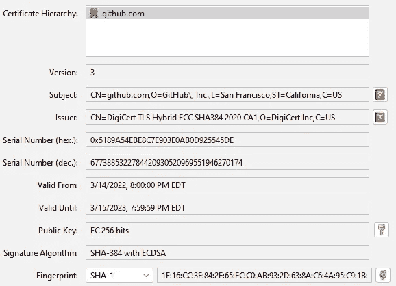
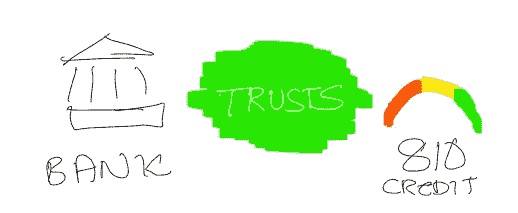
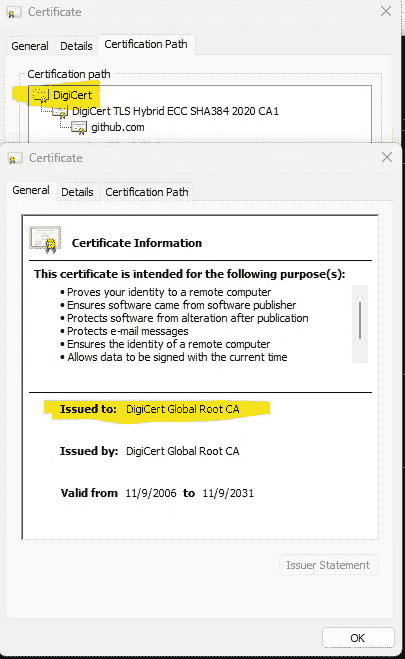
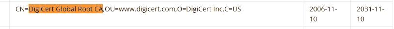
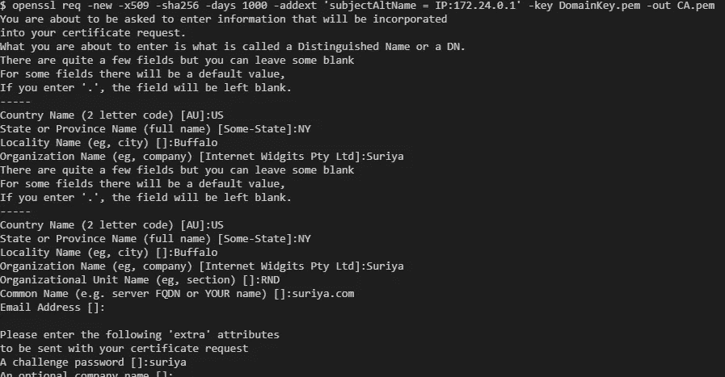
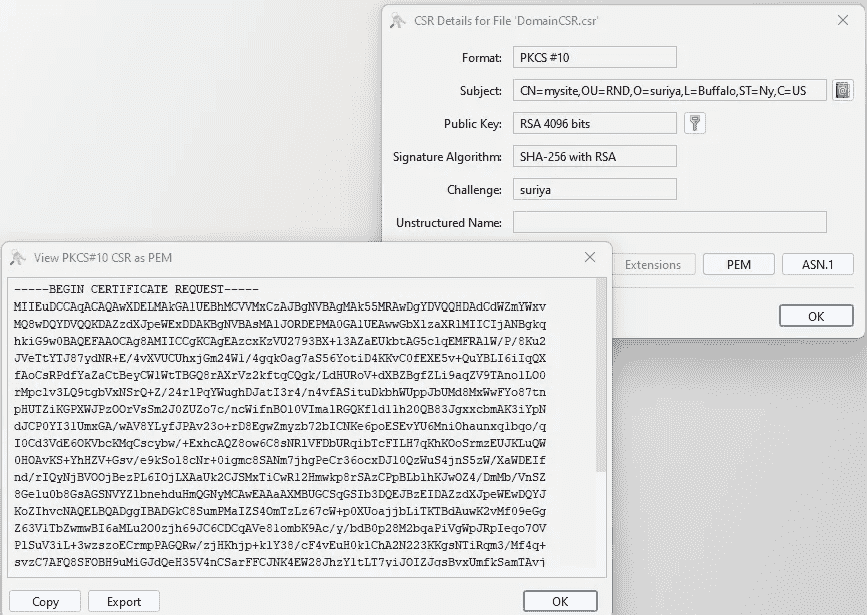
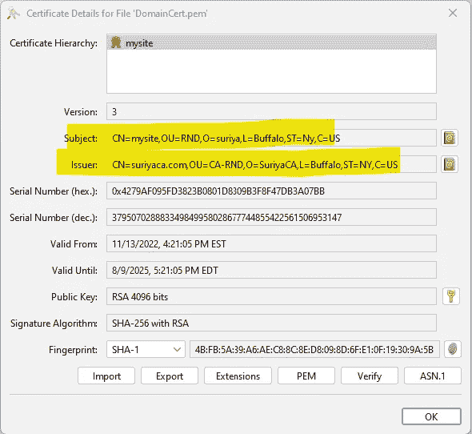

# SSL 证书

> 原文：<https://medium.com/javarevisited/ssl-certificate-67b4e3bdee38?source=collection_archive---------0----------------------->

**安全套接字协议(SSL)** 是通过互联网从客户端向服务器安全发送信息的方式，反之亦然。


HTTPS 上空的 SSL

对于发生在 ***客户端*** *(在 web 浏览器中运行的 web 应用)*和 ***服务器*** *(您的应用所在的地方)*之间的 SSL 连接，使用 ***SSL 证书*** *在客户端和服务器之间发生前体*握手*。*

**内容**

1.  什么是 SSL 证书？
2.  为什么我们需要 SSL 证书？
3.  它还能提供什么？
4.  [准备好 SSL 的步骤](#66e2)
5.  [模拟本地的步骤](#4b91)

> 首先，什么是 SSL 证书？

它是一个公钥文件以及其他信息，如发布者、主题、有效性、扩展名、指纹等。



Github 公钥证书

> 为什么我们需要 SSL 证书？

让我们考虑向银行申请汽车抵押贷款。

[](https://javarevisited.blogspot.com/2013/07/how-ssl-https-and-certificates-works-in-java-web-application.html)

银行在给你报价之前会检查信用评分。



在这里， ***银行*** 就像是你的 ***客户端网页浏览器。你*** 是 ***web 应用*** 像 ***私钥一样保存着你的个人信息，******征信局*** 像 ***公钥证书*** 一样为你提供 ***信用评分*** 。

在这里，信用局的证书会帮助银行信任你，因为银行已经信任信用提供者。

在一个典型的 web 应用程序中，一个 *web 证书*是由一系列中间人发布的，他们建议浏览器信任该 web 应用程序。

现在这里有一个 [github](http://github.com) 证书链的例子。DigiCert 信任 DigiCert TLS，后者又信任由 [github](http://github.com) 生成的证书

[](https://www.java67.com/2012/09/keytool-command-examples-java-add-view-certificate-ssl.html)

为 [github](https://github.com/) 提供的证书



[Chrome](https://chromium.googlesource.com/chromium/src/+/main/net/data/ssl/chrome_root_store/root_store.md) 信任 DigiCert 全球根 CA

> 它还能提供什么？

是的，SSL 证书有一个*公钥*，提供了一种加密和解密在**客户端**网络浏览器和**服务器**之间流动的数据的方法，在服务器上，网络应用程序被托管，并持有*私钥*。

查看这个帖子以了解更多关于钥匙的信息，

<https://suriyaprakhash.medium.com/exploring-java-keystore-keys-9eb4805fa4ec>  

> 准备好 SSL 的步骤

1.  [服务器管理员创建一个域主键](#bba3)
2.  [服务器管理员使用域主键生成 CSR](#2b38)
3.  服务器管理员根据 CA 的文档或要求，将它们与其他所需信息一起发送给证书颁发机构。
4.  CA 从服务器管理员那里接收 CSR、付款和其他必需的详细信息
5.  [CA 使用自己的私钥和公钥证书对 CSR 进行签名，并建立 CA 签名证书](#12ff)
6.  CA 将 CA 签名的证书发送给服务器管理员
7.  服务器管理员将 CA 签名的证书以及他/她在步骤 1 中生成的域私钥安装到服务器中。

[让我们加密](https://letsencrypt.org/)提供免费的 SSL 证书，如果你想检查一下。

检查此选项，以便在没有 CA 的情况下进行签名，

<https://suriyaprakhash.medium.com/self-signed-certificate-d545d6054327>  

> 模拟本地步骤

对于提供 SSL 证书的**认证机构**，它需要一个*证书签名请求(CSR)* 、证书扩展细节(DNS、IP 等)来签署来自客户端(服务器管理员)的证书。

因此，作为一名*服务器管理员*生成了**域私钥**及其 **CSR** 。

*   **生成安全私钥和证书**

[*使用此步骤*到**只生成**private key](https://suriyaprakhash.medium.com/self-signed-certificate-d545d6054327#59d2)***domain key . PEM***

*   **生成证书签名请求**

下面的命令会输出一个 ***域名 CSR*CSR**

```
openssl req -new -sha256 -key DomainKey.pem -out DomainCSR.csr
```

[](http://javarevisited.blogspot.sg/2012/03/add-list-certficates-java-keystore.html)

属性提示



典型的 **CSR** 及其 **PEM**

**模拟私有认证机构的证书生成**

**注意—** *假设服务器管理员已经向 CA 提供了信息*

为了签署证书，CA 需要自己的[私钥](/@suriyaprakhash/cryptography-algorithms-e86ce7e2bb9b#abf6)和一个[公钥证书](/@suriyaprakhash/cryptography-algorithms-e86ce7e2bb9b#41bc)。所以，在这里产生它们，

下面将吐出一个[私钥](/@suriyaprakhash/cryptography-algorithms-e86ce7e2bb9b#abf6) ***CAKey.pem*** 文件，并提示输入一个 ***CA_PASSPHRASE，*** 我们可能会在接下来的步骤*中用到。*

这可能是 CA 用来签署多个证书的密钥。

```
openssl genrsa -aes256 -out CAKey.pem 4096
```

[](https://javarevisited.blogspot.com/2012/09/difference-between-truststore-vs-keyStore-Java-SSL.html)

提示输入密码短语

现在我们需要创建一个公共证书***ca . PEM****从上面生成的私钥 ***CAKey.pem****

```
*openssl req -new -x509 -sha256 -days 1000 -key CAKey.pem -out CACert.pem*
```

**

*属性提示*

*现在我们得到了我们生成的 ***CAKey.pem*** 和 ***CACert.pem*** 。*

***模拟 CA 签署请求***

*CA 将通过使用 ***CAKey.pem、CACert.pem*** 和其他所需信息签署***domain CSR***来发布最终的 SSL 证书，*

*用以下信息创建 **extfile.cnf** ，*

```
*subjectAltName=DNS:*.suriya.com,IP:172.24.0.1*
```

*发出以下命令来生成 SSL 签名证书。*

```
*openssl x509 -req -sha256 -days 1000 -in DomainCSR.csr -CA CACert.pem -CAkey CAKey.pem -out DomainCert.pem -extfile extfile.cnf -CAcreateserial*
```

**

*提示输入 CA 密码短语*

> *验证 CA 签名的证书*

*最后，我们会在本地看到以下文件*

*   ***DomainKey.pem** —服务器管理员的私钥*
*   ***DomainCSR.pem** —服务器管理员的证书签名请求*
*   ***CAKey.pem** —证书颁发机构的私钥*
*   ***CACert.pem** —认证机构的[公钥证书](/@suriyaprakhash/cryptography-algorithms-e86ce7e2bb9b#41bc)*
*   ***extfile.cnf** —证书签名扩展文件配置*
*   ***domain Cert . PEM**—CA 颁发的服务器管理员公钥证书*

*在这里，验证 **DomainCert.pem** ，**颁发者**应该是颁发证书的 *CA* 并且**主题**应该包含由*服务器管理员*发送给 CA 的信息*

**

*该证书由苏里南颁发给苏里亚*

*祝本地主机运行愉快！*