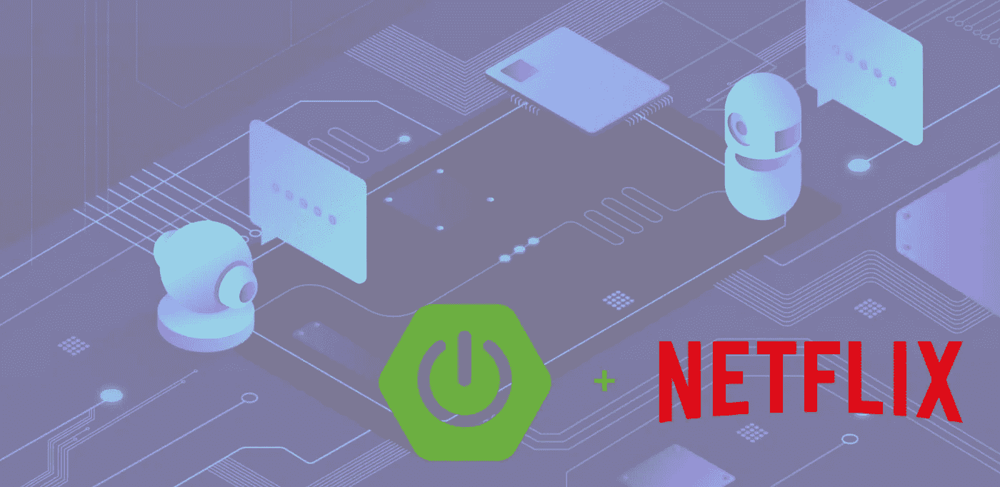

# 开始用 Feign 和 Spring MVC 创建声明性 Rest 客户端

> 原文：<https://medium.com/javarevisited/start-creating-declarative-rest-clients-with-feign-and-spring-mvc-fc48bd23d1aa?source=collection_archive---------0----------------------->

## 了解 Feign 如何使您的应用程序更具弹性和可定制性

对于服务之间的 API rest 调用，在大多数情况下，我们需要设置头、体调用和处理服务器响应。如果你是一个纯粹的 Java 用户，那么`OkHttpClient`可能是你的首选库，如果你想要一个…