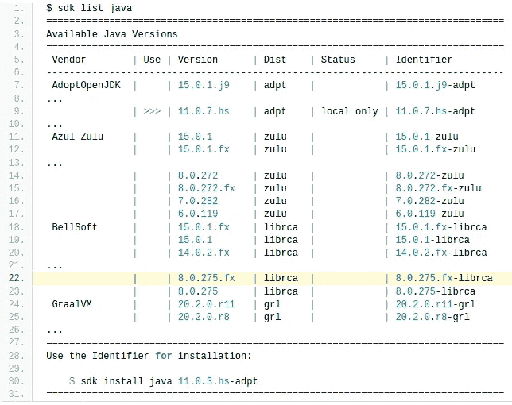
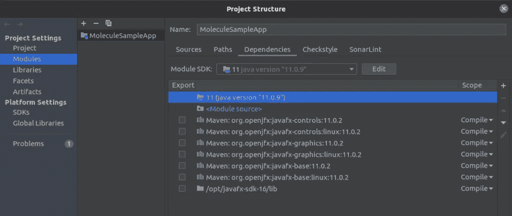
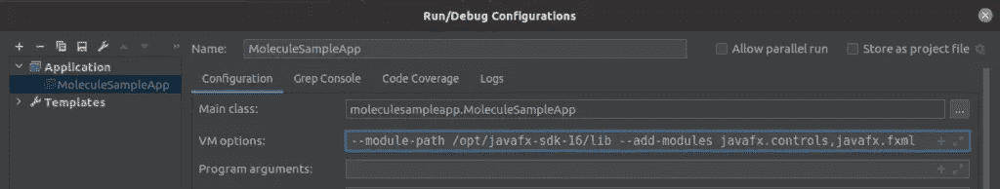
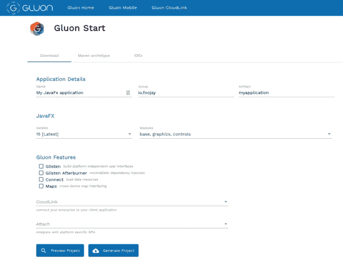
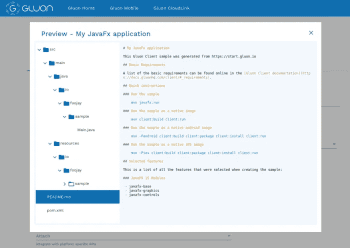
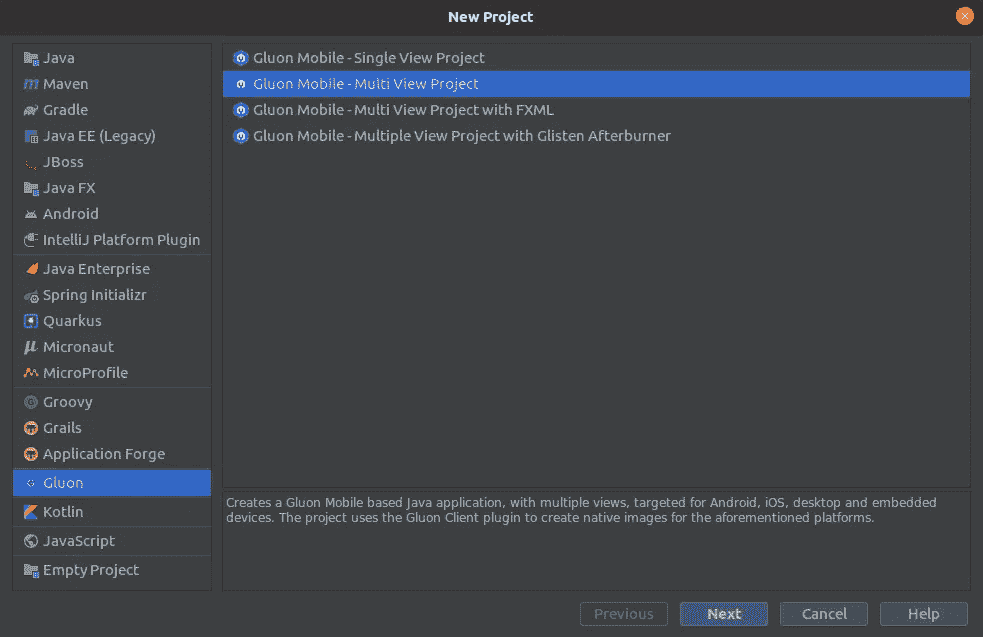
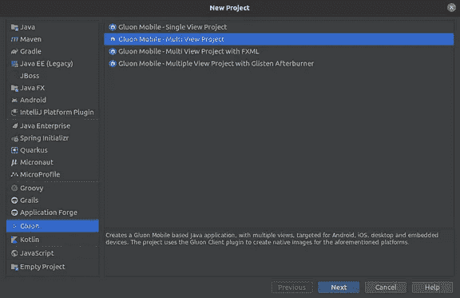
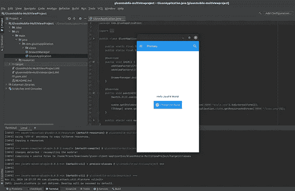
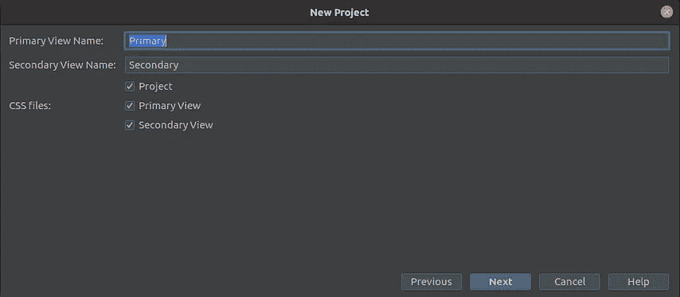

# 使用 Gluon Tools | foojay.io 启动 JavaFX 项目

> 原文：<https://medium.com/javarevisited/starting-a-javafx-project-with-gluon-tools-foojay-io-2f9360bb0c05?source=collection_archive---------1----------------------->

在 foojay.io 上，您已经可以找到 Carl Dea 的两篇文章来帮助您开始使用 JavaFX:

1.  [使用 IntelliJ IDE 开始 JavaFX 应用程序](https://foojay.io/blog/beginning-javafx-with-intellij/):如何在不使用任何工具的情况下启动一个新的 JavaFX 项目的分步说明，请使用 Maven 和 Gradle 工具。
2.  [ZuluFX 上的一个 JavaFX 应用 60 秒](https://foojay.io/blog/a-javafx-app-on-zulufx-in-60-seconds/):如何使用 [Azul](https://www.azul.com/) 的一个流行发行版在 60 秒内构建一个 JavaFX HelloWorld 应用。

在这篇文章中，我想向你展示另一种方法，使用由[glon](https://gluonhq.com/)提供的工具，他们是维护者，也是 [OpenJFX](https://openjfx.io/) 背后的驱动力。

> 本帖原载于[**foojay . io**](https://foojay.io/today/starting-a-javafx-project-with-gluon-tools/)**《open JDK 的朋友们的去处》**。更多 Java 相关新闻请关注 Twitter 上的 [@foojay2020](https://twitter.com/foojay2020) 。

# 在我们开始之前…

我们将在这篇文章中使用 IntelliJ IDEA，为了开发 JavaFX 应用程序，我们需要安装正确的 JDK 和 JavaFX。

过去 [JavaFX](/javarevisited/6-free-courses-to-learn-servlet-jsp-and-java-fx-in-2020-best-of-lot-720201c84f63) 包含在 Oracle JDK 中，直到版本 11。

但它一直是一个独立的项目(见 [openjfx.io](https://openjfx.io/) )，也可以与 JDK 分开安装。

这给了我们两种可能的方法。

## 使用包含 JavaFX 的 JDK

一些 JDK 提供商有一个集成了 JavaFX 的 JDK 版本。这使得构建和运行应用程序变得容易，而无需指定运行应用程序所需的模块路径和模块。

1.  Azul ZuluFX
2.  [BellSoft LibericaJDK](https://bell-sw.com/pages/downloads/)

在 JDK 版本之间切换的最简单的方法可能是 SDKMAN，它包含了一长串可能的选项。例如，在 Linux PC 上，这只是 80 多个版本中的一小部分！

带有 SDKMAN 的 Linux 上可用的 JDK 版本

对于 JavaFX-development，请选择带有“.”的版本。fx”，例如`sdk install java 15.0.1.fx-zulu`并在你的 [IDE](https://itnext.io/top-5-intellijidea-and-android-studio-courses-for-java-and-android-programmers-afcc27309b60?source=user_profile---------12------------------) 中使用这个版本。

## 将 JavaFX 用作单独的库

这个选项允许您更灵活地使用不同版本的 Java 和 [JavaFX](https://javarevisited.blogspot.com/2020/06/top-5-courses-to-learn-java-fx-in-2020.html) 。在我的情况下——正如我的大多数项目或在 Java 11 上——我使用 AdoptOpenJDK 11，但将它与 JavaFX 16-ea 结合起来，以便能够用最新版本进行测试。

在这种情况下，您需要遵循以下步骤:

1.  从 Gluon 网站下载你选择的 FX 版本
2.  将其解压到您选择的目录中，例如`opt/javafx-sdk-16/`
3.  在 IntelliJ IDEA 的“项目结构”对话框中，在“模块>依赖项”屏幕中添加包括“库”在内的位置，例如`/opt/javafx-sdk-16/lib`。通过这样做，您的 IDE 将能够为您提供正确的语法突出显示。
4.  为了运行您的应用程序，我们还需要添加启动参数来指向 javafx 模块。打开配置对话框，提供“虚拟机选项”，包括项目所需的所有模块，例如`--module-path /opt/javafx-sdk-16/lib --add-modules javafx.controls,javafx.fxml`。

将 openjfx 添加为依赖项

定义运行应用程序的虚拟机选项

# 用 start.gluon.io 创建一个新项目

Gluon 已经创建了网站 [start.gluon.io](https://start.gluon.io/) 来开始一个新的 JavaFX 项目，同样的方式你也可以用 [start.spring.io](https://start.spring.io/) 为 Spring 做，或者用 [code.quarkus.io](https://code.quarkus.io/) 为 Quarkus 做。

start.gluon.io 上 JavaFX 应用程序的最小选择

对于一个最小的 JavaFX 项目，您只需要定义“应用程序细节”并选择您将需要的版本和模块。

由于 Gluon 还提供额外的功能，你可以使用他们的工具来构建移动应用，额外的选项可以在“Gluon 功能”部分选择。请注意，其中一些需要许可证，否则当您的应用程序启动时会显示一个弹出窗口。

这个网站的一个很好的特点是“预览项目”按钮，它会在你下载之前显示你的项目的结构。

下载前预览项目

通过点击“生成项目”按钮，您将获得一个包含完整项目的 ZIP 文件，您可以在 IDE 中打开该文件，并立即使用`mvn javafx:run`运行。

在 IntelliJ IDEA 中运行的创建的应用程序

# 用 IntelliJ IDEA 中的 Gluon 插件创建一个新的移动项目

Gluon 还为 IntelliJ IDEA 创建了一个[插件，使得启动 JavaFX 移动项目变得非常容易。](https://plugins.jetbrains.com/plugin/7864-gluon)

在你的 [IntelliJ IDEA](/javarevisited/7-best-courses-to-learn-intellij-idea-for-beginners-and-experienced-java-programmers-2e9aa9bb0c05) 中，双击 SHIFT 键打开通用搜索框，输入“插件”并选择第一个选项。现在你可以在市场上搜索并安装胶子插件。

现在开始一个新的移动 JavaFX 项目已经变得非常容易。从主菜单中选择文件>新建>项目。在左边的列表中，你会发现“胶子”和一个新项目的四个不同选项。

在接下来的窗口中，您可以选择不同的选项， [Maven](/javarevisited/6-best-maven-courses-for-beginners-in-2020-23ea3cba89) 或 [Gradle](https://javarevisited.blogspot.com/2020/06/maven-vs-gradle-beginners-introduction.html#axzz6dHZ7oEpK) ，预先创建的第一个和第二个视图的名称，……一旦在 [IntelliJ IDEA](https://dev.to/javinpaul/5-best-courses-to-learn-intellij-idea-for-java-developers-5e6n) 中创建和打开了项目，您就可以用`mvn javafx:run`运行它。

正如您在该视频中看到的，在 30 秒内，您在 IntelliJ IDEA 中打开了一个新的 JavaFX 项目，您可以立即运行并测试它。

# 结论

Gluon start 网站和插件允许你点击几下就可以开始一个新的 JavaFX 项目。

感谢 Gluon 团队所做的惊人工作，这也让你快速开始创建一个可以为 Android 和 iOS 构建的移动应用。

*原载于 2020 年 11 月 17 日*[*https://foojay . io*](https://foojay.io/today/starting-a-javafx-project-with-gluon-tools/)*。*