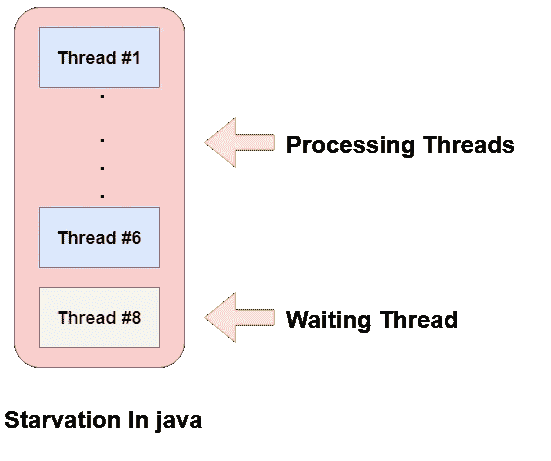

# Java 中线程的匮乏

> 原文：<https://medium.com/javarevisited/starvation-of-threads-in-java-e3d6bcfeb770?source=collection_archive---------1----------------------->



**定义:**Java 中的线程饥饿据说发生在某个特定的线程无法访问对象或资源，导致等待和执行时间增加的时候。

当两个或更多线程被分配给 CPU(中央处理器)并在执行中花费大量时间时，就会发生饥饿，因为其他等待线程无法获得 CPU 来继续执行。

**饿死的原因:**

java 中线程饥饿的原因有很多，下面介绍了其中一些原因:

*   **高优先级运行线程:**可能会有这样的情况，高优先级线程通过占用 CPU 运行，并且需要大量处理，这需要大量时间来完成，因此为了完全执行这项工作，具有低优先级顺序的其他线程必须等待很长时间，这将导致资源匮乏。
*   **Java 中的 Synchronized Block:**可能会出现这样的情况，线程被允许进入 [synchronized block](https://www.java67.com/2013/01/difference-between-synchronized-block-vs-method-java-example.html) 的顺序与它们被编程调度的顺序相同，这导致另一个线程等待资源和对象，从而导致饥饿，其中除了特定线程之外的其他线程被给予 C.P.U .用于其执行。
*   **等待对象的线程永远等待:**Java 中的 [notify()方法无法跟踪线程，如果有多个线程，哪个特定的线程正在被唤醒，因此可能存在任何线程正在被处理而其他线程从未被调用执行的风险。](https://javarevisited.blogspot.com/2015/07/how-to-use-wait-notify-and-notifyall-in.html#axzz6e8hmwujv)

**线程饥饿示例**

```
class Starvation extends Thread { 
 static int count = 1; 
 public void run() { 
  System.out.println(count + " Thread execution starts"); 
  System.out.println("Thread execution completes"); 
  count++; 
 } 
 public static void main(String[] args) throws InterruptedException { 
  System.out.println("Parent thread execution starts"); 

  /* Priority of each thread given. */
        /* Thread 1 with priority 7\. */
  Starvation thread1 = new Starvation(); 
  thread1.setPriority(7); 
        /* Thread 2 with priority 6\. */
  Starvation thread2 = new Starvation(); 
  thread2.setPriority(6); 
        /* Thread 3 with priority 5\. */
  Starvation thread3 = new Starvation(); 
  thread3.setPriority(5);
        /* Thread 4 with priority 4\. */
  Starvation thread4 = new Starvation(); 
  thread4.setPriority(4); 
        /* Thread 5 with priority 3\. */
  Starvation thread5 = new Starvation(); 
  thread5.setPriority(3); 

  thread1.run(); 
  thread2.run(); 
  thread3.run(); 
  thread4.run(); 

  /* Here thread 5 have to wait because of the 
     other threads */
  thread5.run(); 

  System.out.println("Parent thread execution completes"); 
 } 
}
```

**上述代码的输出将是:**

```
Parent thread execution starts
1 Thread execution starts
Thread execution completes
2 Thread execution starts
Thread execution completes
3 Thread execution starts
Thread execution completes
4 Thread execution starts
Thread execution completes
5 Thread execution starts
Thread execution completes
Parent thread execution completes.
```

**消除饥饿的要点:**

消除线程匮乏的一些要点如下:

*   通过`Thread.yield()`方法的实现，当线程在进程中释放锁后获得一个公平的机会来占用 CPU，并可以获得一些时间来完成它的执行，直到原始线程再次获得对 CPU 的控制
*   还可以使用 [Thread.sleep()](http://www.java67.com/2015/06/how-to-pause-thread-in-java-using-sleep.html) 方法将机会给予其他线程执行。

## 你可能喜欢的其他线程文章

[](https://javarevisited.blogspot.com/2020/01/what-is-happens-before-in-java-concurrency.html) [## Java 并发中的先发制人是什么？一个例子

### 几天前，我的一位读者在 LinkedIn 上给我发消息，谈到他最近面临的一个 Java 面试问题…

javarevisited.blogspot.com](https://javarevisited.blogspot.com/2020/01/what-is-happens-before-in-java-concurrency.html) [](https://javarevisited.blogspot.com/2020/04/difference-between-atomic-volatile-and-synchronized-in-java-multi-threading.html) [## Java 中原子、易变和同步的区别？

### 大家好，很多人问我关于 Java 并发中的易变、同步和易变变量…

javarevisited.blogspot.com](https://javarevisited.blogspot.com/2020/04/difference-between-atomic-volatile-and-synchronized-in-java-multi-threading.html) [](/javarevisited/java-threadlocal-the-boon-and-the-bane-18263fa4f64) [## Java 线程本地——好处和坏处

### 最近，我和我的团队正在对某段代码进行一些性能测试(特别是一个 HTTP…

medium.com](/javarevisited/java-threadlocal-the-boon-and-the-bane-18263fa4f64)