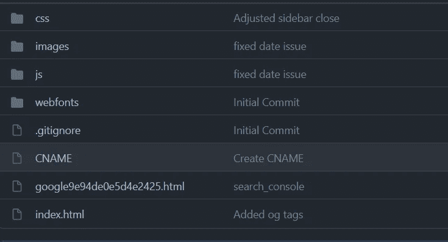
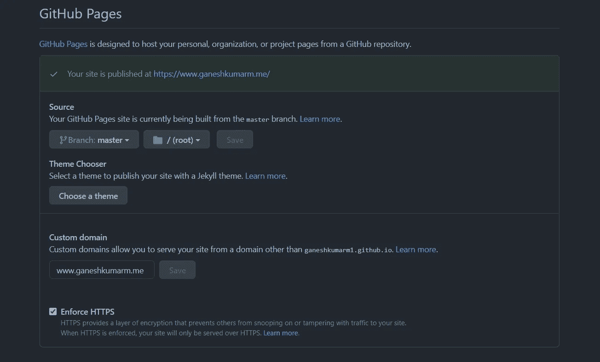
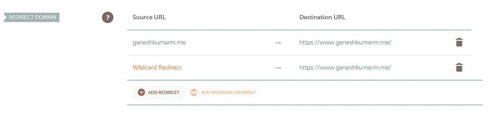
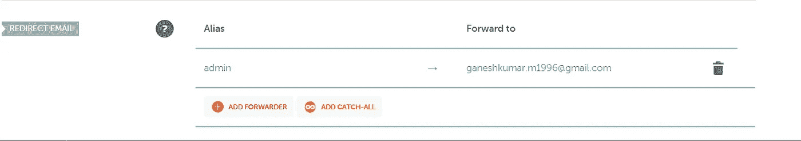
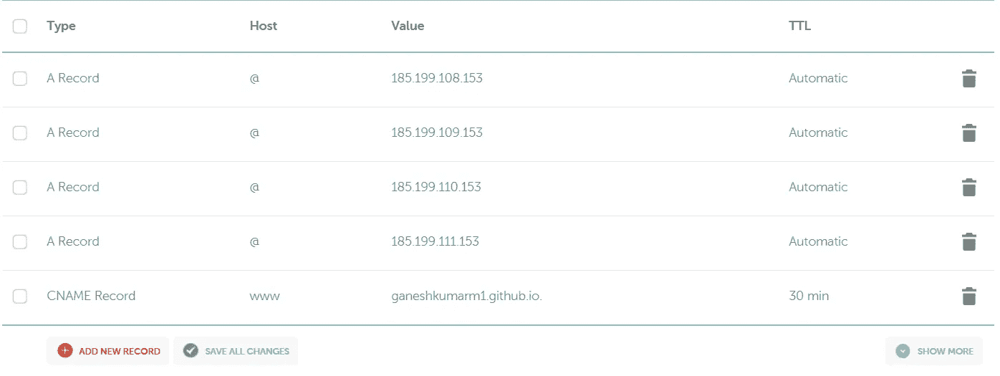
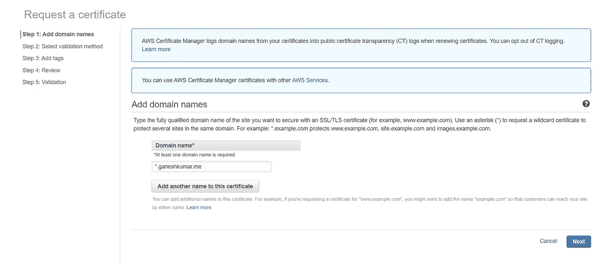
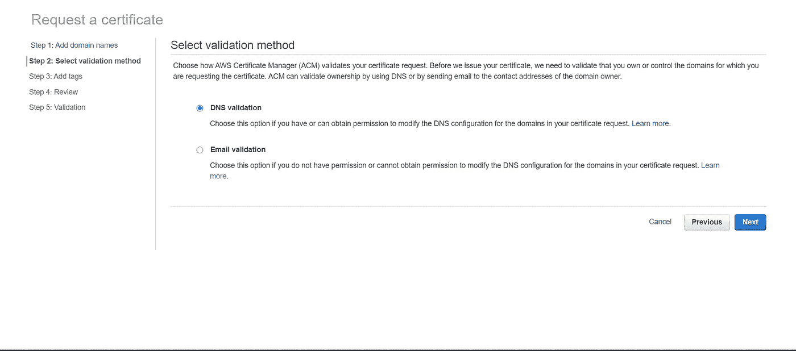

# 使用 Github 页面、Namecheap 和 ACM 的静态站点托管

> 原文：<https://medium.com/javarevisited/static-site-hosting-with-github-pages-namecheap-and-acm-e64592faf086?source=collection_archive---------5----------------------->

使用自定义域和免费 SSL 证书托管静态网站

[HalGatewood.com](https://unsplash.com/@halacious?utm_source=medium&utm_medium=referral)在 [Unsplash](https://unsplash.com?utm_source=medium&utm_medium=referral) 上拍照

大家好。在本文中，我们将使用 Github 页面托管我的个人作品集网站，映射一个自定义域名并添加一个免费的 SSL 证书。

# 先决条件

*   一个 [Github](https://github.com/join) 账户
*   从[购买的域名便宜](https://www.namecheap.com/)
*   AWS 账户

# 设置 Github 页面

1.  登录 Github。
2.  创建一个名为**<github _ username>github . io**的新存储库
3.  将您的网站代码推送到存储库。它应该在根目录下有一个**index.html**文件。

网站文件夹结构

4.单击存储库中的**设置**选项卡，向下滚动到 **Github 页面**部分。

5.在源选项中，选择分支为**主**，选择文件夹为
**/(根)。**

6.在自定义域中，输入从 Namecheap 购买的域名。在这种情况下，我添加了从 Namecheap 购买的域名[**www . ganeshkumarm . me**](http://www.ganeshkumarm.me)。

7.勾选选项**强制 HTTPS。**

8.如果您看到任何与 HTTPS 设置相关的错误信息，请不要担心。我们稍后会修理它。

Github 页面配置

9.添加自定义域后，一个名为 **CNAME** 的新文件将被添加到存储库中。CNAME 文件包含自定义域名(如果自定义域名没有 www 前缀，请添加)。

10.现在你可以通过打开**https://<github _ username>. github . io**来测试网站是否工作

# 廉价 DNS 配置

## 添加重定向域

1.  转到[廉价域名仪表板](https://ap.www.namecheap.com/domains/list/)并点击**管理。**
2.  在**域**选项卡下，转到**重定向域**部分。
3.  点击**添加重定向**，添加以下带有域名的条目。 **来源 URL【yourdomain.com】
    **目的地 URL**-[https://www.yourdomain.com](https://www.yourdomain.com)**
4.  点击**添加通配符重定向**并添加以下带有域名的条目。
    **源 URL** -通配符重定向
    **目的 URL**-[https://www.yourdomain.com](https://www.yourdomain.com)

重定向域

## 添加重定向电子邮件

1.  转到**重定向电子邮件**部分，点击**添加转发。**
2.  添加一个电子邮件 id 为
    **别名为** -管理
    **的重定向电子邮件条目，转发至**-youremail@xyz.com

重定向电子邮件

## 启用电子邮件转发

1.  导航到**高级 DNS** 选项卡，并转到**邮件设置**部分。
2.  从下拉菜单中选择**电子邮件转发**，并添加以下条目。
    **类型** - TXT 记录
    **主机** - @
    **值** - v=spf1 包含:SPF . efwd . registrar-servers . com ~ all
    **TTL**-30min

电子邮件转发

## 加上 CNAME 和一个记录

1.  导航到**高级 DNS** 选项卡，点击**添加新记录**按钮添加以下条目。
2.  下面补充一下 CNAME 和一个记录。

加上 CNAME 和一个记录

# 通过 AWS 证书管理器(ACM)请求 SSL 证书

1.  登录 AWS 管理控制台，选择服务 [**证书管理器**](https://aws.amazon.com/certificate-manager/) **。**
2.  点击**开始**下**提供证书。**
3.  选择**请求公共证书**并点击**请求证书。**
4.  在**域名**文本框中输入 ***.domainname.com** 并点击**下一步。**

域名

5.选择**电子邮件验证**并点击**下一步。**

电子邮件验证

6.点击**审核**，然后点击**确认并请求。**

7.现在，您的证书将处于**待定**状态，您将收到来自 **Amazon Certificates** 的邮件，请求批准。

8.您可以点击电子邮件中的链接并批准它。

# 注意

通常，DNS 传播可能需要 **24 - 48 小时**才能得到反映。在此之前，该网站将不会工作。

此外，AWS 证书将需要 **30 分钟- 1 小时**才能得到反映。在那之前，https 不会工作。

# 谢谢你🤘

想了解我更多，请访问[T5 ganeshkumarm . me](https://www.ganeshkumarm.me)

