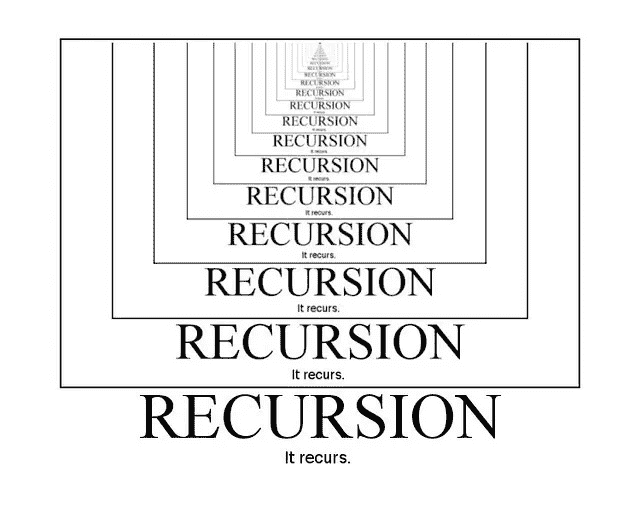
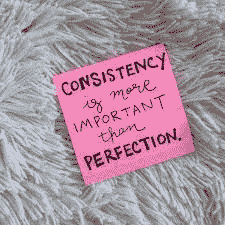

# 窃取这 9 个技巧来提高编程中的逻辑构建技巧

> 原文：<https://medium.com/javarevisited/steal-these-9-hacks-to-improve-logic-building-skills-in-programming-8e880eaedd83?source=collection_archive---------0----------------------->

大约 4 年前，当我开始第一次软件开发实习时，我意识到拥有良好的逻辑和分析技能是我在这个行业长期生存的关键。尽管我有一个计算机学位，但这是我必须自己建立的东西，没有人足够关心去教。

虽然有这么多的嗡嗡声和压力要通过磨 leetcode 问题来破解世界上最大的科技公司，但我也看到数百万人在同一个问题上挣扎——无法建立逻辑。

所以，这里先来看一下这些年来我为了保持领先地位所做的和仍在做的事情。

# 概念是积木

Pixabay 的照片:[https://www.pexels.com/photo/clear-light-bulb-355948/](https://www.pexels.com/photo/clear-light-bulb-355948/)

毫无疑问。

那些第一次学习编程的人往往会直接跳到解决“X”个问题上，从而破解大型科技公司。

除非我们 100%清楚数据结构或算法的本质，否则仅仅为了解决问题而盲目地解决问题并不是一个好主意。

我喜欢花更长的时间去思考和吸收概念，而不是在比赛中完成一系列的问题或章节。

简单地说，如果没有一个坚实的基础，在其上增加复杂的层次是没有意义的。

# 笔和纸

照片由 Tirachard Kumtanom 拍摄:[https://www . pexels . com/photo/black-twist-pen-on-top-of-open-white-notebook-472311/](https://www.pexels.com/photo/black-twist-pen-on-top-of-open-white-notebook-472311/)

简陋的笔记本和一支笔是必不可少的。他们是你最好的朋友。

通过预演来运行新学到的算法总是一个好主意。它打开了如此多的方面，以至于人们在学习新东西时几乎意识不到。

当我学习合并排序时，虽然我能够可视化整个算法，但当我坐下来运行几个例子时，我开始打嗝，并且不能清楚地回忆起步骤。只是在 a 用多个例子做了一次适当的预演之后，现在我可以自信地说，我确实理解得足够好了。

这同样适用于你所学的任何东西。

如果你努力成为一名更好的软件工程师， ***持续的学习才是正道。***

# 准备笔记

照片由 Vlada Karpovich 拍摄:[https://www . pexels . com/photo/crop-young-woman-writing-schedule-in-diary-on-sofa-4050344/](https://www.pexels.com/photo/crop-young-woman-writing-schedule-in-diary-on-sofa-4050344/)

学习时保持个人笔记总是比跟随别人的笔记好。

如何准备笔记？
笔记中的 3 件必备之物——

> ➡️用一个例子把问题陈述出来，
> 
> ➡️:强力方法之后是最优解，
> 
> ➡️至少对一个样本测试用例进行粗略的预演。

稍微高级一点的学习者也可以创建 GitHub repos 并检入他们的代码。

这有什么帮助？

当你写下你的笔记时，这就相当于向你自己解释这些概念。

后来当你再次访问相同的网站时，你会发现新的东西，并在概念上获得更多的清晰。

重复这个练习会在你的大脑中形成新的神经连接，从而自然地强化你的逻辑。

# 学习递归

递归—来自 AlgoDaily 的图像

这听起来可能有点跑题，因为我们在这里没有谈论任何技术问题。

看，我不打算谈论[递归](/javarevisited/7-best-courses-to-learn-recursion-for-programming-and-coding-interviews-1f8b0bcfd44)，但是我更想强调一下这个被认为是硬算法的*是如何在我的编码之旅中受益的。*

*递归有助于将大问题分解成小块。*

*当我面临一个无法解决的大任务时，这正是我所做的，并且还会继续做下去。*

*当我们学习新的编程知识时，很难一下子全部消化。*

*因此，分解它并一次取一个“字节”是很重要的。*

# *一致性*

**

*学分 letsliveandlearn*

**熟能生巧。**

*不管我们可能听过多少次，听起来有多老套，你需要每天出现来掌握任何事情，这是显而易见的。*

*这背后的原因很简单。*

***复合效应的力量。***

> *每天解决一个问题相当于一年解决 30 个问题和超过一个 10K 难题。*

*再说一遍，我在这里不仅仅是指数字，而是指由于时间的原因可以完成的工作量。*

*你给大脑越多的时间去消化事实和数据，你就变得越老练。你解决的 10K 问题并不会让你成为这方面的专家。相反，是你坚持每天至少解决一个问题，从而增加大脑容量，帮助你成为解决问题的大师。*

# *读取代码*

**

*照片由水野彩香·K 拍摄:[https://www . pexels . com/photo/woman with golden-hair-looking-in-computer-screen with-colorful-code-12899138/](https://www.pexels.com/photo/woman-with-blond-hair-looking-at-computer-screen-with-multicoloured-code-12899138/)*

*可能是所有软件工程师中最被低估的**习惯之一。但是，仅仅因为它的无数好处，阅读代码最近已经获得了很大的收益。***

*作为一名软件工程师，她在职业生涯的开始维护了几十个遗留代码，我怎么强调阅读代码的重要性都不为过。*

*而且我说的“读代码”，并不是指仅仅大声读代码的字面意思。相反，从代码的字里行间去解读它的含义，然后对它进行改进，这样就不会破坏它。*

*听起来很重？
比写 1000 行代码还重？*

*事实上是的。*

*因为工程师写的大多数代码都不容易理解。这需要时间。*

> **我记得我花了将近一周的时间，也就是将近 40 个工作小时来消化遗留代码库的细节。**

*虽然后来它对我有利，但它确实需要自己的甜蜜时光。*

*事实上，做大量的代码评审也是有帮助的。*

# *教*

> *教等于学两次*

**

*Antoni Shkraba 摄:[https://www . pexels . com/photo/woman-talking-a-person-on-laptop-6266980/](https://www.pexels.com/photo/woman-talking-to-a-person-on-laptop-6266980/)*

*我创建自己的 [YouTube 频道](https://www.youtube.com/@codewithease-byvarsha)的最大原因是，我在那里讨论编程、数据结构、算法、学习技巧等。*

*不一定要很大。*

*最起码，从自学开始。*

*自学的最好方法是复习。*

> ***重访。修改。重复***

*你会注意到，当你在休息七天后回到同一个概念时，不仅这个问题对你来说是新鲜的，就连你输入的代码也似乎从未被写过。*

*这是它打开新的视角和概念变得更强大的地方和时间，剩下的就是历史了。*

# *构建辅助项目*

**

*照片由 Anete Lusina 拍摄:[https://www . pexels . com/photo/crop-cyber-spy-typing-on-computer-keyboard-while-hacking-system-5240544/](https://www.pexels.com/photo/crop-cyber-spy-typing-on-computer-keyboard-while-hacking-system-5240544/)*

*虽然这是我希望每个软件工程师都必须做的一件事，但老实说，我自己最近还没有涉足这个领域。*

*我确实有一些想法，但是我还没能找到合适的资源来开始实施。此外，它需要适量的研究来开始这些工作，我发现自己没有时间来执行事情。*

*但是，我没有抄袭关于缺乏时间。*

*我在这里要说的是，当你从零开始建立自己的东西时，它不仅有助于建立巨大的自信，而且你开始将所有的点连接起来。*

*这就是成为一名全面发展的工程师所需要的一切。*

# *耐心*

**

*信用-报价程序*

*长期回报来自锻炼耐心。对你参与的过程有足够的信心。*

> *从长远来看，耐心是有回报的。*

*对绝大多数人来说，试图仓促行事从来都没有帮助。*

*急什么，我不明白。精通需要数年时间来培养，这是有道理的。*

*记住，重要的是旅程，而不是最终目的地。*

***感谢阅读。***

**如果你喜欢这篇文章，请点击“鼓掌”按钮👏有几次。**

*给了我足够的动力去发布更多这样的内容。请分享给你认为这篇文章可能会有帮助的朋友。*

*订阅[这里](/subscribe/@varshadas21)每当我发表一篇文章就收到提醒。*

*如果你喜欢读这篇文章，你可以在这里给我买杯咖啡。*

*与我联系—[Varsha Das](https://www.linkedin.com/in/varsha-das-se/)|[LinkedIn](https://www.linkedin.com/in/varsha-das-se/)*

*轻松关注我的 Youtube 频道— [***代码—作者 Varsha***](https://www.youtube.com/@codewithease-byvarsha) ，在这里我们讨论数据结构&算法。*

*快乐学习！😁*