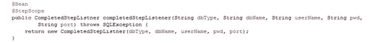
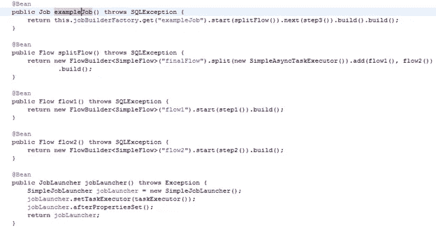
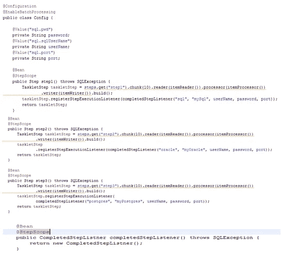
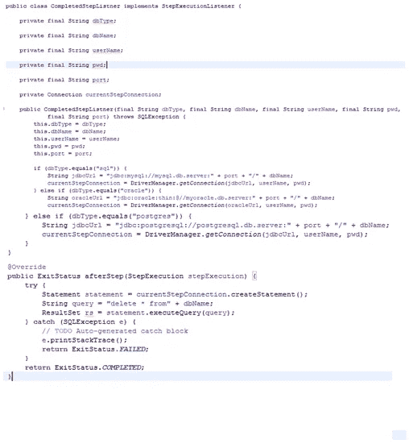
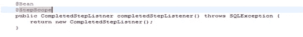
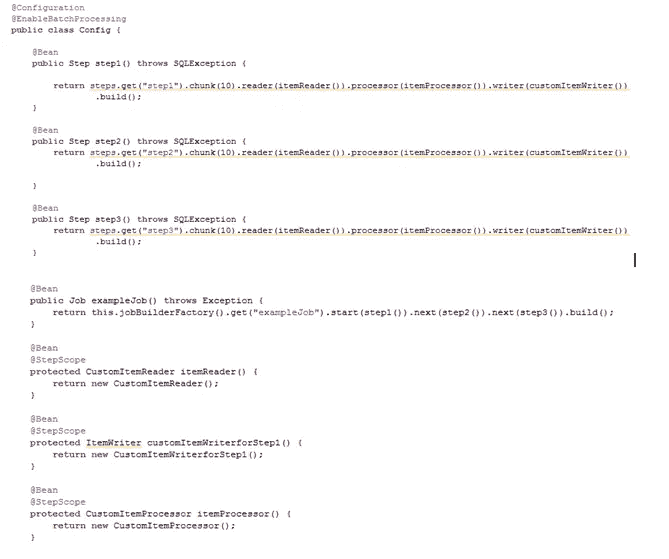
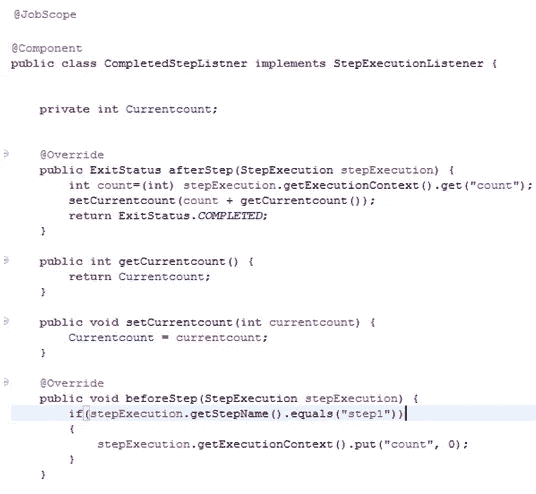

# Spring 批处理作业中的 Step 作用域 beans

> 原文：<https://medium.com/javarevisited/step-scoped-beans-in-a-spring-batch-job-570a09184fa5?source=collection_archive---------1----------------------->

spring 中 bean 范围的概念使我们能够专注于业务逻辑，而不必担心数据不一致。

spring 应用程序中 beans 的生命周期是根据应用程序上下文(@Singleton)、线程(@Prototype)或 web 感知应用程序的 http 会话(@Session)、http 请求(@Request)或 servlet 生命周期(@ApplicationScope)、webSocket 会话来定义的。

换句话说，用@Singelton 注释的 bean 将在容器初始化(应用程序启动)时创建一次，并在容器终止(应用程序关闭)时销毁。

类似地，每次有对 bean 的新请求时，都会创建一个用@prototype 注释的 bean。用@Session 注释的 Bean 为每个会话创建一次，用@Request 注释的 bean 为每个 http 请求创建一次。

可以看到，我们有大量的 [**bean 作用域**](https://javarevisited.blogspot.com/2012/05/what-is-bean-scope-in-spring-mvc.html) 可供选择，以满足每个定制应用程序的需求。我们有关于 web 应用程序的特定范围，我们有关于应用程序上下文的范围。

到目前为止一切顺利。但是在 spring 批处理作业的情况下，上述范围只能在一定程度上使用。由于跳批作业由多个步骤组成，因此除了上述范围之外，根据一个步骤来定义 beans 是很自然和实际的。

幸运的是， **Spring 定义了另外两个作用域，即 step 作用域和 job 作用域**，帮助我们定义生命周期分别与 job 和 step 生命周期相关联的 beans。

## **步进范围**

步骤范围内的 bean 的生命周期与步骤的生命周期相关，即 bean 分别在步骤开始和结束时创建和销毁。

用于声明步骤范围 bean 的注释是@StepScope

当我们并行执行步骤时，步骤范围特别有用，因为隔离 bean 的状态变得非常重要。否则，多个线程会同时修改 bean 的状态，导致它不一致。

在下面的示例中，我们配置了一个 SpringBatch 作业，其中每个步骤都执行相同的操作，即从数据库中读取数据，对数据进行一些转换，然后将其写入文件。

这里的想法是从[数据库](/hackernoon/top-5-sql-and-database-courses-to-learn-online-48424533ac61)中读取数据，对其进行处理并将其移动到文件中。一旦它被成功处理并写入文件，我们就从数据库中删除所有数据。

上述顺序在各个步骤中是不变的，唯一的区别是每个步骤读取的数据库(每个步骤一个 db 配置),然后从中删除所有数据。

这项工作包含三个步骤步骤 1，步骤 2，步骤 3。步骤 1 和 2 被配置为并行运行，而步骤 3 在步骤 1 和 2 完成执行后执行。

读取、处理、写入部分由步骤处理，但是额外的数据删除方面呢？

这是一个通用操作，必须在每个步骤执行完毕后执行。

Spring 为我们提供了一种叫做 step listener 的东西，它能做到这一点。当侦听器注册到一个步骤时，在该步骤成功运行之后，在进入下一个步骤之前，框架会调用它。

我们已经定义了一个通用的 step listener 类，它将处理流程中的数据删除部分。

它在构造函数中接受 dbname、dbUserName 等参数，然后在步骤完成后框架调用监听器的 afterStep 方法时删除数据库中的所有数据。

定义一个通用监听器使我们能够在每个步骤中使用相同的监听器类。我们只需要确保每一步都使用三个不同配置的不同实例

我们需要监听器存在于步骤的生命周期中，并且对于每个步骤都有不同的配置。这只能通过使用步骤范围来实现。

StepScope 将确保我们隔离每个步骤的侦听器的处理，而且一旦步骤完成执行，侦听器实例就不再存在，从而避免任何内存泄漏。

**Stepscope 还为我们提供了**的能力

**通过步骤执行上下文和步骤执行监听器在步骤之间传递信息**

**通过用占位符对参数进行注释来执行参数的后期绑定**

考虑下面的场景，其中每个都需要将它处理的记录数传递给下一个连续步骤。我们有三步第一步，第二步，第三步。步骤 1 应该将它处理的记录总数传递给步骤 2，依此类推。

当我们必须将计数信息从一个步骤传递到另一个步骤时，问题就出现了。这就是 stepexecutionListener 再次发挥作用的地方。

如上所述，当侦听器向某个步骤注册时，一旦该步骤完成执行，侦听器的 afterStep 方法就会被调用。Listener 有两个方法 BeforeStep 和 AfterStep，分别在步骤开始执行之前和完成执行之后调用。

因此，侦听器通过在步骤之间不间断地存储计数信息来帮助我们弥合步骤之间的差距。

现在，这些步骤只需确保在终止之前将这些信息传递给侦听器。我们如何将这些数据从步骤传递给监听器？

幸运的是，我们有一个叫做`stepExecutionContext` 的东西，它通常包含与该步骤相关的上下文信息。每个步骤的编写器在 stepExecutionContext 中设置计数值，侦听器从上下文中检索它。

这里我们使用一个占位符来自动填充计数变量。最初，该值为 0，步骤 1 的编写器将刚刚处理的数字添加到该值中。因此，如果步骤 1 读取了 10 条记录，计数将更新为 10。(0+10)

占位符允许我们检索前面所有步骤处理的记录的数量。占位符在运行时通过从 stepExecutionContext 中检索计数值来解析。

但是，stepExecutionContext 的生命周期与一个步骤相关联。步骤 1 的 stepExecutionContext 中保存的内容在步骤 2 的 stepExecutionContext 中不可见。

您一定已经注意到，这次我们的侦听器不是单步执行，而是作业。这意味着每次作业调用只创建一个侦听器实例。因此，同一个侦听器实例在一个作业的所有步骤中共享。

我们利用这一点间歇地将当前计数存储在侦听器中，并在步骤之间传递它。

在退出步骤之前，我们从 stepExecutionContext 中检索计数(通过侦听器中的 AfterStep 方法),并更新 stepExecutionListener 的 currentCount 以反映到目前为止处理的记录总数。

我们之前提到过，在 step1 开始处理之前，初始计数值被设置为 0。但是谁来设定呢？这是在侦听器的 beforeStep 方法中完成的，该方法检查当前步骤是否是第一步，如果是，则将其设置为 0。

这就是【step scope 如何帮助我们不仅定义 beans 的生命周期，还允许我们跨步骤传递数据

页（page 的缩写）你可以在这里找到一个例子[https://github.com/SafinaAh/SpringBatchExamples](https://github.com/SafinaAh/SpringBatchExamples)。这并不包含本文中讨论的所有内容，但是当我能挤出一些时间来整合这里讨论的所有内容时，将会进行更新。