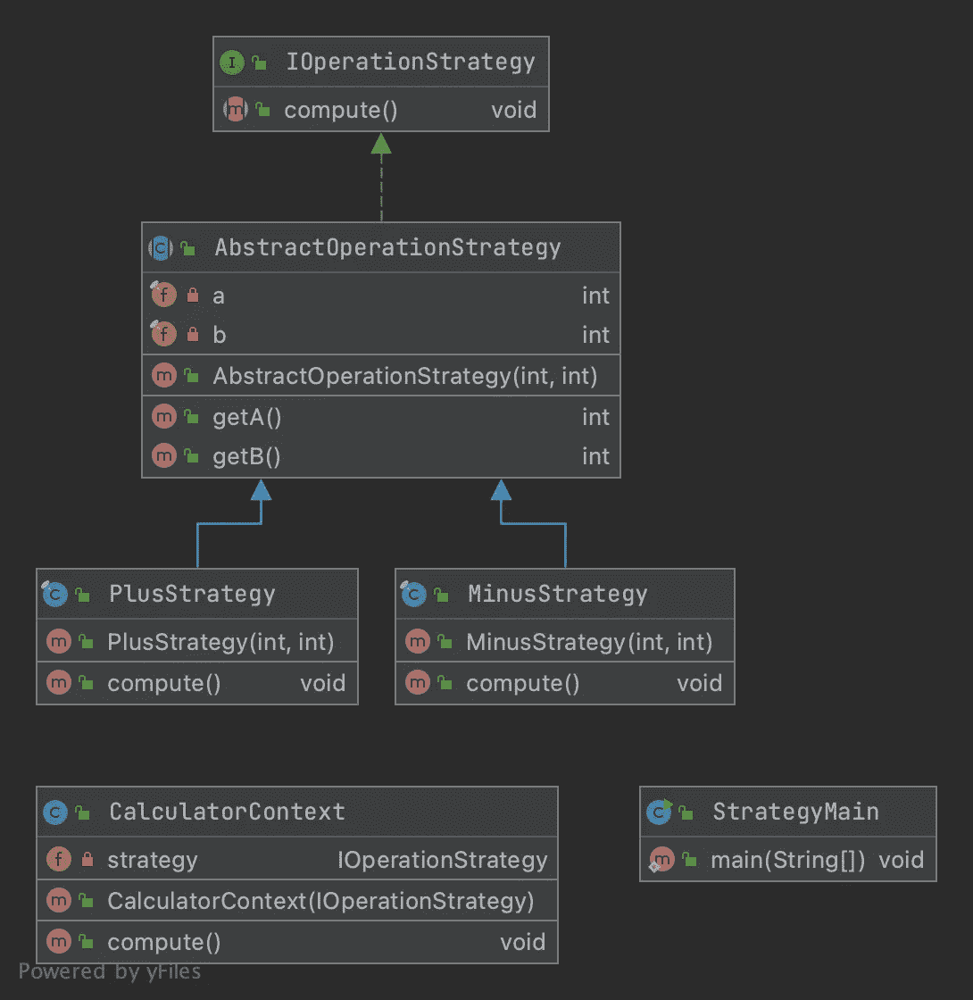

# 战略设计模式— Java

> 原文：<https://medium.com/javarevisited/strategy-design-pattern-java-30439e00299e?source=collection_archive---------1----------------------->

## 策略设计模式教程


# 战略模式的定义

> 在[计算机编程](https://en.wikipedia.org/wiki/Computer_programming)中，**策略模式**(也称为**策略模式**)是一种[行为](https://en.wikipedia.org/wiki/Behavioral_design_pattern) [软件设计模式](https://en.wikipedia.org/wiki/Design_pattern_(computer_science))，能够在运行时选择[算法](https://en.wikipedia.org/wiki/Algorithm)。代码不是直接实现单个算法，而是接收运行时指令，以决定使用哪一组算法。

# 在哪里使用工厂模式

当您希望算法独立于使用它的客户端而变化时。

# UML 示例

[](https://javarevisited.blogspot.com/2015/07/strategy-design-pattern-and-open-closed-principle-java-example.html)

# 战略模式的实施

首先，我们需要声明一个接口或者一个抽象类，这里我两个都用了，但是一个抽象类就可以完成这项工作。

我想要实现的是，根据上下文，我的代码会有不同的行为，所以让我们实现一些策略。

出于本教程的目的，我创建了两个策略:`PlusOperationStrategy` 和`MinusOperationStrategy`，它们都扩展了我的[抽象类](https://javarevisited.blogspot.com/2010/10/abstraction-in-java.html#axzz6oOeSmpNw)。

通过[继承](https://javarevisited.blogspot.com/2012/10/what-is-inheritance-in-java-and-oops-programming.html)使它们成为相同的超类型，我可以在所需行为的函数中替换它们。

所以现在，如果我想使用我的策略，更准确地说是在其中实现的**计算方法**，我需要一个上下文。

因此，基于作为参数传递的[策略](https://www.java67.com/2014/12/strategy-pattern-in-java-with-example.html)，上下文将使用计算方法 it。

现在，让我们看看它是如何工作

上面的代码片段将返回这个结果

```
5
-1
```

感谢您的阅读，本教程中使用的代码可以在[Github 资源库](https://github.com/ErwanLT/designPattern)中找到。