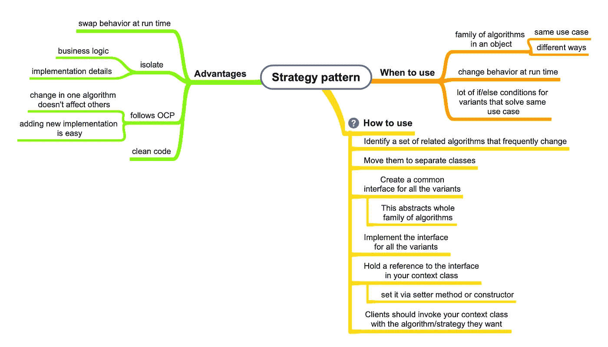

# Java 中的策略模式

> 原文：<https://medium.com/javarevisited/strategy-pattern-in-java-6e97304bf5e5?source=collection_archive---------1----------------------->

**什么是战略模式？**
它封装了一系列算法，使它们在运行时可以互换。

**示例**:分类报告数据(按名称分类、按日期分类……)，支付策略(借记卡、信用卡、UPI……)

[](https://www.java67.com/2014/12/strategy-pattern-in-java-with-example.html)

**何时使用:**

1.  在运行时更改行为。
    例如:基于用户输入的不同支付策略，基于用户输入的不同报告数据排序方式
2.  当你有一个以不同方式解决相同用例的类家族时。

**优点:**

1.  干净的代码— [战略模式](https://javarevisited.blogspot.com/2014/11/strategy-design-pattern-in-java-using-Enum-Example.html) n 坚持 OCP。我们不需要更新现有的策略类来添加新的策略。
2.  关注点分离——我们可以在不同的类中分离业务逻辑和算法的实现细节。
3.  更喜欢组合而不是继承——允许在运行时交换策略。

让我们以报表数据排序为例来看一个实现。用户将有一个报告，并可以选择根据报告中的列对数据进行排序。

假设我们有一个 ReportGenerator 类负责生成报告。

```
public class ReportGenerator {
   public Report sortReport(ReportData reportData, String sortByColumn) {
    if (sortByColumn == "name") {
     return sortReportByName(reportData);
    } else if (sortByColumn == "productNumber") {
     return sortReportByProductNumber(reportData);
    } else {
     return sortReportByDate(reportData);
    }
   }

   private Report sortReportByName(ReportData reportData) {
    // sort the report based on date column
   }

   private Report sortReportByProductNumber(ReportData reportData) {
    // sort the report based on product number
   }

   private Report sortReportByDate(ReportData reportData) {
    // sort the report based on name column
   }
}
```

让我们假设一个 UIController 类处理用户的 UI 交互。这将调用 ReportGenerator 类来根据用户需要的列生成报告数据。

```
package behavioral.strategy.sortingreport;

public class UIController {
 public Report sortReport(ReportData reportData, String sortType) {
  // call to ReportGenerator
  return new ReportGenerator().sortReport(reportData, sortType);
 }
}
```

**上述方法有什么问题？**

1.  **不遵循 OCP:** ReportGenerator 不遵循开闭原则。每当有一个新的排序机制，或者如果我们必须更新一些现有的机制，类必须改变。这可能会导致代码中潜在的错误。
2.  **维护:**随着更多实现的加入，if else 会变得庞大而复杂。这影响了代码的可读性和理解
3.  **关注点没有分离:**report generator 类的业务逻辑和排序报表的实现细节没有分离。

我们如何使用策略模式来解决这个问题？
**步骤:**
1 .将算法家族移到单独的类中。在我们的示例中，我们将把排序策略(按名称排序、按日期排序、按产品编号排序)移动到单独的类中= > SortByName、sort by date、sort by product number。

2.为所有策略提供一个公共界面。这个接口作为一个抽象，向调用者/客户隐藏策略的实现逻辑。在我们的示例中，我们将创建一个定义排序方法的 SortingStrategy 接口。

4.更新您的上下文类(我们示例中的 ReportGenerator 类)以使用接口。

5.客户端代码(我们示例中的 UIController)将在上下文类中设置所需的算法，并调用上下文类。

***实现:***

让我们为所有的报表排序实现创建一个公共接口类(SortingStrategy)。

```
public interface SortingStrategy {
   Report sort(ReportData reportData);
}
```

让我们将所有的排序机制分解成独立的类，这些类将实现上面的接口

```
public class SortByName implements SortingStrategy {
   @Override
   public Report sort(ReportData reportData) {
    // sort the report based on name
   }
}
```

```
public class SortByDate implements SortingStrategy {
 @Override
 public Report sort(ReportData reportData) {
  // sort the report based on date
 }
}
```

```
public class SortByProductNumber implements SortingStrategy {
 @Override
 public Report sort(ReportData reportData) {
  // sort data based on product number
 }
}
```

让我们重构 ReportGenerator 类以使用 SortingStrategy 接口。我们将删除以前的排序实现代码。

```
 public class ReportGenerator {
   private SortingStrategy sortingStrategy;

   // setter to allow setting the strategy at run time based on clients choice.
   // we can also pass the SortingStrategy in the constructor if we want.
   public void setSortingStrategy(SortingStrategy sortingStrategy) {
      this.sortingStrategy = sortingStrategy;
   }

   // this method will directly call the sort method of the interface. Which 
   // concrete implementatation to call will be decided by the client 
   // at run time (Run time polymorphism)
   public Report generateReport(ReportData reportData) {
      this.sortingStrategy.sort(reportData);
   }
} 
```

这样，我们的代码就与具体的排序实现解耦了。

现在客户机(在我们的例子中是 UIController 类)将决定使用哪种排序策略。客户端将在 ReportGenerator 对象中设置相应的策略，并将调用它。ReportGenerator 对象将调用相应策略对象中的排序方法。

```
public class UIController {
   public Report sortReport(ReportData reportData, String sortType) {
      ReportBuilder reportBuilder = new ReportBuilder();

      // client will set the sorting strategy dynamically at run time
      if(sortType == "name") {
       reportBuilder.setSortingStrategy(new SortByName());
      } else if (sortType == "productNumber"){
       reportBuilder.setSortingStrategy(new SortByProductNumber());
      } else if (sortType == "date"){
       reportBuilder.setSortingStrategy(new SortByDate());
      }

      return reportBuilder.generateReport(reportData);
   }
}
```

**这种方式的优点:**

1.  遵循 OCP——新策略将进入自己的类，不会影响任何其他代码。对现有策略的更新也将在它自己的类中，并且不会影响任何其他代码。
2.  我们的业务逻辑(报告生成)与报告排序的实现细节是分开的。
3.  代码的维护将会很容易，因为每个实现都被分离到自己的类中。

我们对策略模式的讨论到此为止。编码快乐！