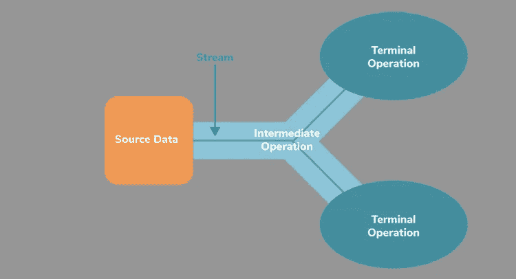
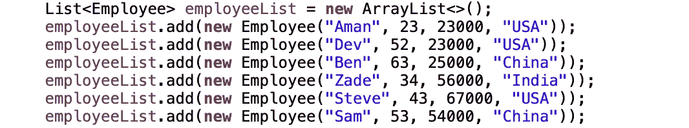
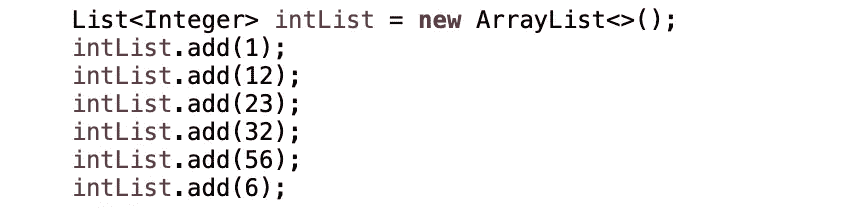
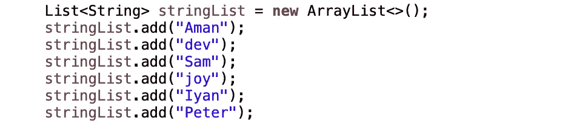

# 流 API-最有用的操作

> 原文：<https://medium.com/javarevisited/stream-api-most-useful-operations-28e3988002d0?source=collection_archive---------0----------------------->

tream API 是 Java 8 的主要补充之一。可以将流定义为来自支持聚合操作的源的元素序列。源可以是向流提供数据的集合或数组。

流本身不是数据结构。它是应用于源的一组操作。它基本上有两种类型的操作:

*   **中级操作——**这些方法不会产生任何结果。它们通常接受函数接口作为参数，并且总是返回一个新的流。中间操作的一些例子有 [filter()](https://www.java67.com/2018/03/java-8-stream-find-first-and-filter-example.html) 、 [map()](https://www.java67.com/2015/01/java-8-map-function-examples.html) 等。
*   **终端操作-** 这些方法产生一些结果，例如 [count()](https://www.java67.com/2014/04/java-8-stream-examples-and-tutorial.html) ， [collect()](https://javarevisited.blogspot.com/2014/03/2-examples-of-streams-with-Java8-collections.html#axzz6co28cbJC) 等。

**流**操作进一步分类:
注意:我们将在整篇文章中使用这三个列表:
**employeeList** 包含雇员的姓名、年龄、工资和国家。
**intList** 有一些随机整数。
string list 有一些大写和小写的字符串。

1.  ***过滤*** *-* 过滤操作对给定的流进行过滤，并返回一个新的流，该流只包含下一个操作所需的那些元素。这是一个中间操作。

*   ***过滤出年龄大于 30 的员工:***
    `employeeList.stream().filter(emp -> emp.getAge() >30).ForEach(System.out::println);`

2.S **licing-** 切片操作是中间操作，顾名思义，是用来切片流的。它包括 distinct()、limit()、skip()。以这个 **intList** 为例:

*   ***柜内不同值列表有重复项-*** intList.stream()。独特()。forEach(system . out::println)；
*   **限制返回的流最多只返回 n 个值-** intList.stream()。独特()。极限(3)。forEach(system . out::println)；
*   ***跳过第 n(此处为其 2)个值-*** intList.stream()。独特()。跳过(2)。forEach(system . out::println)；

3.**映射-** 映射操作是转换一个流的元素并返回一个包含转换后的元素的新流的操作。Map()和 [flatMap()](http://www.java67.com/2016/03/how-to-use-flatmap-in-java-8-stream.html) 是最常用的方法。对于 ex:取 **stringList** 它以 String 为输入，

*   ***以大写形式打印列表中的名称—***
    string list . stream()。map(name - > name.toUpperCase())。forEach(system . out::println)；
*   ***要得到单词的长度，输入是一个字符串，输出是一个整数，我们用 mapToInt()方法代替 map()，它将返回 IntStream 而不是 Stream。***
    string list . stream()。mapToInt(name - > name.length())。forEach(system . out::println)；

4.**匹配**——匹配操作是终端操作，用于检查流中是否存在符合特定标准的元素。大多使用匹配的三种运算:[**【any match()】**](https://javarevisited.blogspot.com/2014/02/10-example-of-lambda-expressions-in-java8.html#axzz6ieZZarMY)**、allMatch()、noneMatch()。考虑到 employeeList，让我们看看不同的匹配操作:**

*   **检查是否有人居住在特定国家:**
    boolean Canadian = employee list . stream()。anyMatch(p - > p.getCountry()。equals("加拿大"))；
*   T **o 检查所有人员是否都是特定国家的居民:**
    boolean allIndian = employee list . stream()。allMatch(p - > p.getCountry()。equals("印度"))；
*   **检查是否所有人都不是某个国家的居民:**
    boolean none Mexican = employee list . stream()。noneMatch(p - > p.getCountry()。equals("墨西哥"))；

5.**查找** -查找操作是终端操作，用于获取匹配的元素，而不仅仅是验证它是否存在。流中有两个基本的查找操作，即 findAny()， [findFirst()](https://javarevisited.blogspot.sg/2016/03/how-to-find-first-element-of-stream-in.html) 。例如:

*   **筛选居住在印度的员工并获得第一个匹配项。**T43【可选】员工<员工> person = employeeList.stream()。filter(p - > p.getCountry()。等于(“印度”))。findFirst()；

findAny()的用法与 findFirst()类似，但是在我们不关心返回哪个元素的情况下，比如并行流。如果我们在并行流中使用 findFirst()方法，会非常慢。

6.**归约-** 归约流操作是将流归约为单个值的操作。当我们需要执行流缩减为单个值的操作时，例如，最大值、最小值、总和、乘积等。sum()，min()，max()，count()等。下面是一些归约运算的例子。 [reduce()](https://www.java67.com/2016/09/map-reduce-example-java8.html) 明确要求您指定如何减少通过数据流的数据。

*   **计算所有员工工资的总和。** 可选<整数>合计薪资= employeeList.stream()。map(p - > p.getSalary())。减少((a，b)->a+b)；
*   使用 sum()也可以找到上面的 sum，但是我们需要将流转换为 IntStream，我们可以直接使用 sum()。
    int total sal = employee list . stream()。mapToInt(p - > p.getSalary())。sum()；
*   **同样地，当我们需要任何流中的最大或最小元素时，我们也可以使用 min()，max()。**
    可选<整数> max = intList.stream()。max(comparator . natural order())；
    *注意:如果流是一个自定义对象，我们也可以提供一个自定义比较器。*

7.**收集**——是终端法。我们可以创建自己的**收集器**实现，也可以使用 [**收集器**类](https://www.java67.com/2018/11/10-examples-of-collectors-in-java-8.html)提供的预定义实现。Collectors 有各种方法，比如— toList()、toMap()、toSet()、CollectingAndThen()、 [groupingBy()](https://javarevisited.blogspot.com/2015/07/how-to-do-group-by-in-java-8.html) 、partitioningBy()、minBy()、maxBy()等。我们将通过将这些分为三类来详细研究这些问题:

# ***收藏操作:***

1.  **toList()-** 将流收集到列表中:
    List<String>empName = employee List . stream()。map(emp - > emp.getName()。collect(collectors . to list())；
2.  **toSet()** -将流收集到 Set:
    Set<String>empName = employee list . stream()。map(emp - > emp.getCountry())。collect(collectors . toset())；
3.  **toMap()** -将流收集到 Map:
    Map < String，Integer>name Map = list . stream()。collect(collectors . tomap(s->s，s - > s.length()，(s1，S2)->S1))；
    **注意** : toMap()在列表有重复元素的情况下抛出异常，为了避免这种情况，使用上面提到的带有附加参数的实现来选择第一个有重复的元素(比如 s1，s2 - > s1)。
4.  **to Collection(Supplier<C>Collection factory)**-将输入元素收集到新集合中:
    linked list<String>empName = employee list . stream()。map(emp - > emp.getName())。collect(collectors . to collection(linked list::new))；
5.  **collectingAndThen()** -这个方法返回一个收集器，它将输入元素累积到给定的收集器中，然后执行一个附加的完成功能。例如:在这里使列表不可修改:
    List<Employee>unmodified List = Employee List . stream()。收藏(收藏者。*收集然后*(收集者。 *toList* ()、Collections:: *不可修改列表*)；

# 聚合操作:

1.  **counting()-** 获取员工数:long count = employee list . stream()。过滤器(emp - > emp.getAge() > 30)。收藏(收藏者。*计数*())；
2.  **minBy()** -获取最低工资的员工:
    可选<员工> emp =employeeList.stream()。collect(collectors . min by(comparator . comparising(Employee::get salary)))；
3.  **maxBy()-** 获取最高工资的员工:可选<员工>Employee = Employee list . stream()。collect(collectors . max by(comparator . comparising(Employee::get salary)))；
4.  **collectors . summingint(tointfunctionmapper)-**获取所有员工的工资总和:int count = employee list . stream()。collect(collectors . summingint(EMP->EMP . getsalary()))；
5.  **collectors . averaging int(tointfunctionmapper)-**获取所有员工的平均工资:double avg = employee list . stream()。collect(collectors . averaging int(EMP->EMP . getsalary()))；
6.  **joining()-** 将所有字符串连接起来，中间留有空间。
    String joined String = stream . of(" welcome "，" to ""Java "，" world ")。collect(collectors . joining())；
    **注意**:我们也可以使用其他重载版本的连接方法，它们允许我们提供分隔符以及前缀和后缀字符串。
7.  **summary gint(tointfunctionmapper)-**获取任意集合的汇总统计:IntSummaryStatistics summary gint = employee list . stream()。收藏(收藏者。*summary gint*(Employee::get salary))；
    **注意**:输出将类似于—
    IntSummaryStatistics { count = 6，sum=248000，min=23000，average=41333.333333，max=67000}

# 分组操作:

分组操作是 streams 最重要的[特性之一，因为它们可以帮助您在 2-3 行内完成一项任务，否则将需要大量编码。](/javarevisited/7-best-java-collections-and-stream-api-courses-for-beginners-in-2020-3ad18d52c38)

**groupingBy()** -按国家对雇员进行分组:
Map < String，List<Employee>>EMP Map = Employee List . stream()。
collect(collectors . grouping by(Employee::get country))；

**注意**:该方法有更多的使用案例，例如:

*   **如果我们需要得到一个映射，其中的关键字是国家的名称，值是该国所有雇员的工资总和:**
    Map < String，Integer>EMP Map = employee list . stream()。collect(collectors . grouping by(Employee::get country，collectors . summingint(Employee::get salary)))；
*   **我们也可以用重载版本的 grouping by():**
    Map<String，set<Employee>>EMP Map = Employee list . stream()将结果存储在 Set 而不是 list 中。collect(collectors . grouping by(Employee::get country，collectors . toset())；
*   **如果我们需要对多个条件进行分组。然后我们可以提供另一个 groupingBy()作为下游的*，例如:*通过两次使用 groupingBy()方法按照国家和年龄对雇员进行分组。** Map < String，Map < Integer，List<Employee>>>empMap = Employee List . stream()。collect(collectors . grouping by(Employee::get country，collectors . grouping by(Employee::get age)))；
*   如果我们需要得到一个映射，其中键是国家的名称，值是在那个国家有最高工资的雇员对象。
    映射<字符串，可选<雇员>>EMP Map = Employee list . stream()。collect(collectors . grouping by(Employee::get country，collectors . max by(comparator . comparingint(Employee::get salary)))；

**partitioningBy():** 是用于根据给定的谓词对一个对象流(或一组元素)进行分区，并返回一个 Map < Boolean，List < T > >。因为键是布尔值，所以它只接受真/假值。在 true 键下，我们将找到匹配给定谓词的元素。

*   **如果我们需要根据年龄对 employeeList 进行分区:**
    Map < Boolean，List<Employee>>EMP Map = Employee List . stream()。collect(collectors . partitioning by(EMP->EMP . getage()>30))；

这是一些非常有用的流方法。这些只是快速检查，需要一些更详细的练习。
参考: [Java Stream Api](https://www.educative.io/courses/java-8-lambdas-stream-api-beyond)

谢谢！快乐学习:)