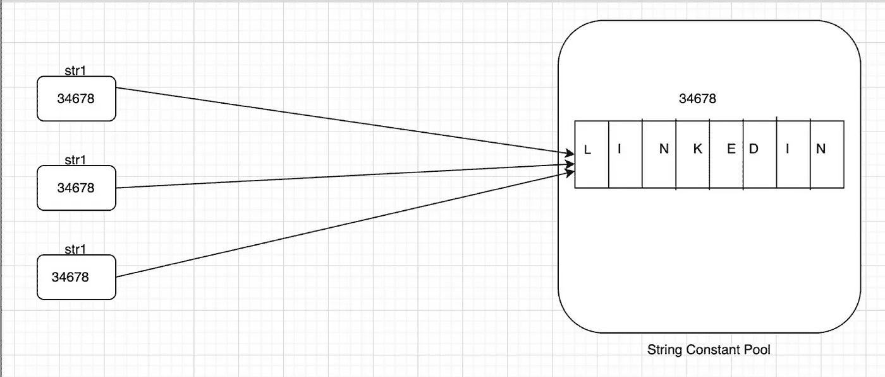
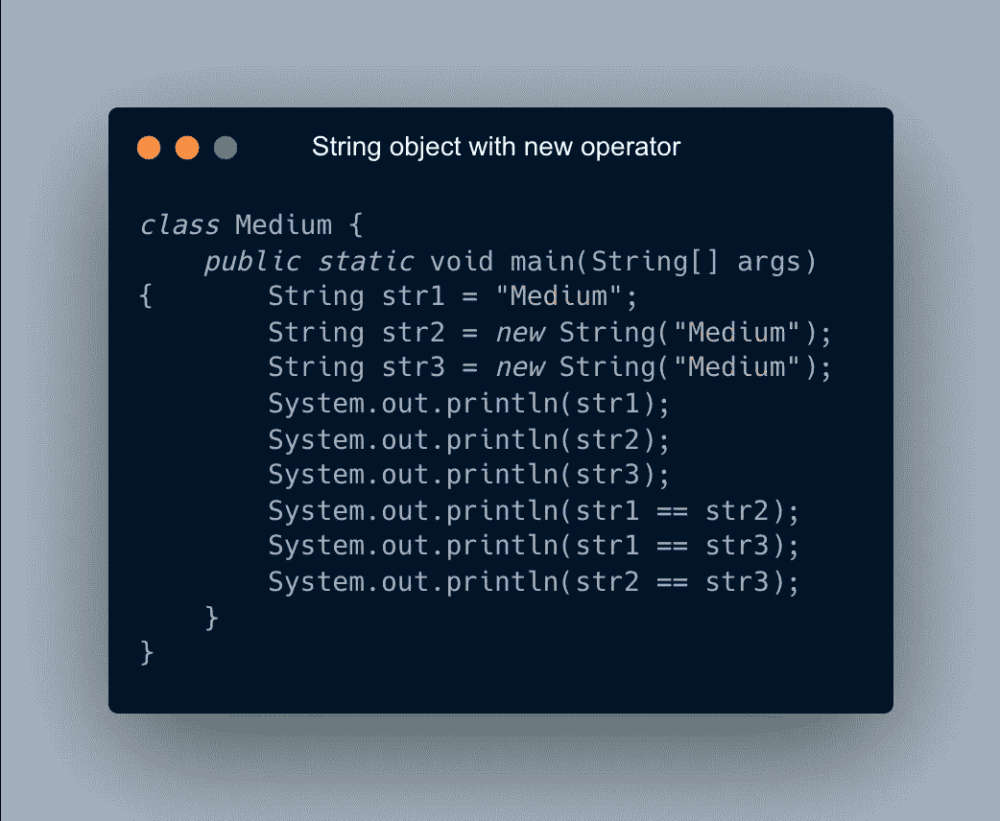

# Java 中的字符串类:开始

> 原文：<https://medium.com/javarevisited/string-class-in-java-the-begining-c0bc35e42798?source=collection_archive---------4----------------------->

今天我们要看一下 [String 类](https://javarevisited.blogspot.com/2022/03/3-examples-to-parse-json-in-java-using.html)，它是 java.lang 包中的入门类之一。正是这个内置的类帮助程序员解决了许多与数据及其操作相关的问题。

让我们从字符串类的签名开始。

```
public final class String
extends Object
implements Serializable, Comparable<String>, CharSequence
```

有了上面的声明，我们可以说[字符串是最终的类](https://javarevisited.blogspot.com/2010/10/why-string-is-immutable-or-final-in-java.html)，它继承了一个对象类的属性并实现了 [*可序列化*](https://javarevisited.blogspot.com/2014/05/why-use-serialversionuid-inside-serializable-class-in-java.html) 、 [*可比*](https://www.java67.com/2019/06/top-5-sorting-examples-of-comparator-and-comparable-in-java.html) 和 CharSequence 接口。因为它是一个带有 final 关键字的类，所以我们不能为它定义子类。

[字符串对象本质上是不可变的](https://www.java67.com/2014/01/why-string-class-has-made-immutable-or-final-java.html)，这意味着一旦对象被创建，那么对象的内容或数据就不能被修改。如果我们试图修改一个对象的内容或数据，那么就会创建一个新的对象。我们可以用两种方法创建 String 类的对象:

# 没有新操作员

1.  [JVM](/javarevisited/7-best-courses-to-learn-jvm-garbage-collection-and-performance-tuning-for-experienced-java-331705180686) 为字符串引用变量分配内存，并验证字符串常量池中的字符串文字。[字符串常量池](http://javarevisited.blogspot.sg/2016/07/difference-in-string-pool-between-java6-java7.html)放在 [*堆内存*](https://javarevisited.blogspot.com/2011/05/java-heap-space-memory-size-jvm.html) 中，在这里定义字符串的值。字符串的内部状态在整个程序中保持不变，字符串常量池有助于通过对象的不变性来实现这一点。
2.  如果[字符串文字](https://www.java67.com/2014/08/difference-between-string-literal-and-new-String-object-Java.html)不在字符串常量池中，那么它在字符串常量池中创建一个新的字符串对象，新创建的字符串对象将被赋给 [*字符串引用变量*](https://javarevisited.blogspot.com/2015/12/when-to-use-intern-method-of-string-in-java.html) 。
3.  如果 JVM 发现字符串文字可用，那么现有的字符串对象地址将被分配给字符串引用变量。

[](https://www.java67.com/2018/06/top-35-java-string-interview-questions.html)

创建不带新运算符的字符串

[](https://javarevisited.blogspot.com/2012/10/10-java-string-interview-question-answers-top.html)

幕后的字符串操作

# 使用新运算符

1.  这里，JVM 也为字符串引用变量分配内存，并验证字符串常量池中的字符串文字。
2.  如果字符串常量池中不存在字符串文字，那么在这种情况下，它会在字符串常量池中创建新的字符串对象。
3.  如果字符串常量池中存在字符串文字，则忽略它，在常量池外创建一个新的字符串对象，并将字符串常量池外新创建的字符串对象的地址分配给字符串引用变量。

[](https://javarevisited.blogspot.com/2013/02/how-to-convert-json-string-to-java-object-jackson-example-tutorial.html)

带有新运算符的字符串对象

[](https://www.java67.com/2019/04/how-to-check-if-two-string-are-anagram.html)

# String 类的 intern()方法

[intern()方法](https://javarevisited.blogspot.com/2015/12/when-to-use-intern-method-of-string-in-java.html)的签名为“public native String intern()”，它从字符串常量池中返回字符串对象的引用。

当调用 intern()方法时，JVM 使用 string 类的 equals(object)方法检查池中是否已经包含一个等于 string 对象的字符串，然后返回 string pool 对象。否则，将这个字符串对象添加到池中，并返回对这个字符串对象的引用。

# **症结**

1.  当我们创建两个字符串对象而没有使用新的操作符并且具有相同的内容时，两个引用变量指向同一个对象。
2.  当您使用 new 运算符创建一个字符串对象时，每次都会在字符串常量池之外创建一个新对象，并将该地址赋给引用变量。

我希望你明白这个主题，如果你有任何困惑，请告诉我，以便我可以用一些更具互动性的例子来更深入地解释它。更多类似的话题，请关注，如果你喜欢这些内容，请鼓掌。敬请期待！

