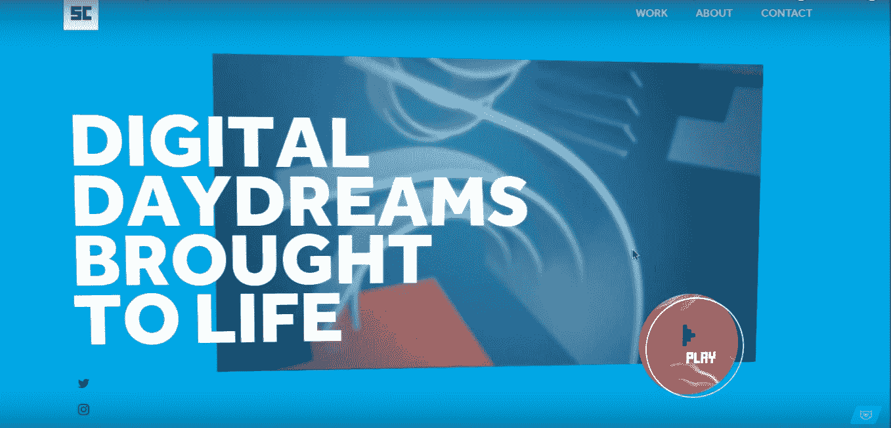
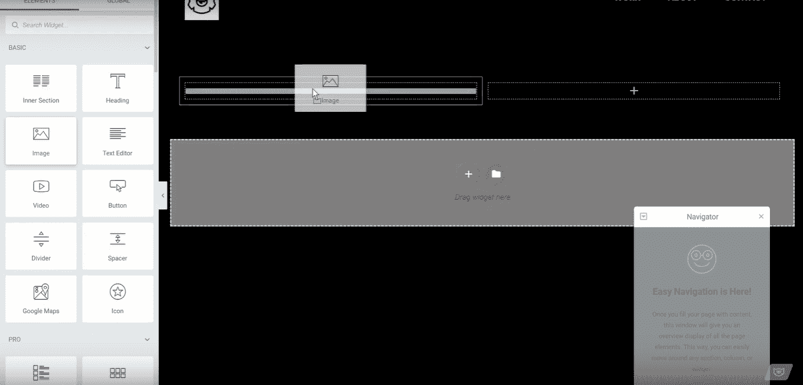
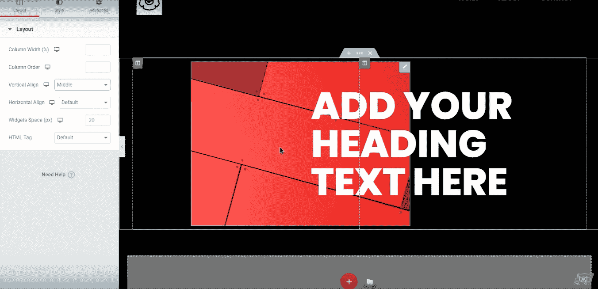
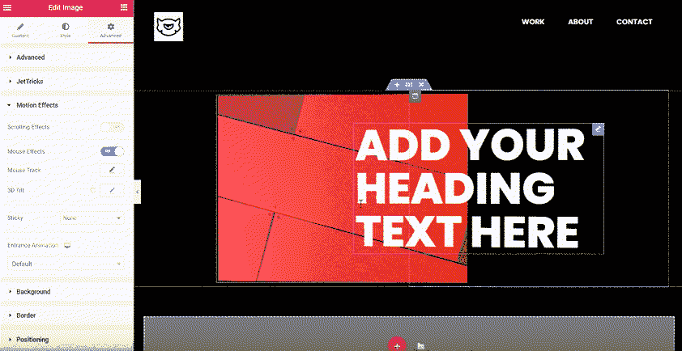
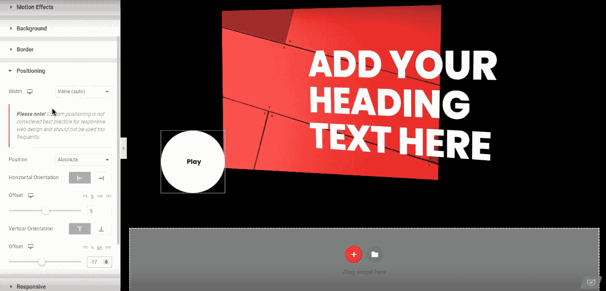
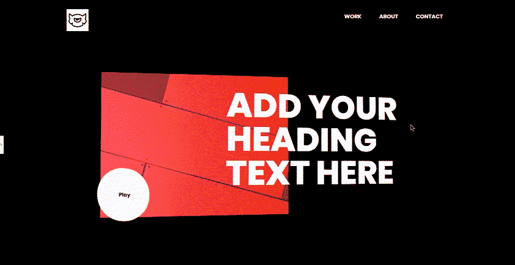

# 令人惊叹的 Elementor PRO 教程:如何创建 3D 视差全息幻觉

> 原文：<https://medium.com/javarevisited/stunning-elementor-pro-tutorial-how-to-create-3d-parallax-holographic-illusion-99b86d8c62c0?source=collection_archive---------0----------------------->

你好！你想为你的 WordPress 网站创建一个令人惊叹的英雄版块吗？今天，我将向你展示一个防弹的方法，用 Elementor Pro 使你的网站主页的顶部更吸引人。

通过下面我给你展示的几个步骤，你可以创造一个看起来非常酷的 3D 视差全息幻觉。这里有一个你可以创造的例子:

现在，让我们开始吧！

您的项目需要图形元素吗？

[**试用一次会员**](https://one.templatemonster.com/graphics/?aff=javarevisited&utm_campaign=one_banner&utm_source=javarevisited&utm_medium=referral)

# 如何创造 3D 视差全息错觉

# 第一步

用 Elementor Pro 打开你的主页。**使用可视化工具添加由两列组成的部分。**

# 第二步

现在，您将添加一个用于英雄部分的背景。将图像添加到左栏。

# 第三步

现在我们需要把这张图片移到右边。我要移动的不是图像本身。相反，选择保存图像的列。

转到**“高级”**，切换到“边距”旁边的**%(百分比)。**

> **NB！**为了不影响网站的响应，请始终从像素(所有屏幕分辨率的固定值)切换到百分比(相对值)。

接下来，取消“**页边距**”值的链接，并设置值以将图像向右移动。

# 第四步

现在，向右边的列添加一个 header 元素。调整文本的样式、文本大小和对齐方式。

接下来，将标题向左移动，就像之前将图像向右移动一样。因此，选择正确的列并转到“**高级**”。切换到“ **%** ”，取消链接“**页边距**”。

设置值以将标题小部件向左移动。

# 第五步

是时候给我的元素添加一些动画和深度了。现在，我处理标题和图像。稍后我会添加按钮。

选择您之前创建的**标题小工具**，进入左侧的**高级**设置。转到“**动作效果**部分，启用“**鼠标效果**”。接下来，启用“ **3D 倾斜**”。保持倾斜的**方向**和**速度**为默认。

现在，我为 image 小部件启用相同的效果。选择 widget，在**高级**选项卡下启用**鼠标效果**和 **3D 倾斜**。

将 **3D 倾斜**的**速度**调低至 3，因为背景中的图像应该移动得慢一点。

# 第六步

在图像小工具的高级设置中，启用“**鼠标轨迹**”。不要改变效果的方向和速度！

接下来，再次选择 Heading widget，进入“**高级**，同时启用“**鼠标轨迹**”。为了给你的 3D 视差全息错觉增加更多的深度，将“**鼠标轨迹**的方向改为“**直接**”。您可能还想增加该元素的“**速度**”值。

# 第七步

是时候加个按钮了。创建一个新的部分，在那里添加一个按钮部件。调整按钮的样式以匹配 3D 视差全息插图的其余部分。将按钮做成圆形。观看[这个视频教程](https://www.youtube.com/watch?time_continue=153&v=rpzLfsxkxhw&feature=emb_logo)来学习如何让你的按钮变成圆形+ 8 个附加元素或按钮样式。

# 第八步

在这一步中，我将向上移动按钮。选择**按钮**“widget and go”**高级**->**定位**。将**宽度**设置为**内嵌(自动)**。这将把你的小部件变成一个整洁的易于移动的正方形。

接下来，将下面的小部件**位置**设置为**绝对**。这允许向上拖动你的按钮部件。切换到“ **%** ”，为按钮添加一个偏移量，使其向右移动一点。

通过添加一个“**偏置**”将圆形按钮上移。

# 第九步

是时候添加**动作特效了。**

打开**鼠标效果**和**鼠标轨迹**。将“**鼠标轨迹**方向更改为“**直接**”，以匹配您之前应用到标题小部件的效果。接下来，启用“ **3D 倾斜**”。您可以随意调整效果的速度。

# 包扎

C 祝贺！你已经用 3D 视差全息幻觉创建了一个很酷的英雄网站部分。

当然，你可以改变风格，打造独一无二的外观，或者使用视频背景，让你的网站主页更加吸引人！

如果你想详细查看这个酷炫英雄版块的制作过程，可以看看这个循序渐进的 [**3D 视差全息错觉视频教程**](https://www.youtube.com/watch?v=l-FNYqwgQms&feature=youtu.be) **。**它涵盖了最微小的细节和您拥有的额外选项。

## 你用 Elementor Pro 创建网站吗？

用高质量的现成元素或 WordPress 主题在几天内创建你的下一个 WordPress 网站。顺便访问[**elements or market place**](https://www.templatemonster.com/elementor-marketplace/?aff=javarevisited&utm_campaign=elementor_holographic&utm_source=javarevisited&utm_medium=referral)来发现最好的**elements or Pro 主题、模板和插件**用无限的功能和强大的 UI 元素来增强你的 WordPress 网站！

> 你喜欢这个 3D 视差全息错觉教程吗？

如果您有任何问题或意见，请不要犹豫，在下面分享！

敬请关注更多内容！