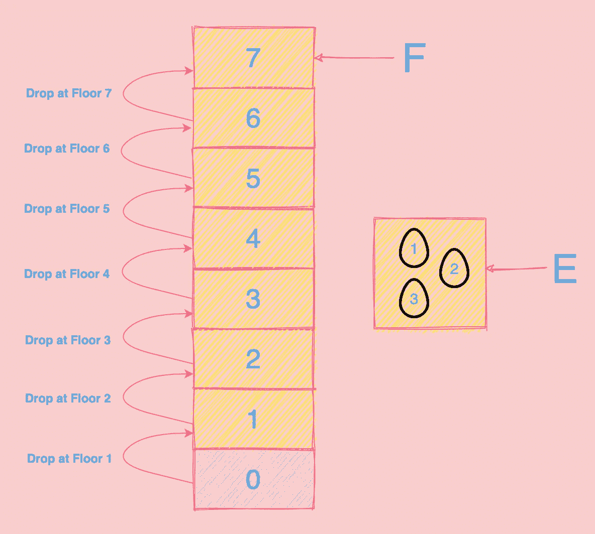
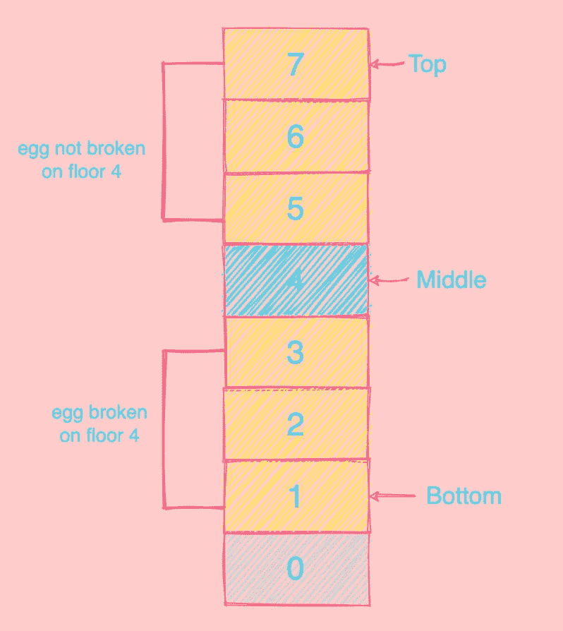
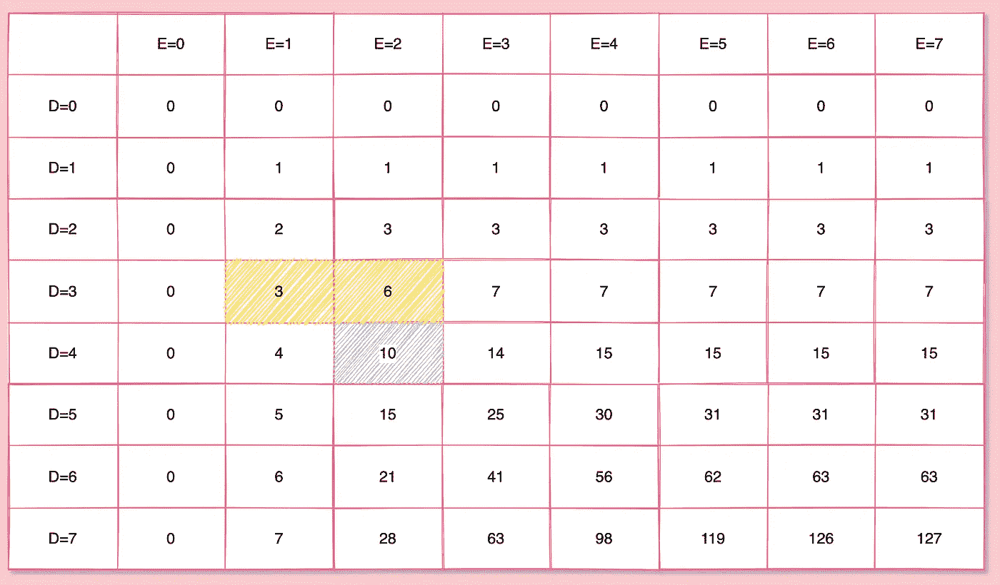
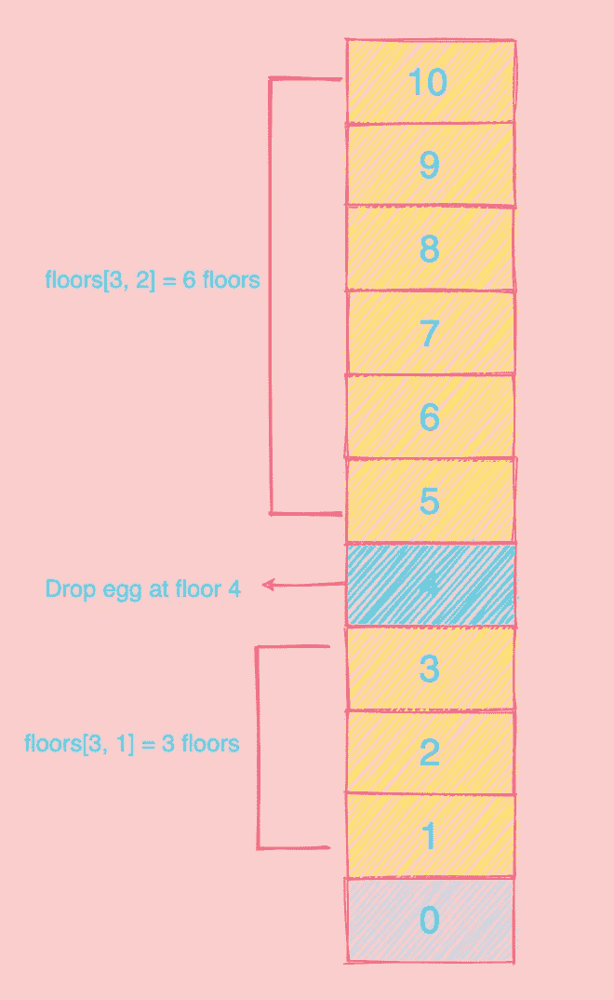

# 如何用动态规划解决超级落蛋问题

> 原文：<https://medium.com/javarevisited/super-egg-drop-problem-ac42a4b4b09a?source=collection_archive---------1----------------------->

> 找出鸡蛋掉落的最少次数，从而知道鸡蛋不会从建筑物的哪一层打破。

# 问题描述

[](https://medium.com/javarevisited/20-array-coding-problems-and-questions-from-programming-interviews-869b475b9121)

由 [FreePik](https://www.flaticon.com/authors/freepik)

有 **E 蛋(=允许蛋碎)**，一栋有 **F** **楼层**[**1≥F】****特殊楼层**S**[**0≤S≤F】-**任何掉在高于 S 楼层的未碎蛋都会碎，掉在该楼层或该楼层以下的蛋不会碎。**

**给定一个未打破的鸡蛋可以从任何楼层掉下，为了在最坏的情况下找到 S ，需要**的**鸡蛋掉 D[1≤D≤F】**的最少次数是多少？****

**输入 1: E =1，F=1 |输出 1: D=1
输入 2: E =1，F=2 |输出 2: D=2
输入 3: E =1，F=7 |输出 3: D=7
输入 4: E =2，F=7 |输出 4: D=4
输入 5: E =3，F=7 |输出 5: D=3**

## **常见混淆点:**

*   **什么是“最坏的情况”？这意味着只有当从上到下的搜索范围用尽时，鸡蛋才会打破。**
*   **特殊地板范围内的“地板 0”是多少？把它当成一个不允许掉蛋但可以借鉴的地下室。例如:S=0 如果鸡蛋在 1 楼打破，这意味着任何高于 0 楼的跌落都会导致打破。**

# **🍳解决方法**

## **线性搜索**

**拿一个鸡蛋到第一层，开始一层一层往下扔，直到它破了或者我们超过了顶层。最坏的情况是遍历所有楼层[O(F)]来求 S=F。**

**[](https://hackernoon.com/10-data-structure-algorithms-books-every-programmer-should-read-d50487313127)

建筑物中的线性搜索** 

**不幸的是，这种算法将不起作用，因为我们必须找到找到 S 所需的最小**蛋滴数**，这在几种情况下将小于 S。**

## ****改良的二分搜索法****

**一只典型的二分搜索法会给我们带来蛋液。这里我们将在一个范围内(从底层到顶层)从中层反复做一次鸡蛋掉落，检查是否打碎。在下图中，您可以看到第一次迭代中建筑物的底部=1，顶部=7，中部=4。**

**[](https://medium.com/javarevisited/top-10-free-data-structure-and-algorithms-courses-for-beginners-best-of-lot-ad807cc55f7a?source=collection_home---4------0-----------------------)

建筑中的二分搜索法** 

**如果鸡蛋在第 4 层打破，那么这一层在 S 层之上，因为鸡蛋会在 S 层之上的所有层打破，所以底部保持为 1，而顶部变为中间-1=4 -1=3。如果鸡蛋没有在第 4 层打破，那么这一层就在 S 层以下，因为鸡蛋不会在 S 层以下的任何一层打破。所以顶部保持为 7，而底部变为中间+1=4 +1=5。范围改变后，我们不断重复这一过程，直到找到 S。最坏的情况是通过 Log2(F)层，找到 S=F 或 S=0。**

**这在一个有**无限鸡蛋(=鸡蛋打破)**的世界中非常有效，但在有鸡蛋打破限制的情况下效率会低得多。在上面的场景中，如果第一个鸡蛋从第四层打破，然后第二个鸡蛋也从第二层打破，会怎么样？因为没有剩余的鸡蛋来继续算法，所以不可能找到 S=1 还是 S=0。为了实现这一点，我们可以将第二个鸡蛋带到底部(第一层)并进行线性搜索，而不是将第二个鸡蛋放在第二层，每次向上一层。**

**即使做了这样的修改，想象一个有 1000 层和 2 个鸡蛋的情况，我们最终将通过 500 层，在这种情况下是 F/2 ~ O(F)。我们能做得更好吗？**

## **O(ExF)复杂性**

****两个鸡蛋打破****

**现在让我们再来看看 F 层有 2 个鸡蛋限制的问题，以及修改过的[二分搜索法算法](/javarevisited/binary-search-in-java-algorithm-eca288cb9bc2?source=extreme_sidebar----d3a191ac6ed-----0-1----------------------)，我们学会了理解算法的基本主题。**

**假设我们已经知道需要执行 **X** 落蛋来找到 s，给定这些约束，第一个蛋必须落在楼层 X **(直接跳到 X)**。这是必要的，以保持最后的蛋滴数等于 X。**

**当第一个鸡蛋打破时，我们从第一层的第二个鸡蛋开始线性搜索。**

```
X =   1 (drop at floor X with first egg) 
    + X-1 (drops from floor 1 to floor X-1 with second egg)
```

**当第一个鸡蛋在 X 层没有打破的时候，我们可以向上跳 X-1，然后把它掉在地板上(X+(X-1))=2X-1。如果第一个鸡蛋在第二次下落时破裂，那么我们从 X+1 开始线性搜索，否则我们继续向上跳。**

```
X =    1 (drop at floor X with first egg) 
     + 1 (drop at floor 2X-1 with first egg)
     + X-2 (drops from floor X+1 to floor 2X-2 with second egg)
```

**我们每跳一次就减少一次，直到只剩下一层楼。概括地说，对于 2 个鸡蛋，在最坏的情况下，跳跃的总和应该大于或等于楼层数，如下所示:**

```
X + (X-1) + (X-2) + … + 2 + 1 >= F
```

****限制 E 蛋打破****

**在深入研究实际算法之前，让我们回顾一些事情:**

1.  **建筑物的总层数=
    当前楼层
    +当前鸡蛋破裂时探索的楼层(底部到当前-1)
    +当前鸡蛋未破裂时探索的楼层(当前+1 到顶部)**
2.  **在蛋破裂的约束下，有可能从若干楼层发现蛋掉落，反之亦然(根据等式)。**

**我们有一个二维矩阵 **floors** 是 D x E，而 **floors[d][e]** 是我们可以找到 S 的层数，其中允许蛋掉落 **d** 和**蛋打破 **e** (基本上是蛋的数量)。****

```
floors[d][e] =   1 (new floor against new egg drop)
               + floors[d-1][e-1] 
                 (floors with 1 less egg drop and 1 less egg break)
               + floors[d-1][e] 
                 (floors with 1 less egg drop)
```

**floors[d][e]是我们能找到的有 d 个鸡蛋下落和 e 个鸡蛋破裂的楼层数。当我们丢下一个新蛋时，如果蛋破了，那么 S 在当前楼层之下，否则它在当前楼层之上。总楼层数是三个值的总和:**

*   ****当前+朝向底部的楼层数** : 1 +楼层数[d-1][e-1]是我们可以从底部到达的总楼层数，假设鸡蛋在新的下落中破碎。**
*   ****朝向顶层的楼层数**:楼层数【d-1】【e】是我们从新楼层到顶层可以到达的楼层数。**

****代号****

```
# Language: Java
# Time Complexity: O(ExF) because of the nested loop.public int superEggDrop(int E, int F) {

        int[][] floors = new int[F+1][E+1];

        for (int d=1; d<=F; d++) {
            for (int e=1; e<=E; e++) {

                floors[d][e] = 1 
                    + floors[d-1][e-1] 
                    + floors[d-1][e];

                if (floors[d][e] >= F) {
                    return d;
                }
            }
        }

        return -1;
}
```

**让我们详细讨论一个例子；对于 D=4 和 E=2，楼层数为 10。楼层矩阵的可视化(比代码计算的维度更多)如下:**

**[](https://medium.com/javarevisited/7-best-courses-to-learn-data-structure-and-algorithms-d5379ae2588?source=---------18------------------)

地板矩阵 7x7** 

**请注意 E=1 列值如何用于楼层上的线性搜索，因为只允许 1 个鸡蛋打破，而 E=2 列值遵循两个鸡蛋打破部分中描述的逻辑。**

**[](https://medium.com/hackernoon/10-data-structure-algorithms-and-programming-courses-to-crack-any-coding-interview-e1c50b30b927?source=user_profile---------8-----------------------)

楼层(4、2 层)** 

**算法步骤是:**

**第一步:在地板上扔鸡蛋=地板(3，1)+1=3+1=4。我们还剩 3 滴鸡蛋。如果中断，[从第 1 层到第 3 层线性搜索](https://javarevisited.blogspot.com/2020/01/how-to-implement-linear-or-sequential-search-in-java.html#axzz6VYKcmyZz)，否则转到步骤 2。**

**第二步:把鸡蛋扔在地板上= 4+(4–1)= 4+3 = 7。我们还剩两滴鸡蛋。如果中断，从第 5 层到第 6 层进行线性搜索，否则转到第 3 步。**

**第三步:把鸡蛋扔在地板上= 7+(4–2)= 9。我们还剩一滴鸡蛋。如果打破了，把鸡蛋扔在第 8 层，否则扔在第 9 层。**

**如果你觉得这篇文章有用，请帮助我接触更多的开发学习者！**

**通过“鼓掌”来展示一些❤👏在页面的左边距(在桌面上)或底部(在手机上)。通过连续点击，您可以这样做多达 50 次！**

# **阿努姆·马利克**

**[LinkedIn](https://www.linkedin.com/in/anumsarmadmalik/)|[Twitter](https://twitter.com/anumsarmadmalik)**

## **特别感谢…**

**【1】[最简单——Python DP 解决方案详解](https://leetcode.com/problems/super-egg-drop/discuss/443089/Simplest-Python-DP-Solution-with-Detailed-Explanation-99Time-100Mem)
【2】[经典 DP 超级彩蛋](https://labuladong.gitbook.io/algo-en/i.-dynamic-programming/throwingeggsinhighbuildings)
【3】[两个彩蛋问题](http://datagenetics.com/blog/july22012/index.html)
【4】[887。超级蛋蛋滴](https://leetcode.com/problems/super-egg-drop/)**

**您可能喜欢的其他**数据结构和算法文章**:**

**[](/hackernoon/50-data-structure-and-algorithms-interview-questions-for-programmers-b4b1ac61f5b0) [## 50+数据结构和算法程序员面试问题

### 有很多计算机科学毕业生和程序员申请编程、编码和软件…

medium.com](/hackernoon/50-data-structure-and-algorithms-interview-questions-for-programmers-b4b1ac61f5b0) [](/javarevisited/top-10-data-structure-and-algorithms-courses-for-java-developers-25161ee2edc0) [## 面向 Java 开发人员的 10 大数据结构和算法课程

### 这些是学习 Java 中数据结构和算法的最好的在线课程，包含免费和付费…

medium.com](/javarevisited/top-10-data-structure-and-algorithms-courses-for-java-developers-25161ee2edc0) [](/javarevisited/top-21-string-programming-interview-questions-for-beginners-and-experienced-developers-56037048de45) [## 面向初学者和有经验的开发人员的 21 个字符串编程面试问题

### 除了数组、二叉树和链表数据结构，字符串是编程工作中的另一个热门话题…

medium.com](/javarevisited/top-21-string-programming-interview-questions-for-beginners-and-experienced-developers-56037048de45)**