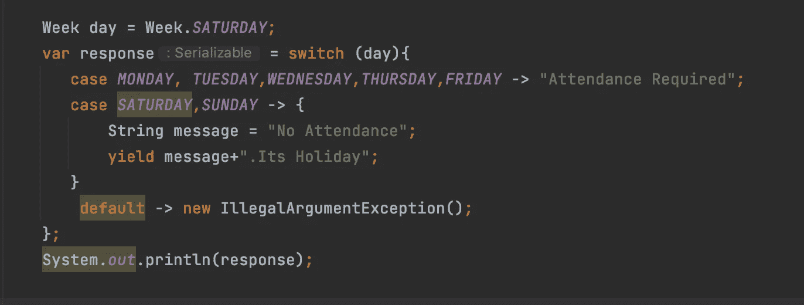

# Java 中的 Switch 语句和表达式(JEP 361)

> 原文：<https://medium.com/javarevisited/switch-statement-expression-in-java-jep-361-cb62cd0b9e68?source=collection_archive---------1----------------------->

## 用 Java Switch 语句和表达式提高代码可读性

> 最初发表于[https://asyncq.com](https://asyncq.com/switch-statement-expression-in-java-jep-361)

# **开关声明**

*   在用编程语言编写逻辑时，我们经常会遇到需要根据用户输入执行特定逻辑的情况。
    为…