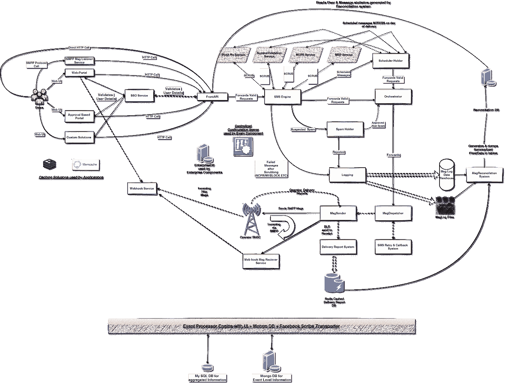

# 赞助短信系统的系统交互设计

> 原文：<https://medium.com/javarevisited/system-interaction-design-of-sponsored-sms-systems-fe2cab03a6f7?source=collection_archive---------2----------------------->

## 关于如何构建这些消息传递系统的案例研究

在过去的几年里，创业世界到处都是关于消息服务提供商的消息，如<https://venturebeat.com/2016/07/14/line-starts-trading-on-nyse-at-42-up-33-from-ipo-price/>**[**Twilio**](https://www.cnbc.com/2016/06/23/twilio-ipo.html)**等。以十亿美元的估值在美国上市，这一趋势中最新的一个是 [**MessageBird**](https://messagebird.com/en/) 。****

****这种趋势现在已经在印度出现，印度本土的信息服务提供商如 [**Route Mobile**](https://www.routemobile.com/) 已经上市，很少有其他公司如 [**SMS Gupshup**](http://www.gupshup.io) 也在排队搭上 IPO 的顺风车。****

# ****短信服务有什么特别之处？****

****嗯，这是这些交付服务处理的规模，虽然消息数据大小很小(只有 160 个字符，只有几千字节)，但数量至少在每天 1 亿+百万的规模，每月至少转化为 30 到 40 亿条消息。****

## ****那么如何建立这样的系统呢？****

****好了，这是本博客讨论的主题，所以不再浪费时间，让我们深入到我的赞助短信系统的系统交互设计的案例研究中去。****

# ****系统交互设计****

******设计注意事项******

*   ****必须快速，延迟非常低，即在几秒钟内****
*   ****每天处理至少 2 亿封邮件****
*   ****对于事务性消息传递，必须无损且可靠****
*   ****处理流量突发(短期促销流量)****
*   ****低成本的基础设施最好能够自动扩展。****
*   ****支持邮件过滤/垃圾邮件检测/清理。****
*   ****支持进出流量的各种协议****
*   ****具有粒度级实时跟踪和报告的能力****

****以上是 Twilio 这样的赞助商消息系统的几个需求，应该是**高度分布式、** [**微服务化、**](/javarevisited/5-best-courses-to-learn-spring-cloud-and-microservices-1ddea1af7012) **、负载均衡、启用缓存、支持文件存储的系统**。我们可能不得不构建我们的定制解决方案，但是我不会深入探究那些库/解决方案的实现(稍后会写一篇博客)。****

******基本流程是:******

## ******用户** → **赞助短信系统** → **运营商******

****首先，谁是这个系统的**用户**，答案是使用促销&交易信息的企业，即**银行、电子商务门户、促销活动者**等。**运营商**是移动服务提供商，如 **Airtel、沃达丰、Reliance Jio** 等。下面的系统图作为将要出现的信息的实际表示:****

********

****赞助短信系统交互流程****

# ****对赞助短信系统的思考****

****赞助短信系统提供多种方式发送 160 个字符的短信，一种是使用由 **SMPP MsgListener 服务**支持的 **SMPP 协议**(在此处[了解更多信息](https://smpp.org/)，第二种可能是将文件上传到他们的**门户网站(或基于批准/定制的解决方案**)。****

****但是我相信 90%的信息是通过 HTTP 直接提交到 FrontAPI 组件上的，因为赞助商系统通常与不同的商业软件集成在一起。向 FrontAPI 的提交可以通过**同步** API(接受请求进行基本的真实性检查并返回响应)或**异步** API(只接受请求并在稍后的时间点处理它)来完成。****

****FrontAPI 之后的其他系统必须是**异步的**，否则将需要太多的机器，这可以通过**分布式队列(如** Redis-Based/RabbitMq 等)或 c**custom asynchronous file Based 队列**(针对对象存储进行了优化，因为 Java 有时会造成混乱的序列化)来处理，然后再进行处理。****

> ****(更多关于定制的**基于异步文件的队列**在我接下来的博客中)****

****<https://www.java67.com/2015/12/producer-consumer-solution-using-blocking-queue-java.html>****、LMAX 干扰器等。，及其多线程变体**应被实现以实现高性能并提取基础设施的完整汁液。******

******DB 调用必须绝对为零**才能达到规模，因为对 [DB](/javarevisited/top-10-free-courses-to-learn-microsoft-sql-server-and-oracle-database-in-2020-6708afcf4ad7) 的写入应该与 MQ(消息队列)异步发生。表中的数据应该遵循直写式缓存实现，使用 **Redis** 或 **Memcached** 层。****

****还有一个**接近实时(NRT)的报告仪表板**，用于跟踪通过所有应用程序的每条赞助短信的进度。这可以通过使用诸如 **Scribe** 之类的传输器将事件发送到另一个称为**事件处理器**的系统来实现。这里需要注意的一点是**该系统的规模几乎是原来的 10 倍，因为 1 条短信会生成 10 个不同的事件，所以每天至少会提供 10 亿个事件的报告和分析。******

# ******角色&各组成部分的职责******

******FrontAPI** 应该做的(注意它必须以毫秒为单位返回响应)****

*   ****短信模板匹配****
*   ****输入验证等****
*   ****避免数据库调用帐户真实性，****
*   ****消息模板匹配，****
*   ****应该使用分布式缓存****
*   ****将消息异步传递给**短信引擎**组件。****

******WebHook 服务**是另一个出站组件，收集用户的输入响应(例如 **Kaun Banega Crorepati —** 印度版的[谁想成为百万富翁](https://www.youtube.com/channel/UCKSxNv7X_ewMbXgs134rCJA)用户发送了他们对 4 位短代码的回复)，然后通过配置的 URL 转发给公司。****

******短信引擎(**基本上是系统的心脏):****

*   ****促销和交易流量分叉、转移和分配到 **orchestrator** 实例****
*   ****对例如 **NV** (号码验证) **NCPR** (全国用户偏好寄存器([**【TRAI**](https://en.wikipedia.org/wiki/Telecom_Regulatory_Authority_of_India))**(移动号码携带) **BlockNo 服务**等应用各种擦洗逻辑。。******
*   ****过滤垃圾邮件/计划邮件，并将它们移动到相应的**垃圾邮件容器/计划容器**组件****

******SchedulerHolder** 组件任务是存储消息，直到预定日期&那天应用相同的清理规则，因为清理数据每天和每周都会发生变化。****

******SpamHolder** 是包含针对用户的反对或垃圾内容的促销消息的控制组件，有一个文字引擎逻辑，用于将这些消息标记为垃圾消息，并将此类活动通知客户关系团队。****

******Orchestrator** 是一个分发器组件，它根据帐户的配置在服务器之间异步接收和分发繁重的流量。****

******MessageDispatcher** 是发送逻辑处理器，它有各种贪婪算法来选择发送哪个运营商，由于有些在印度特定地区更便宜，有些发送成本高但有保证，所以这个组件有实现的算法，如[漏桶](https://medium.datadriveninvestor.com/leaky-bucket-algorithm-for-flow-control-6ba600bfee10)，基于成本的优化，发送&时间参数。****

****<https://medium.datadriveninvestor.com/leaky-bucket-algorithm-for-flow-control-6ba600bfee10>  

**日志记录**组件异步接收&并将所有传出的消息存储在表/文件中(二进制或拼花格式)以便协调。这充当了**对账**组件的一个输入源，该组件的工作是为每个客户创建使用和计费报告。

**消息发送者:**

*   将消息提交给操作员 SMSC
*   收集 SMPP 提交的来自操作员 SMSC 的响应(他们处理 SMPP 的消息)
*   标识是否要重试消息。
*   从操作员 SMSC 处收集交货报告，并将其传递给**交货报告系统**进行进一步处理。
*   这也将传入的响应发送到 **Web Hook 消息接收器**服务，该服务又转发到 **Web hook 服务**，该服务将响应转发到客户的已配置 URL。

**SMSRetryCallback 系统:**这是一个重试系统，由于第一次尝试失败，它会将 SMS 的属性重置给另一个运营商，以便从不同运营商 SMSC 的 **MessageDispatcher** 再次重试。

**交付报告(DR)系统:**

这个微服务应该处理交付报告，并保存到数据库/文件中，还应该一起缓存。缓存的灾难恢复将加速由**msg reconcilization**组件完成的协调过程。

**事件处理者**的职责应该是

*   为每条消息提供**近乎实时的跟踪(NRT)**
*   系统内部故障的亲密技术支持团队
*   提供一个仓储系统，以获取报告并根据区域、周期、时间、操作员等分析趋势。**** 

******有趣的阅读******

*   ****系统分析论文:【https://arxiv.org/ftp/arxiv/papers/1408/1408.1201.pdf ****

****有问题吗？建议？评论？****

****下一步是什么？ [**在 Medium 上关注我**](/@vaibhav0109) 成为第一个阅读我的故事的人。****