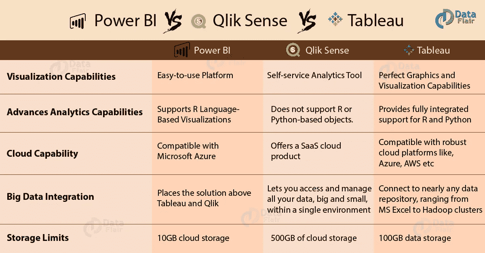
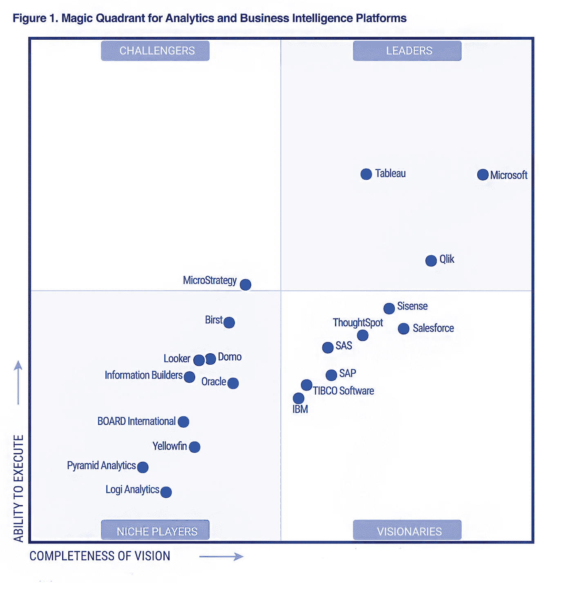
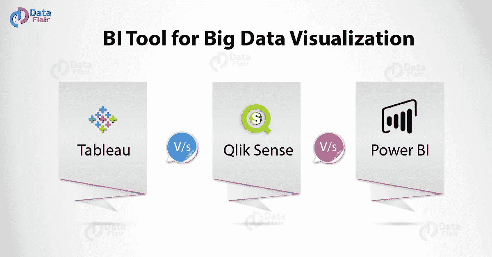

# Tableau vs Qlik Sense vs Power BI —选择大数据可视化的最佳 BI 工具

> 原文：<https://medium.com/javarevisited/tableau-vs-qlik-sense-vs-power-bi-choose-best-bi-tool-for-big-data-visualization-533976324c47?source=collection_archive---------0----------------------->

大数据是各种企业的金矿。每个组织都希望为其大数据提供最佳的数据分析和可视化工具。在本文中，我们将尝试向您提供关于用于大数据可视化的[最佳 BI 工具](https://data-flair.training/blogs/business-intelligence-tools/)的所有信息。在这里，我们将了解 Tableau vs Qlik Sense vs Power BI 的区别。

那么，您准备好探索大数据可视化的顶级 BI 工具了吗？

# 1.用于大数据可视化的商业智能工具

如今，企业非常依赖[大数据](https://data-flair.training/blogs/What-is-big-data/)和其中加密的信息来理解当前趋势和业务场景，以便在未来做出明智而明智的决策。

因此，这使得拥有一个良好的商业智能工具来分析和可视化大数据势在必行。

毫无疑问，目前市场上有不少*针对大数据可视化的 BI 工具*。大多数工具都有特定的用途，这实际上取决于您的需求和使用案例，即哪种工具最适合您。

然而，我们在这里是为了寻找大数据可视化和分析的最佳通用 BI 工具。

[你知道目前 IT 行业大数据的趋势吗？](https://data-flair.training/blogs/big-data-trends/)

# 2.一个好的工具需要什么？

在我们进入单个 BI 工具的二分法之前，我们必须了解任何好的大数据可视化工具的基本需求是什么。

*   每个数据可视化工具都被期望将深不可测的数据转换成赏心悦目的图表和图形，并让它们将数据中隐藏的信息传达给业务用户和分析师。
*   相反，工具还必须能够以易于理解的方式分析、处理和呈现数据。
*   该工具必须通过吸收和聚合来自不同来源的大量复杂数据，高效地创建可理解的数据报告和仪表板。
*   该工具的设计必须使每个用户，无论其背景和技能如何，都能像日常使用的任何其他软件或应用程序一样学习使用它。
*   工具必须专注于成为交互式自助分析、开发和可视化工具。这与传统的企业范围的 IT 开发软件不同，后者只能由一小部分技术用户使用。工具应该让入门级用户能够高效地使用它，并获得对大数据的洞察力。
*   大数据的过滤、处理和切片应该很容易。
*   工具必须为组织内外的协作和洞察力共享提供足够的功能。
*   可视化必须足够丰富和直观，以便任何技术或非技术用户理解它并从中获得有意义的见解。

阅读更多关于— [为什么要学习大数据？](https://data-flair.training/blogs/learn-big-data-hadoop/)

# 3.大数据可视化的顶级 BI 工具

大数据可视化的三大[商业智能](https://data-flair.training/blogs/business-intelligence/)工具是 *Tableau、Qlik Sense 和微软 Power BI* 。让我们了解它们在大数据可视化中分别扮演什么角色，以及它们对大数据有多好。

此外，根据 Gartner 的商业智能和分析平台魔力象限(2018)，这三种工具都被宣布为领先的 BI 工具。

*Gartner 商业智能和分析平台魔力象限(2018)*

# 一.什么是 Tableau？

Tableau 是目前最流行、最领先的 BI 工具。它具有最好的可视化功能，拥有完美的前端图形用户界面。它还有一些内置的分析模块，用户可以直接使用他们的数据。

此外，它使用户能够开发应用程序对象，定制动态视觉效果，并通过网络向其他用户分发报告和文档。如果你想了解更多，查看那些最好的 Tableau 课程

# 二。什么是 Qlik Sense？

[Qlik Sense](https://data-flair.training/blogs/Qlik-Sense-tutorial/) 是一款简单的交互式数据可视化工具，支持用户从各种[大数据](https://hackernoon.com/10-java-big-data-and-web-development-frameworks-programmers-should-learn-in-2019-399692efb4d5)来源导入和聚合数据。他们可以进一步使用软件的数据可视化工具将原始数据转化为有意义的信息。Qlik 还声称 [QlikView](https://data-flair.training/blogs/Qlikview-tutorial/) 是高效[大数据工具](https://javarevisited.blogspot.com/2019/04/top-10-hadoop-tutorials-for-big-data-developers.html)的潜在竞争者，因为它还能够同时集成多个数据源。

# 三。什么是微软 Power BI？

Microsoft Power BI 是微软自己的数据可视化工具。它在某些方面比其他产品更好，因为它与微软 Azure 和微软云环境兼容得最好。此外，用户可以连接到 Excel 来导入数据和创建个性化的数据仪表板。

# 4.Tableau vs Qlik Sense vs Power BI

在大数据可视化最佳 BI 工具的竞争中，我们将讨论 Power BI 与 Tableau 和 Qlik Sense 之间的区别:

*Tableau vs Qlik Sense vs Power BI*

# 一.可视化能力

Power BI:这是一个易于使用的平台，使用户能够从各种来源导入数据，并使用图表、图形和表格来可视化数据。在 Gartner 的商业智能和分析平台魔力象限(2018)中，它被视为领先 BI 供应商中使用最简单的工具*。它支持来自各种来源的数据集成，如 Hadoop、本地文件或基于云的来源。*

Qlik Sense:这是一个自助式分析工具，带有内存数据存储引擎。由于内存中的引擎，它提供了良好的动态可视化。数据与创建关联相关联，一旦数据源中的数据更新，关联就会更新可视化。同时，用户可以继续在仪表板上探索和工作。

Tableau: [Tableau](/javarevisited/5-best-tableau-desktop-associate-certification-courses-and-practice-tests-to-crack-in-2021-86312b60c1f3?source=extreme_sidebar---------0-2----------------------) 以其完美的图形和可视化能力而闻名。与此同时，它是一个易于使用的软件。它支持来自不同来源的数据集成。此外，如果文件很大，无法容纳在内存中，它可以在内存中获取数据，或者直接从源中访问数据。它被 Gartner 的商业智能和分析平台魔力象限(2018)评为“*最具吸引力和最直观的可视化工具”。*

# 二。提升分析能力

Power BI:它支持基于 R 语言的可视化。此外，它还提供了一些高级功能，如预测、聚类和决策树。

Qlik Sense:不支持基于 [R](https://hackernoon.com/5-free-r-programming-courses-for-data-scientists-and-ml-programmers-5732cb9e10) 或 [Python](https://hackernoon.com/10-free-python-programming-courses-for-beginners-to-learn-online-38312f3b9912) 的对象。然而，Qlik 承诺在未来的版本中提供语言支持。您可以通过与第三方应用程序的 API 连接来使用回归、聚类和预测分析等功能。

Tableau:为 [R](https://dev.to/javinpaul/5-free-courses-to-learn-r-programming-for-data-science-1gn8) 和 [Python](https://data-flair.training/blogs/Python-tutorial/) 提供完全集成的支持。此外，它还内置了聚类和预测工具。

# 三。云能力

Power BI:它与微软 Azure 兼容，后者提供名为“云优先”的云软件。如果您希望利用桌面上的云功能，您需要有一个云帐户，以便在云上共享见解和可视化。

Qlik Sense:它提供了一款 [SaaS 云](https://data-flair.training/blogs/software-as-a-service-saas/)产品。虽然，用户更喜欢服务器版本。

Tableau: Tableau 兼容健壮的云平台，如[微软 Azure](/javarevisited/10-best-microsoft-azure-courses-for-beginners-and-experienced-developers-d41a454834c0) 、[亚马逊网络服务](https://hackernoon.com/top-5-amazon-web-services-or-aws-courses-to-learn-online-free-and-best-of-lot-d94e192054b7)等。您可以通过 Tableau 托管的云系统或第三方云平台来使用 Tableau 的云功能。

# 四。定价

[Power BI](/javarevisited/7-best-courses-to-learn-microsoft-power-bi-for-beginners-and-experienced-developers-83695c9428dc) :微软 Power BI 服务每个用户每月大约 9.99 美元。

[Qlik Sense](/javarevisited/7-best-qlikview-and-qliksense-courses-for-beginners-7c356354b3e8) :对于企业版，价格为 1.5 万美元一个令牌。它授予 10 个定时登录通行证和一个用户的无限使用。对于云版本，单个用户的价格是 20 美元，多个用户的价格是 25 美元。

[Tableau](/javarevisited/my-favorite-courses-to-learn-tableau-for-data-science-and-visualization-46623ba5b424) :不同服务的 Tableau 费用为:

*   对于 Tableau 桌面个人$35 用户/月。
*   Tableau 桌面专业版 70 美元用户/月。
*   Tableau 服务器 35 美元用户/月。
*   tableau Online 42 美元用户/月。

# 动词 （verb 的缩写）存储限制

[Power BI](https://javarevisited.blogspot.com/2020/07/top-5-courses-to-learn-microsoft-power-BI.html) :订阅限制允许总存储容量为 10GB 的云存储数据。如果您想要扩展数据存储容量，则需要支付额外费用。

[Qlik Sense](https://javarevisited.blogspot.com/2020/07/top-5-courses-to-learn-qlikview-and-qlik-sense.html):Qlik Sense 云业务订阅限制允许每个工作组有 500GB 的云存储数据。

[Tableau](https://javarevisited.blogspot.com/2019/07/top-5-tableau-online-courses-and-certifications-for-data-science-engineers.html#axzz6Rs6ATkD1) :在线订阅提供总共 100GB 的云端数据存储。

# 5.用于大数据可视化的其他 BI 工具

除了我们刚刚讨论过的三大巨头，市场上还有许多其他优秀的大型软件。我们在下面的列表(2019)中提供了一些高评级大数据软件的名称。

*   [SAP HANA](https://data-flair.training/blogs/sap-hana-tutorial/)
*   西森斯
*   谷歌图表
*   多莫
*   克鲁维奥
*   IBM 的 SPSS
*   福卡斯
*   戴尔统计
*   曼陀罗马

所以，这都是关于用于[大数据](https://en.wikipedia.org/wiki/Big_data)可视化的 BI 工具。霍普，你喜欢。

# 6.结论

因此，宣布一种工具是大数据可视化的最佳工具是一项艰巨的任务，因为所有这些工具都有独特的功能，并且都是为特定目的而开发的。

然而，我们已经设法提出了三个潜在的工具，它们在大数据可视化方面比其他工具更好。我们希望我们提供的解释将有助于您决定最适合您需求的最佳 BI 工具。

此外，如果您有任何疑问，请随时与我们分享。

# **7。进一步学习**

1.  [Tableau 10 A-Z:数据科学实践 Tableau 培训！](https://click.linksynergy.com/deeplink?id=JVFxdTr9V80&mid=39197&murl=https%3A%2F%2Fwww.udemy.com%2Ftableau10%2F)
2.  [微软 Power BI —完整介绍](https://click.linksynergy.com/deeplink?id=JVFxdTr9V80&mid=39197&murl=https%3A%2F%2Fwww.udemy.com%2Fpowerbi-complete-introduction%2F)
3.  [掌握 Qlik 感觉](https://click.linksynergy.com/deeplink?id=JVFxdTr9V80&mid=39197&murl=https%3A%2F%2Fwww.udemy.com%2Fmastering-qlik-sense%2F)

> 如果你不是媒体成员，我强烈推荐你加入媒体，阅读不同领域伟大作家的精彩故事。你可以在这里**加入中等**