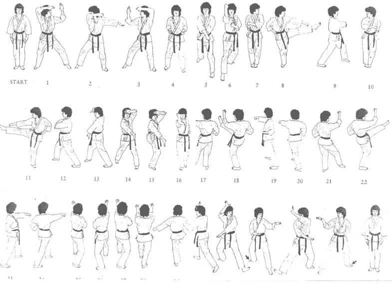

# TDD 卡塔斯

> 原文：<https://medium.com/javarevisited/tdd-katas-5e897300a887?source=collection_archive---------4----------------------->

TDD(测试驱动开发)卡塔是旨在帮助程序员提高他们的 TDD 技能的练习。形背后的理念是通过一遍又一遍的重复来学习。TDD 的机制需要嵌入到现代程序员的大脑中，这就是我们练习形的原因。

记住步骤:

1.  写一个失败的测试
2.  编写最少的代码来通过测试
3.  重构

尽可能多的重复这些步骤，你将掌握 TDD 的技巧。

完成一个形后，删除代码并重试。很可能你的下一个解决方案会有所不同。在这里，我将留给你一些我做一些经典 TDD 的视频。我希望它们对你有用。

# 罗马数字(从阿拉伯到罗马)

# 罗马数字(从罗马到阿拉伯)

# 嘶嘶作响

# 康威的生活游戏

*最初发表于 http://javing.blogspot.com/p/tdd_9.html*T2