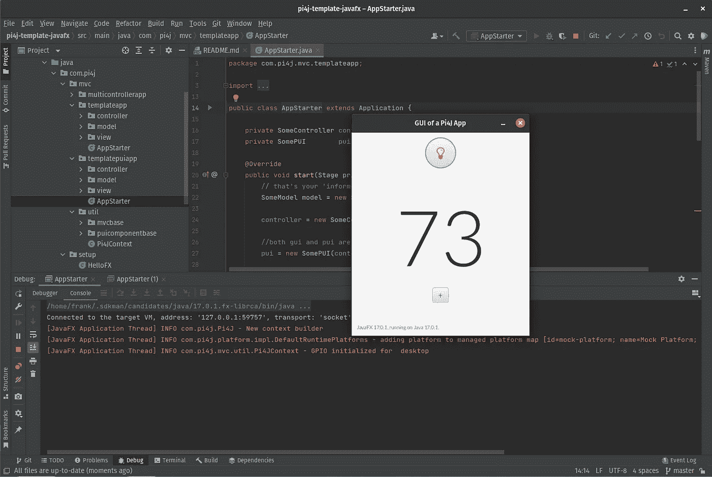
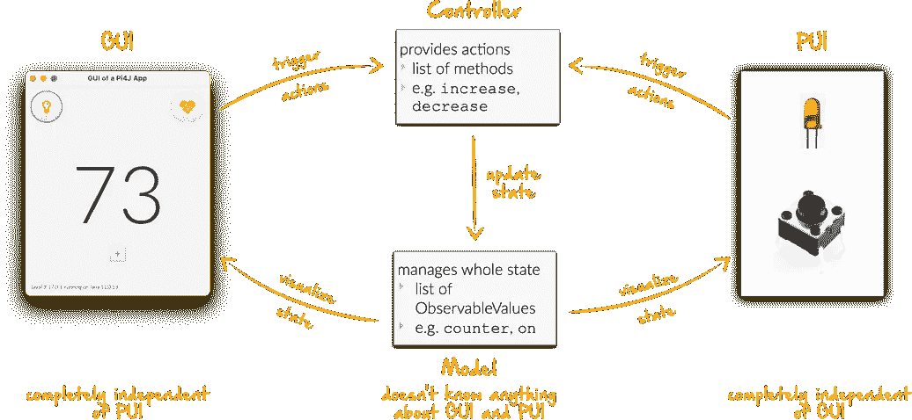
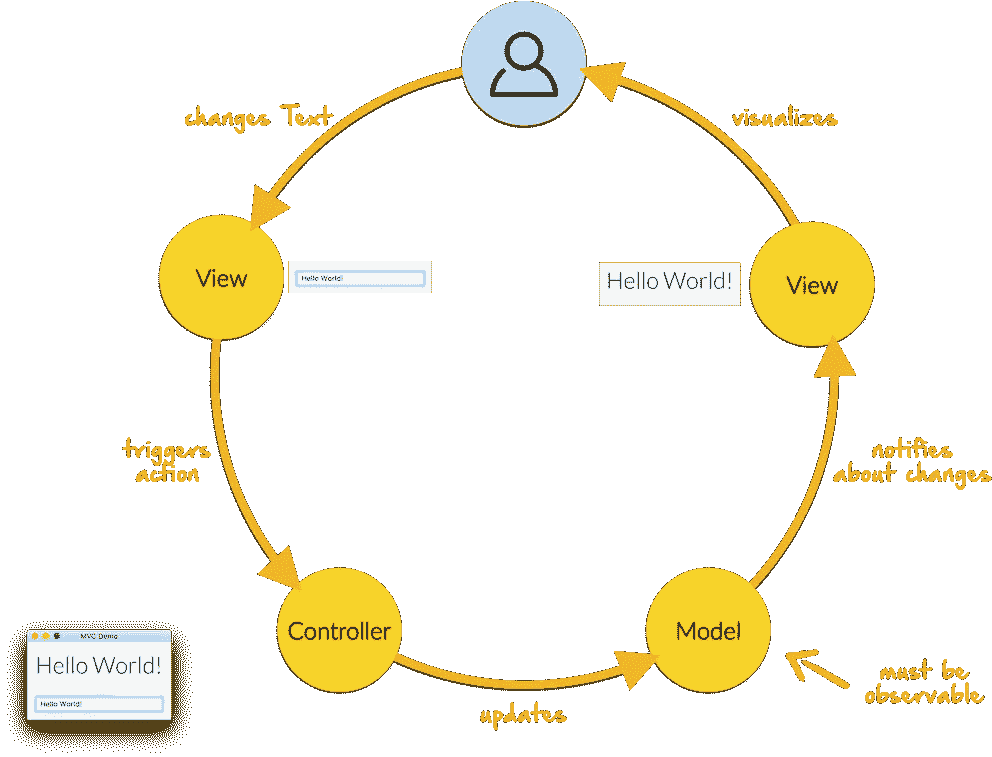

# 在 Raspberry Pi 上开始使用 Pi4J 和 JavaFX 的模板

> 原文：<https://medium.com/javarevisited/template-to-get-started-with-pi4j-and-javafx-on-raspberry-pi-bfc0fcc45275?source=collection_archive---------0----------------------->

Pi4J 项目希望成为每个想在 Raspberry Pi 上使用 Java 的人的起点，它是一个无头的 JavaFX 用户界面和/或 GPIO 控制器项目。

> *Pi4J 旨在为 Java 程序员* *提供* ***一个友好的面向对象的 I/O API 和实现库，以访问 Raspberry Pi 平台*** *的* ***全部 I/O 功能。该项目抽象了底层原生集成和中断监控，使 Java 程序员能够* ***专注于实现他们的应用业务逻辑*** *。***

[Dieter Holz](https://www.linkedin.com/in/dieter-holz-24761524/) ( [FHNW 大学](https://www.fhnw.ch))和[Robert von Burg](https://twitter.com/eitchme)([strol ch . Li](https://strolch.li/))创建了一个模板项目，它现在是 Pi4J 范例库的一部分。该项目使启动变得更加容易，旨在:

*   提供一个清晰的步骤，如何准备你的树莓 Pi
*   提供多个测试和启动应用程序
*   解释使用 MVC 模型(模型-视图-控制器)来清晰地划分数据、动作和用户界面
*   解释 JUnit 测试的使用

# 来源和信息

请查看项目源代码的[自述文件，以获得关于 Raspberry Pi 设置过程的完整描述，并充分理解示例应用程序和 MVC 模型。这一页只是为了给你一个快速的概述。](https://github.com/Pi4J/pi4j-template-javafx)

# 示例应用

# HelloFX

测试 JavaFX 库安装是否正确的简单应用程序。
不应该作为自己 JavaFX 应用的模板。

# 接线

另外两个示例应用程序使用 LED 和按钮。
这些必须按照下图所示进行接线:

带 LED 和按钮的最小 Pi4J 示例应用程序的接线

# MinimalPi4J

MinimalPi4j 应用程序是一个没有 GUI 的纯 Pi4j 应用程序。此应用程序也仅用于测试设置，并且可以在测试后删除。

按下按钮应该会在控制台中生成一条消息。

测试完 Pi4J 设置后，可以删除 MinimalPi4J。

# 模板应用

这个应用程序展示了基于 [JavaFX](/javarevisited/7-best-java-fx-online-courses-for-beginners-9e774ba6f996) 的图形用户界面(GUI)和 Raspberry Pi 连接的传感器和执行器，物理用户界面(PUI)之间的交互。

此应用程序将用作自己应用程序的模板。这包括现有的测试用例。

运行模板 JavaFX GUI 应用程序

你应该先了解并理解这个例子。对于您自己的应用程序，您应该复制`TemplateApp`并为您的项目修改它，但是不要违反 MVC 概念的规则。

# TemplatePUIApp

MVC 概念也应该用于没有 GUI 的应用程序。

当开发只有 PUI 的应用程序时，或者当以后添加 GUI 时，应该使用`TemplatePUIApp`作为模板。

# MVC 概念

除了 starter 类之外，经典的 Model-View-Controller 概念还包含至少 3 个以上的类。
交互作用是明确定义的:

通过这种方式，GUI 和 PUI 彼此完全分离，即，打开 LED 的 GUI 按钮不能直接访问 PUI 的 LED 组件。相反，GUI 按钮在控制器中触发相应的动作，然后在模型中设置 on 状态属性。监听该状态的 PUI 然后打开或关闭实际的 LED。

GUI 和 PUI 使用相同的控制器，因此也使用相同的型号。

在 MVC 概念中，每个用户交互都经历完全相同的循环:

# 结论

您可以使用相同的架构(MVC)来实现基于 JavaFX 的 GUI、附加到 Raspberry Pi 的 PUI，并以清晰、模块化的方式集成两者。

*原载于 2022 年 1 月 13 日*[*https://foojay . io*](https://foojay.io/today/template-to-get-started-with-pi4j-and-javafx-on-raspberry-pi/)*。*