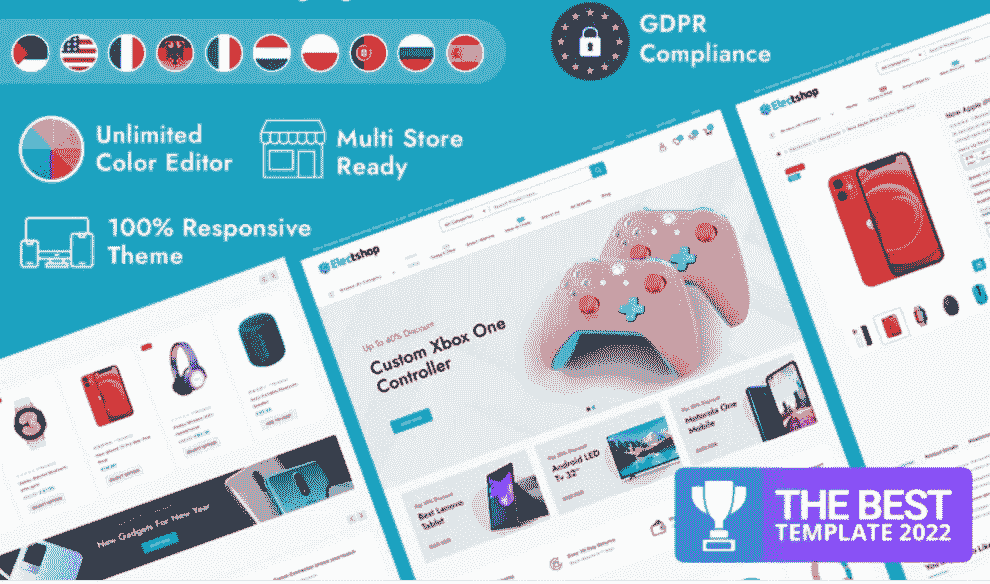
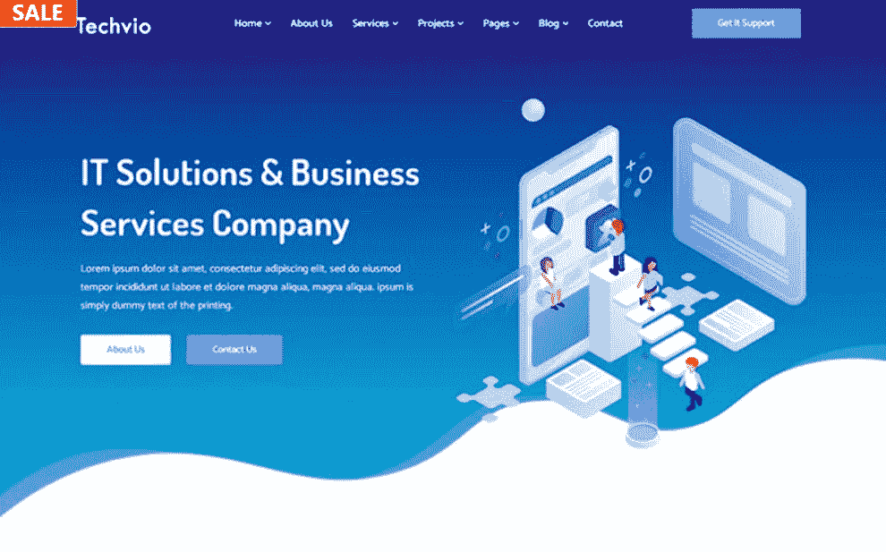
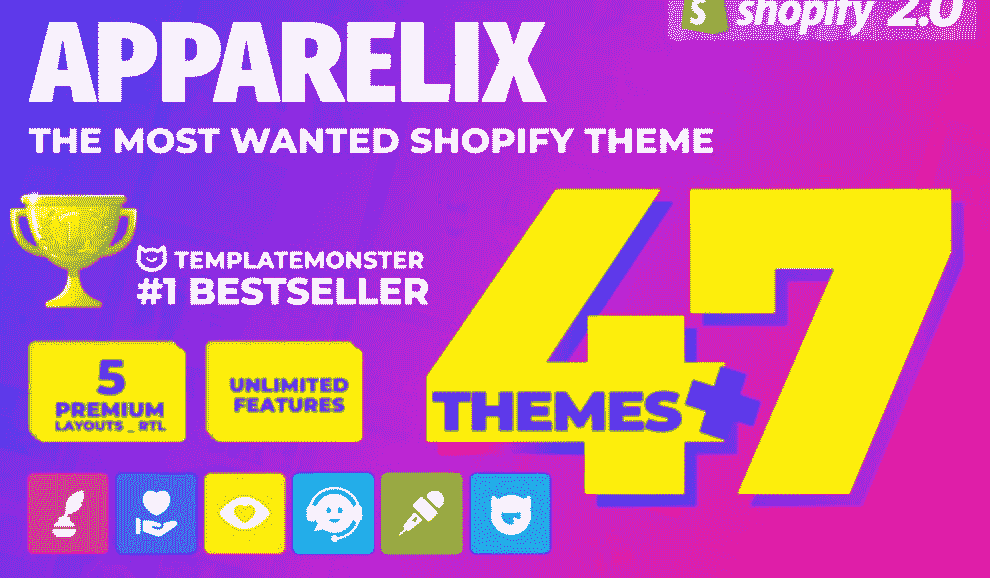
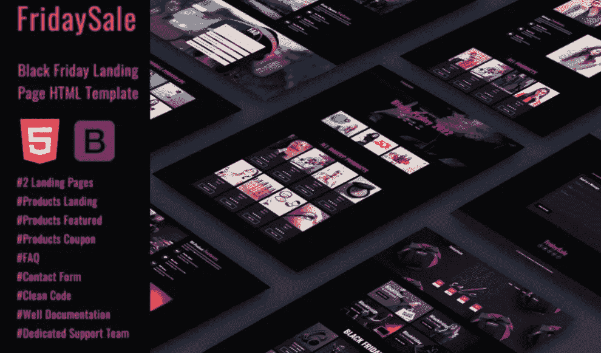
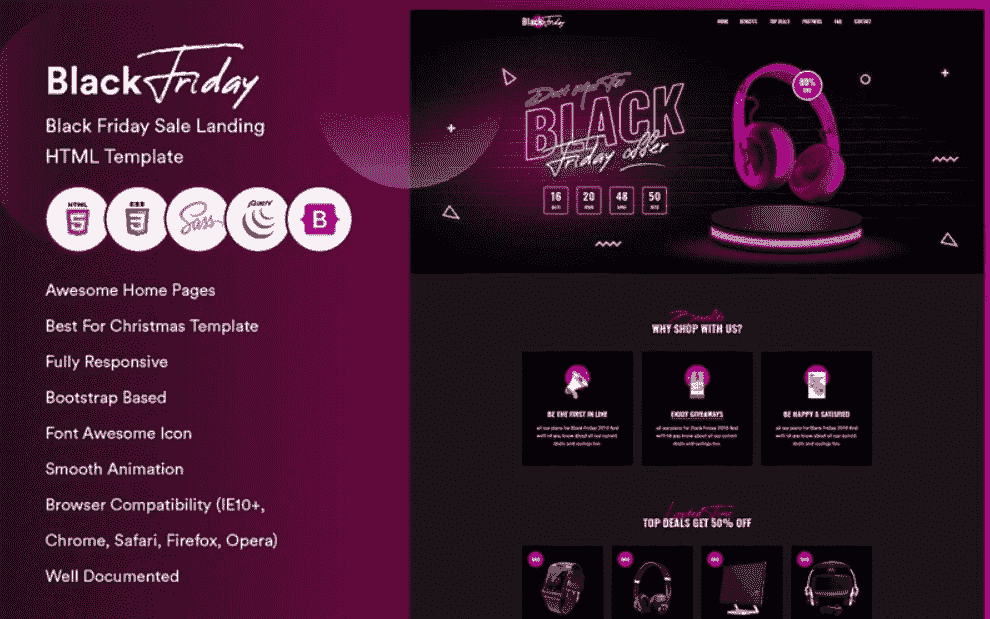
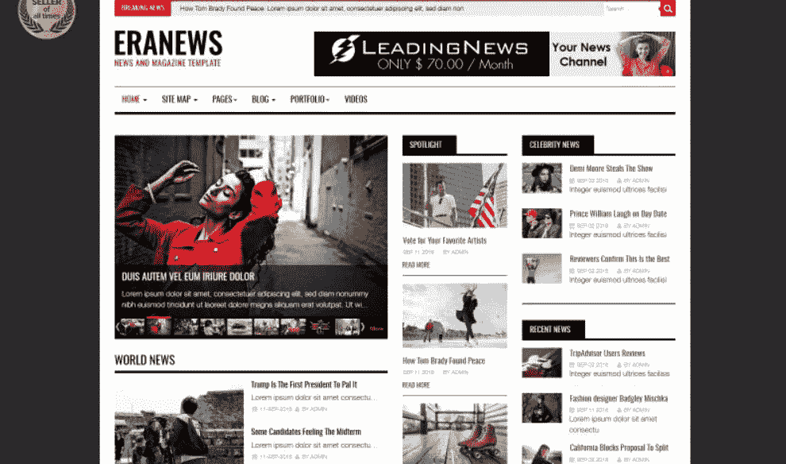
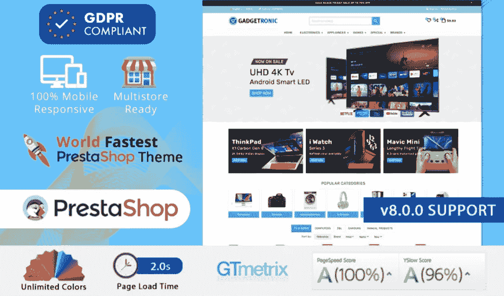

# TemplateMonster 黑色星期五+网络星期一交易:节省越来越多，高达 50%的折扣！

> 原文：<https://medium.com/javarevisited/templatemonster-black-friday-cyber-monday-deals-savings-are-getting-better-with-up-to-50-off-f5029dc18cc3?source=collection_archive---------4----------------------->

黑色星期五和网络星期一是购物季节的高峰，每个人都在寻找最令人难以置信的销售。人们从床上跳起来，参加他们等待了一年的活动。我们在这里通知您，您不能错过的折扣开始了。

今天你将瞥见 [**TemplateMonster 黑色星期五交易**](https://www.templatemonster.com/sale.php?aff=javarevisited&utm_campaign=blackfriday2022&utm_source=javarevisited&utm_medium=referral) **。**商场为所有产品提供高达 50%的折扣。我们准备分享一些出色的主题，确保您以实惠的价格获得出色的功能。

# 使用 TemplateMonster 黑色星期五和网络星期一交易购买的 10 大网站模板

## 1.Monstroid2 多用途模块化 WordPress 元素或主题

顾名思义，它是多用途 WordPress 主题中的一个真正的怪物。出于这个原因，在 TemplateMonster 黑色星期五交易中忘记这个设计精美、全面增强的选项是错误的。您可以在各种设备上自由展示您的项目、作品和成就。

由于全响应设计，您的网站将毫不费力地适应各种屏幕。该软件包有许多优秀的演示，适用于多个领域，包括时尚、金融、汽车维修、门、游戏、化妆、室内设计等等。它配备了更高级的功能，包括 Elementor 页面生成器和 WooCommerce 包。

主要特点:

*   旋转滑块
*   300 多个预建页面模板
*   500 个随时可用的部分
*   音频和视频播放器
*   WPML 兼容性

[立即购买](https://www.templatemonster.com/wordpress-themes/monstroid2.html?aff=javarevisited&utm_campaign=blackfriday2022&utm_source=javarevisited&utm_medium=referral) | [演示](https://demo.templatemonster.com/demo/62222.html) | [在 MonsterONE](https://www.templatemonster.com/monsterone/tm-membership/?id=62222?aff=javarevisited&utm_campaign=blackfriday2022&utm_source=javarevisited&utm_medium=referral) 免费下载

## 2.技术— IT 解决方案和商业服务主题

Techno 是一个动态的、引人注目的主题，致力于不同类型的网络机构。它也可以在黑色星期五交易中买到。总的来说，它集成了两个非常流行的拖放构建器，Elementor 和 KingComposer。

此外，有可能从 30 多个独特的演示，15 个以上的页眉变体和 10 个以上的页脚样式中进行选择。换句话说，你可以根据自己的需求对网站进行微调，并实时看到所有的修改。同样值得一提的是无限的颜色和内容元素的可用性。

主要特点:

*   添加的视频
*   谷歌字体
*   联系方式
*   添加了旋转木马
*   所有图像都包含在包中

[立即购买](https://www.templatemonster.com/wordpress-themes/techno-it-solution-service-wordpress-theme-94212.html?aff=javarevisited&utm_campaign=blackfriday2022&utm_source=javarevisited&utm_medium=referral) | [演示](https://demo.templatemonster.com/demo/94212.html) | [在 MonsterONE](https://www.templatemonster.com/monsterone/tm-membership-exclusive/?id=94212?aff=javarevisited&utm_campaign=blackfriday2022&utm_source=javarevisited&utm_medium=referral) 免费下载

## 3.电子商店—电子和数码商店 Prestashop 主题

如果你需要一个具有独特设计的电子和数码商店主题，这是一个完美的匹配。它允许展示和销售手机，电脑，扬声器，音响系统和不同的配件。凭借多语言和多币种支持，您可以在全球范围内销售您的产品组合，而不受我的限制。有多种电子商务选项可以为您的受众提供非凡的购物体验。其中包括 Ajax 产品快速查看、愿望列表和比较。

主要特点:

*   无限横幅
*   每日交易滑块
*   博客模块
*   Ajax 产品过滤器
*   购物车下拉列表

[立即购买](https://www.templatemonster.com/prestashop-themes/electshop-electronics-and-digital-store-prestashop-theme-202489.html?aff=javarevisited&utm_campaign=blackfriday2022&utm_source=javarevisited&utm_medium=referral) | [演示](https://demo.templatemonster.com/demo/202489.html) | [在 MonsterONE](https://www.templatemonster.com/monsterone/tm-membership-exclusive/?id=202489?aff=javarevisited&utm_campaign=blackfriday2022&utm_source=javarevisited&utm_medium=referral) 免费下载

## 4.Techvio — IT 解决方案和业务服务网站模板

TemplateMonster 黑色星期五交易也使 it 公司升级网站成为可能。它是一个可靠的现成解决方案，允许人们不受干扰地浏览您的内容。你可以使用 17 种以上的页面布局，每一种都会以最有创意和最引人注目的方式展示你的信息。一份合同表格保证每个人都可以和你联系，和团队交流。除此之外，还可以利用引人入胜的视差效应。

主要特点:

*   巨型菜单
*   谷歌地图
*   博客和图库功能
*   全响应设计
*   团队成员

[立即购买](https://www.templatemonster.com/website-templates/techvio-it-solutions-amp-business-services-website-template-187467.html?aff=javarevisited&utm_campaign=blackfriday2022&utm_source=javarevisited&utm_medium=referral) | [演示](https://demo.templatemonster.com/demo/187467.html) | [在 MonsterONE](https://www.templatemonster.com/monsterone/tm-membership/?id=187467?aff=javarevisited&utm_campaign=blackfriday2022&utm_source=javarevisited&utm_medium=referral) 免费下载

# 5.Apparelix —清洁多用途购物主题

正如你对任何有价值的多用途 Shopify 主题的期望，它有一切可以打动你的核心观众。该软件包包括 40+最初设计的多方面的主题，适合高度流行的利基。由于用户友好的 Shopify 可视化构建器，您可以控制所有的个性化设置。调整你的布局，添加想要的内容，不要限制你的想象力。此外，你还会得到一些不错的选项，比如产品快速浏览、传送带和愿望清单。

主要特点:

*   视差效应
*   排序选项
*   Ajax 购物车
*   高级搜索
*   巨型菜单

[立即购买](https://www.templatemonster.com/shopify-themes/apparelix-clean-multipurpose-shopify-theme-87247.html?aff=javarevisited&utm_campaign=blackfriday2022&utm_source=javarevisited&utm_medium=referral) | [演示](https://demo.templatemonster.com/demo/87247.html) | [在 MonsterONE](https://www.templatemonster.com/monsterone/tm-membership/?id=87247?aff=javarevisited&utm_campaign=blackfriday2022&utm_source=javarevisited&utm_medium=referral) 免费下载

# 6.星期五销售-黑色星期五销售登录页面 HTML 模板

如果没有一些相关的选择，TemplateMonster 黑色星期五交易中包含的现成解决方案集合将是不完整的。因此，您需要熟悉这个现代化的 HTML 登录页面。对于那些想要分享销售、优惠券、促销代码和折扣的人来说，这是一个令人惊叹的助手。一般来说，有两种登录页面变体。每一款都有令人难以置信的设计，能满足你的需求，提升整个产品组合。毫无疑问，一个完全响应的设计总是存在的。换句话说，您的在线项目将得到优化，以支持所有最新的设备及其屏幕分辨率。

主要特点:

*   联系方式
*   社交媒体链接
*   奖状部分
*   投资组合部分
*   产品和优惠

[立即购买](https://www.templatemonster.com/landing-page-template/fridaysale-black-friday-sale-landing-page-html-template-282752.html?aff=javarevisited&utm_campaign=blackfriday2022&utm_source=javarevisited&utm_medium=referral) | [演示](https://demo.templatemonster.com/demo/282752.html) | [在 MonsterONE](https://www.templatemonster.com/monsterone/tm-membership/?id=282752?aff=javarevisited&utm_campaign=blackfriday2022&utm_source=javarevisited&utm_medium=referral) 免费下载

# 7.花式优惠券，优惠，交易，折扣和销售黑色星期五登录页面模板

另一个复杂的主题，可以帮助你分享黑色星期五的交易和折扣。创新设计和功能的完美结合，将会给观众留下长久的印象。它有一个独特的产品主页滑块部分，可以立即将注意力集中在您的产品上。此外，它使您能够完全控制在线项目的不同方面。顺便说一下，你不需要有一个完美的编程背景来制作你梦想中的网站。

主要特点:

*   顶级和超级交易
*   广告部
*   跨浏览器兼容设计
*   福利科
*   活动日历

[立即购买](https://www.templatemonster.com/landing-page-template/black-friday-fancy-coupons-offers-deals-discounts-and-sale-black-friday-landing-page-template-282755.html?aff=javarevisited&utm_campaign=blackfriday2022&utm_source=javarevisited&utm_medium=referral) | [演示](https://demo.templatemonster.com/demo/282755.html) | [在 MonsterONE](https://www.templatemonster.com/monsterone/tm-membership/?id=282755?aff=javarevisited&utm_campaign=blackfriday2022&utm_source=javarevisited&utm_medium=referral) 免费下载

## 8.黑色星期五登陆页面模板

您是否正在寻找更多登录页面，以便在黑色星期五活动中销售您的商品？幸运的是，我们有更多优秀的变种可供选择。利用这个有效而优雅的主题，你可以实现你所有的想法。例如，该包有组织良好的部分，以显示-交叉您的项目和共享折扣。毫无疑问，你不会面临任何关于你的在线项目在不同设备上出现的问题。由于完全响应的设计，该网站将根据各种类型的设备及其屏幕进行转换。

主要特点:

*   包含图像
*   平滑动画
*   惊人的主页布局
*   热门交易和优惠部分
*   合作伙伴部分

[立即购买](https://www.templatemonster.com/landing-page-template/blackfridos-black-friday-landing-page-template-275660.html?aff=javarevisited&utm_campaign=blackfriday2022&utm_source=javarevisited&utm_medium=referral) | [演示](https://demo.templatemonster.com/demo/275660.html) | [在 MonsterONE](https://www.templatemonster.com/monsterone/tm-membership/?id=275660?aff=javarevisited&utm_campaign=blackfriday2022&utm_source=javarevisited&utm_medium=referral) 免费下载

## 9.新闻和杂志 Joomla 4 和 Joomla 3 模板

一个干净和专业的模板，适合展示各种各样的主题。这些包括新闻和杂志网站、技术或商业在线项目以及评论。你有机会调整许多元素，使它们符合你的口味。例如，有 12 种预设颜色样式、三种背景选项和五种大型菜单变体。此外，你可以从九个主页中选择。它们都提供了必要的灵活性，允许你为你的网站定义一个独特的风格。

主要特点:

*   不同的投资组合页面
*   博客布局示例
*   视频和视频画廊扩展
*   时事通讯订阅
*   最多三列布局

[立即购买](https://www.templatemonster.com/joomla-templates/eranews-news-and-magazine-joomla-template-74344.html?aff=javarevisited&utm_campaign=blackfriday2022&utm_source=javarevisited&utm_medium=referral) | [演示](https://demo.templatemonster.com/demo/74344.html) | [在 MonsterONE](https://www.templatemonster.com/monsterone/tm-membership-exclusive/?id=74344?aff=javarevisited&utm_campaign=blackfriday2022&utm_source=javarevisited&utm_medium=referral) 免费下载

## 10.gadgetronic——数字电子多用途预购主题

这个超级强大的主题可以成为你推广网上业务的绝佳伴侣。例如，它可以是电子产品、计算机、家用电器和许多其他受欢迎的物品。该软件包具有高级定制选项，可以更改布局选项、颜色、字体和其他组件。您可以利用庞大的菜单对您的产品进行分类。除此之外，多语言支持确保您可以开始在不同国家销售您的产品。

主要特点:

*   时事通讯订阅
*   同位素过滤器和品牌过滤器
*   谷歌字体
*   提供 GIF 动画横幅
*   网格和列表视图

[立即购买](https://www.templatemonster.com/prestashop-themes/gadgetronic-digital-electronic-multipurpose-prestashop-theme-230079.html?aff=javarevisited&utm_campaign=blackfriday2022&utm_source=javarevisited&utm_medium=referral) | [演示](https://demo.templatemonster.com/demo/230079.html) | [在 MonsterONE](https://www.templatemonster.com/monsterone/tm-membership-exclusive/?id=230079?aff=javarevisited&utm_campaign=blackfriday2022&utm_source=javarevisited&utm_medium=referral) 免费下载

# 几句话作为结论

黑色星期五活动的数量可能会变得势不可挡。当你在整理东西的时候，购物季可能已经结束了。出于这个原因，最好现在就进入 TemplateMonster 黑色星期五交易，获得最好的物品，然后放松一下。你知道，当你以半价买到所有必要的工具时，你会感觉很棒。我们希望你会对这次超级大甩卖满意，并且省钱。感谢阅读！