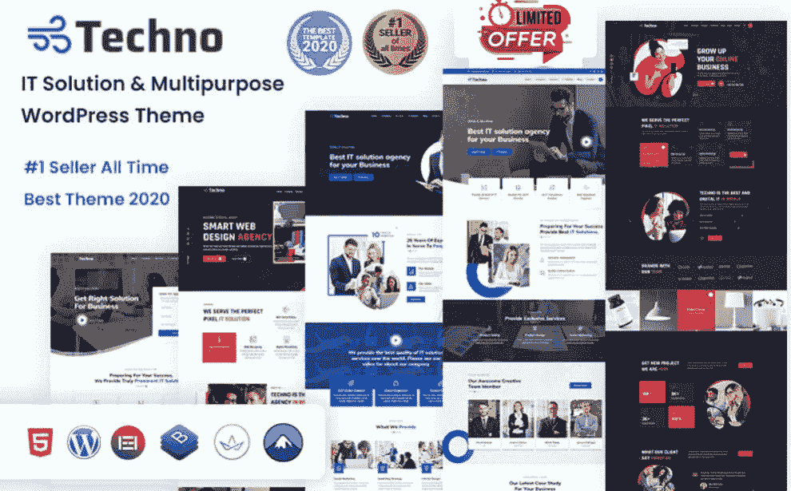
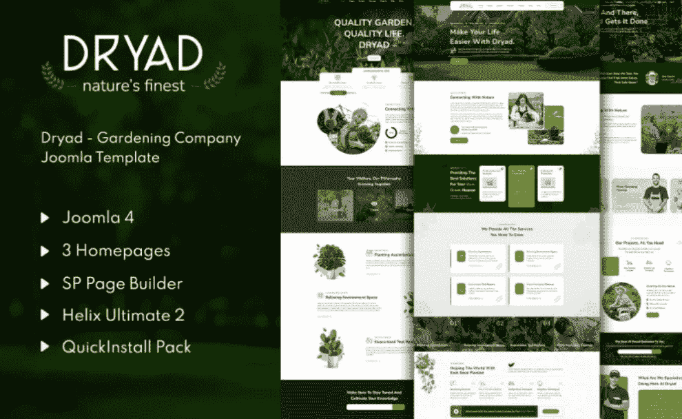
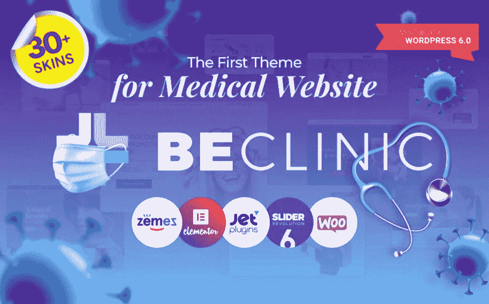
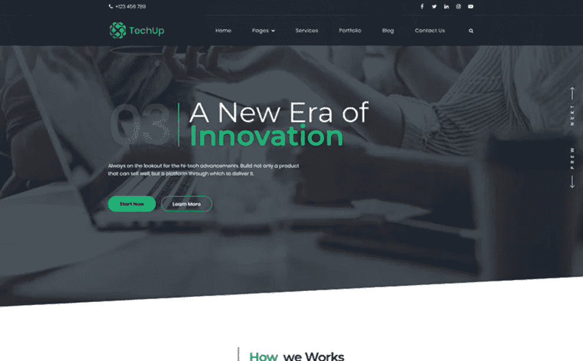
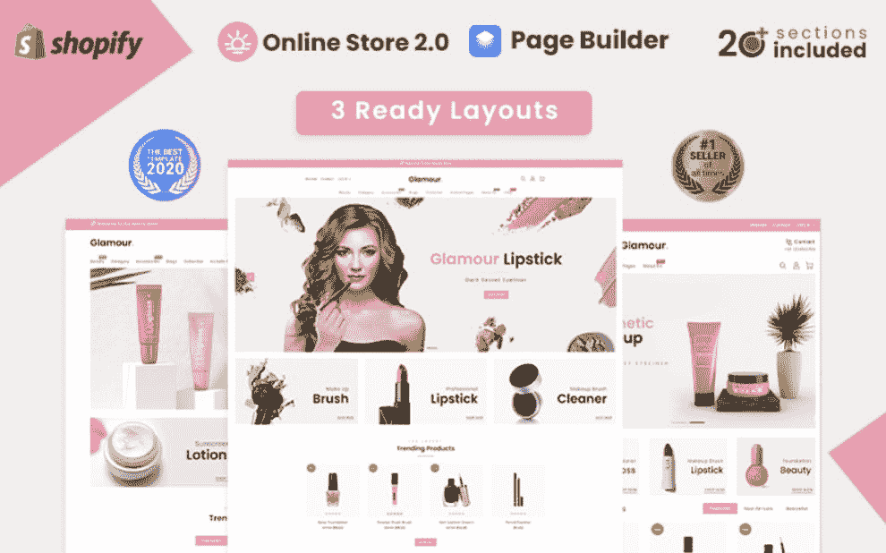
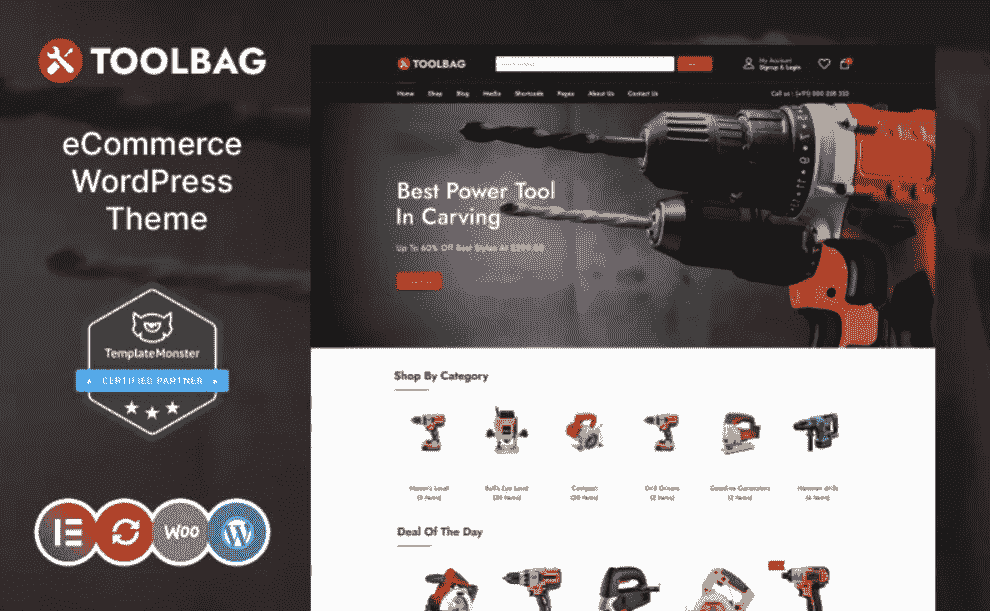
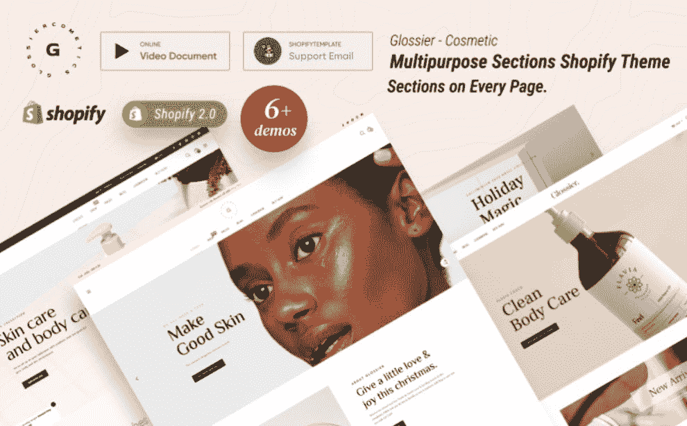
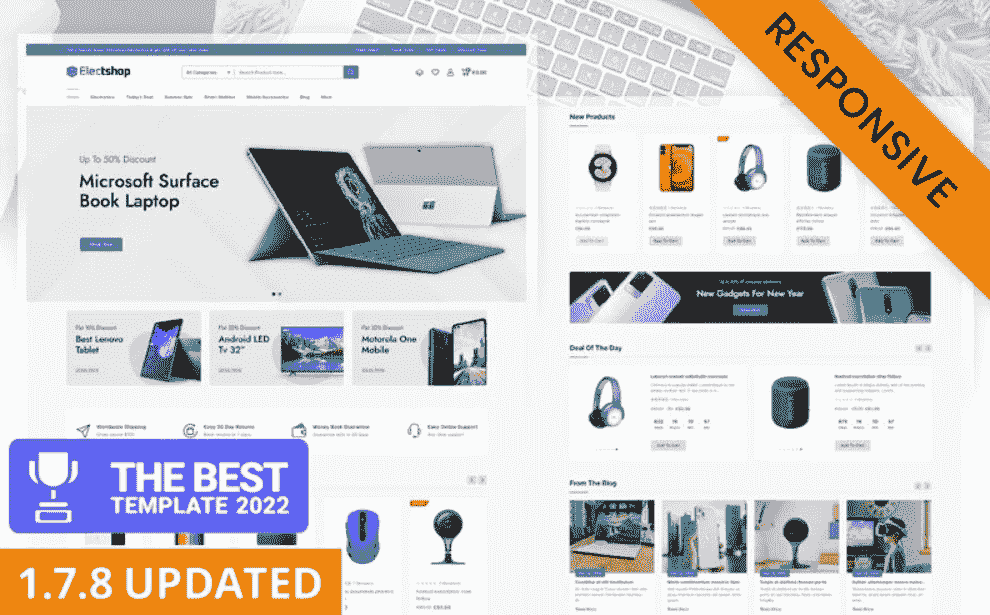

# TemplateMonster Marketplace 概述+来自最有才华的作者的 10 大畅销商品

> 原文：<https://medium.com/javarevisited/templatemonster-marketplace-overview-top-10-best-selling-items-from-the-most-talented-authors-b3bad1ee6a5f?source=collection_archive---------3----------------------->

## TemplateMonster 值得吗？

在一个每个人都急于开发非凡网站的市场中，有一种更快的方法可以在在线平台上获得成功。在对编码一无所知的情况下，收购令人惊叹的、独一无二的、引人入胜的网站怎么样？在这种情况下， [TemplateMonster](https://www.templatemonster.com?aff=javarevisited&utm_campaign=tmoverview&utm_source=javarevisited&utm_medium=referral) 将是您的目的地。

总的来说， [**TemplateMonster**](https://www.templatemonster.com?aff=javarevisited&utm_campaign=tmoverview&utm_source=javarevisited&utm_medium=referral) 是互联网上最古老、最成熟的市场之一。它有大量的产品，可以真正打动你的想象力。

首先，各种小众的 WordPress 主题有很多。更重要的是，你可以查看各种 CMS 和[网站模板 HTML](https://www.templatemonster.com/html5-website-templates?aff=javarevisited&utm_campaign=tmoverview&utm_source=javarevisited&utm_medium=referral) ，以及针对电子商务平台的现成解决方案。这些工具可用于 Shopify、WooCommerce、PrestaShop、Magento、OpenCart 等。

该网站上的其他类别包括插件、各种图形、库存照片、视频和音频以及演示模板。还应注意的是，商品的数量并不保持稳定，而是每天都在增长。它们不断更新，并提供改进的功能来完成各种任务。

还值得注意的是，TemplateMonster 提供了一种独特的订阅服务，名为 MonsterONE。它包含了市场上所有现成的最佳解决方案。这种订阅不仅可以成为网页设计者和开发者的一个有价值的助手，也可以成为营销人员、商人和博客作者的助手。您将获得无限制的下载、24/7 可用的专业团队支持、超级简单的许可证以及许多其他好处。也有可能购买由专家提供的高质量服务，他们将代替你创建网上商店和网站。

你可以理解，任何创作数字产品的人都可以成为作者，并在 TemplateMonster 上出售他们的模板。此外，您还有机会作为代销商推广您的产品组合，并从每笔销售中获得佣金。即使你是现成解决方案行业的新手，专家也会为你提供一切，帮助你取得成功。作者可以访问实时流、教育帖子和有用的视频。

你也可以看看 MonsterPost 博客，这对于任何从事网页设计行业的人来说都是一个发现。你将有机会免费下载相关主题的精彩电子书，浏览指南，熟悉激动人心的采访。

# 值得立即下载的 TemplateMonster 十大现成模板

# Woostroid2 —用于 WooCommerce 主题的多用途元素

你有没有想过从零开始建立一个在线项目，但认为这个任务太高级了？有可能改变你的想法连同来自 TemplateMonster 的通用主题。这是下载量最大、最受好评的现成解决方案之一，值得您关注。该套装包含了您对多功能数码产品不同用途的所有期望。

举个例子，你可以从大量的演示中自由选择。这些都是精心制作的，以提高小玩意，家具，工具，化妆品，运动服等许多其他利基的受欢迎程度。

感谢神奇的按钮功能，你将获得 1000 多个独特的预制模板。还可以为任何场合添加超快的 Ajax 过滤器。

主要特点:

*   全响应设计；
*   可构建的页眉和页脚样式；
*   动画效果；
*   巨型菜单；
*   时事通讯订阅和联系方式。

[详情](https://www.templatemonster.com/woocommerce-themes/woostroid.html?aff=javarevisited&utm_campaign=tmoverview&utm_source=javarevisited&utm_medium=referral) | [在 MonsterONE 免费下载](https://www.templatemonster.com/monsterone/tm-membership/?id=63000&?aff=javarevisited&utm_campaign=tmoverview&utm_source=javarevisited&utm_medium=referral)

# 技术— IT 解决方案和商业服务主题

Techno 是来自 TemplateMonster 的一个广泛的 WordPress 主题，它总是准备推动设计的边界。正如你所理解的，对于那些与 it、数据科学、机器学习和许多其他领域相关的人来说，这将是一个完美的匹配。它兼容两个流行的网站构建器，不需要高水平的编程知识。这些是 Elementor 页面生成器和 King Composer。除此之外，它还有一堆为专业在线形象定制的入门网站。您将能够从 30 多个原始演示、15 个以上的页眉样式和 10 个以上的页脚变体中进行选择。它还包括一个移动友好的布局，将允许人们通过各种设备查看网站。

主要特点:

*   联系方式；
*   WPML 译者；
*   WooCommerce 功能；
*   谷歌字体；
*   旋转滑块。

[详情](https://www.templatemonster.com/wordpress-themes/techno-it-solution-service-wordpress-theme-94212.html?aff=javarevisited&utm_campaign=tmoverview&utm_source=javarevisited&utm_medium=referral) | [在 MonsterONE 免费下载](https://www.templatemonster.com/monsterone/tm-membership-exclusive/?id=94212&?aff=javarevisited&utm_campaign=tmoverview&utm_source=javarevisited&utm_medium=referral)

# 得律阿德斯—园艺公司 Joomla 4 模板

得律阿德斯是 TemplateMonster 的 Joomla 模板的一个很好的例子，它可以作为园艺相关网站的一个入口。你可以自由选择三个主页设计中的一个来吸引大量的潜在买家。它还包含一个易于使用的 SP 页面生成器。它允许创建特定行业的网站，而不需要高级编码技能。在处理您的内容之前，无需花费数小时来安装所有元素。由于一个简单的演示导入，它将花费你最少的时间开始编辑所需的组件。

主要特点:

*   博客功能；
*   下拉菜单；
*   谷歌地图；
*   团队成员；
*   全响应设计。

[详情](https://www.templatemonster.com/joomla-templates/dryad-gardening-company-joomla-4-template-209564.html?aff=javarevisited&utm_campaign=tmoverview&utm_source=javarevisited&utm_medium=referral) | [在 MonsterONE](https://www.templatemonster.com/monsterone/tm-membership/?id=209564?aff=javarevisited&utm_campaign=tmoverview&utm_source=javarevisited&utm_medium=referral) 免费下载

# BeClinic —多用途医疗清洁 WordPress 主题

要找到一个在互联网上展示你的诊所的完美主题，没有必要从 TemplateMonster 的所有选择中寻找。有一种设计精美、专业的变体，可以将你的想法变成现实。它与大量现成的网站结合在一起。因此，您可以分享关于您的诊所的信息，包括医生的简介、他们的成就和他们的联系人。还有动态滑块，一个吸引人的大菜单，以及其他你认为有价值的工具。您的潜在客户也将有机会直接在资源上预订咨询。

主要功能:

*   旋转滑块；
*   页眉和页脚的不同选项；
*   在线时间表；
*   巨型菜单；
*   与 WooCommerce 的兼容性。

[详情](https://www.templatemonster.com/wordpress-themes/bedentist-wordpress-theme-58654.html?aff=javarevisited&utm_campaign=tmoverview&utm_source=javarevisited&utm_medium=referral) | [在 MonsterONE 免费下载](https://www.templatemonster.com/monsterone/tm-membership/?id=58654&?aff=javarevisited&utm_campaign=tmoverview&utm_source=javarevisited&utm_medium=referral)

# Techup —物联网和人工智能技术初创公司 WordPress 主题

Techup 是一个复杂的主题，允许您显示任何您感兴趣的技术主题。可以讨论人工智能、计算机视觉以及其他问题。此外，它非常适合那些需要为他们的技术组织提供一个优秀网站的个人。您可以展示计算机设施、设备和独特的软件。它无疑为你的材料提供了各种现成的页面。定价、投资组合、人员和其他方面都在其中。使用一个完全有效的 Unyson 页面生成器，您将无需花费任何时间来处理和更改您的材料。

主要特点:

*   博客功能；
*   社交媒体整合；
*   联系方式；
*   高级搜索；
*   一键安装。

[详情](https://www.templatemonster.com/wordpress-themes/techup-iot-and-ai-tech-startup-wordpress-theme-82872.html?aff=javarevisited&utm_campaign=tmoverview&utm_source=javarevisited&utm_medium=referral) | [在 MonsterONE](https://www.templatemonster.com/monsterone/tm-membership-exclusive/?id=82872&?aff=javarevisited&utm_campaign=tmoverview&utm_source=javarevisited&utm_medium=referral) 免费下载

# 魅力——化妆品店 Shopify 主题

来自 TemplateMonster 的一个非常高级但时尚的 Shopify 主题，可以为您提供无与伦比的功能。对于寻找一种方式来宣传美容、服装和化妆品的人来说，这是一种美学上有吸引力的选择。其有效的包包括所有必要的功能，为您的要求。毫无疑问，您将收到大量的 Ajax 选择，包括购物车、搜索和愿望列表。重视多语言和多币种支持，以确保您的创新在线项目被全球观众发现。你也可以通过加入产品评论和博客模块来增加信任。

主要特点:

*   无限横幅；
*   拖放功能；
*   产品列表和网格视图；
*   产品快速查看；
*   订阅时事通讯。

[详情](https://www.templatemonster.com/shopify-themes/glamour-cosmetics-shopify-theme-83769.html?aff=javarevisited&utm_campaign=tmoverview&utm_source=javarevisited&utm_medium=referral) | [在 MonsterONE 免费下载](https://www.templatemonster.com/monsterone/tm-membership/?id=83769?aff=javarevisited&utm_campaign=tmoverview&utm_source=javarevisited&utm_medium=referral)

# 工具包 WooCommerce 主题元素

工具包是 TemplateMonster 的一个令人惊叹的 WooCommerce 主题，将展示电动工具、硬件和配件的最佳状态。它的包装保证了你的最终产品将具有适应性和可扩展性。你将准备好分享关于最新产品、当天交易和其他更新的信息。再加上一个令人惊叹的 Elementor 页面生成器提供的拖放技术，就有可能组装出你梦想中的网站。要构建引人注目的视觉内容，请务必利用令人惊叹的旋转滑块。此外，它有多语言和 RTL 支持，这将有助于您扩大您的观众群。

主要特点:

*   产品对比；
*   高级搜索；
*   产品愿望清单；
*   产品快速查看；
*   全响应设计。

[详情](https://www.templatemonster.com/woocommerce-themes/toolbag-elementor-woocommerce-theme-193871.html?aff=javarevisited&utm_campaign=tmoverview&utm_source=javarevisited&utm_medium=referral) | [在 MonsterONE](https://www.templatemonster.com/monsterone/tm-membership-exclusive/?id=193871&?aff=javarevisited&utm_campaign=tmoverview&utm_source=javarevisited&utm_medium=referral) 免费下载

# Glossier —多用途部分 Shopify 主题

你想要一个强调可访问性和用户友好性的 TemplateMonster 的与美容相关的 Shopify 主题吗？在这种情况下，请熟悉这种提供灵活性和定制自由的时尚选择。你将准备好推广诸如化妆品、礼品、水疗等话题。它有 6+演示可供选择。除此之外，你将获得一个了不起的博客功能来分享帖子，让人们更好地了解你的产品和服务。不要忘记使用标签来吸引人们对最新和最热门商品的注意。

主要特点:

*   拖放构建器；
*   多个页眉和页脚；
*   社交媒体整合；
*   lookbook 功能；
*   奖状和团队成员。

[详情](https://www.templatemonster.com/shopify-themes/glossier-multipurpose-sections-shopify-theme-160558.html?aff=javarevisited&utm_campaign=tmoverview&utm_source=javarevisited&utm_medium=referral) | [在 MonsterONE 免费下载](https://www.templatemonster.com/monsterone/tm-membership/?id=160558&?aff=javarevisited&utm_campaign=tmoverview&utm_source=javarevisited&utm_medium=referral)

# 电子商店—电子和数码商店 Prestashop 主题

这是一个现代和令人惊叹的主题，专为销售手机、电脑、扬声器等数码产品和电子产品而设计。它有一个完全响应的设计，为人们从任何设备上提供最佳的在线购物体验。

一键安装将节省您导入所有必要元素的时间和精力。它支持多种语言和货币在全球范围内销售您的产品，没有任何限制。您还将获得许多 Ajax 特性。这包括愿望清单、产品快速浏览和比较。

主要功能:

*   无限横幅；
*   巨型菜单；
*   博客模块；
*   产品过滤器；
*   品牌旋转木马。

[详情](https://www.templatemonster.com/prestashop-themes/electshop-electronics-and-digital-store-prestashop-theme-202489.html?aff=javarevisited&utm_campaign=tmoverview&utm_source=javarevisited&utm_medium=referral) | [在 MonsterONE](https://www.templatemonster.com/monsterone/tm-membership-exclusive/?id=202489&?aff=javarevisited&utm_campaign=tmoverview&utm_source=javarevisited&utm_medium=referral) 免费下载

# 几句话作为结论

现成的解决方案有助于使网站建设过程更加简单。现在，你需要做的就是选择最合适的选择，让你的网站尽快运行起来。剩下要做的就是应用一些更改，调整一些颜色，并为站点添加独特的内容。

资源中提供的大部分现成模板都非常复杂，并且具有最高标准。正因如此，[**template monster**](https://www.templatemonster.com?aff=javarevisited&utm_campaign=tmoverview&utm_source=javarevisited&utm_medium=referral)演变成了公认的市集。我们很高兴为您提供我们的促销代码“javaregistered ”,它为所有 TemplateMonster 项目提供 5%的折扣。感谢阅读！