# 地形与蔚蓝的身份——让我们一起航行

> 原文：<https://medium.com/javarevisited/terraform-and-azure-identity-lets-sail-together-f3a179ad1846?source=collection_archive---------1----------------------->

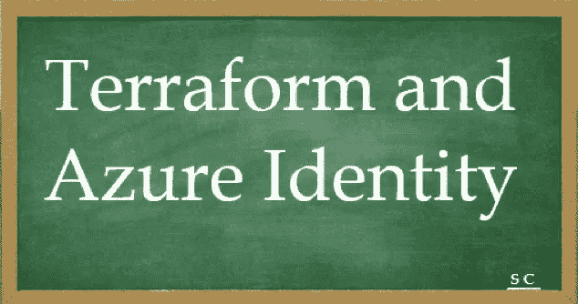

在了解了如何从笔记本电脑或 azure cloud 上的虚拟机供应虚拟机和 Azure Kubernetes 服务等资源后，我很想知道如何避免用户交互会话并尝试服务主体或托管身份。

参考:[地形安装](/javarevisited/automation-lets-sail-together-terraform-hello-world-on-windows-10-27ae3be1f869)然后继续

目标很简单

用例 1 : [虚拟机上的 terra form](/javarevisited/7-best-terraform-online-courses-for-devops-engineers-5e4dab297785)————>连接云端使用用户交互登录(简单来说就是 AZ 登录)创建资源组——**实现**。

用例 2:虚拟机上的平台—-->使用服务主体连接到云以创建资源组— **待实现**

用例 3:虚拟机上的平台— — ->使用用户管理的身份连接到云以创建资源组— **待实现**

请参考下图，了解所有 3 个使用案例的摘要:-

[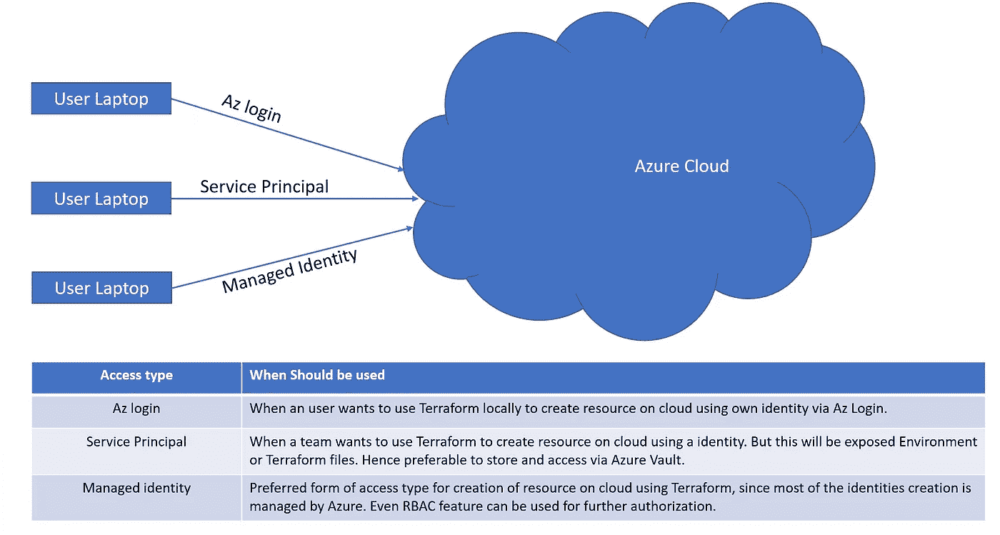](https://javarevisited.blogspot.com/2020/08/top-5-courses-to-learn-terraform-in.html)

**在使用案例之前，让我们回顾几个关键概念:**

软件工作负载(如应用程序、服务、脚本或容器)用来验证和访问其他服务和资源的身份。

在 Azure Active Directory (Azure AD)中，身份是

**a .申请对象**

[应用](https://learn.microsoft.com/en-us/azure/active-directory/develop/app-objects-and-service-principals#application-object)是由其应用对象定义的抽象实体。

应用程序对象是应用程序的全局表示，供所有租户使用。application 对象描述如何颁发令牌、应用程序需要访问的资源以及应用程序可以采取的操作。

示例—基于管理员或用户同意，使 web 应用程序能够访问 Microsoft Graph 的应用程序。这种访问可以代表用户或代表应用程序。

b .服务负责人

[服务主体](https://learn.microsoft.com/en-us/azure/active-directory/develop/app-objects-and-service-principals#service-principal-object)是特定租户中的全局应用对象。

应用程序对象用作创建服务主体的模板。服务主体对象定义应用程序在特定租户中实际可以做什么、谁可以访问应用程序以及应用程序可以访问哪些资源。

示例—开发人员使用的服务主体，使 [*CI/CD 管道*](/javarevisited/7-best-courses-to-learn-jenkins-and-ci-cd-for-devops-engineers-and-software-developers-df2de8fe38f3?source=---------15------------------) 能够将 web app 从 GitHub 部署到 Azure App Service。

**c .托管身份。**

托管身份是一种特殊类型的服务主体，它消除了开发人员管理凭证的需要。

示例—开发人员使用的托管身份，用于向他们的服务提供对 Azure 资源(如 Azure 密钥库或 Azure 存储)的访问。

**有两种类型的托管身份:**

1.  **系统分配的** —是一种特殊类型的服务主体，它与 azure 资源的生命周期相关联。如果删除资源，此服务主体也会被删除。
2.  **用户分配的** —是一种特殊类型的服务主体，它与 azure 资源的生命周期无关，但与使用它的资源分开管理。我们可以授权分配了托管身份的用户访问一项或多项服务。

让我们通过使用 terraform 创建一个 Azure 资源组来执行用例:-

**用例 3:** 虚拟机上的平台———>连接到云，使用用户管理的身份创建资源组

步骤 1:在启用 AAD 的 Azure Cloud 上创建一个 VM(Azure Active Directory)

[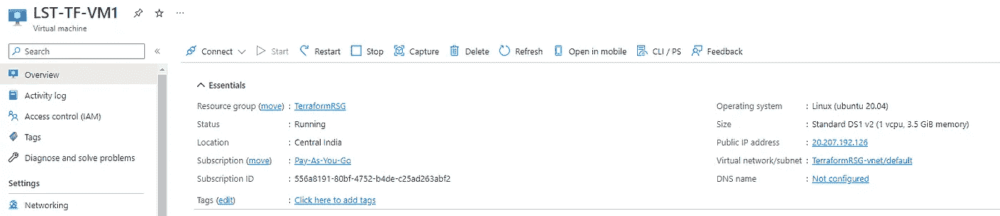](https://javarevisited.blogspot.com/2020/02/top-5-courses-to-crack-az-900-microsoft-azure-fundamentals-certification-exam.html)

确认启用了 AAD，并且生成了托管身份，如下所示:-

[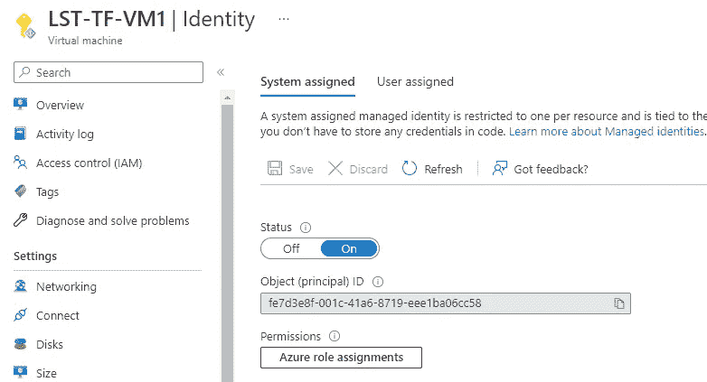](https://javarevisited.blogspot.com/2020/08/top-10-coursera-certifications-to-learn-cloud-computing-aws.html)

步骤 2:安装 terraform

wget-O-[https://apt.releases.hashicorp.com/gpg](https://apt.releases.hashicorp.com/gpg)| gpg—dearmor | sudo tee/usr/share/keyrings/hashi corp-archive-keyring . gpg

echo " deb[signed-by =/usr/share/keyrings/hashi corp-archive-keyring . gpg][https://apt.releases.hashicorp.com](https://apt.releases.hashicorp.com)$(LSB _ release-cs)main " | sudo tee/etc/apt/sources . list . d/hashi corp . list

sudo apt 更新&& sudo apt 安装平台

参考:-[https://developer.hashicorp.com/terraform/downloads](https://developer.hashicorp.com/terraform/downloads)

确认地形版本

[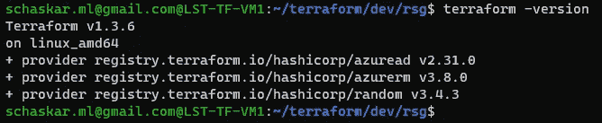](https://www.java67.com/2020/07/top-5-courses-to-learn-linux-in-depth.html#)

步骤 3:准备 Terraform 文件(通过 Windows Bash shell 使用托管身份登录到在云上创建的 Linux 虚拟机)

mkdir /terraform/dev/rsg 并创建以下 4 个文件

[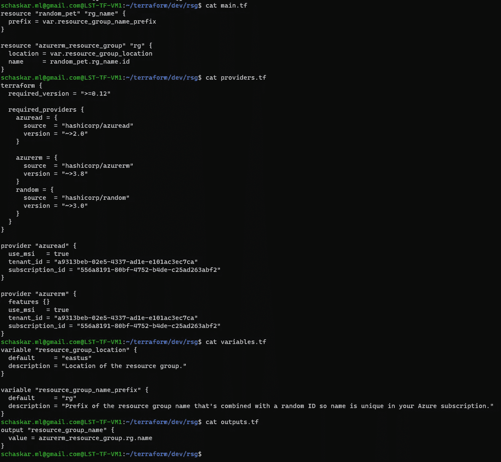](https://www.java67.com/2018/02/5-free-linux-unix-courses-for-programmers-learn-online.html)

测试时间:— —

确保在 Azure 云上运行的虚拟机上没有 AZ 登录

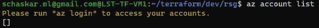

初始化地形

查看托管身份上分配的角色，以便连接到 Azure 云订阅并创建 RSG。

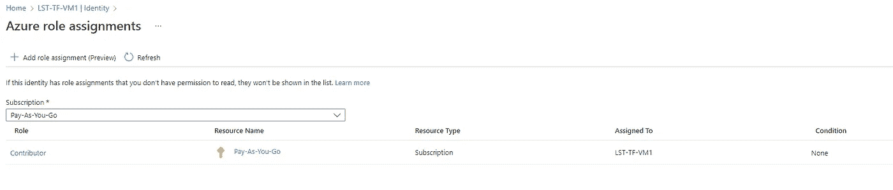

运行 Terraform 计划以创建计划

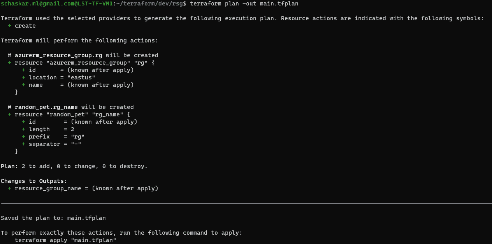

实施计划

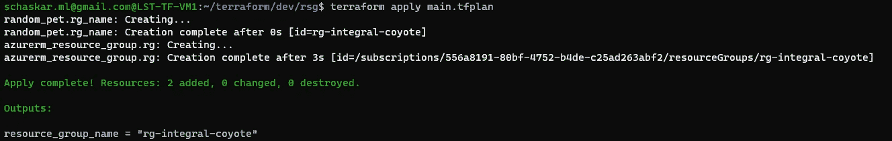

成功:从传送门确认 RSG 被创建。

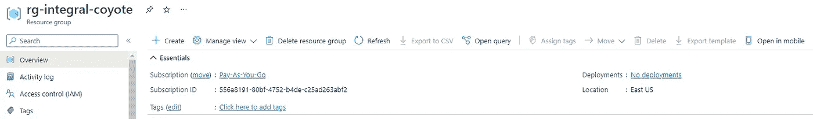

准备清理计划

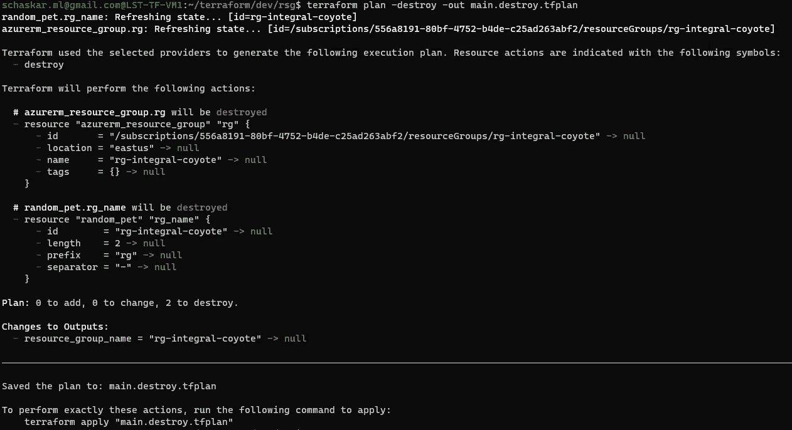

应用的清理计划将破坏创建的资源。

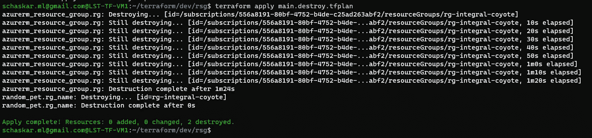

成功:从门户确认 RSG 被删除。

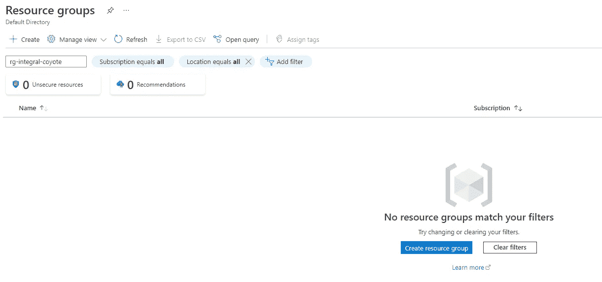

**用例 2** :虚拟机上的平台———>连接到云，使用服务主体创建资源组

步骤 5:准备 Terraform 文件(通过 visual studio 代码 IDE 从笔记本电脑使用服务主体)

使用以下命令创建服务主体:

az ad sp 为 rbac 创建—

仅供参考——这是我为 AKS 验证创建的。

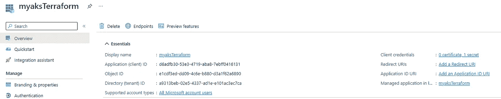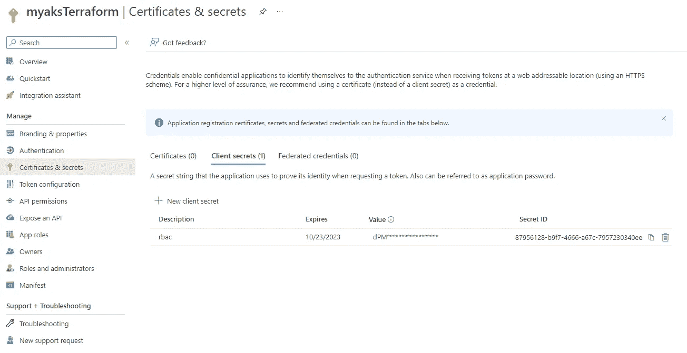

仅修改 providers.tf 以使用服务主体

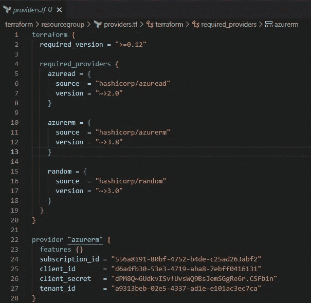

测试时间到了-

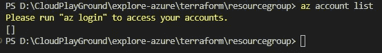

初始化地形

运行 Terraform 计划以创建计划

实施计划

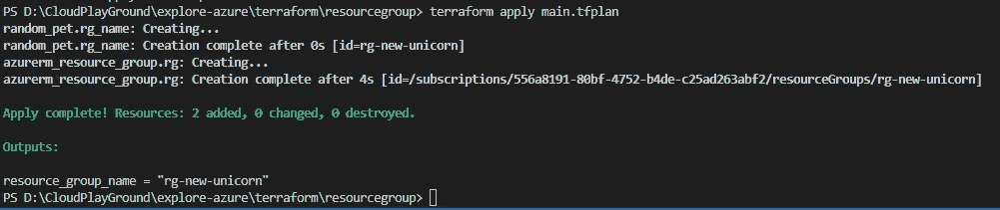

成功:从传送门确认 RSG 被创建。

准备清理计划

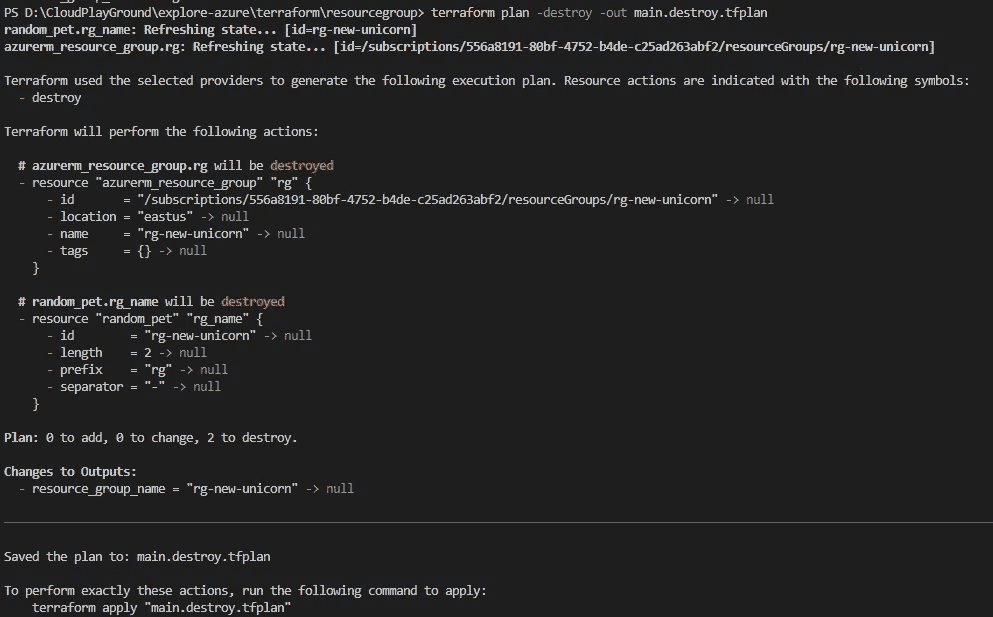

应用的清理计划将破坏创建的资源。

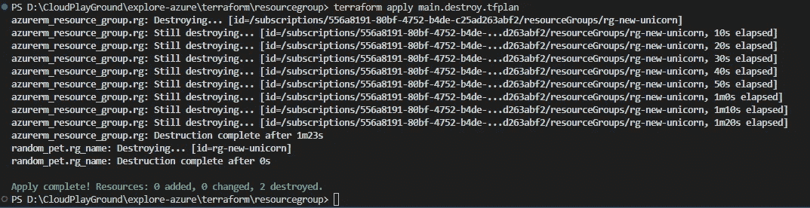

成功:从门户确认 RSG 被删除。

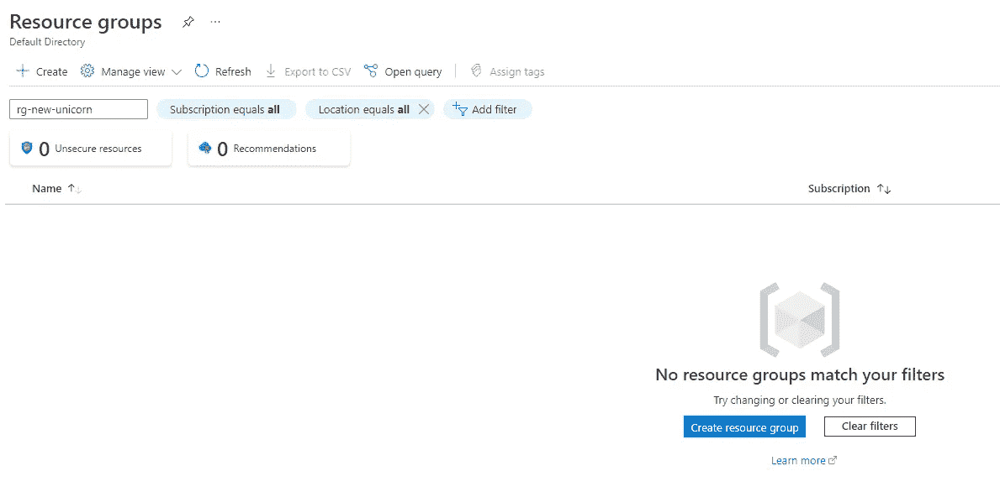

让我们继续一起航行…..！！