# Terraform 和 Azure 存储帐户后端——让我们一起航行

> 原文：<https://medium.com/javarevisited/terraform-and-azure-storage-account-backend-975b1a603aab?source=collection_archive---------1----------------------->

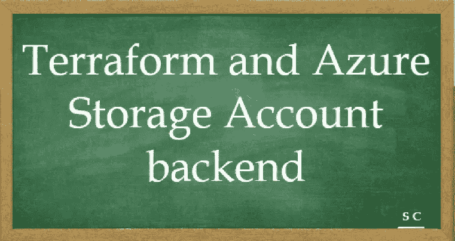

让我们使用 Terraform 创建 Azure 存储帐户，然后引用同一个帐户作为后端来存储 terraform 状态文件。

用例 1:在 Azure Cloud 上使用 [Terraform](/javarevisited/7-best-terraform-online-courses-for-devops-engineers-5e4dab297785) 创建一个存储帐户。

用例 2:修改 Terraform 后端，将状态文件存储在 Azure Cloud 上的 Azure 存储帐户中。

参考:[地形安装](/javarevisited/automation-lets-sail-together-terraform-hello-world-on-windows-10-27ae3be1f869)和[地形和天蓝色标识](/@chaskarshailesh/terraform-and-azure-identity-f3a179ad1846)然后继续

**用例 1 执行:-**

初始化地形

[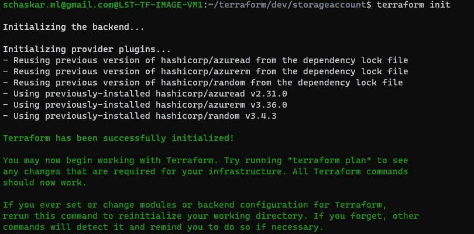](https://javarevisited.blogspot.com/2020/08/top-5-courses-to-learn-terraform-in.html)

运行 Terraform 计划以创建计划。

应用计划。

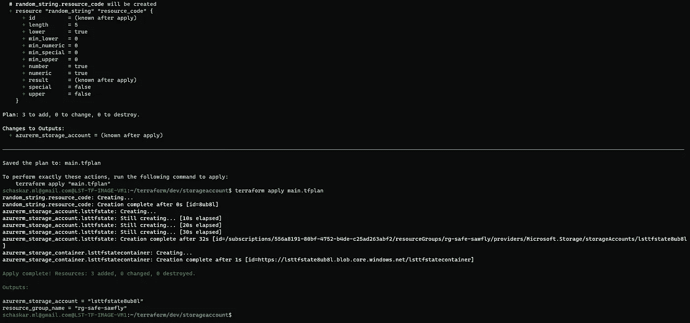

**成功**:从 portal 确认用容器创建了存储帐户，以保存状态。

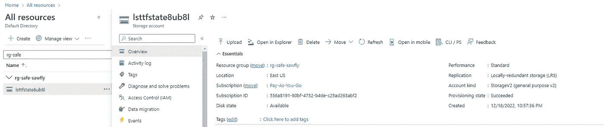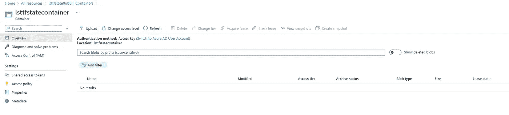

**用例 2 执行:-**

初始化地形

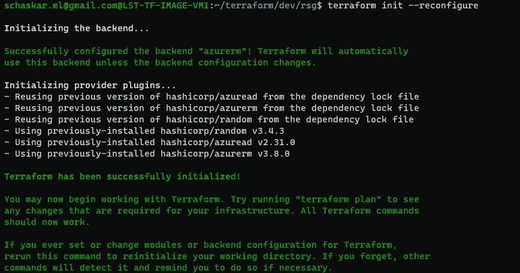

运行 Terraform 计划以创建计划。

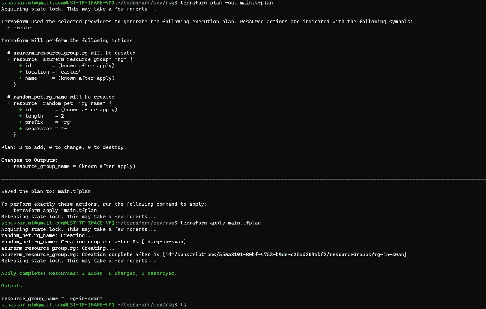

创建的地形文件列表。

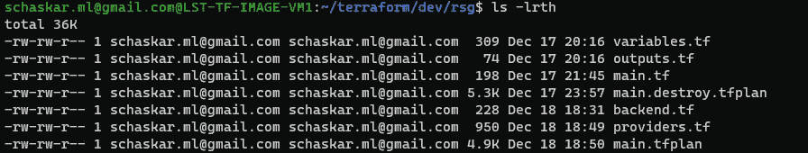

创建 backend.tf 以写入远程存储

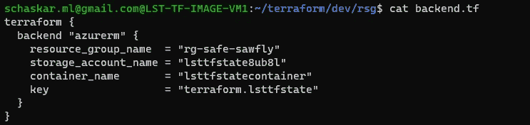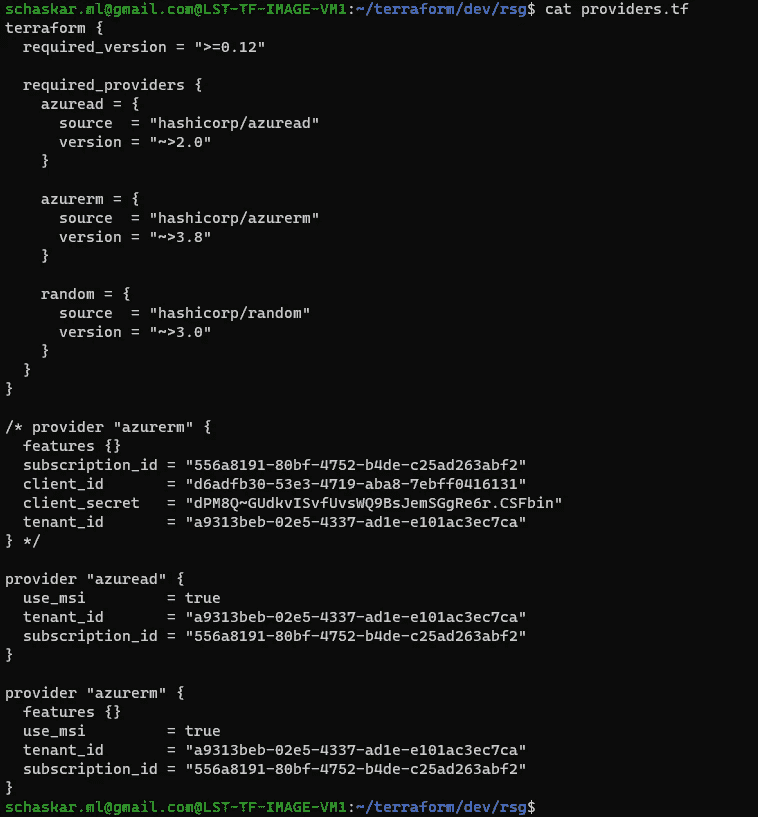

**成功**:从 portal 确认 Terraformn 状态文件已在存储帐户—容器中创建。

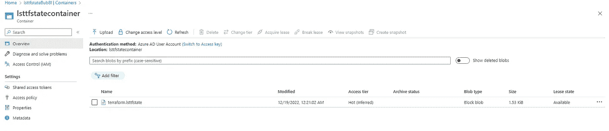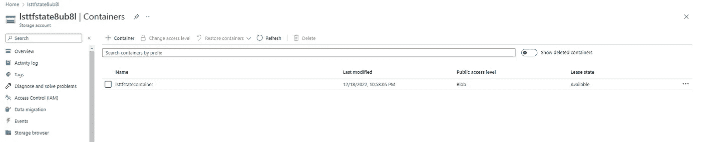

让我们继续一起航行…..！！