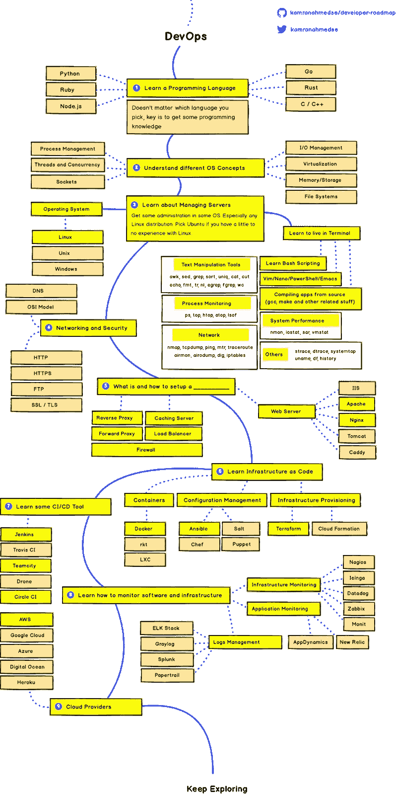
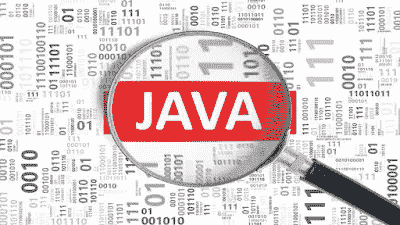
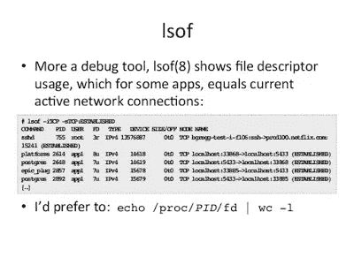
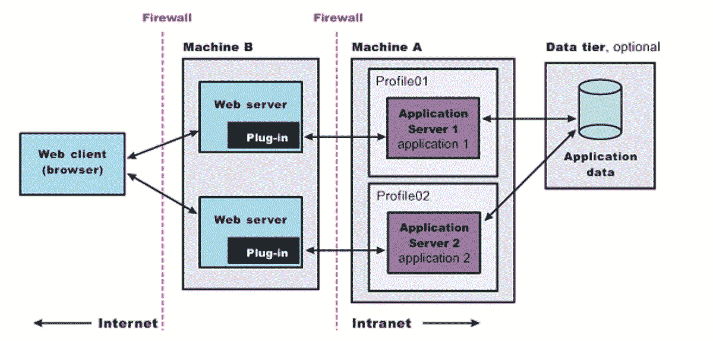
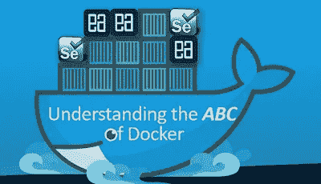
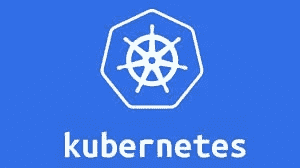
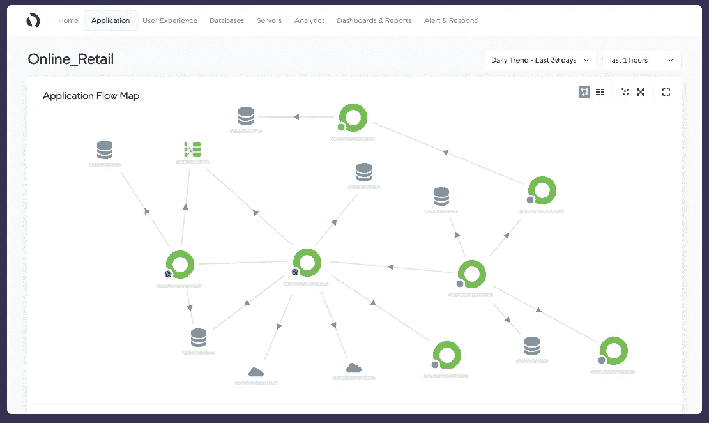

# 2023 年开发运维工程师和 SRE 路线图[更新]

> 原文：<https://medium.com/javarevisited/the-2018-devops-roadmap-31588d8670cb?source=collection_archive---------0----------------------->

## 2023 年成为 DevOps 工程师和 SRE(系统可靠性工程师)的图解指南，包含相关课程的链接

image_credit —教育性

DevOps 和 SRE 目前非常热门，我认识的大多数朋友、同事和高级开发人员都在努力成为一名 DevOps 工程师，并计划成为他们组织中的 DevOps 冠军。

虽然我确实承认 [DevOps](https://javarevisited.blogspot.com/2018/09/10-devops-courses-for-experienced-java-developers.html) 的好处，它与改进的软件开发和部署直接相关，但从我有限的经验来看，我可以说**这不是一份轻松的工作**。在这么多的工具和实践中选择正确的道路是非常困难的。

作为一名[的 Java 博主](https://javarevisited.blogspot.com)，我的许多读者经常问我类似于**如何成为一名** [**DevOps 工程师**](/javarevisited/top-5-online-courses-to-become-a-devops-engineer-in-2020-764f5e60c2b) 的问题，我应该学习哪些工具？我应该遵循哪些实践？学习 [Maven](/javarevisited/top-10-free-courses-to-learn-maven-jenkins-and-docker-for-java-developers-51fa7a1e66f6?source=collection_home---4------3-----------------------) 和 [Jenkins](/javarevisited/7-best-courses-to-learn-jenkins-and-ci-cd-for-devops-engineers-and-software-developers-df2de8fe38f3) 一定是 DevOps 的家伙吗？**Docker 和 Kubernetes 怎么样？**基础设施自动化是 DevOps 的一部分吗？我该不该学厨师、木偶、T21，这些问题不断出现在我的脑海中。我已经尽力用我最少的经验来回答这些问题，但我无法用一种简单的、令人敬畏的、可重复使用的方式记下它们，不过，别担心。

今天，我将与您分享一个很棒的资源，它将帮助您成为您一直想成为的 DevOps 工程师，**2023 devo PS 路线图**。

昨天我在网上漫不经心地浏览时，看到了<https://github.com/kamranahmedse/developer-roadmap>[Kamranahmedse](https://github.com/kamranahmedse)的这个优秀的 GitHub 页面，它展示了成为前端开发人员、后端开发人员、全栈 web 开发人员以及最后但同样重要的**devo PS 工程师**的一些有用的路线图。

这份路线图在任何意义上都很棒，因为它不仅强调了 [DevOps 工程师的角色](https://javarevisited.blogspot.com/2018/09/10-devops-courses-for-experienced-java-developers.html)，还告诉了你需要学习哪些工具和技术来覆盖该领域。

最重要的是，漂亮的颜色在视觉上很有吸引力(你不喜欢黄色和带有蓝色线条的奶油色吗？)，这样你就可以拿一份打印出来的东西贴在办公桌上，方便参考。虽然路线图告诉你要学什么，但它并没有告诉你如何学以及从哪里学，从这个意义上来说它是好的。为了完成路线图，我分享了一些[有用的在线 DevOps 课程](/javarevisited/13-best-courses-to-learn-devops-for-senior-developers-in-2020-a2997ff7c33c)，有免费的，也有付费的，这样你就可以学习和提高你想要的工具或领域。

# 面向开发人员的 2023 年 DevOps 路线图

无论如何，这就是我所说的 2023 年 *DevOps 路线图*:

图片由 kamranahmedse([https://github.com/kamranahmedse/developer-roadmap](https://github.com/kamranahmedse/developer-roadmap)

现在，让我们一步一步地浏览路线图，并找出如何在 2023 年成为 DevOps 大师所需的基本技能:

## 1.学习一门编程语言

显然，我假设你们肯定知道三种主要编程语言中的一种，即 [Java](https://javarevisited.blogspot.sg/2017/11/top-5-free-java-courses-for-beginners.html#axzz4zuIICRs9) 、 [Python](http://javarevisited.blogspot.sg/2018/03/top-5-courses-to-learn-python-in-2018.html) 或 [JavaScript](https://javarevisited.blogspot.com/2018/06/top-10-courses-to-learn-javascript-in.html) 。

如果你没有，不要担心，你可以看看下面的课程来学习你选择的语言，尽管我强烈建议你至少学习这三种主要的通用编程语言中的一种。

## 1.1 Java

如果你想学习 Java，那么 [**完整的 Java 大师班**](https://click.linksynergy.com/fs-bin/click?id=JVFxdTr9V80&subid=0&offerid=323058.1&type=10&tmpid=14538&RD_PARM1=https%3A%2F%2Fwww.udemy.com%2Fjava-the-complete-java-developer-course%2F) 是一门很棒的课程，也是最近为 Java 10 更新的。

## 1.2 Python

如果你想学习 Python，那么 [**完整的 Python BootCamp**](https://click.linksynergy.com/fs-bin/click?id=JVFxdTr9V80&subid=0&offerid=323058.1&type=10&tmpid=14538&RD_PARM1=https%3A%2F%2Fwww.udemy.com%2Fcomplete-python-bootcamp%2F) 是我最喜欢的资源，它会教你 Python 3，Python 最流行的版本。

## 1.3 JavaScript

而且，如果你想学习 JavaScript，那么你不应该去看看摩西·海姆达尼在 Udemy 上的 [**初学者 JavaScript 基础知识**](https://click.linksynergy.com/fs-bin/click?id=JVFxdTr9V80&subid=0&offerid=323058.1&type=10&tmpid=14538&RD_PARM1=https%3A%2F%2Fwww.udemy.com%2Fjavascript-basics-for-beginners%2F) 课程。

如果你需要更多的选择，并且不介意从免费资源中学习，那么你可以随时看看我的免费 [Java](https://javarevisited.blogspot.com/2018/08/top-5-free-java-8-and-9-courses-for-programmers.html) 、 [Python](http://www.java67.com/2018/02/5-free-python-online-courses-for-beginners.html) 和 [JavaScript](http://www.java67.com/2018/04/top-5-free-javascript-courses-to-learn.html) 课程列表。

## 2.理解不同的操作系统概念

这就是 Ops 部分的用武之地，早期它仅由负责了解操作系统和硬件的人员和系统管理员提供支持，但有了 DevOps，现在开发人员也需要了解他们。

您至少需要了解路线图中建议的进程管理、 [*线程和并发*](/javarevisited/8-best-multithreading-and-concurrency-courses-for-experienced-java-developers-8acfd3b25094) 、套接字、I/O 管理、虚拟化、内存存储和文件系统。

由于我们大多数人都在 Linux 下工作，我建议你去参加 Udemy 上的[**Linux Administration boot camp**](https://click.linksynergy.com/fs-bin/click?id=JVFxdTr9V80&subid=0&offerid=323058.1&type=10&tmpid=14538&RD_PARM1=https%3A%2F%2Fwww.udemy.com%2Flinux-administration-bootcamp%2F)课程，更好地学习和理解 Linux OS。

如果你需要更多的选择，并且不介意从免费资源中学习，那么你也可以看看这个免费 Linux 课程列表。

# 3.学会在终端生活

对于一个 DevOps 人员来说，在命令行中掌握好命令是很重要的，特别是如果他正在使用 Linux 的话。了解一些像 Bash，或者 Ksh 这样的 Linux shell 和像 [find](http://javarevisited.blogspot.sg/2011/03/10-find-command-in-unix-examples-basic.html#axzz5E2uHdG3w) ， [grep](http://www.java67.com/2017/07/grep-command-example-list-only-file-names-matching-string.html) ，awk， [sed](http://javarevisited.blogspot.sg/2013/05/sed-command-examples-in-unix-and-linux.html#axzz56KhwFZ4z) ， [lsof](http://javarevisited.blogspot.sg/2016/06/10-example-of-lsof-command-in-unix-linux.html#axzz5CkWP96Nb) ，以及像 [nslookup](http://javarevisited.blogspot.sg/2017/04/how-hostname-to-ip-address-conversion-or-name-resolution-works-in-Linux.html) 和 netstat 这样的联网命令是必须的。

如果您觉得需要更新这些命令和工具，那么您应该参加 Pluralsight 上的 [**Linux 命令行界面(CLI)基础**](https://pluralsight.pxf.io/c/1193463/424552/7490?u=https%3A%2F%2Fwww.pluralsight.com%2Fcourses%2Flinux-cli-fundamentals) 课程。

对于初学者和有经验的 Linux 用户来说，这都是一个很好的复习。你需要一个[**的多重视野会员**](http://pluralsight.pxf.io/c/1193463/424552/7490?u=https%3A%2F%2Fwww.pluralsight.com%2Flearn) 才能进入这个课程，这个课程的费用大约是每月 29 美元或者每年**299 美元，但是完全值得。

Pluralsight 就像是开发者的网飞，它拥有 6000 多门关于最新技术的优质课程，这意味着你可以在任何地方学习任何东西。我主要是在旅行和通勤时学习。

顺便说一句，如果你需要更多的选择，想成为 shell 脚本大师，也可以看看我列出的[学习 shell 脚本的最佳课程](https://javarevisited.blogspot.com/2018/02/5-courses-to-learn-shell-scripting-in-linux.html)。**

# **4.网络和安全性**

**孤立的日子已经一去不复返了，在今天的世界里，一切都是相互联系的，这使得网络和安全变得非常重要。**

**为了成为一名优秀的 DevOps 工程师，您必须了解基本的网络和安全概念，如 DNS、OSI 模型、 [HTTP](https://javarevisited.blogspot.com/2013/07/how-ssl-https-and-certificates-works-in-java-web-application.html) 、HTTPS、FTP、SSL、TLS 等。**

**为了刷新这个概念，你可以看一下 Pluralsight 上 Ed Liberman 课程的 [**TCP/IP 和 IT 专业人员网络基础**](https://pluralsight.pxf.io/c/1193463/424552/7490?u=https%3A%2F%2Fwww.pluralsight.com%2Fcourses%2Ftcpip-networking-it-pros) 。**

**<https://pluralsight.pxf.io/c/1193463/424552/7490?u=https%3A%2F%2Fwww.pluralsight.com%2Fcourses%2Ftcpip-networking-it-pros>  

如果你需要更多的选择，你也可以查看这些 Udemy 课程，比如网络课程，[完整的网络基础知识](http://bit.ly/2QcTtAW)是一门不错的课程，关于安全，你也可以查看 [**完整的网络安全课程:网络安全！**](http://bit.ly/2QcTtAW) 。

**

# **5.什么是设置以及如何设置**

**作为一名 DevOps 拥护者，您应该知道您的机器中设置了什么，以及如何设置，只知道您可以考虑将其自动化。**

**一般来说，一个 DevOps 工程师应该知道如何设置一个像 IIS、 [Apache](https://javarevisited.blogspot.com/2017/01/12-essential-apache-web-server-interview-questions-answers-java-linux.html) 和 [Tomcat](https://javarevisited.blogspot.com/2018/07/how-to-setup-jndi-database-connection-pool-tomcat-spring-example-tutorial.html) 这样的 Web 服务器。**

**他还应该了解缓存服务器、负载平衡器、反向代理和防火墙等。如果你是 web 开发领域的新手，我建议你也去看看柯尔特·斯蒂尔的 Web 开发者训练营<http://bit.ly/2AGj5m2>**

********

# ****6.将基础设施作为代码来学习****

****这可能是 DevOps 工程师最重要的事情，也是一个非常广阔的领域。作为一名 DevOps 工程师，您应该了解像 [Docker](https://javarevisited.blogspot.com/2018/02/10-free-docker-container-courses-for-Java-Developers.html) 和 [Kubernetes](https://javarevisited.blogspot.com/2018/09/10-devops-courses-for-experienced-java-developers.html) 这样的容器，像 [Ansible](http://bit.ly/2ygZXa3) 、 [Chef](http://bit.ly/2CRTh2x) 、 [Salt](http://bit.ly/2xZiAjM) 和 [Puppet](http://bit.ly/2yc6O4D) 这样的配置管理工具，像 Terraform 和云形成这样的基础设施供应。下面是我推荐的一些学习这些工具的课程。

如果你想学习 Docker，那么 Udemy 上的[**Docker Mastery:Docker 船长课程的完整工具集**](https://click.linksynergy.com/fs-bin/click?id=JVFxdTr9V80&subid=0&offerid=323058.1&type=10&tmpid=14538&RD_PARM1=https%3A%2F%2Fwww.udemy.com%2Fdocker-mastery%2F) 是最好的开始课程。它全面涵盖了 DevOps 工程师需要的所有工具。****

********

****如果你想学习 Kubernetes，那么我建议你加入[**Learn devo PS:Kubernetes 完整课程**](https://click.linksynergy.com/fs-bin/click?id=JVFxdTr9V80&subid=0&offerid=323058.1&type=10&tmpid=14538&RD_PARM1=https%3A%2F%2Fwww.udemy.com%2Flearn-devops-the-complete-kubernetes-course%2F) 。这将教你如何构建、部署和管理 Kubernetes。****

********

****如果你想学习 Chef，那么没有比 Udemy 上的[**Chef Fundamentals:A Recipe for Automating infra structure**](https://click.linksynergy.com/fs-bin/click?id=JVFxdTr9V80&subid=0&offerid=323058.1&type=10&tmpid=14538&RD_PARM1=https%3A%2F%2Fwww.udemy.com%2Fchef-fundamentals-a-recipe-for-automating-infrastructure%2F)更好的课程了。大概是此刻学厨师最好的课程了。****

********

****如果你在 Docker 上需要更多的选择，你可以探索一下这个[devo PS 工程师 10 门必备课程](https://javarevisited.blogspot.com/2018/09/10-devops-courses-for-experienced-java-developers.html)的列表。****

## ****7.学习一些持续集成和交付(CI/CD)工具****

****对于 DevOps 大师和冠军来说，这是另一件非常重要的事情，即建立持续集成和交付的渠道。CI/CD 领域有许多工具，例如 [Jenkins](http://www.java67.com/2018/02/6-free-maven-and-jenkins-online-courses-for-java-developers.html) 、TeamCity、Drone 等。但是，我强烈建议至少学习 Jenkins，因为它是市场上使用最广泛，可能也是最成熟的 CI/CD 工具。如果你不知道詹金斯，那么这个课程是最好的开始。

如果你想学习 Jenkins，那么没有比经典的 [**学习 DevOps: CI/CD 用 Jenkins 使用 Pipelines 和 Docker**](https://click.linksynergy.com/fs-bin/click?id=JVFxdTr9V80&subid=0&offerid=634352.1&type=10&tmpid=14538&RD_PARM1=https%3A%2F%2Fwww.udemy.com%2Flearn-devops-ci-cd-with-jenkins-using-pipelines-and-docker%2F) 上 Udemy 更好的课程了。这简直是最好的课程，我也从这门课中学到了大部分的詹金斯技能。****

********

****顺便说一句，如果你需要更多的选择，并且不介意从免费资源中学习，那么你也可以查看我为 Java 开发人员提供的 6 门免费 Jenkins 和 Maven 课程的列表。****

## ****8.学习监控软件和基础设施****

****除了设置和部署之外，监控是 DevOps 的另一个重要方面，这也是 DevOps 工程师了解基础设施和应用监控非常重要的原因。这个领域有很多工具，比如 Nagios，ice， [Datadog](https://www.datadoghq.com/) ，Zabbix，Monit，AppDynanic，New Relic 等等。****

****你可以选择其中的一些，这取决于你的公司使用哪一个，比如 AppDynamic 和 Nagios。****

****如果您想在 2023 年了解更多关于 AppDynamic 的信息，并且需要资源，那么我强烈建议您查看 Udemy 上的 [**思科 AppDynamics 应用性能管理(APM)**](https://click.linksynergy.com/deeplink?id=CuIbQrBnhiw&mid=39197&murl=https%3A%2F%2Fwww.udemy.com%2Fcourse%2Fcisco-appdynamics-application-performance-management-apm%2F) 课程。这是一个很好的课程，学习这个有用的工具来监控您的软件和基础设施。****

********

## ****9.了解云提供****

****云是下一个重要的东西，迟早你必须将你的应用程序迁移到云中，因此对于一个 DevOps 工程师来说，至少了解一些流行的云提供商及其基础知识是很重要的。

虽然 [AWS](http://www.java67.com/2018/05/top-5-amazon-web-services-or-aws-courses-to-learn-online.html) 显然是云领域的领导者，但它并不孤单，[谷歌云](https://javarevisited.blogspot.com/2019/07/top-5-google-cloud-platform-gcp-courses-certifications-online.html)和 [Azure](https://javarevisited.blogspot.com/2019/07/top-5-courses-to-crack-azure-architecture-technologies-certification-az-300-exam.html) 正在慢慢赶上，然后我们有一些其他的参与者，如 Heroku、Cloud Foundry 和 Digital Ocean。

首先，我强烈建议加入经典的 [**AWS 无服务器 API&应用 Udemy 中的完整介绍**](https://click.linksynergy.com/fs-bin/click?id=JVFxdTr9V80&subid=0&offerid=323058.1&type=10&tmpid=14538&RD_PARM1=https%3A%2F%2Fwww.udemy.com%2Faws-serverless-a-complete-introduction%2F) 课程，这简直是最好的。****

********

****顺便说一句，如果你需要更多的选择，并且不介意从免费资源中学习，那么你也可以查看我为开发人员和 DevOps 人员提供的免费 AWS 课程列表。****

****其他**编程文章**你可能喜欢的
[2023 年 Java 开发者路线图](https://javarevisited.blogspot.com/2019/10/the-java-developer-roadmap.html#123)
[2023 年学习 Python 的 10 个理由](https://javarevisited.blogspot.com/2018/05/10-reasons-to-learn-python-programming.html)
[2023 年你可以学习的 10 种编程语言](http://www.java67.com/2017/12/10-programming-languages-to-learn-in.html)
[每个 Java 开发者都应该知道的 10 个工具](http://www.java67.com/2018/04/10-tools-java-developers-should-learn.html)
[学习 Java 编程语言的 10 个理由](http://javarevisited.blogspot.sg/2013/04/10-reasons-to-learn-java-programming.html)
[2023 年 Java 和 Web 开发者应该学习的 10 个框架](http://javarevisited.blogspot.sg/2018/01/10-frameworks-java-and-web-developers-should-learn.html) 2023 年
[2023 年要学习的 5 大 Java 框架](http://javarevisited.blogspot.sg/2018/04/top-5-java-frameworks-to-learn-in-2018_27.html)
[每个 Java 开发者都应该知道的 10 个测试库](https://javarevisited.blogspot.sg/2018/01/10-unit-testing-and-integration-tools-for-java-programmers.html)****

# ****结束语****

****感谢您阅读本文。你可能会想，有这么多东西要学，有这么多课程要参加，但你不需要担心。****

****很有可能你已经知道了大部分内容，也有很多有用的免费资源可供你使用，我还在这里和那里链接了它们以及最好的资源，这些资源当然不是免费的，但很值钱。****

****我是 Udemy 课程的特别粉丝，因为它们非常实惠，并且以很小的金额提供了很多价值，但是你可以自由选择你想要的课程。****

****说到底，你应该对这里提到的事情有足够的知识和经验。****

****祝你的 DevOps 之旅好运！当然**不会很容易**，但是通过遵循这个路线图和指南，你离成为你一直想成为的 DevOps 工程师更近了一步****

****如果你喜欢这篇文章，那么请考虑在 medium 上关注我( [javinpaul](https://medium.com/u/bb36d8439904?source=post_page-----31588d8670cb--------------------------------) )。如果你想在每篇新帖子上得到通知，别忘了在 Twitter 上关注**[**Java 访问过的**](https://twitter.com/javarevisited) ！

祝您的 DevOps 之旅一切顺利，非常感谢 [Kamran Ahmed](https://medium.com/u/d4eb92ea1991?source=post_page-----31588d8670cb--------------------------------) 制作了如此精彩的内容。******

## ****附:如果你只想从一门课程开始学习 DevOps，我认为[Learn devo PS:CI/CD with Jenkins using Pipelines and Docker](https://click.linksynergy.com/fs-bin/click?id=JVFxdTr9V80&subid=0&offerid=634352.1&type=10&tmpid=14538&RD_PARM1=https%3A%2F%2Fwww.udemy.com%2Flearn-devops-ci-cd-with-jenkins-using-pipelines-and-docker%2F)是最好的开始。****

******其他文章上** [**中**](https://medium.com/u/504c7870fdb6?source=post_page-----b657a195aa07----------------------) **你可能喜欢:******

****</hackernoon/the-2019-web-developer-roadmap-ab89ac3c380e>  </javarevisited/the-2019-react-js-developer-roadmap-9a8e290b8a56>  </javarevisited/top-15-online-courses-to-learn-docker-kubernetes-and-aws-for-fullstack-developers-and-devops-d8cc4f16e773> ****