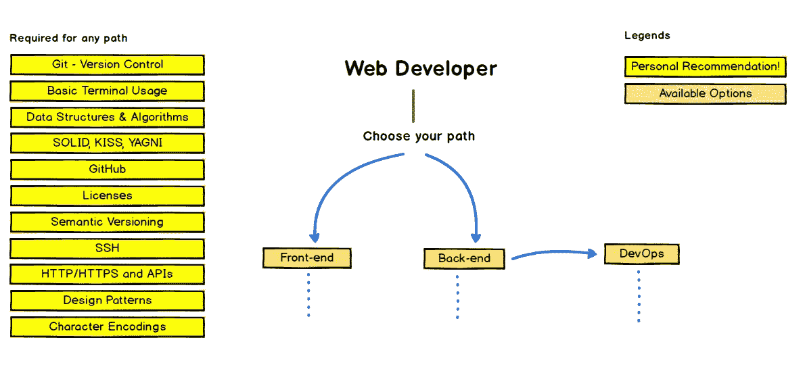
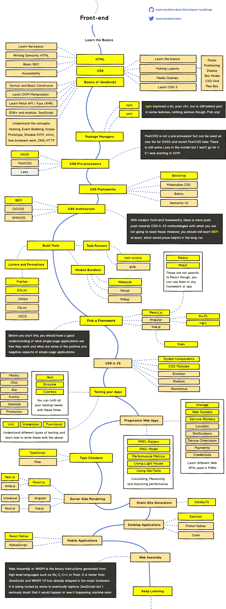
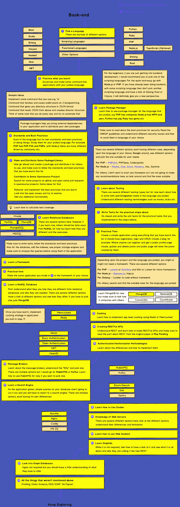

# 2023 年 FullStack Web 开发者路线图[更新]

> 原文：<https://medium.com/javarevisited/the-2019-web-developer-roadmap-ab89ac3c380e?source=collection_archive---------0----------------------->

## 2023 年成为网页开发者的图解指南，并附有相关课程的链接

你好，伙计们，如果你想学习编码或者在 2023 年成为一名网页开发者，那么你来对地方了。之前，我已经分享了 [20 个学习编码的网站](/javarevisited/top-20-sites-to-learn-coding-in-2020-f57ff63d9cb3)和[最佳 web 开发课程](/better-programming/my-5-favorite-courses-to-learn-web-development-in-2019-a5e74167f8b2)，今天我有一个特别的东西要和大家分享，那就是**完整的全栈 Web 开发者路线图**。

这是一个关于如何在 2023 年*成为一名全栈 web 开发人员*的极好例证，并指导你如何在 2023 年学习和掌握 Web 开发。

它是学习[前端](https://javarevisited.blogspot.com/2020/01/10-things-web-developers-should-learn.html)、后端[全栈](/javarevisited/top-10-online-courses-to-become-a-fullstack-web-developer-in-2020-d608a6b63232)的不同途径的集合，包括一个 Web 开发者应该知道的所有其他事情。你不仅会了解网络开发，还会了解对所有程序员都很重要的[基本编程知识](https://javarevisited.blogspot.com/2019/01/10-things-every-programmer-and-software-engineer-should-know.html)。

路线图也分为 3 个部分，第一部分是关于每个 web 开发人员都应该知道的**基本技能，而第二和第三部分是关于 web 开发的两个主要领域**前端**和**后端**开发。你可以学习前端或后端，或者两者都学，这取决于你的选择。如果你想成为一名 FullStack Web 开发人员，那么你必须学习前端和后端，这是不可避免的。

在前端你也可以选择学习你想要的框架，比如 [React](https://javarevisited.blogspot.com/2018/08/top-5-react-js-and-redux-courses-to-learn-online.html) 、 [Angular](https://javarevisited.blogspot.com/2018/06/5-best-courses-to-learn-angular.html) 或者 [Vue.js](https://vuejs.org/) ，你不需要全部学习，只需要学习你喜欢的。如果你问我的建议，Vue.js 在 2023 年是比其他两个更好的选择，但这些仍然比 Vue.js 更常用。

顺便说一句，你可能以前见过这个路线图。这本关于如何成为一名 web 开发人员的很棒的视觉指南是由 [Kamranahmedse](https://github.com/kamranahmedse) 创建的，并发布在他的 GitHub 知识库[这里](https://github.com/kamranahmedse/developer-roadmap)。这是我最喜欢的地方之一，我已经把它收藏起来，准备以后再去。去年，当我在网上冲浪时，偶然发现了这个优秀的网页。我首先在那里找到了 [DevOps 路线图](https://javarevisited.blogspot.com/2018/09/the-2018-devops-roadmap-your-guide-to-become-DevOps-Engineer.html#axzz5d7MDZd3M)和 [React 开发者路线图](/javarevisited/the-2019-react-js-developer-roadmap-9a8e290b8a56)，并且立刻成为了 [Kamran Ahmed](https://medium.com/u/d4eb92ea1991?source=post_page-----ab89ac3c380e--------------------------------) 的粉丝。事实上，我已经把这些路线图打印出来，贴在我的桌子上，作为日常参考。

顺便说一句，路线图告诉你要学什么，但没有告诉你怎么学，在哪里可以学到那些技能。我试图通过提供一些有用的[课程](http://www.java67.com/2018/08/top-10-free-java-courses-for-beginners-experienced-developers.html)和[书籍](http://www.java67.com/2015/03/10-books-every-programmer-and-software-engineer-read.html)的链接来补充这一部分，你可以用来学习成为一名 web 开发人员所需的[技术](http://www.java67.com/2018/01/top-10-web-mobile-and-big-data-framework-libraries-technologies-programmers-should-learn-in-2018.html)、[编程语言](http://www.java67.com/2017/12/10-programming-languages-to-learn-in.html)、[框架](http://www.java67.com/2018/02/top-10-open-source-frameworks-and-libraries-java-web-developers.html)和[库](http://www.java67.com/2019/01/top-10-javascript-frameworks-and-libraries-for-web-developers.html)，并在这个路线图中提到。**

# **2023 年如何成为全栈 Web 开发者？**

**不管怎样，这就是你要开始的地方。正如我以前说过的，你可以选择前端或后端路径，这取决于你的兴趣。不管怎样，有八条黄色的建议是你必须学会的，这些是每个程序员都应该知道的常识。**

**

[https://github.com/kamranahmedse/developer-roadmap](https://github.com/kamranahmedse/developer-roadmap)** 

# ****推荐学习任一途径****

**这里有一些成为前端开发人员或服务器端后端开发人员所需的基本技能。**

## ****1。Git****

**最流行的版本控制系统之一。没有 Git 的生活已经不可能了。你可以从 Udemy 上的 [**查看 Git 完整指南**](https://click.linksynergy.com/deeplink?id=JVFxdTr9V80&mid=39197&murl=https%3A%2F%2Fwww.udemy.com%2Fgit-complete%2F) 开始。**

** [## Git 完整教程:Git 权威指南

### Git 完成这一课程的目的是一个全面的 Git 方法，这意味着没有事先的知识或…

udemy.com](https://click.linksynergy.com/deeplink?id=JVFxdTr9V80&mid=39197&murl=https%3A%2F%2Fwww.udemy.com%2Fgit-complete%2F) 

## **2。宋承宪**

它允许你删除登录到另一个主机，另一个流行的网络概念，每个 web 开发人员都应该知道。

**3。HTTP/HTTPS HTTP 协议是 web 的支柱，对于一个 web 开发人员来说，很好地了解 HTTP 和 HTTPS 是必不可少的。基本终端用法 Linux 命令行基础知识**
不仅仅是一个 web 开发人员，对于任何程序员来说，Linux 命令行都是非常非常重要的，我强烈建议你花些时间学习它们。Udemy 上的 [**Linux 命令行基础**](https://click.linksynergy.com/deeplink?id=JVFxdTr9V80&mid=39197&murl=https%3A%2F%2Fwww.udemy.com%2Flinux-command-line-volume1%2F) 课程是一个很好的起点，如果你喜欢免费课程，你可以使用这些免费的 Linux 课程开始学习 Linux。

 [## Linux 命令行基础

### 这是 Linux 命令行的入门课程。对于 Linux 初学者和高级 Linux 用户来说都非常棒。

udemy.com](https://click.linksynergy.com/deeplink?id=JVFxdTr9V80&mid=39197&murl=https%3A%2F%2Fwww.udemy.com%2Flinux-command-line-volume1%2F) 

**5。数据结构和算法**
这些是任何程序的组成部分，更好的算法和数据结构知识是你下一份工作或做好当前工作的关键。

如果你对学习算法和数据结构感兴趣，我建议你选择你理解的编程语言的课程。

例如，对于 Java 开发人员来说 [**数据结构和算法:使用 Java**](https://click.linksynergy.com/deeplink?id=JVFxdTr9V80&mid=39197&murl=https%3A%2F%2Fwww.udemy.com%2Fdata-structures-and-algorithms-deep-dive-using-java%2F) 进行深入研究是一个很好的开始。

 [## 数据结构和算法:使用 Java 进行深入研究

### 所以你已经掌握了 Java(或另一种面向对象编程语言)中数据结构和算法的基础知识，但是…

udemy.com](https://click.linksynergy.com/deeplink?id=JVFxdTr9V80&mid=39197&murl=https%3A%2F%2Fwww.udemy.com%2Fdata-structures-and-algorithms-deep-dive-using-java%2F) 

同样，对于 JavaScript 开发者来说，柯尔特·斯蒂尔的 [**JavaScript 算法和数据结构大师班**](https://click.linksynergy.com/deeplink?id=JVFxdTr9V80&mid=39197&murl=https%3A%2F%2Fwww.udemy.com%2Fjs-algorithms-and-data-structures-masterclass%2F) 是一个很好的例子。

 [## JavaScript (JS)算法和数据结构大师班

### 这门课程将几个月的计算机科学和面试准备材料压缩成 20 小时的视频。内容基于…

udemy.com](https://click.linksynergy.com/deeplink?id=JVFxdTr9V80&mid=39197&murl=https%3A%2F%2Fwww.udemy.com%2Fjs-algorithms-and-data-structures-masterclass%2F) 

而且，如果你使用 Python，那么 Python 中的 [**算法和数据结构是一个不错的选择。**](https://click.linksynergy.com/deeplink?id=JVFxdTr9V80&mid=39197&murl=https%3A%2F%2Fwww.udemy.com%2Falgorithms-and-data-structures-in-python%2F)

 [## Python 中的算法和数据结构

### 这门课程是关于数据结构和算法的。我们将使用 Python 实现这些问题。我非常…

udemy.com](https://click.linksynergy.com/deeplink?id=JVFxdTr9V80&mid=39197&murl=https%3A%2F%2Fwww.udemy.com%2Falgorithms-and-data-structures-in-python%2F) 

并且，如果你不介意从资源中学习，那么你也可以使用这个[免费算法课程](https://javarevisited.blogspot.com/2018/01/top-5-free-data-structure-and-algorithm-courses-java--c-programmers.html)的列表作为开始。

**7。字符编码**
如果你正在创建一个全球性的应用程序，用世界上许多不同的语言显示信息，那么你应该对字符编码有很好的了解。它基本上告诉你的浏览器如何显示你的数据。

**8。毫无疑问，每个程序员都应该知道 Git 和 GitHub，因为它们是版本控制和代码库的标准。如果你想学习和掌握 [Git](https://dzone.com/articles/top-5-free-courses-to-learn-git-and-github-in-2019) 和 [Github](https://hackernoon.com/top-5-free-courses-to-learn-git-and-github-best-of-lot-2f394c6533b0) ，可以查看这些[免费 Git 课程](https://javarevisited.blogspot.com/2018/01/5-free-git-courses-for-programmers-to-learn-online.html)。**

# 2023 年前端开发者路线图

如果你想在 2023 年成为前端开发者，那么你应该遵循下面的前端开发者路线图。你应该把重点放在黄色方框上，突出重要的事情，从那里开始学习和遵循。在路线图下面，你会找到额外的资源，如[书籍](https://javarevisited.blogspot.com/2017/02/top-5-javascript-books-to-learn-best-of-lot-must-read.html)和[课程](/javarevisited/top-10-courses-to-learn-python-for-web-development-in-2020-best-of-lot-efe11fb6d212)来帮助你学习。

[https://github . com/kamranahmedse/developer-roadmap/blob/master/images/frontend . png](https://github.com/kamranahmedse/developer-roadmap/blob/master/images/frontend.png)

## 1.Web 开发基础

很明显，如果你想成为一名 web 开发人员，那么你应该了解互联网、web 应用程序、HTTP 等协议以及一般的 Web 开发的基础知识。谢天谢地，有很多课程，你不仅能学到这些，还能学到更多。

我给所有想学习 Web 开发的程序员推荐以下资源:

1.  [**柯尔特钢铁**](https://click.linksynergy.com/deeplink?id=JVFxdTr9V80&mid=39197&murl=https%3A%2F%2Fwww.udemy.com%2Fthe-web-developer-bootcamp%2F) 网络开发者训练营
2.  [**《2023 年网络开发者训练营》作者 Angela Yu**](https://click.linksynergy.com/deeplink?id=JVFxdTr9V80&mid=39197&murl=https%3A%2F%2Fwww.udemy.com%2Fthe-complete-web-development-bootcamp%2F)
3.  [**高级 Web 开发者训练营**](https://click.linksynergy.com/deeplink?id=JVFxdTr9V80&mid=39197&murl=https%3A%2F%2Fwww.udemy.com%2Fthe-advanced-web-developer-bootcamp%2F)

 [## 高级 Web 开发人员训练营

### 嗨！欢迎来到高级 Web 开发人员训练营，这是一个完整的课程，将帮助您了解最新的…

udemy.com](https://click.linksynergy.com/deeplink?id=JVFxdTr9V80&mid=39197&murl=https%3A%2F%2Fwww.udemy.com%2Fthe-advanced-web-developer-bootcamp%2F) 

## 2.HTML 和 CSS

HTML 和 CSS 是任何网站的支柱。HTML 提供了结构，而 CSS 提供了风格，帮助他们看起来更好，更具视觉吸引力。如果你想成为一名认真的前端开发人员，那么你必须掌握这两个，首先，你可以查看这些免费的 HTML 和 CSS 课程在线学习。

 [## 2023 年我最喜欢的学习 HTML 和 CSS 的免费课程

### HTML 和 CSS 是 web 开发的两大支柱，它们被用来创建你每天看到的网页。HTML 提供了…

medium.com](/javarevisited/5-free-html-and-css-courses-to-learn-front-end-web-development-online-8b04517c6ecb) 

## 3.Java Script 语言

就像面向对象编程的四大支柱，我指的是[抽象](https://javarevisited.blogspot.com/2017/04/difference-between-abstraction-and-encapsulation-in-java-oop.html)、[封装](https://javarevisited.blogspot.com/2012/03/what-is-encapsulation-in-java-and-oops.html)、[多态](http://javarevisited.blogspot.sg/2011/08/what-is-polymorphism-in-java-example.html)、[继承](http://www.java67.com/2016/03/top-21-java-inheritance-interview-Questions-Answer-Programming.html)，web 开发有三大支柱，即——[HTML](/javarevisited/top-10-free-courses-to-learn-html-5-css-3-and-web-development-872d62d97a97)、 [CSS](/javarevisited/top-5-advanced-css-courses-to-learn-flexbox-grid-and-sass-da8e37b09b1d) 、 [JavaScript](/javarevisited/10-javascript-frameworks-and-libraries-to-learn-in-2020-best-of-lot-5f61f86c60b4) 。前两者提供了结构和风格，但是是 JavaScript 通过增加交互性使它们变得生动。对于现代 Java 开发人员来说，学习 [JavaScript](https://javarevisited.blogspot.com/2018/06/top-10-courses-to-learn-javascript-in.html) 非常重要，值得庆幸的是，有许多课程可供初学者和高级 JavaScript 学习，以下是一些建议:

1.  [完整的 JavaScript 课程 2033](https://click.linksynergy.com/deeplink?id=JVFxdTr9V80&mid=39197&murl=https%3A%2F%2Fwww.udemy.com%2Fthe-complete-javascript-course%2F)
2.  [高级 JavaScript 和 ES6 初学者指南](https://click.linksynergy.com/deeplink?id=JVFxdTr9V80&mid=39197&murl=https%3A%2F%2Fwww.udemy.com%2Fadvanced-javascript-course%2F)

 [## 高级 JavaScript 初学者指南& ES6 - ES2017

### 你准备好最终理解 JavaScript 了吗？JavaScript 是世界上最流行的语言，如果你想成为…

udemy.com](https://click.linksynergy.com/deeplink?id=JVFxdTr9V80&mid=39197&murl=https%3A%2F%2Fwww.udemy.com%2Fadvanced-javascript-course%2F) 

## 4.以打字打的文件

就像我们有 C 和 C++一样，TypeScript 可以被认为是 JavaScript++，尽管它没有 C++流行。

[TypeScript](https://javarevisited.blogspot.com/2018/07/top-5-courses-to-learn-typescript.html) 的好处是它在 JavaScript 代码中增加了类型安全，这意味着您可以在开发阶段捕捉到讨厌的 JavaScript 类型相关错误。

它还使 JavaScript 开发面向对象的代码变得容易。如果你想学习 TypeScript， [**理解 TypeScript**](https://click.linksynergy.com/deeplink?id=JVFxdTr9V80&mid=39197&murl=https%3A%2F%2Fwww.udemy.com%2Funderstanding-typescript%2F) 是一个很好的开始课程，如果你需要更多的选择或免费的替代品，这里有另一个列表，列出了一些免费的 TypeScript 课程开始。

 [## 初学者和有经验的 Web 开发人员学习 TypeScript 的 7 门最佳课程

### 学习 TypeScript 成为更好的 Web 开发人员

medium.com](/@javinpaul/7-best-courses-to-learn-typescript-in-depth-58439e1ce729) 

## 5.有角的

人们使用普通的 HTML、CSS 和 JavaScript 构建网站的日子已经一去不复返了。如今大部分工作都是由像 [Angular](https://javarevisited.blogspot.com/2018/06/5-best-courses-to-learn-angular.html) 、 [React JS、](https://javarevisited.blogspot.com/2018/10/the-2018-react-developer-roadmap.html)或 [Vue.js](https://javarevisited.blogspot.com/2019/08/top-5-online-courses-to-learn-vue.js-best.html) 这样的框架来完成的。它们不仅提供了一个存储代码的结构，还使得快速开发一个 web 应用程序变得容易。Angular 由 Google 支持，因此学习 Angular 对于任何现代 Web 开发人员来说都是一个不错的选择。如果你想学习 Angular，没有比 Udemy 上 Max 的[**Angular——完全指南**](https://click.linksynergy.com/deeplink?id=JVFxdTr9V80&mid=39197&murl=https%3A%2F%2Fwww.udemy.com%2Fthe-complete-guide-to-angular-2%2F) 更好的课程了。

## 7.反应 JS

与 [Angular](https://hackernoon.com/top-10-angular-courses-tutorials-and-books-for-web-developers-e8a8e2c490c2) 类似， [React](https://hackernoon.com/the-2018-react-js-roadmap-4d0a43814c02) 也是开发 web 应用的热门库。它允许您编写可重用的组件，然后您可以使用这些组件来创建现代外观的交互式网页。

就像 Angular 得到了谷歌的支持一样，React 得到了脸书的支持，因此非常受欢迎。如果你想学习 React，那么你可以加入斯蒂芬·格里德的 [Modern React with Redux](https://click.linksynergy.com/deeplink?id=JVFxdTr9V80&mid=39197&murl=https%3A%2F%2Fwww.udemy.com%2Freact-redux%2F) 或者马克斯的[React——Udemy 上的完整指南](https://click.linksynergy.com/deeplink?id=JVFxdTr9V80&mid=39197&murl=https%3A%2F%2Fwww.udemy.com%2Freact-the-complete-guide-incl-redux%2F)。两者都是学习在线反应的优秀课程。

以下是链接:

1.  [现代反应与还原](https://click.linksynergy.com/deeplink?id=JVFxdTr9V80&mid=39197&murl=https%3A%2F%2Fwww.udemy.com%2Freact-redux%2F)
2.  [React —完整指南](https://click.linksynergy.com/deeplink?id=JVFxdTr9V80&mid=39197&murl=https%3A%2F%2Fwww.udemy.com%2Freact-the-complete-guide-incl-redux%2F)

 [## React 16:完整课程(包括 React 路由器 4 和 Redux)

### 本课程是 React 的最新版本，包括 React 挂钩！当然会保留…

udemycom](https://click.linksynergy.com/deeplink?id=JVFxdTr9V80&mid=39197&murl=https%3A%2F%2Fwww.udemy.com%2Freact-the-complete-guide-incl-redux%2F) 

## 8.vue . j

Vue 或 [Vue JS](https://www.java67.com/2020/07/5-free-courses-to-learn-vuejs-in-2020.html) 去年真的加快了速度，越来越多的人推荐和使用 Vue.js。我仍然是 Vue 的初学者，可能需要一些时间来学习和迁移到基于 Vue 的应用程序。但是，如果你已经做出了决定，你可以从 Udemy 上的[**vue . js Essentials**](https://click.linksynergy.com/deeplink?id=JVFxdTr9V80&mid=39197&murl=https%3A%2F%2Fwww.udemy.com%2Fvuejs-2-essentials%2F)课程开始。

# 2023 年后端开发者路线图

如果你想在 2023 年成为后端开发者，那么你可以遵循这个后端开发者路线图。同样，你可以从黄色方框开始，突出显示你需要学习的关键技术。

在下面的路线图中，您将找到一些辅助材料以及课程和书籍的链接，以帮助您的学习。如果你最终购买了任何非免费课程，我也会赚一些佣金。

[https://github . com/kamranahmedse/developer-roadmap/blob/master/images/back end . png](https://github.com/kamranahmedse/developer-roadmap/blob/master/images/backend.png)

## 1.节点. js

开发 web 应用程序的后端有很多选择，比如你可以使用 Java 和 Spring，也可以使用 [Python](https://javarevisited.blogspot.com/2018/12/10-free-python-courses-for-programmers.html) + [Django](https://javarevisited.blogspot.com/2019/04/top-5-python-web-development-frameworks.html) ，但是最近几年 Node.js 已经成为首选。

关于 [NodeJS](http://javarevisited.blogspot.sg/2018/01/top-5-nodejs-and-express-js-online-courses-for-web-developers.html) 最好的事情是它允许你只用一种编程语言——JavaScript——开发一个完整的网络应用程序。

如果你想走 Node 路线，那么最好从 Rob Percival 和 Andrew Mead 的 Node.js 开发者课程开始。

 [## 面向 Web 开发人员的前 5 名 Node.js 和 Express JS 在线课程

### 毫无疑问，JavaScript 是世界上第一编程语言，Node.js 是最大的原因之一…

javarevisited.blogspot.sg](http://javarevisited.blogspot.sg/2018/01/top-5-nodejs-and-express-js-online-courses-for-web-developers.html) 

## 2.Java 语言(一种计算机语言，尤用于创建网站)

我主要是一名 Java 开发人员，学习过 Web 开发和其他编程语言，因此在开发后端时，我的首选是 Java。你可以使用[核心 Java](http://www.java67.com/2018/08/top-10-free-java-courses-for-beginners-experienced-developers.html) 或者 [Java + Spring](https://javarevisited.blogspot.com/2018/06/top-6-spring-framework-online-courses-Java-programmers.html) Boot 来编写一个尖端的、高性能的后端。如果你想去 Java 和 Spring route，这里有几门课程可以让你快速上手。

1.  [完整的 Java Masterclass](https://click.linksynergy.com/fs-bin/click?id=JVFxdTr9V80&subid=0&offerid=323058.1&type=10&tmpid=14538&RD_PARM1=https%3A%2F%2Fwww.udemy.com%2Fjava-the-complete-java-developer-course%2F)
2.  [Spring 框架 6:初学者到大师](https://click.linksynergy.com/fs-bin/click?id=JVFxdTr9V80&subid=0&offerid=323058.1&type=10&tmpid=14538&RD_PARM1=https%3A%2F%2Fwww.udemy.com%2Fspring-framework-5-beginner-to-guru%2F)

 [## Spring Framework 6:初学者到大师教程

### 通过 Spring Framework 6 和 Spring Boot 3 可用的最现代和最全面的课程来学习 Spring。你会…

udemy.com](https://click.linksynergy.com/fs-bin/click?id=JVFxdTr9V80&subid=0&offerid=323058.1&type=10&tmpid=14538&RD_PARM1=https%3A%2F%2Fwww.udemy.com%2Fspring-framework-5-beginner-to-guru%2F) 

## 3.计算机编程语言

[Python](https://javarevisited.blogspot.com/2018/05/10-reasons-to-learn-python-programming.html) 是另一种很棒的语言，充满了强大的框架和库。如果你想使用 [Python](https://hackernoon.com/top-5-courses-to-learn-python-in-2018-best-of-lot-26644a99e7ec) 开发后端，那么你可以使用 Django，这是一个面向 Python 程序员的全栈 web 开发框架。

首先，这里有几门学习 Python 和 Django 的课程:

1.  [完整的 Python 训练营](https://click.linksynergy.com/deeplink?id=JVFxdTr9V80&mid=39197&murl=https%3A%2F%2Fwww.udemy.com%2Fcomplete-python-bootcamp%2F)
2.  [Python 和 Django 全栈 Web 开发者训练营](https://click.linksynergy.com/deeplink?id=JVFxdTr9V80&mid=39197&murl=https%3A%2F%2Fwww.udemy.com%2Fpython-and-django-full-stack-web-developer-bootcamp%2F)

 [## Python 和 Django 全栈 Web 开发人员训练营

### 欢迎来到 Python 和 Django 全栈 Web 开发者训练营！在本课程中，我们涵盖了您需要知道的一切…

udemy.com](https://click.linksynergy.com/deeplink?id=JVFxdTr9V80&mid=39197&murl=https%3A%2F%2Fwww.udemy.com%2Fpython-and-django-full-stack-web-developer-bootcamp%2F) 

## 4.红宝石

Ruby 是另一种非常适合 web 开发的强大语言。它有一个很棒的框架，叫做 Rails，让创建 Web 应用程序变得非常容易和快速。如果你想从 Ruby 开始，你可以在 Udemy 上查看完整的 Ruby on Rails 开发者课程。

这是最好的资源之一，如果你需要更多的选择，并且不介意从免费资源中学习，你也可以看看这些免费的 Ruby 和 Rails 课程。

## 5.PHP 和 MySQL

忘记人们对 PHP 的任何负面评价。这仍然是编写服务器端代码的最简单的方法，许多，几乎 50%的互联网运行在 PHP 和 MySQL 栈上。

如果你对学习 PHP 有兴趣，可以去 Udemy 上查看 [**初学 PHP**](https://click.linksynergy.com/deeplink?id=JVFxdTr9V80&mid=39197&murl=https%3A%2F%2Fwww.udemy.com%2Fphp-for-complete-beginners-includes-msql-object-oriented%2F)课程。如果你需要更多的选择和免费资源，你也可以查看我的免费 PHP 和 MySQL 课程列表。

以上就是**如何在 2023 年成为一名 Web 开发者**。这是一个很好的资源，因为它强调了成为你一直想成为的网络开发人员的几条途径。

不过，如果你被困在某个地方，如果有任何困惑，你可以随时在这里问，我们会尽可能地回答你的问题。

如果你是第一次接触[编程](https://javarevisited.blogspot.com/2019/03/top-5-online-courses-to-learn-to-code.html#axzz5kKVMEdwb)世界，不要让这个插图和大量的技术吓到你。这只是一个指导方针，你可以走不同的道路来学习 Web 开发并成为一名 Web 开发人员，你可以选择你喜欢的道路并坚持下去。

其他**编程文章**你可能喜欢的
[2023 年 Java 开发者路线图](https://javarevisited.blogspot.com/2019/10/the-java-developer-roadmap.html#123)
[2022 年 Java 程序员应该学习的 10 件事](https://javarevisited.blogspot.com/2017/12/10-things-java-programmers-should-learn.html#axzz5atl0BngO)3
[2023 年你可以学习的 10 种编程语言](http://www.java67.com/2017/12/10-programming-languages-to-learn-in.html)
[每个 Java 开发者都应该知道的 10 种工具](http://www.java67.com/2018/04/10-tools-java-developers-should-learn.html)
[学习 Java 编程语言的 10 个理由](http://javarevisited.blogspot.sg/2013/04/10-reasons-to-learn-java-programming.html)
[2023 年 Java 和 Web 开发者应该学习的 10 个框架 2023 年开发者](http://javarevisited.blogspot.sg/2018/01/10-frameworks-java-and-web-developers-should-learn.html)
[2023 年要学的 5 大 Java 框架](http://javarevisited.blogspot.sg/2018/04/top-5-java-frameworks-to-learn-in-2018_27.html)
[2023 年要学 Python 的 10 个理由](https://javarevisited.blogspot.com/2018/05/10-reasons-to-learn-python-programming.html)
[10 个测试库每个 Java 开发者都应该知道的](https://javarevisited.blogspot.sg/2018/01/10-unit-testing-and-integration-tools-for-java-programmers.html)
[10 门最适合初学者的 Python 课程](/better-programming/top-5-courses-to-learn-python-in-2018-best-of-lot-26644a99e7ec)
[15 门最适合 Web 开发者的 JavaScript 课程](/javarevisited/10-best-online-courses-to-learn-javascript-in-2020-af5ed0801645)
[7 门最适合初学者的数据结构和算法课程【](/javarevisited/7-best-courses-to-learn-data-structure-and-algorithms-d5379ae2588)

# 结束语

感谢您阅读本文。你可能会想，有这么多东西要学，有这么多课程要参加，但你不需要担心。

很有可能你已经知道了大部分内容，也有很多有用的免费资源供你使用，我还在这里和那里链接了它们以及最好的资源，这些资源当然不是免费的，但很值钱。

我是 [Udemy](https://click.linksynergy.com/deeplink?id=JVFxdTr9V80&mid=39197&murl=https%3A%2F%2Fwww.udemy.com%2F) 课程的特别粉丝，不是因为如果你最终购买任何课程我都会得到报酬，而是因为它们非常实惠，并且以很小的金额提供很多价值，但你可以自由选择你想要的课程。

说到底，你应该对这里提到的事情有足够的知识和经验。

祝您的 Web 开发之旅好运！当然**不会很容易**，但是通过遵循这个路线图和指南，你离成为你一直想成为的 Web 开发者又近了一步

如果你喜欢这篇文章，那么请考虑关注我的 medium ( [javinpaul](https://medium.com/u/bb36d8439904?source=post_page-----ab89ac3c380e--------------------------------) )。如果你想在每篇新文章上得到通知，别忘了在 Twitter 上关注**[**javarevited**](https://twitter.com/javarevisited)！

祝你的 Web 开发之旅一切顺利，非常感谢 [Kamran Ahmed](https://medium.com/u/d4eb92ea1991?source=post_page-----ab89ac3c380e--------------------------------) 制作了如此精彩的内容。**

> **如果你想翻译这篇文章，或者在你的博客、网站或出版物上重新发表，请给我的电子邮件 savingfunda@gmail.com 留言，我通常会答应的。**

****其他文章上** [**中**](https://medium.com/u/504c7870fdb6?source=post_page-----b657a195aa07----------------------) **你可能喜欢:****

** [## 完整的 React JS 开发者路线图

### 成为 React 开发人员的图解指南，提供相关课程的链接

medium.com](/javarevisited/the-2019-react-js-developer-roadmap-9a8e290b8a56)  [## 面向有经验的 Java 开发人员的 10 门高级 Spring Boot 课程

### 高级 Spring Boot 课程为有经验的 Java 开发人员学习 Spring Boot 测试，云和容器…

medium.com](/javarevisited/10-advanced-spring-boot-courses-for-experienced-java-developers-5e57606816bd)  [## 为 Fullstack 开发人员和 DevOps 学习 Docker、Kubernetes 和 AWS 的 15 大在线课程…

### 大家好，你可能听说过 Docker 和 Kubernetes 周围的嗡嗡声。他们从根本上改变了发展…

medium.com](/javarevisited/top-15-online-courses-to-learn-docker-kubernetes-and-aws-for-fullstack-developers-and-devops-d8cc4f16e773)****