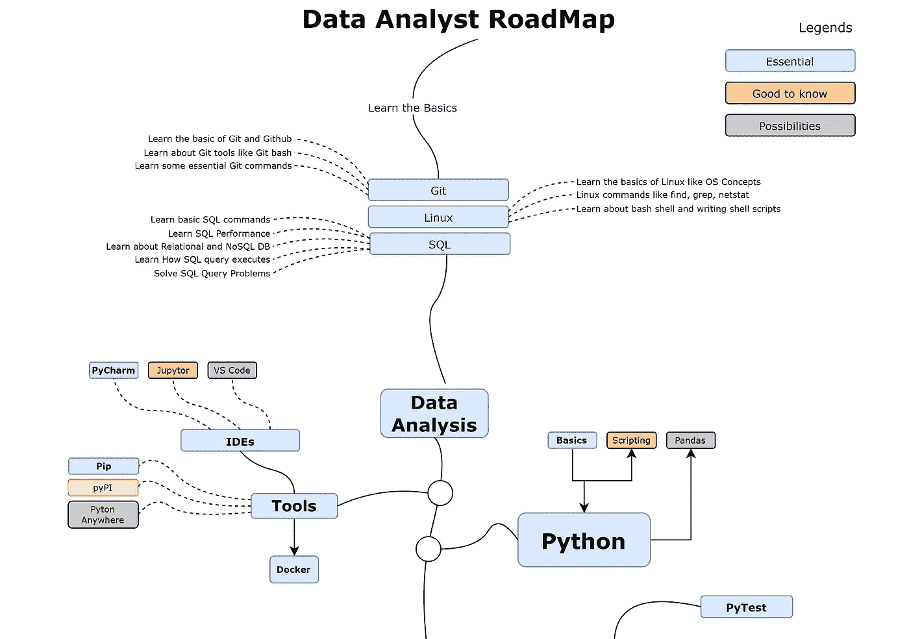
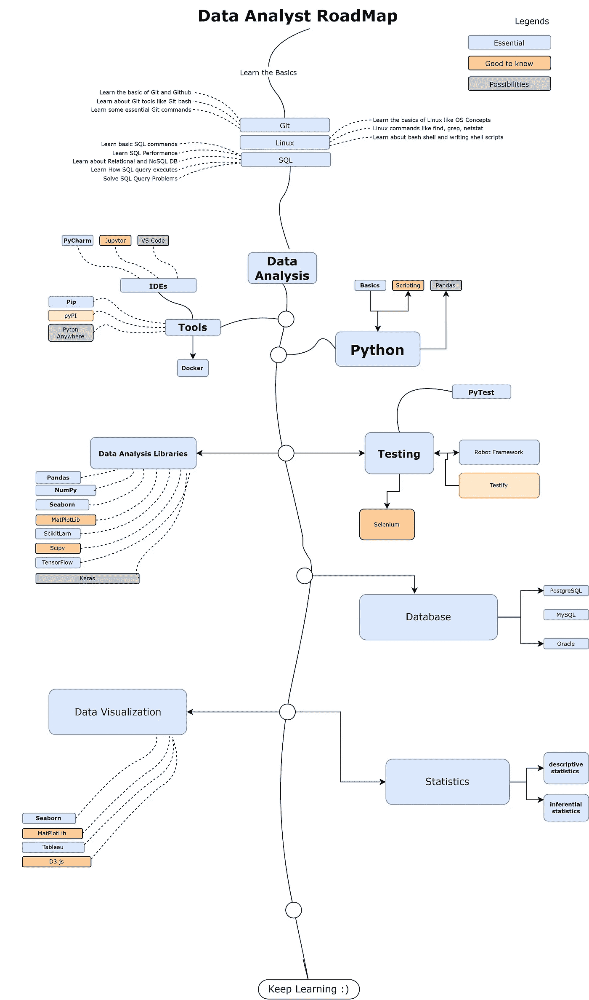
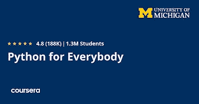
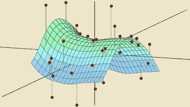

# 2023 年数据分析师路线图

> 原文：<https://medium.com/javarevisited/the-2020-data-analyst-roadmap-9a2d64d3bdfe?source=collection_archive---------0----------------------->

## 2023 年成为数据分析师的完整路线图，包括资源、在线课程、工具和教程的链接。

大家好，如果你想成为一名数据分析师，但不确定你需要哪些技能以及如何获得这些技能，那么你来对地方了。

之前我已经分享了 [Java 开发者路线图](https://javarevisited.blogspot.com/2019/10/the-java-developer-roadmap.html)、 [Python 开发者 RoadMa](https://javarevisited.blogspot.com/2022/05/the-python-developer-roadmap.html) p、 [Web 开发者路线图](https://javarevisited.blogspot.com/2019/02/the-2019-web-developer-roadmap.html)、 [iOS 开发者路线图](https://javarevisited.blogspot.com/2022/05/ios-developer-roadmap.html)和 [DevOps 工程师 RoadMa](https://javarevisited.blogspot.com/2018/09/the-2018-devops-roadmap-your-guide-to-become-DevOps-Engineer.html) p，在这篇文章中，我将分享数据分析师路线图，帮助你在 2023 年成为一名数据分析师。

所有公司都有关于客户的数据，以改善服务，获得有价值的见解，更好地了解客户的行为。这可以通过在贵公司雇佣数据分析师来实现，以利用这种拥抱客户数据的好处。

# 2023 年数据分析师路线图

为了成为一名数据分析师，你需要先学习编程，掌握计算机科学知识，尤其是数据库和 SQL 也有帮助。本文将尝试帮助您理解成为数据分析师的路线图，并向您展示成为数据分析师所需的资源。

下面是 *2023 年数据分析师路线图*，你可以按照这些来学习所有[**必备的数据分析师技能**](https://javarevisited.blogspot.com/2022/05/10-essential-skills-for-data-analyst-in.html) ，成为 2023 年成功的数据分析师。

我已经尽力使这个路线图尽可能简单，并且只有*包括基本技能、工具和框架，但是*如果您有任何其他工具或技能应该在这个数据分析师路线图中，那么请随意提出意见。

现在，让我们深入了解数据分析师路线图中的重要内容，并查看有用的资源来学习它们:

## 1.学习 Python 语言

如果您通过学习 python 语言开始您的数据分析之旅，那将是最好的，因为大多数数据分析师的工作都要求您具备编写 python 代码的技能。

此外，大多数数据分析和可视化包都支持 python 语言。参加 Python 课程的另一个好处是它很容易学习，而且它有一个庞大的社区来为你在职业生涯中可能遇到的任何问题找到解决方案。

由于 python 有一个庞大的社区，所以毫无疑问，互联网上充斥着 YouTube 视频、博客帖子、付费课程等等的 Python 课程。不过，我还是会推荐 Coursera 的这个 python 专门化，你可以在两到三个月内成为 Python 的中级用户:

## **1。** [**Python 为大家上 Coursera**](https://coursera.pxf.io/c/3294490/1164545/14726?u=https%3A%2F%2Fwww.coursera.org%2Fspecializations%2Fpython)

参加由 Coursera 提供的密歇根大学 python 语言课程，你不会后悔开始你的职业生涯。您将首先学习 Python 的基础知识，例如数据结构、变量、循环等等。

然后，您将使用 Python 访问 web，并使用这种语言和更多语言与数据库进行交互。

作为一名数据分析师，掌握这门语言意味着你已经完成了成为数据分析师的漫长旅程，但要成为这个领域的入门级员工，你还需要学习很多东西。

**这里是加入本课程** — [Python 给大家](https://coursera.pxf.io/c/3294490/1164545/14726?u=https%3A%2F%2Fwww.coursera.org%2Fspecializations%2Fpython)

顺便说一句，如果你计划参加多个 Coursera 课程或专业，那么考虑参加 [**Coursera Plus 订阅**](https://coursera.pxf.io/c/3294490/1164545/14726?u=https%3A%2F%2Fwww.coursera.org%2Fcourseraplus) ，它可以让你无限制地访问他们最受欢迎的课程、专业、专业证书和指导项目。

它每月花费大约 59 美元，但很值得，因为你可以访问 7000 多门课程和项目，还可以获得无限的证书。

 [## Coursera Plus |无限制访问 7，000 多门在线课程

### 在 Coursera 上可以无限制地访问 90%以上的课程、项目、专业和专业证书

coursera.pxf.io](https://coursera.pxf.io/c/3294490/1164545/14726?u=https%3A%2F%2Fwww.coursera.org%2Fcourseraplus) 

# 2.学习数据处理和可视化

你可以说，如果你不知道数据可视化或者在这个领域不够好，你就不是数据分析师，因为你的工作涉及分析数据并从这些数据中获得洞察力。

无论如何，你都无法做到这一点，但数据可视化可以获取原始数据，并将其转换成图表，以便更好地理解你的数据。

要成为一名数据分析师，您需要学习很多数据可视化和处理库，每种工具都有其优势，所以尽可能多的了解会更好。以下是其中的几个例子:

**2.1。Numpy:**

您需要从这个旨在处理数组和执行数学计算的库开始您的旅程。它速度快，被数据分析师广泛使用。如果你需要资源，你可以从查看这些 [**最好的 Numpy 课程**](/javarevisited/6-best-online-courses-to-learn-numpy-for-beginners-60120f611e06) 开始。

 [## 2023 年 6 门最佳初学者 NumPy 在线课程

### 我最喜欢学习和掌握的在线课程和教程是 2023 年的 NumPy 库。

medium.com](/javarevisited/6-best-online-courses-to-learn-numpy-for-beginners-60120f611e06) 

**2.2。熊猫:**

如果您想要导入数据或更改其中的某些内容，您可能需要使用旨在分析和清理数据的 pandas。如果你需要资源，你可以从这些 [**最佳熊猫课程**](/javarevisited/5-best-courses-to-learn-pythons-pandas-libary-for-data-analysis-and-data-science-34b62abb0e96) 开始。

 [## 2023 年学习熊猫和 Python 数据分析的 5 门最佳在线课程

### Pandas 是用于数据分析的最强大和最流行的 Python 库之一。它也是最受欢迎的工具之一…

becominghuman.ai](https://becominghuman.ai/5-best-courses-to-learn-pythons-pandas-libary-for-data-analysis-and-data-science-34b62abb0e96) 

**2.3。Matplotlib:**

你可以说 matplotlib 是数据分析师中最著名和最常用的数据可视化库，因为它是开源的，提供了无限的绘图空间，并且如果你没有找到可视化问题的解决方案，它有一个巨大的社区来支持你。如果你需要资源，你可以从这些 [**最好的 Matplotlib 课程**](/javarevisited/5-best-matplotlib-online-courses-for-python-developer-and-data-scientist-9f3bf4359b86) 入手。

 [## Python 开发人员和数据科学家的 5 门最佳 Matplotlib 在线课程

### 2023 年想学 Matplotlib？以下是 2023 年学习 Matplotlib 和增强你的数据的最佳在线课程…

medium.com](/javarevisited/5-best-matplotlib-online-courses-for-python-developer-and-data-scientist-9f3bf4359b86) 

**2.4。Seaborn:**

另一个很棒的数据可视化库，以定制其图形和提供无穷多种图形而闻名，学习起来很简单。如果你需要资源，你可以从这些最好的 Seaborn 课程开始。

 [## 2023 年 10 大最佳机器学习课程和认证

### 如果你今天在技术领域工作，就像你是一名程序员或软件工程师，那么我肯定你听说过…

medium.com](/javarevisited/top-10-machine-learning-and-data-science-certifications-and-training-courses-for-beginners-and-a6308497b764) 

**2.5。画面:**

你可以使用这个软件来可视化你的数据，而不需要学习任何编程语言。只需导入您的数据，开始可视化，并自定义您的绘图。如果你需要资源，你可以从这些 [**最好的 Tableau 课程**](https://javarevisited.blogspot.com/2019/07/top-5-tableau-online-courses-and-certifications-for-data-science-engineers.html) 入手。

# 3.学习统计学

你也可以说，如果你不具备统计技能，你就错过了被这位员工聘用的大好机会。你不能低估学习统计学的力量，因为你要处理大量的数据。

你需要从你的数据中提取更深刻的见解，基于这些数据做出决策，做出预测。

## **3.1。** [**统计学简介**](https://coursera.pxf.io/c/3294490/1164545/14726?u=https%3A%2F%2Fwww.coursera.org%2Flearn%2Fstanford-statistics)

这是斯坦福大学通过 Coursera 平台为初学者提供的学习统计学基础知识的一门很棒的课程。你将了解如何进行探索性数据分析，了解抽样、概率、抽样分布、回归等原理。

**以下是加入本课程** — [统计学简介](https://coursera.pxf.io/c/3294490/1164545/14726?u=https%3A%2F%2Fwww.coursera.org%2Flearn%2Fstanford-statistics)的链接

## 结论

这些都包含在这份 **2023 年数据分析师路线图中。**感谢阅读！这是数据分析师开始时最简单的路线图。还可以学习很多其他用于这个领域的语言，比如 R 语言和很多用于数据可视化的 python 包比如 Plotly&folius。

其他有用的**数据分析和可视化**资源

*   [数据分析师的 8 种最佳数据可视化工具](/javarevisited/8-best-data-visualization-tools-and-libraries-data-analysts-and-scientists-can-learn-d2734371df16)
*   [排名前五的数据科学和机器学习课程](https://hackernoon.com/top-5-data-science-and-machine-learning-course-for-programmers-e724cfb9940a)
*   [面向初学者的 10 门免费数据科学课程](/javarevisited/10-free-data-science-online-courses-for-beginners-a5fe78c2cb7b)
*   [5 门免费课程学习机器学习的 R 编程](http://www.java67.com/2018/09/top-5-free-R-programming-courses-for-Data-Science-Machine-Learning-Programmers.html)
*   [2023 年学习 Python 的 5 门免费课程](http://www.java67.com/2018/02/5-free-python-online-courses-for-beginners.html)
*   [学习 R 编程的 10 门最佳课程](/javarevisited/10-best-r-programming-courses-for-data-science-and-statistics-8f84ebec4974)
*   [7 门最适合初学者的人工智能课程](/javarevisited/7-best-courses-to-learn-artificial-intelligence-in-2020-26d59d62f6fe)
*   [我最喜欢的学习计算机视觉的课程](/javarevisited/5-best-computer-vision-courses-for-beginners-85f901a8f88a)
*   [数据科学初学者的 10 个必备工具](https://javarevisited.blogspot.com/2021/01/10-tools-data-scientists-and-machine-learning-engineers.html#axzz6skoVdG6z)
*   [面向初学者的 10 门免费机器学习课程](/javarevisited/10-free-machine-learning-courses-for-beginners-181f83b4c816)
*   [数据科学五大编程语言](/javarevisited/top-5-programming-language-for-data-science-and-machine-learning-badc2f8eff72)
*   [2023 年加入的 10 个最佳机器学习课程](/javarevisited/top-10-machine-learning-and-data-science-certifications-and-training-courses-for-beginners-and-a6308497b764)

感谢您阅读本文。如果你喜欢这个数据分析师开发者路线图，请在 Twitter 和脸书上与你的朋友分享。

祝您的数据分析之旅一切顺利。

如果您有任何改进 2023 年数据分析路线图的建议，请随时留言。