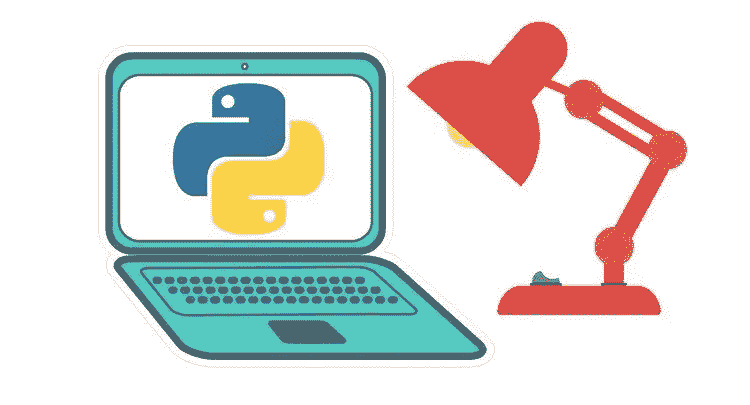
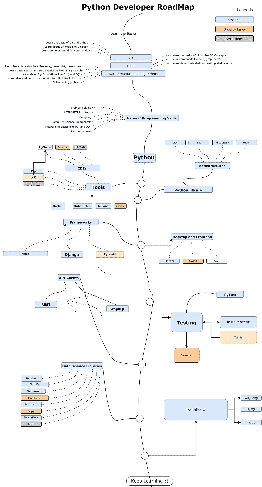
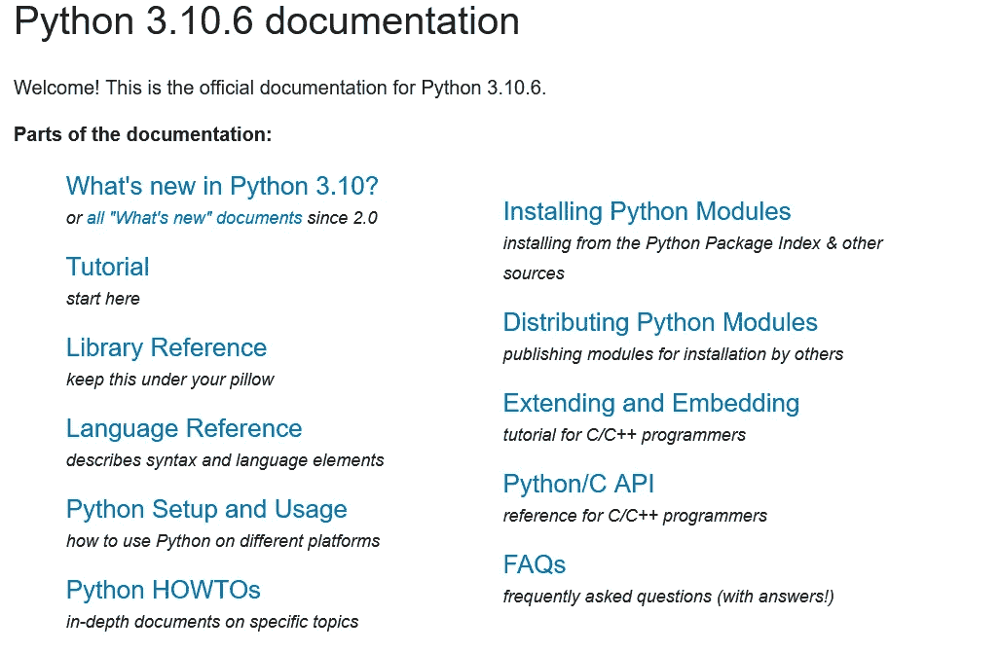
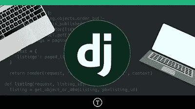
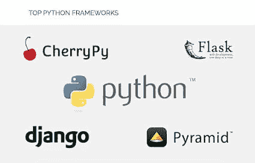
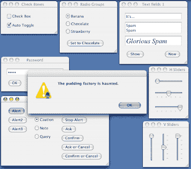
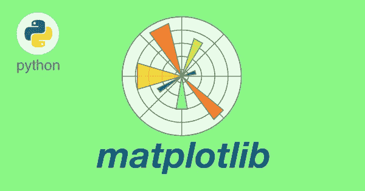

# 2023 年 Python 程序员路线图

> 原文：<https://medium.com/javarevisited/the-2022-python-programmer-roadmap-bafb365071a3?source=collection_archive---------0----------------------->

## 2023 年成为 Python 开发者的图解指南，包含相关课程的链接

image_credit — Eucative.io

你好朋友，如果你想成为一名 Python 开发者，并且正在寻找一份完整的 2023 Python 开发者路线图，那么你来对地方了。在过去，我曾分享过 [**Java 开发者路线图**](/javarevisited/the-java-programmer-roadmap-f9db163ef2c2)[**Web 开发者路线图**](/javarevisited/the-2019-web-developer-roadmap-ab89ac3c380e)[**React 开发者路线图**](/javarevisited/the-2019-react-js-developer-roadmap-9a8e290b8a56)[iOS 开发者路线图](https://javarevisited.blogspot.com/2022/05/ios-developer-roadmap.html)[数据分析师路线图](https://javarevisited.blogspot.com/2022/05/the-complete-data-analyst-roadmap.html)，甚至还有一个 [**DevOps 工程师路线图**](/javarevisited/the-2018-devops-roadmap-31588d8670cb) 在本文中，我将与您分享成为一名 Python 程序员的 *Python 开发者路线图*

在写这篇文章之前，我在网上寻找了各种路线图，其中**列出了成为 Python 开发人员需要学习的很多东西，**实际上并不需要。如果你想成为一名 Python 专家，你可能需要它们，这可能需要几年时间，但是如果你只是开始你的 Python 生涯，你根本不需要它们。

相反，你需要的是学习 Python 编程语言，学习必要的 Python 工具，必要的 Python 框架，这就是我在这篇文章中要和你分享的。

但在此之前，我们先来说说 **Python 编程语言**，软件开发史上最流行的编程语言之一。 [Python](https://www.python.org/) 是开发者中发展最快的编程语言，公司几乎在每个行业都在使用它，比如机器学习和 web 开发。

你可以编写一个简单的 python 脚本来自动化几乎每一个日常任务，这使得它成为最受欢迎的语言，也是最有吸引力的学习语言，所以我已经创建了如果你打算成为一名 [python 开发者](https://www.java67.com/2020/05/top-5-courses-to-learn-python-in-depth.html)你应该做的事情。

顺便说一句，如果你很急，想快速开始你的 python 之旅，那么没有更好的办法了，那就报名参加 Udemy 网站上何塞·波尔蒂利亚的**[**完整 Python 训练营:从零到英雄 3**](https://click.linksynergy.com/fs-bin/click?id=JVFxdTr9V80&subid=0&offerid=323058.1&type=10&tmpid=14538&RD_PARM1=https%3A%2F%2Fwww.udemy.com%2Fcomplete-python-bootcamp%2F) 课程。到目前为止，这个课程已经培养了超过 150 万名 Python 程序员，而且这个数字还在增加。**

****

# **2023 Python 开发者路线图**

**那么，我们还在等什么，让我们从第一件事开始，是的，我说的是学习 Python 编程语言<https://betterprogramming.pub/top-5-courses-to-learn-python-in-2018-best-of-lot-26644a99e7ec>*，然后我们将进入用于 web 开发、数据科学和机器学习的基本 Python 工具、库和 Python 框架。***

***但是，首先让我们看看 t **他的 2023 Python 程序员路线图*****

******

# ***1.学习 Python***

***如你所知，Python 是一种流行语言。因此，许多人创建了在线资源来教授学生这门语言:付费课程、YouTube 频道或免费博客。所有这些资源都是良好的开端。***

***尽管如此，因为您是初学者，您可能会不知从哪里开始这个旅程，因为有这么多的概念和库，您可能会成为一名 python 开发人员，我将为您提供两个资源:***

## ***1.1. [Python 3.10.1 文档](https://docs.python.org/3/)***

***Python 专家编写官方的 python 文档。它遵循一步一步地理解语言。尽管如此，有时因为你是新手，可能很难理解一些概念或论点，特别是如果你喜欢从视频中学习，而不是阅读文章。***

******

## ***1.2.[完成 Python Bootcamp 从零到 Python 中的英雄](https://click.linksynergy.com/fs-bin/click?id=JVFxdTr9V80&subid=0&offerid=323058.1&type=10&tmpid=14538&RD_PARM1=https%3A%2F%2Fwww.udemy.com%2Fcomplete-python-bootcamp%2F)***

***假设你喜欢从视频中学习 python，有一些钱投资自己。在这种情况下，我建议看看 Udemy 上的 Python 课程 中的这个 [*完整的 Python 训练营，它将教会你几乎所有你需要知道的东西，让你的职业生涯更上一层楼，并开始用这种语言构建一些有用的东西。*](https://click.linksynergy.com/fs-bin/click?id=JVFxdTr9V80&subid=0&offerid=323058.1&type=10&tmpid=14538&RD_PARM1=https%3A%2F%2Fwww.udemy.com%2Fcomplete-python-bootcamp%2F)***

******

***首先，在你的电脑上安装 [Python](https://www.python.org/) 解释器，并安装 IDE(集成开发环境)如 [Jupyter Notebook](https://jupyter.org/) 或 [PyCharm](https://www.jetbrains.com/pycharm/) 然后你就可以开始学习这些初级课程如 Python 数据类型、代码指导、接受用户输入、if 语句、& while 循环、函数、列表、字典、元组、集合、布尔、Lambda 函数、数组。***

***这些是 python 语言的基础，但是稍后，你还需要学习 OOP ( [面向对象编程](/swlh/5-free-object-oriented-programming-online-courses-for-programmers-156afd0a3a73))，它由类、构造函数、getter & setter、模块、继承、静态方法、iterable、class 方法和多重继承组成。***

***但是如果你对这[两个 Python 资源](https://javarevisited.blogspot.com/2019/09/5-websites-to-learn-python-for-free.html)不满意，想从 YouTube 视频或博客帖子中学习，并按照主题进行，我会指导你如何实现。我也分享过我[喜欢的 Python 课程](https://betterprogramming.pub/top-5-courses-to-learn-python-in-2018-best-of-lot-26644a99e7ec?gi=447a67345e8f)、[书籍](/javarevisited/my-favorite-books-to-learn-python-in-depth-77465633b46e)、[项目](/javarevisited/8-projects-you-can-buil-to-learn-python-in-2020-251dd5350d56)和[网站](/javarevisited/10-free-python-tutorials-and-courses-from-google-microsoft-and-coursera-for-beginners-96b9ad20b4e6)在线学习 Python。***

***<https://www.java67.com/2020/05/top-5-courses-to-learn-python-in-depth.html>  

# 2.框架和库

一旦你完成了所有这些主题并进行足够的练习，那么你现在就可以使用这种语言来构建一些东西了。python 是一种开源语言，这意味着人们不断合作，以使其在各个行业中更容易使用，因此他们创建了许多包和库来构建您的项目，而不是使用原生 Python 语言编写整个代码。

## 2.1.Web 开发

如果你想成为一名[的 web 开发人员](https://javarevisited.blogspot.com/2018/02/top-5-online-courses-to-learn-web-development.html)，那么选择 python 是创建 web 应用程序的最佳选择之一，因为它在公司之间被大量使用，并且有两个最常用的框架需要学习:

**2.1.1。** [**姜戈**](https://www.djangoproject.com/) **:**

Django 是一个 python 库的集合，允许您构建 web 应用程序，用于前端和后端，被认为是一个高级 web 框架。Django 可以与许多数据库系统集成，如 [PostgreSQL](https://javarevisited.blogspot.com/2020/02/top-5-courses-to-learn-postgresql-in.html) 、 [MySQL](https://javarevisited.blogspot.com/2018/05/top-5-mysql-courses-to-learn-online.html) 、SQLite 和 [Oracle](https://javarevisited.blogspot.com/2021/05/top-5-oracle-database-and-plsql-online-courses.html) 。

如果你想学习 Django，那么我强烈推荐你加入 Udemy 上 Brad Traversy 的**[**Python Django Dev To Deployment**](https://click.linksynergy.com/deeplink?id=JVFxdTr9V80&mid=39197&murl=https%3A%2F%2Fwww.udemy.com%2Fcourse%2Fpython-django-dev-to-deployment%2F)课程。边做边学 Django 是一门很棒的课程。**

****

**如果你正在寻找免费的替代品，那么你也可以查看这些为初学者提供的免费 Django 课程。***** 

## *****2.1.2.烧瓶:*****

*****Flask 是一个后端 python 框架，也大量用于开发 web 应用程序，比 [Django](https://www.java67.com/2020/06/top-5-courses-to-learn-django-and-python-for-web-development.html) 更容易学习，但不如前一个强大和广泛，它用于简单和轻量级的 web 应用程序。*****

**********

## *****2.2.桌面应用程序*****

*****此外，有许多用于开发桌面应用程序的 python 库，但我将只推荐两个流行的框架:*****

*******2.2.1。Tkinter:** 唯一一个默认集成在 python 语言中的 GUI 库，如果你想开始构建可以在许多 OS 系统上运行的桌面应用程序，它有很多文档和教程。*****

*******2.2.2。PyQT:** 是免费软件，也用于开发比 [Tkinter](/javarevisited/6-best-courses-to-learn-tkinter-and-pyqt-for-gui-development-in-python-664976674114) 更好的 UI，并且可以通过结合 Python 和 QT 库为你的桌面应用程序添加更多的功能。*****

**********

## *****2.3.数据可视化*****

*****数据可视化是将数据转换成有意义的图表，以便更好地理解问题，并在数据科学家和分析师中大量使用。*****

*******2.3.1。Matplotlib*******

*****MatplotLib 是一个著名的库，可以用 2D 进行数据可视化，甚至只用几个简单的命令就可以进行 3D 可视化，这使它成为数据科学家、数据分析师和机器学习工程师最喜欢的库。*****

*****如果你想从事人工智能、数据科学、可视化和机器学习方面的工作，这是 Python 开发人员的基本库之一，如果你想在 2023 年学习这方面的课程，没有比 Udemy 上的 [**数据可视化、Matplotlib 和 Python**](https://click.linksynergy.com/deeplink?id=JVFxdTr9V80&mid=39197&murl=https%3A%2F%2Fwww.udemy.com%2Fcourse%2Fcomplete-course-on-data-visualization-matplotlib-and-python%2F) 完整课程更好的课程了。它是全面的，最新的，而且非常实惠。*****

**********

*******2.3.2。海博恩*******

*****这是另一个伟大的 Python 库，它建立在 [matplotlib 库](https://javarevisited.blogspot.com/2022/03/top-5-courses-to-learn-matplotlib-for.html)之上，但它在数据可视化方面提供了更多可定制的选项，并在统计绘图中大量使用，并有效地处理 pandas 数据帧。*****

*****如果你想深入学习 Seaborn，那么我推荐你参加 Udemy 上的[**Python for Data Science and Machine Learning boot camp**](https://click.linksynergy.com/deeplink?id=JVFxdTr9V80&mid=39197&murl=https%3A%2F%2Fwww.udemy.com%2Fcourse%2Fpython-for-data-science-and-machine-learning-bootcamp%2F)**课程，你不仅可以学习 Seaborn，还可以在一门课程中学习下面提到的大部分 Python 库。*******

**************

## *******结论*******

*******这就是关于 **2023 Python 开发者路线图**的全部内容。我创建了这个路线图，让那些想学习 Python，并以 Web 开发、数据科学或机器学习方面的 Python 开发人员开始职业生涯的初学者牢记在心。*******

*****与 python 语言相比，这个框架和库列表算不了什么。尽管如此，我还是推荐了最常用的语言，以便开始构建一些有用的东西，并记住在学习这种神话般的语言时要有耐心。*****

*****这并不是你在互联网上能找到的最全面的 Python 路线图，但目标是关注每个 Python 开发者都应该学习的最重要的 Python 技能。*****

*****其他有用的 **Python 编程和软件开发**资源*****

*   *****[排名前五的数据科学和机器学习课程](https://hackernoon.com/top-5-data-science-and-machine-learning-course-for-programmers-e724cfb9940a)*****
*   *****[前 5 名张量流和机器学习课程](https://hackernoon.com/top-5-tensorflow-and-ml-courses-for-programmers-8b30111cad2c)*****
*   *****[面向初学者的 10 门免费数据科学课程](/javarevisited/10-free-data-science-online-courses-for-beginners-a5fe78c2cb7b)*****
*   *****[7 门最适合初学者的人工智能课程](/javarevisited/7-best-courses-to-learn-artificial-intelligence-in-2020-26d59d62f6fe)*****
*   *****[我最喜欢的学习计算机视觉的课程](/javarevisited/5-best-computer-vision-courses-for-beginners-85f901a8f88a)*****
*   *****[数据科学初学者的 10 个必备工具](https://javarevisited.blogspot.com/2021/01/10-tools-data-scientists-and-machine-learning-engineers.html#axzz6skoVdG6z)*****
*   *****[10 门面向初学者的免费机器学习课程](/javarevisited/10-free-machine-learning-courses-for-beginners-181f83b4c816)*****
*   *****[5 门免费课程学习机器学习的 R 编程](http://www.java67.com/2018/09/top-5-free-R-programming-courses-for-Data-Science-Machine-Learning-Programmers.html)*****
*   *****[2021 年学习 Python 的 5 门免费课程](http://www.java67.com/2018/02/5-free-python-online-courses-for-beginners.html)*****
*   *****[学习 R 编程的 10 门最佳课程](/javarevisited/10-best-r-programming-courses-for-data-science-and-statistics-8f84ebec4974)*****
*   *****[数据科学五大编程语言](/javarevisited/top-5-programming-language-for-data-science-and-machine-learning-badc2f8eff72)*****
*   *****[2023 年加入的 10 门最佳机器学习课程](/javarevisited/top-10-machine-learning-and-data-science-certifications-and-training-courses-for-beginners-and-a6308497b764)*****

*****感谢您阅读本文。如果你喜欢这个 Python 开发者路线图，那么请在 Twitter 和脸书上与你的朋友分享。*****

*****祝您的 Python 之旅一切顺利。*****

*****如果您有任何改进 Python 开发人员路线图的建议，请不吝赐教。*****

*******附言——**如果你是从零开始，并且正在寻找一门从零开始学习 Python 的课程，那么我强烈推荐你参加由 Angela Yu 主持的[**100 天的代码:2023 年完整的 Python Pro Bootcamp**](https://click.linksynergy.com/deeplink?id=JVFxdTr9V80&mid=39197&murl=https%3A%2F%2Fwww.udemy.com%2Fcourse%2F100-days-of-code%2F)，她是前 boot camp 讲师，现在是一位受欢迎的 Udemy 讲师。这是一门非常棒的基于动手项目的课程，从零开始学习 Python。*****

*****</javarevisited/7-best-python-online-courses-for-beginners-to-learn-programming-abe12cecb1ad> *****