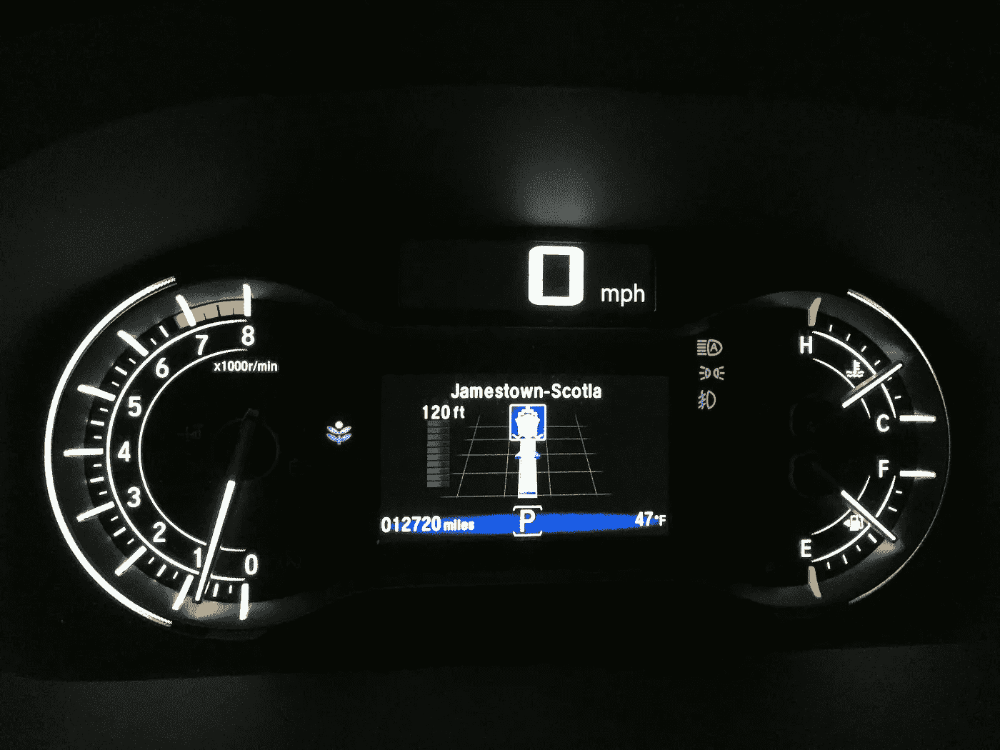
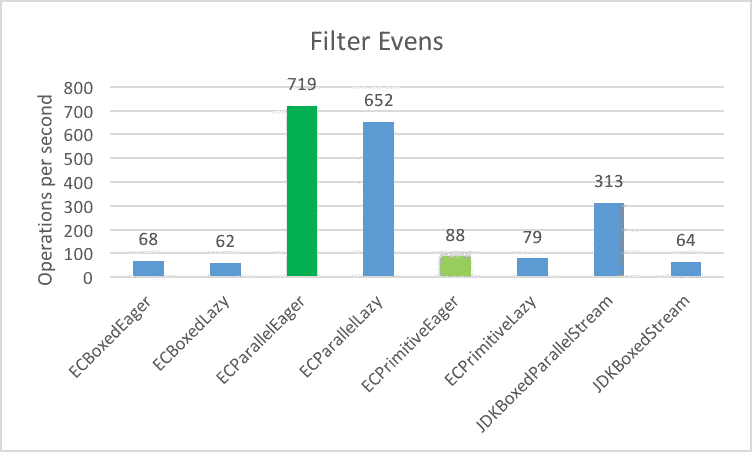
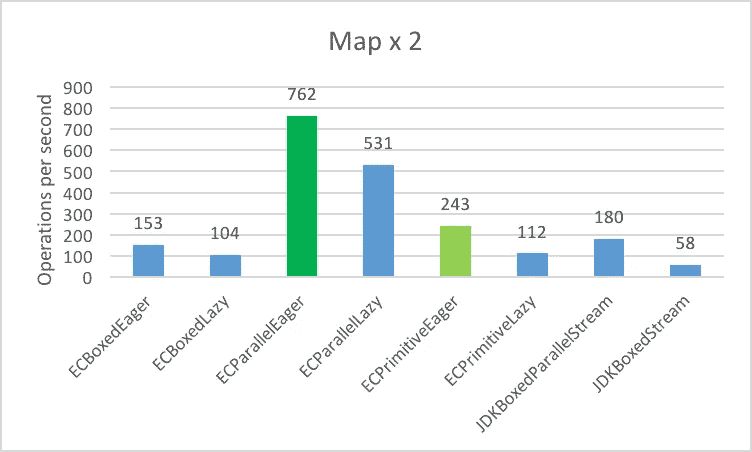
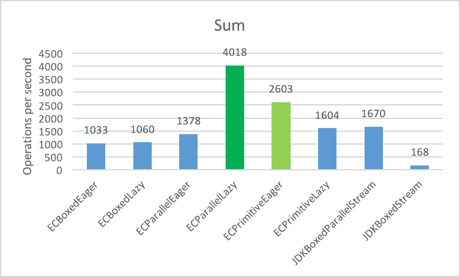
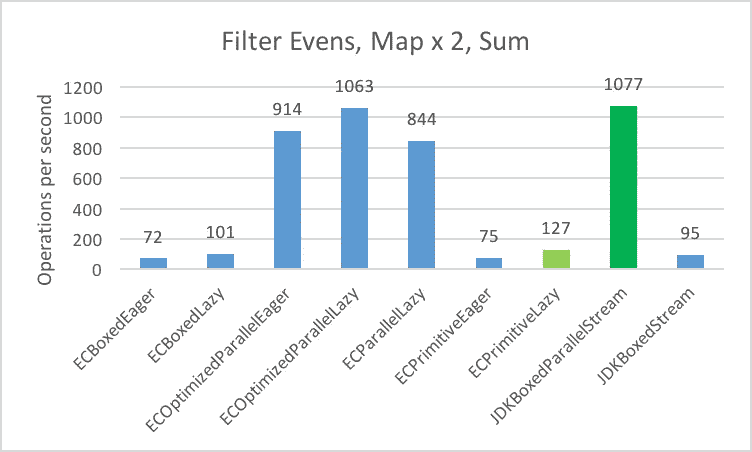

# 凌晨 4 点詹姆斯敦-苏格兰渡轮和其他优化策略

> 原文：<https://medium.com/javarevisited/the-4am-jamestown-scotland-ferry-and-other-optimization-strategies-66365ac415ef?source=collection_archive---------1----------------------->

当性能很重要时，了解您的可用选项也很重要。



捷径有时候不是。

新年快乐

我想我会从 2017 年的性能优化故事开始 2018 年。

## 这篇博客的要点

*   Java 迭代模式优化策略
*   一些 [Eclipse 集合](http://www.eclipse.org/collections/)和 Java 流迭代模式选项。
*   最后的建议

## 一条曲折的捷径

2017 年 1 月 2 日，凌晨 3:30，我和家人坐在码头上的本田 Pilot 里，等了半个小时，等待凌晨 4 点[詹姆斯敦-苏格兰轮渡](http://www.virginiadot.org/travel/ferry-jamestown.asp)的到来。我在一条捷径上走到了路的尽头，这条捷径并不完全符合我的预期。我决定通过汽车导航系统选择一条较短的路线，以避免在 95 号州际公路上向北行驶，然后向南行驶到达弗吉尼亚州的威廉斯堡。以前有几次，我从佛罗里达回来，深夜乘车在弗吉尼亚 95 号公路上遇到大排长龙的交通堵塞。当我们到达较短路线的尽头时，导航系统显示下一个转弯是登上渡轮(见上图)。

我愿意走慢一点的当地道路，特别是因为那是在清晨，路上没有车辆。我们发现太晚了，我们选择的道路包括乘坐渡轮。此时，我们只有两个选择。我们可以等渡船，希望它能开着，或者掉头，给我们的旅程增加 3 到 4 个小时。经典的[霍布森的选择](https://en.wikipedia.org/wiki/Hobson%27s_choice)。我们等待渡船。当我们把车停在渡船上时，这变成了一次有趣的经历，但我更喜欢在开了 14 个小时的车后的凌晨 4 点换一个地方。

## “树林里分出两条路……”——罗伯特·弗罗斯特

我当然选择了人迹较少的一条。我确实学到了一条以前不知道的从奥兰多到威廉斯堡的新路线，以及通过轮渡时间表优化这条路线所需的规划。

您可能会问，这次旅行与 Eclipse 集合有什么关系？好吧，我选择的路径是 ***串行*** (一条车道殖民时代的道路) ***懒惰*** (渡船一直工作到你到达码头)，以及*(你的车实际上被其他车堵在了渡船上)——这只是你可以使用 Eclipse 集合和 Java 流选择的许多选项之一。*

## *“过早优化是万恶之源”——唐纳德·克努特*

*编写代码时，可读性应该优先于性能。然而，在你发现最后一分钟你唯一的选择是停下来等待下一班渡轮之前，知道你可用的性能优化选项是什么是有帮助的。实际上，您可以在不牺牲可读性的情况下获得更好的性能。事实上，可能有一些您以前不知道的选项可以同时提高可读性和性能。*

*有一套迭代模式优化策略，我相信所有开发人员都应该知道，这样他们就可以适当地调整他们的代码以获得最佳性能。*

*优化代码的时候不要乱猜。首先证明你有一个需要解决的问题。然后对你认为可能有助于证明它们确实有效的任何解决方案进行基准测试。*

***旅行者请注意:**您可能会浪费很多时间来衡量性能优化的好处。我在下面运行的测试每次需要 45-50 分钟。我不得不将它们和单元测试一起运行几次，以验证所有类似测试的结果是相同的。当您看到这些图表时，您可能会首先被这些图表所驱使，想要更改您的代码以使其更加“优化”。就应用程序的整体性能而言,“最优”可能并不等同于明显更快。这些测试中的每一个最多需要数百毫秒来运行。都是“快”，因为都在内存里。最佳解决方案可能只能通过大量执行来累积节省。如果你碰巧看到了一个你不知道的可读性更强的解决方案，那就去找吧。*

## *迭代模式优化策略*

*您知道如何单独或共同利用所有这些策略来提高性能而不牺牲可读性吗？*

*   ***急切** —立即执行，针对每个算法和数据结构进行潜在的优化。Eager 算法就像你将得到的手工编码的 for 循环一样，所以它们很容易理解和调试。*我更喜欢将 eager 作为迭代集合的默认选项。这是最简单的，通常也是最简洁易读的解决方案。我认为每一个其他的解决方案都是潜在的优化，可能是不成熟的。**
*   *如果你能避免装箱原语，你就能减少内存开销并潜在地提高性能。我总是尽可能使用原始集合和算法。*
*   ***惰性** —仅在调用终端操作时执行。优化包括减少执行多个操作时所需的内存量和总计算量。延迟运行时，短路效果确实有助于提高性能。*当我执行多个操作时，我更喜欢懒惰，因为这会导致创建临时集合。**
*   ***并行** —并行运行成本更高。您需要合适的数据大小、算法和多核。如果你有所有这些，你可能会受益于并行运行。*量一量，以证之。**

## *渴望与懒惰——了解他们如何工作*

*让我们取一个包含五个整数的列表，急切地和懒洋洋地执行一组过滤、映射和归约操作。*

```
*@Test
public void eagerVsLazy()
{
    long eagerSum = Lists.mutable.with(1, 2, 3, 4, 5)
            .tap(i -> System.out.println("eager select: " + i))
            .select(i -> i % 2 == 0)
            .tap(i -> System.out.println("eager collect: " + i))
            .collectInt(i -> i * 2)
            .tap(i -> System.out.println("eager sum: " + i))
            .sum();
    System.out.println(eagerSum);

    long lazySum = Lists.mutable.with(1, 2, 3, 4, 5)
            .asLazy()
            .tap(i -> System.out.println("lazy select: " + i))
            .select(i -> i % 2 == 0)
            .tap(i -> System.out.println("lazy collect: " + i))
            .collectInt(i -> i * 2)
            .tap(i -> System.out.println("lazy sum: " + i))
            .sum();
    System.out.println(lazySum);

    Assert.assertEquals(eagerSum, lazySum);
}*
```

*除了懒惰示例中对`asLazy`的额外调用，代码看起来应该是相同的。打印结果如下:*

```
*eager select: 1
eager select: 2
eager select: 3
eager select: 4
eager select: 5
eager collect: 2
eager collect: 4
eager sum: 4
eager sum: 8
12lazy select: 1
lazy select: 2
lazy collect: 2
lazy sum: 4
lazy select: 3
lazy select: 4
lazy collect: 4
lazy sum: 8
lazy select: 5
12*
```

*注意在惰性情况下 lambdas 的执行顺序是如何变化的。在急切的情况下，在执行过程中会创建两个额外的列表作为中间结果。在最后一次调用 sum 之前，创建一个带有两个整数(2，4)的`Integer`的`List`和一个带有两个整数(4，8)的`IntList`。在惰性情况下，没有创建中间集合。这导致产生更少的垃圾。这就是当涉及多个操作时，我更喜欢延迟执行的原因。如果只涉及一个操作，那么我会默认使用 eager 解决方案。*

*如果我们看一下串行流解决方案，它的执行顺序将与惰性 Eclipse 集合解决方案相同。*

```
*@Test
public void stream()
{
    int streamSum = Lists.mutable.with(1, 2, 3, 4, 5)
            .stream()
            .peek(i -> System.out.println("stream filter: "+ i))
            .filter(i -> i % 2 == 0)
            .peek(i -> System.out.println("stream map: "+ i))
            .mapToInt(i -> i * 2)
            .peek(i -> System.out.println("stream sum: "+ i))
            .sum();
    System.out.println(streamSum);
}*
```

*以下是输出:*

```
*stream filter: 1
stream filter: 2
stream map: 2
stream sum: 4
stream filter: 3
stream filter: 4
stream map: 4
stream sum: 8
stream filter: 5
12*
```

***懒惰+平行=更难跟上***

*使用批量大小为 1 的 Eclipse 集合`asParallel`，这样我们可以看到一个非常小的列表的结果。*

```
*@Test
public void parallel()
{
    long parallelSum = Lists.mutable.with(1, 2, 3, 4, 5)
            .asParallel(Executors.newWorkStealingPool(), 1)
            .select(i -> {
                System.out.println("parallel select: " + i);
                return i % 2 == 0;
            })
            .collect(i -> {
                System.out.println("parallel collect: " + i);
                return i * 2;
            })
            .sumOfInt(i -> {
                System.out.println("parallel sum: " + i);
                return i;
            });
    System.out.println(parallelSum);
}*
```

```
***Run 1:** parallel select: 2
parallel select: 1
parallel select: 4
parallel collect: 4
parallel select: 3
sum: 8
parallel select: 5
parallel collect: 2
sum: 4
12**Run 2:** parallel select: 1
parallel select: 3
parallel select: 2
parallel select: 5
parallel select: 4
parallel collect: 2
parallel collect: 4
parallel sum: 4
parallel sum: 8
12**Run 3:** parallel select: 4
parallel select: 2
parallel collect: 2
parallel select: 5
parallel select: 3
parallel select: 1
parallel sum: 4
parallel collect: 4
parallel sum: 8
12*
```

*结果在运行之间是一致的，但是 lambdas 的执行顺序不能保证也不一致。*

*使用`parallelStream`:*

```
*@Test
public void parallelStream()
{
    int streamSum = Interval.oneTo(5).toList()
            .parallelStream()
            .peek(i -> System.out.println("stream filter: "+ i))
            .filter(i -> i % 2 == 0)
            .peek(i -> System.out.println("stream map: "+ i))
            .mapToInt(i -> i * 2)
            .peek(i -> System.out.println("stream sum: "+ i))
            .sum();
    System.out.println(streamSum);
}*
```

```
***Run 1:** stream filter: 4
stream filter: 1
stream map: 4
stream filter: 2
stream sum: 8
stream filter: 3
stream filter: 5
stream map: 2
stream sum: 4
12**Run 2:** stream filter: 5
stream filter: 1
stream filter: 3
stream filter: 2
stream filter: 4
stream map: 2
stream map: 4
stream sum: 4
stream sum: 8
12**Run 3:** stream filter: 2
stream filter: 4
stream map: 2
stream map: 4
stream sum: 8
stream filter: 1
stream filter: 3
stream filter: 5
stream sum: 4
12*
```

## *测量、执行和重复。*

*我将使用存储在列表中的一百万个随机生成的整数，展示一组用例的不同选项及其性能特征。这些不太可能是您在生产代码中遇到的用例，但是它们应该有希望说明一些选项，下次您发现基本 Java 数据结构和算法中的瓶颈时，您可能没有意识到这些选项。我将通过四个不同的用例，演示使用对象和原语列表、急切和懒惰 API、串行和并行执行之间的性能差异。*

*在每个用例中，我都分享我观察到的东西——预期的和意外的。我只是观察。我没有深究为什么结果会是这样。“为什么”也许是另一个博客的主题。*

## *用例—过滤、映射、归约和过滤/映射/归约*

```
*1\. Filter even integers into a List
2\. Multiply the integers by 2 and storing the result in a List
3\. Sum all the integers into a long
4\. Filter/Map/Reduce (Filter Evens, Multiply x 2, Sum into long)*
```

## *数据——100 万个整数*

```
*private List<Integer> jdkList;
private MutableList<Integer> ecList;
private IntList ecPrimitiveList;
private ExecutorService executorService;

@Setup
public void setup()
{
    PrimitiveIterator.OfInt intGenerator = 
        new Random(1L).ints(-1000, 1000).iterator();
    this.ecList = 
        FastList.newWithNValues(1_000_000, intGenerator::nextInt);
    this.jdkList = new ArrayList<>(1_000_000);
    this.jdkList.addAll(this.ecList);
    this.ecPrimitiveList = 
        this.ecList.collectInt(i -> i, new IntArrayList(1_000_000));
    this.executorService = Executors.newWorkStealingPool();
}*
```

## *五金器具*

*我将使用具有以下硬件规格的 Mac Pro 来测量基准:*

```
*Processor Name: 12-Core Intel Xeon E5
Processor Speed: 2.7 GHz
Number of Processors: 1
Total Number of Cores: 12
L2 Cache (per Core): 256 KB
L3 Cache: 30 MB
Memory: 64 GB*
```

## *软件*

*为了说明这些特定用例可用的不同选项，我将使用带有 [Eclipse 集合](https://github.com/eclipse/eclipse-collections)和流的 JDK 1.8.0_152。*

## *标杆管理*

*我使用 [JMH](http://openjdk.java.net/projects/code-tools/jmh/) 版本 1.19 作为我测试的基准工具。我正在运行 30 次预热迭代，以及 20 次使用 2 个分叉的测量迭代。我在用 Mode。测试的吞吐量，以便于阅读。这些数字是以每秒操作数为单位的。*数字越大，结果越好。**

```
*public static void main(String[] args) throws RunnerException
{
    Options options = new OptionsBuilder()
        .include(".*" + IntListJMHTest.class.getSimpleName() + ".*")
            .forks(2)
            .mode(Mode.Throughput)
            .timeUnit(TimeUnit.SECONDS)
            .warmupIterations(30)
            .build();
    new Runner(options).run();
}*
```

*我将在 ***暗绿色*** 中突出显示跑步中的最佳总体成绩。我将在 ***中高亮显示浅绿色*** 的最佳串行执行结果。当我在图表的标签中使用 EC 时，它代表使用 Eclipse 集合的解决方案。在我使用 JDK 的地方，解决方案使用标准的 JDK 方法。*

## *过滤偶数整数*

**

*从 1，000，000 个整数列表中筛选偶数*

**预期:**

*   *我期望 ECParallelEager 表现得更好。*
*   *我期望原始集合的表现优于盒装集合。*
*   *我期望连环渴望胜过连环懒惰。*

**意外:**

*   *我没想到并行流会表现得如此糟糕。*

```
*@Benchmark
public MutableList<Integer> filterECBoxedEager()
{
    return this.ecList.select(i -> i % 2 == 0);
}

@Benchmark
public MutableList<Integer> filterECBoxedLazy()
{
    return this.ecList
            .asLazy()
            .select(i -> i % 2 == 0)
            .toList();
}

@Benchmark
public MutableList<Integer> filterECParallelEager()
{
    return ParallelIterate.select(
            this.ecList,
            i -> i % 2 == 0,
            new CompositeFastList<>(),
            false);
}

@Benchmark
public MutableList<Integer> filterECParallelLazy()
{
    return this.ecList
            .asParallel(this.executorService, 50_000)
            .select(i -> i % 2 == 0)
            .toList();
}

@Benchmark
public IntList filterECPrimitiveEager()
{
    return this.ecPrimitiveList.select(i -> i % 2 == 0);
}

@Benchmark
public IntList filterECPrimitiveLazy()
{
    return this.ecPrimitiveList
            .asLazy()
            .select(i -> i % 2 == 0)
            .toList();
}

@Benchmark
public List<Integer> filterJDKBoxedParallelStream()
{
    return this.jdkList
            .parallelStream()
            .filter(i -> i % 2 == 0)
            .collect(Collectors.toList());
}

@Benchmark
public List<Integer> filterJDKBoxedStream()
{
    return this.jdkList
            .stream()
            .filter(i -> i % 2 == 0)
            .collect(Collectors.toList());
}*
```

## *映射每个整数 x 2*

**

*将 1，000，000 个整数列表中的每个整数乘以 2*

**预期:**

*   *我期望原始集合的表现优于盒装集合。*
*   *我期望连环渴望胜过连环懒惰。*

**意想不到:**

*   *没想到 ECParallelLazy 表现这么差。*
*   *我没想到这两种流解决方案的表现如此之差。*

```
*@Benchmark
public MutableList<Integer> mapECBoxedEager()
{
    return this.ecList.collect(i -> i * 2);
}

@Benchmark
public MutableList<Integer> mapECBoxedLazy()
{
    return this.ecList
            .asLazy()
            .collect(i -> i * 2)
            .toList();
}

@Benchmark
public MutableList<Integer> mapECParallelEager()
{
    return ParallelIterate.collect(
            this.ecList, i -> i * 2,
            new CompositeFastList<>(),
            false);
}

@Benchmark
public MutableList<Integer> mapECParallelLazy()
{
    return this.ecList
            .asParallel(this.executorService, 50_000)
            .collect(i -> i * 2)
            .toList();
}

@Benchmark
public IntList mapECPrimitiveEager()
{
    return this.ecPrimitiveList
            .collectInt(i -> i * 2, IntLists.mutable.empty());
}

@Benchmark
public IntList mapECPrimitiveLazy()
{
    return this.ecPrimitiveList
            .asLazy()
            .collectInt(i -> i * 2)
            .toList();
}

@Benchmark
public List<Integer> mapJDKBoxedParallelStream()
{
    return this.jdkList
            .parallelStream()
            .mapToInt(i -> i * 2)
            .boxed()
            .collect(Collectors.toList());
}

@Benchmark
public List<Integer> mapJDKBoxedStream()
{
    return this.jdkList
            .stream()
            .mapToInt(i -> i * 2)
            .boxed()
            .collect(Collectors.toList());
}*
```

## *对所有整数求和*

**

*对 1，000，000 个整数求和*

**预期:**

*   *我期望原始集合的表现优于盒装集合。*
*   *我认为并行化不会带来什么好处。对整数求和是一种非常快速的运算。我期望 eager primitive 比大多数并行选项更快。*

**意料之外:**

*   *我没想到串行流会被压碎。Java 9 中似乎有所改进。我用 Java 9 再次运行了基准测试，这个特定的基准测试提高了大约 7-8 倍。*

```
*@Benchmark
public long sumECBoxedEager()
{
    return this.ecList.sumOfInt(Integer::intValue);
}

@Benchmark
public long sumECBoxedLazy()
{
    return this.ecList
            .asLazy()
            .sumOfInt(Integer::intValue);
}

@Benchmark
public long sumECParallelEager()
{
    return ParallelIterate.sumByInt(
            this.ecList,
            i -> Integer.valueOf(0),
            Integer::intValue).get(0);
}

@Benchmark
public long sumECParallelLazy()
{
    return this.ecList
            .asParallel(this.executorService, 50_000)
            .sumOfInt(Integer::intValue);
}

@Benchmark
public long sumECPrimitiveEager()
{
    return this.ecPrimitiveList.sum();
}

@Benchmark
public long sumECPrimitiveLazy()
{
    return this.ecPrimitiveList
            .asLazy()
            .sum();
}

@Benchmark
public long sumJDKBoxedParallelStream()
{
    return this.jdkList
            .parallelStream()
            .mapToLong(Integer::longValue)
            .sum();
}

@Benchmark
public long sumJDKBoxedStream()
{
    return this.jdkList
            .stream()
            .mapToLong(Integer::longValue)
            .sum();
}*
```

## *过滤器、地图、总和*

**

*过滤偶数整数，乘以剩余的 x 2 并返回它们的和*

**预期:**

*   *我期望懒惰的操作胜过渴望的操作。*
*   *我期望原始懒惰会胜过所有其他串行操作。*
*   *我期望 JDKBoxedParallelStream 在这个用例中表现良好。*

**意料之外:**

*   *我并不期望 ECParallelEager 做得和 ECParallelLazy 一样好或者更好，尽管它已经过优化。*
*   *没想到 JDKBoxedParallelStream 比 ECParallelLazy 做得更好。*

```
*@Benchmark
public long filterMapSumECBoxedEager()
{
    return this.ecList
            .select(i -> i % 2 == 0)
            .sumOfInt(i -> i * 2);
}

@Benchmark
public long filterMapSumECBoxedLazy()
{
    return this.ecList
            .asLazy()
            .select(i -> i % 2 == 0)
            .sumOfInt(i -> i * 2);
}

@Benchmark
public long filterMapSumECOptimizedParallelEager()
{
    return ParallelIterate.sumByInt(
            this.ecList,
            i -> i % 2,
            i -> i * 2).get(0);
}

@Benchmark
public long filterMapSumECOptimizedParallelLazy()
{
    return this.ecList
            .asParallel(this.executorService, 50_000)
            .sumOfInt(i -> i % 2 == 0 ? i * 2 : 0);
}

@Benchmark
public long filterMapSumECParallelLazy()
{
    return this.ecList
            .asParallel(this.executorService, 50_000)
            .select(i -> i % 2 == 0)
            .sumOfInt(i -> i * 2);
}

@Benchmark
public long filterMapSumECPrimitiveEager()
{
    return this.ecPrimitiveList
            .select(i -> i % 2 == 0)
            .collectInt(i -> i * 2, IntLists.mutable.empty())
            .sum();
}

@Benchmark
public long filterMapSumECPrimitiveLazy()
{
    return this.ecPrimitiveList
            .asLazy()
            .select(i -> i % 2 == 0)
            .collectInt(i -> i * 2)
            .sum();
}

@Benchmark
public long filterMapSumJDKBoxedParallelStream()
{
    return this.jdkList
            .parallelStream()
            .filter(i -> i % 2 == 0)
            .mapToLong(i -> (long) (i * 2))
            .sum();
}

@Benchmark
public long filterMapSumJDKBoxedStream()
{
    return this.jdkList
            .stream()
            .filter(i -> i % 2 == 0)
            .mapToLong(i -> (long) (i * 2))
            .sum();
}*
```

## *恭喜你！*

*我希望您喜欢这个博客，并且学到了一些关于使用 Eclipse 集合和 Java 流的迭代模式选项和优化策略的新东西。如果你唯一的工具是一把锤子，其他的都是钉子。在开始您的旅程之前了解您的可用选项，并根据需要进行调整，这是编写更好、响应更快的应用程序的关键之一。这也可以帮助你执行一次从奥兰多到威廉斯堡的压力较小的旅行，如果那种情况发生的话。*

## *推荐*

*   *比起拳击更喜欢原始。*
*   *对于单个或融合操作，优先使用快速迭代。*
*   *对于多步操作，更喜欢惰性迭代。*
*   *先证明再并行。*
*   *如果你想要的不止是[霍布森的选择](https://en.wikipedia.org/wiki/Hobson%27s_choice)，试试 [Eclipse Collections](http://www.eclipse.org/collections/) 。*

**我是*[*Eclipse Collections*](https://github.com/eclipse/eclipse-collections)*OSS 项目在*[*Eclipse Foundation*](https://projects.eclipse.org/projects/technology.collections)*的项目负责人。* [*月食收藏*](https://github.com/eclipse/eclipse-collections) *开作* [*投稿*](https://github.com/eclipse/eclipse-collections/blob/master/CONTRIBUTING.md) *。如果你喜欢这个库，你可以在 GitHub 上让我们知道。**