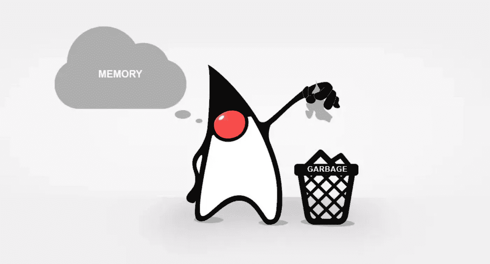
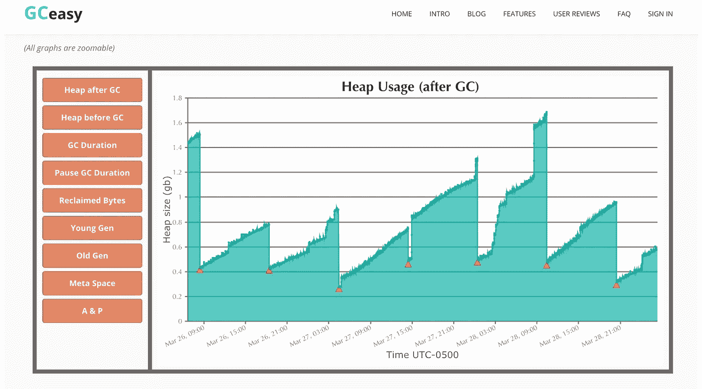

# 调整和提高 JVM 垃圾收集器性能的 5 条规则

> 原文：<https://medium.com/javarevisited/the-5-rules-for-tuning-and-improving-jvm-garbage-collector-performance-86ac8d290661?source=collection_archive---------2----------------------->

## 一个参数如何影响您的应用程序性能

[](https://www.java67.com/2016/08/10-jvm-options-for-java-production-application.html)

杜克向垃圾收集器扔东西

当你在编写一些 Java 应用程序时，通常我们首先关心的是使用的算法和设计模式。当我开始从 [Java 开发人员](/javarevisited/the-java-programmer-roadmap-f9db163ef2c2)向 [SRE 角色](/javarevisited/13-best-courses-to-learn-devops-for-senior-developers-in-2020-a2997ff7c33c)转变时，我开始发现产品团队中正常软件开发过程中的一些差距，其中之一是生产环境中的应用程序性能。如今，仅仅让你的代码在测试/阶段环境中工作并在主分支中合并你的代码是不够的，我们需要进一步思考:这个应用程序在生产中会如何表现？

Java 应用程序崩溃的主要原因之一是糟糕的 [JVM 参数](https://javarevisited.blogspot.com/2011/11/hotspot-jvm-options-java-examples.html)配置。资源分配并不像看起来那么简单，您应该记住这样的事情:硬件细节(CPU、内存)、用户交互、内存中分配了多少对象以及垃圾收集器策略。根据我自己处理这些情况的经验，我可以总结 5 条规则来付诸实践，以使您的应用程序更加可靠，并避免由于 JVM 问题而导致的意外停机。

## 监控资源分配

听起来显而易见，但事实并非如此。我们非常习惯于只监控 HTTP 请求的成功率和错误率，但是 [CPU 和内存使用](https://javarevisited.blogspot.com/2013/06/find-cpu-and-memory-used-by-java-solaris-prstat-command-example.html)对于理解应用程序在服务器/容器内部的行为是至关重要的。

想象一下，如果您处于云环境中，那么您的纵向扩展策略很可能会因为错误的原因而触发，以防您的 pod 由于资源分配而开始失败，最终整个应用程序崩溃。好消息是市场上已经有了一些好的 JVM 监控工具， [JVM](/javarevisited/7-best-courses-to-learn-jvm-garbage-collection-and-performance-tuning-for-experienced-java-331705180686) 也提供了一些支持 JVM 使用度量的配置。

  

如果您正在处理生产中的一些问题，并且想要开始查看[垃圾收集](https://javarevisited.blogspot.com/2012/10/10-garbage-collection-interview-question-answer.html)进程本身，您也可以启用 JVM 选项来记录 GC 活动:

```
-Xloggc:<home-dir>\logs\gc-%t.log
-XX:+PrintGCDetails
-XX:+PrintGCDateStamps
-XX:+PrintGCTimeStamps
-XX:+PrintGCCause
-XX:+PrintTenuringDistribution
-XX:+UseGCLogFileRotation
-XX:NumberOfGCLogFiles=10
-XX:GCLogFileSize=5M
```

如果检索到的日志在开始看起来很难理解，也不用担心。我们有一个神奇的在线工具叫做 [GCEasy](https://gceasy.io) 。您只需要上传您的日志文件，该工具将自动将这些见解转化为人类可读的图形，以及您当前的日志统计数据。

[](https://www.java67.com/2020/02/50-garbage-collection-interview-questions-answers-java.html)

GCEasy 生成的输出

分析 GC 行为现在更容易了，对吗？

## 选择正确的 GC 策略

如果你认为在 [JDK](https://javarevisited.blogspot.com/2012/04/difference-between-java-and-javaw.html) 中只有一种垃圾收集策略，那么你是对的……但是只是在 Java 的早期版本中。随着软件产品越来越复杂， [JVM](https://javarevisited.blogspot.com/2019/04/top-5-courses-to-learn-jvm-internals.html) 必须为正确的情况提供正确的选项。

例如，默认的 GC 类型是序列化的。这意味着每次运行时，所有应用程序线程都将停止，直到作业完成，然后恢复应用程序。当你有这么多内存来清理的时候会发生什么？

是的，很有可能你的垃圾收集过程需要更多的资源，然后你的应用程序就会崩溃。现在我们有一个多线程垃圾收集机制，有助于避免停止所有的应用程序线程。[这篇文章很好地解释了](https://www.baeldung.com/jvm-garbage-collectors)每种垃圾收集器类型和用例。

仅仅通过阅读文档，您不会成为 JVM 垃圾收集器专家。事实上，你需要弄脏你的手，在你的真实环境中观察和监控所有这些类型的行为，这个规则导致了下一个规则。

## 在非生产环境中测试您的配置

JVM 配置参数对您的应用程序性能有很大的影响，所以请不要在生产中测试它。糟糕的配置或对这些参数如何工作的误解可能会导致比最初更糟糕的问题。

假设您有一个经常崩溃的应用程序，配置了`xmx8g`和`xmx16g`。如果只是更新内存设置而不进行分析，甚至会降低垃圾收集的性能，因为[更多的可用内存](https://javarevisited.blogspot.com/2016/10/how-to-increase-heap-size-of-eclipse-OutOfMemoryError.html)意味着需要清理更多的内存。让非生产环境获得正确的配置参数并执行适当的压力和性能测试非常重要。

我发现许多用户喜欢 JMeter 进行性能测试，但我个人认为，为特定用例进行配置有点困难，例如*“我需要每 10 分钟将用户负载增加 4 倍，然后每 15 分钟增加 6 倍”*。对于这些场景，我发现加特林更加强大和可伸缩:

<https://gatling.io>  

我强烈建议将所有的测试场景保存在代码版本控制中，并定期执行它们。这种预防性监控将非常有助于在最终用户之前发现问题。

## 使用 IaC 解决方案来长期保持您的配置

一旦你找到了理想的配置，记住:很容易被覆盖。您必须将配置存储在源代码版本控制工具中，以保持历史更新，并允许您的配置在同一服务的其他环境或实例中轻松复制。试想一下，如果您仅仅因为手动更新而丢失了配置值，您将再次面临同样的问题，所有投入的时间和资源都将浪费。

## 在应用程序级别实施定期清理

我们现在非常清楚在我们的环境中需要注意 JVM 行为，但是不要忘记这里的主要组件:应用程序。如果您已经正确地配置了所有的值，您正在监视性能，但仍然发现有问题，让我们退一步思考:为什么我们会面临内存错误？我们的产品真的需要在内存中分配所有这些对象吗？

有时，某个框架的糟糕实现(例如: [Hibernate](/javarevisited/8-best-spring-and-hibernate-training-courses-for-java-developers-acf09aa0e244) )会导致内存中断，依赖外部数据存储的应用程序也是如此，比如 [Elastic](https://javarevisited.blogspot.com/2022/02/top-5-courses-to-learn-elasticsearch.html) ，在索引过程中会消耗大量资源。

在开发阶段，我们有一些助手方法来帮助 JVM 优化垃圾收集过程，例如:

*   告诉 JVM 现在是执行垃圾收集器的好时机。这并不意味着 GC 会立即执行！
*   `[finalize()](https://www.java67.com/2016/06/difference-between-final-vs-finally-vs-finalize-in-java.html)`:该方法继承自`Object`类，用于在 GC 清理对象时执行一些逻辑。

在运行时，您必须监控使用情况。如果您注意到您的用户正在请求比所需更多的资源，并且您的后端进程变得更慢，那么实现缓存层或清理作业可能有助于减少服务器上的内存负载。

看一看应用程序开发/使用本身可以为您节省大量的调试时间！

找到完美的平衡和配置并不容易，你必须记住:一切都是短暂的。现在有意义的配置，明天可能就没有意义了，这就是为什么你需要保持积极地监控你的产品/平台。你知道那些调整 JVM 的规则吗？你知道其他的吗？欢迎在评论区分享！

下一篇文章再见！