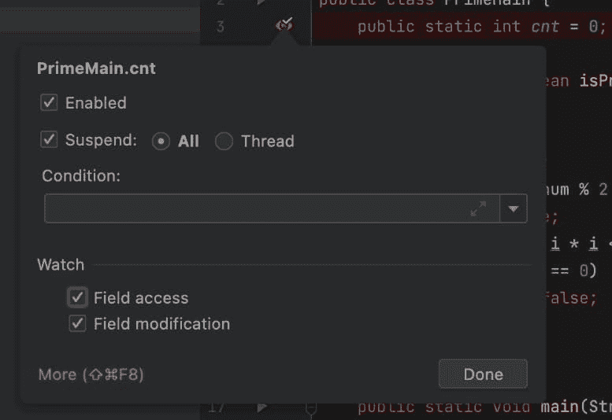
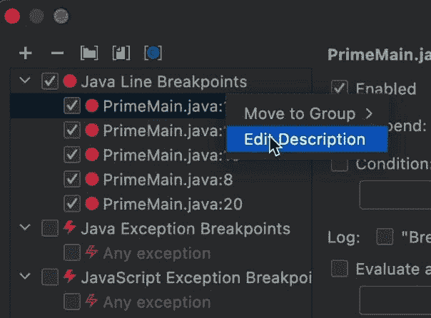
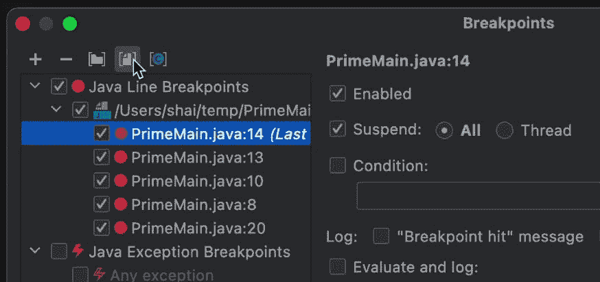
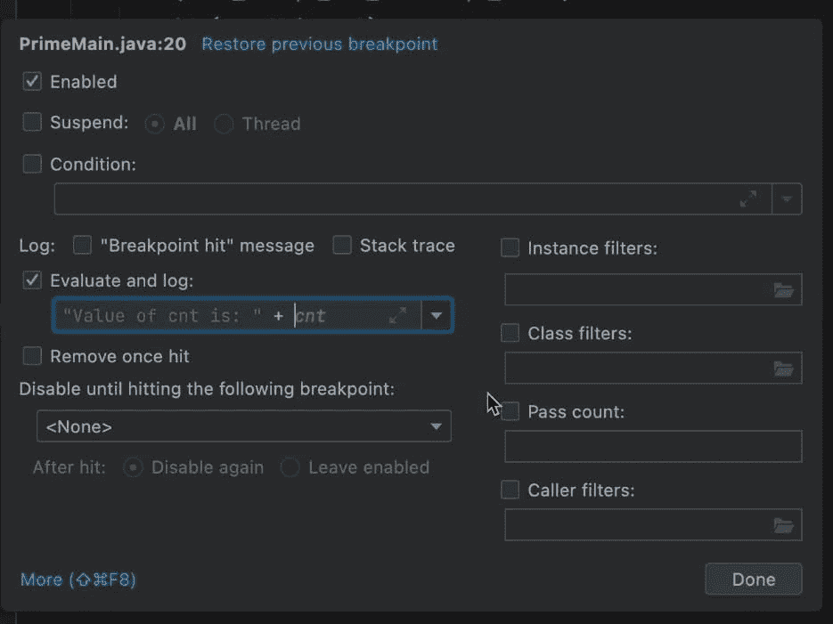

# 您可能不知道的断点基础知识

> 原文：<https://medium.com/javarevisited/the-basics-of-breakpoints-you-might-not-know-8bc8e8e3ac9a?source=collection_archive---------0----------------------->


在《140 秒小鸭子》的第 4 和第 5 集里，我深入到了断点的更高级的基础。要向前发展，还有很多东西需要学习，但即使在这个阶段，令人惊讶的是，在开发人员社区中有这么多相对不为人知的东西。而我才刚刚开始…

# 断点的类型

断点有四种基本类型。

# 行断点

我们说断点，通常就是这个意思。这是默认断点。我在这里包含了类断点，它们有效地在稍后进入构造函数，并且是语义上的行断点。

# 方法断点

当您进入一个方法时，方法断点会停止，当您退出一个方法时，也可能会停止。IntelliJ 之类的 ide 模拟这种直通式断点。原因是方法断点在 JVM 上的性能很差，所以大多数情况下不应该使用它们。

有一个有趣的方法断点用例，我将在下一篇关于这个主题的博文中讨论。所以[确保你跟随](https://twitter.com/debugagent) …这是一个有趣的话题！

[](https://javarevisited.blogspot.com/2011/02/how-to-setup-remote-debugging-in.html)

# 野外观察点

这不是一个断点，因为执行不会在字段处停止。它在访问该字段的代码行中停止。您可以选择切换它，使它只在写入时停止，只在读取时停止，或者在两种情况下都停止。

这是一个非常有用的特性，很少有开发人员使用。“谁改变了这个字段”是调试的陈词滥调，然而开发人员仍然不知道这个特性(或者忘记它的存在)。

[](https://www.java67.com/2018/01/how-to-remote-debug-java-application-in-Eclipse.html)

# 异常断点

异常断点是一个非常有用的特性，每个人都知道…但每个人都回避和讨厌。我完全理解这一点。IDE 默认的在每个异常上停止的行为是多余的，令人恼火！

这使得该功能毫无用处…

这是一个显著的特性，只需一个小开关就能工作。问题的关键是误报。在 [JVM](/javarevisited/7-best-courses-to-learn-jvm-garbage-collection-and-performance-tuning-for-experienced-java-331705180686) 内部抛出并捕获异常时停止的代码。这显然是多余的，而且经常发生(例如在网络代码中)。

下周我会发布讨论解决方案的视频，所以请务必让[跟随](https://twitter.com/debugagent/status/1491075324805001219?s=20&t=f7CFUaRwU0UpCCXP_akBjA)。本系列的下一篇文章将会讨论这个问题。

# 条件断点

条件可以应用于上述任何断点类型。在上面的视频中，我回到了我在这个系列的[上一篇文章，在那里我讨论了对象标记](https://talktotheduck.dev/debugging-tutorial-java-return-value-intellij-jump-to-line-and-more#heading-object-marking)。对象标记有效地让我定义了一个新的全局变量标签。所以我可以用一个新名字`MyThread`将`Thread.currentThread()`保存为一个变量。然后我用了一个条件:

```
Thread.currentThread() == MyThread_DebugLabel
```

这实际上意味着，只有在使用与我之前看到的不同的线程调用这个方法时，我才会停止。调试线程问题？

这是一个神奇的工具…

[](https://javarevisited.blogspot.com/2018/09/top-5-courses-to-learn-intellij-idea-java-and-android-development.html)

# 管理断点

当我们调试一个复杂的应用程序时，我们经常到处散布断点，试图重现一个场景，其中一组特定的断点将带领我们踏上正确的“旅程”。

不幸的是，我们经常因为这个政策而导致许多问题。这将大多数开发人员引向一个错误的方向，即设置太少的断点或者只是一个一个地检查它们…有更好的方法。

# 分组/命名

当我到处都有很多断点时，这是我遇到的一个问题。尤其是对于多个项目(客户端、服务器等)。).很难跟踪所有的事情…

您可以向断点添加描述，以提醒您它为什么在那里。例如，如果你试图重现一个错误，但它从未发生。只需在相关行中放置一个断点，并希望它在某个点被命中。

但是如果你像我一样，你可能会在断点窗口中看到它，而忘记它是什么。那就删了吧。通过编辑描述，您可以提醒自己当初为什么要添加断点。它对于成对调试也非常有用。确保我们在同一页上…

[](https://javarevisited.blogspot.com/2020/05/top-5-courses-to-learn-eclipse-ide-for-java-developers.html)

分组使这更上一层楼。您可以在一个组中放置几个断点。例如“调试问题 333”。然后，您可以禁用或启用整个组。这是我用于上下文切换的东西。当我在[调试](https://javarevisited.blogspot.com/2011/07/java-debugging-tutorial-example-tips.html#axzz6bYzaddcE)的时候，我有时需要做不同的工作。我不记得“我在哪里”。所以我可以将适用的断点分组并禁用它们，直到我“返回”为止。



# 禁用直到

这是一个很常见的情况。代码中有一个区域经常被“命中”，所以在那里放置断点是没有用的。你只要一直按下继续键…

您希望调试该区域，但是只有在满足特定条件之后。您可以在其他区域放置一个断点，并使用“Disable Until”来禁用大容量断点。

所以一旦命中低音量断点，就会启用高音量断点。您可以选择是永久启用还是仅启用一次…

这是我经常看到人们手动做的事情。设置低流量断点，然后手动设置或启用高流量断点。这没问题，但是如果你做得太多，就容易出错。

# 跟踪点

我们可以使用断点作为不暂停执行的临时日志。您可以添加打印输出，其中可以包括表达式等。虽然这有一些限制，但它仍然是一个非常酷的功能。



# TL；速度三角形定位法(dead reckoning)

我们中的许多人几乎每天都和调试人员一起工作，但是仍然有许多未知的东西。我们操作这个非常复杂的工具，同时使用 4 或 5 个大功能:行断点、单步执行、单步进入、继续和观察。

为了弥补这一点，开发人员使用了移除断点并重新设置等技巧。我自己也犯过那种罪…

是时候深入挖掘调试器提供给我们的工具了！