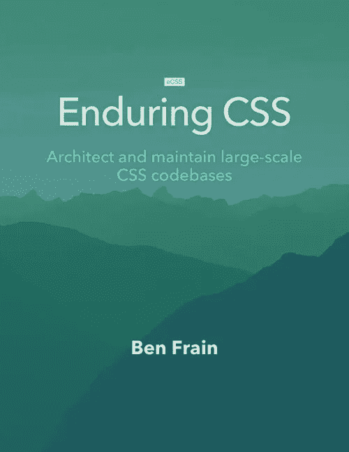
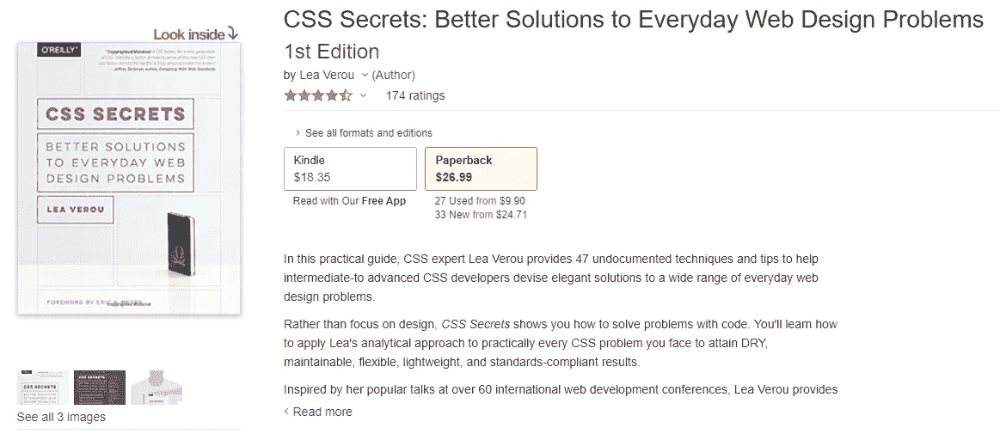
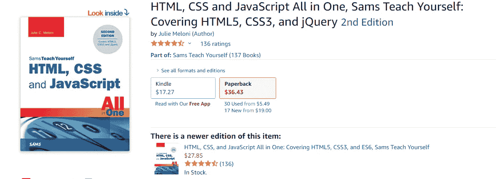
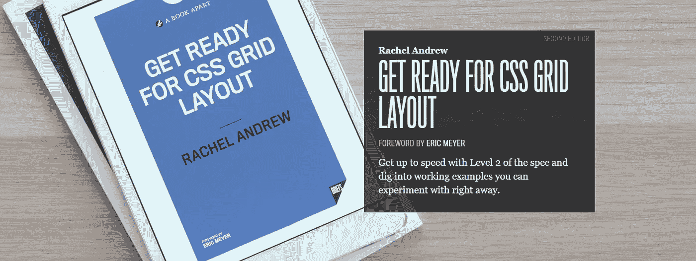
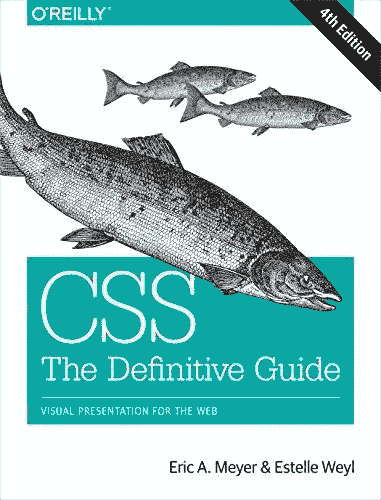
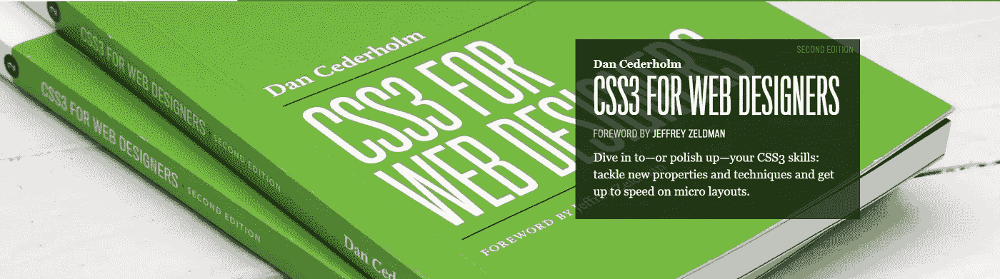

# 2020 年 HTML、CSS 和 UI 界面的 9 本最佳网页设计书籍

> 原文：<https://medium.com/javarevisited/the-best-9-web-design-books-for-html-css-and-ui-interfaces-in-2020-e1513836a3a9?source=collection_archive---------0----------------------->

## 如果你正在开始你的网页开发或设计之旅，你需要有一个坚实的 HTML 和 CSS 知识。为了在这个已经充满了完美的设计布局和 UI 界面的世界上留下你的印记，你需要很好地掌握基本的风格。你将不得不深入设计的深渊，并凭借精湛的技能重返巅峰。

摩根·哈珀·尼克尔斯在 [Unsplash](https://unsplash.com?utm_source=medium&utm_medium=referral) 上拍摄的照片

现在，为了帮助你磨练自己的技能，成为一名专家，我在这里列出了一些我读过的市面上最棒的书。这些书从头开始处理 CSS 和网页设计知识。

他们不仅会教你设计规范，还会帮助你开发自己的艺术设计水平。现在让我们来看看它们。

## 1.[深度 CSS](https://amzn.to/3l0R4rK)

Web 开发人员必须至少了解 HTML 和 CSS 的基础知识。如果你想成为一名网络开发专家，你必须彻底了解他们。

嗯，这本书帮助你学习 web 开发的风格部分，也就是 CSS。它提供了使用 CSS 来设计 HTML 元素的深度和结构化的方法。

当我开始阅读这本书时，我发现它充满了使用 CSS 的创造性例子和最佳实践，这肯定会提高你的技术技能，激发你的设计感。

有了最先进的例子和练习，这本书一定会让你的 CSS 技能更上一层楼。从基本的设计到高级的 CSS 设计概念，在你掌握 CSS 的过程中，你会体验到这一切。这本书的目的是让你成为一个更好的网页设计师，让你的网页应用看起来更壮观。

## 2.[持久 CSS](https://amzn.to/364kctW)

这本名为《持久的 CSS》的书的主要目的是让 [web 开发人员](/javarevisited/100-free-programming-and-web-development-courses-on-udemy-free-resource-center-3f8415eb5e6f)编写出能够持久的 CSS 样式代码。它是为大规模、快速变化、长期存在的 web 项目编写样式表的指南。

它教会了我如何个性化风格，使那些 CSS 模块变得更容易移植到不同的上下文和项目中。它传授 CSS 工具的知识，如 PostCSS 和林挺工具，以研究和维护整个大型项目的 CSS 代码库。

这本书还详细说明了如何用 ARIA 属性更容易地处理状态，而不是改变类。这本书里有更深入的知识要探索。

## 3. [CSS 重构](https://amzn.to/3q3DBTx)

这本书或书中的一章主要是基于 CSS 代码的重构和缩放。它传授了重构的真正含义及其与软件架构的关系。根据《重构是在不改变代码行为的情况下，为了使代码更加简单和可重用而重写代码的过程》一书的说法。现在，我们知道 [CSS 样式](https://javarevisited.blogspot.com/2020/09/top-5-css-cascading-style-sheet-courses-for-beginners.html)也可以通过制作外部样式表来重用。

这本书旨在帮助我们在不改变其整体功能的情况下，重新编写模块化和可扩展的设计元素和属性。它向我介绍了重构 CSS 代码的最佳实践、示例和概念，并对它们进行了单元测试。总的来说，这本书提供了大量关于 CSS 如何工作以及重构如何使代码更有效，以及从长远来看如何扩展的知识。

## 4.[原子设计](https://bradfrost.com/blog/post/atomic-web-design/)

Brad Frost 写的《原子设计》一书介绍了将我们的[ui](https://javarevisited.blogspot.com/2020/06/top-5-courses-to-learn-ux-design-in.html)设计成有思想层次的技术。这本书还讨论了有效模式库的品质以及转换团队设计和开发工作流的方法。

作为一个设计关注点，本书提供的这个原子设计概念将设计组件分为原子、分子、有机体、模板、页面等不同层次。它们基本上有助于理解被称为原子的最奇异的设计单位，当适当地构造时，原子变成分子。

具有正确组合模式的分子设计成为一个有机体。有机体用我们应用于页面的模板中的适当设计模式准确地放置。因此，从这本书里学习设计基本上就像学习化学一样，设计元素就是化学物质。这的确是一本有趣的书。

## [5。CSS 秘密](https://amzn.to/3fxAVZM)

Brad Frost 写的《原子设计》一书介绍了将用户界面设计成有思想层次的技术。这本书还讨论了有效模式库的品质以及转换团队设计和开发工作流的方法。

作为一个设计关注点，本书提供的这个原子设计概念将设计组件分为原子、分子、有机体、模板、页面等不同层次。它们基本上有助于理解被称为原子的最奇异的设计单位，当适当地构造时，原子变成分子。

具有正确组合模式的分子设计成为一个有机体。有机体用我们应用于页面的模板中的适当设计模式准确地放置。因此，从这本书里学习设计基本上就像学习化学一样，设计元素就是化学物质。这的确是一本有趣的书。

## [6。HTML & CSS(也是 jQuery one)](https://amzn.to/3nY8rv0)

这本书是 HTML、CSS 和 JavaScript(包括 jQuery)的成熟学习平台。这是一本一体化的书，提供了对包括 jQuery 在内的 [HTML5](https://www.java67.com/2020/08/5-best-online-courses-to-learn-html-5.html) 、 [CSS3](https://javarevisited.blogspot.com/2019/05/top-5-html-5-and-css-3-courses-for-web-developers.html) 的详细理解、概念、实际例子和最佳实践。

在一天结束时，你将能够设计自己的网页，并让他们在瞬间上线。课程很简单，有一步一步的指导，从头开始构建设计概念。

主要亮点是最常见的 web 开发任务的逐步说明，应用[设计模式](/javarevisited/7-best-online-courses-to-learn-object-oriented-design-pattern-in-java-749b6399af59)的实际例子，以及帮助您测试课程知识积累的练习。总的来说，这本书可以让你成为网页设计和开发领域的专家。

## [7。准备 CSS 网格布局](https://abookapart.com/products/get-ready-for-css-grid-layout)

嗯，网格布局是设计规范的重要补充。他们使得元素在网页上的定位更加容易。网页可以被分割成不同的网格区域，其中每个网格区域具有它们自己的一组设计元素。

[网格](/javarevisited/top-5-advanced-css-courses-to-learn-flexbox-grid-and-sass-da8e37b09b1d?source=---------8------------------)区域可以放置在任何需要的地方，给整个 UI 一个直观的外观。现在，如果你想深入网格布局的深坑，那么这本书由雷切尔安德鲁绝对做你的工作。

通过学习本书的内容，你可以快速掌握网格布局的第二级，并深入研究可以立即进行实验的工作示例。您将能够利用子网格的能力和潜力，这使得将嵌套网格项目与主网格结合起来变得简单而容易。

## [8。CSS:权威指南:Web 的可视化展示](https://amzn.to/3nUkOby)

这本书是为遵循复杂的页面风格和改进的可访问性的网页设计者写的，这样可以节省大量的时间和精力。最新版的指南让你了解最新的设计和 CSS 规范。

这本书让你进入设计实现的更广阔的方面，在那里你将关注用户体验，加速开发，避免潜在的错误，等等。

体验本书的知识深度，你将能够通过布局、过渡和动画、边框、背景、文本属性和许多其他工具和技术，将令人敬畏的设计元素深度添加到你的应用程序中。这本提升你网页设计技能的指南是必读的。

## [9。面向网页设计师的 CSS3】](https://abookapart.com/products/css3-for-web-designers)

如果你想从普通的 CSS 规范过渡到 CSS3，这本书一定会帮助你成为这方面的专家。

CSS3 通过引入高级选择器为 web 字体、渐变、阴影、圆角以及优雅的动画生成内容，在设计世界中开辟了一个可能性的世界。在 Dan Cederholm 的这本书的最新版本中，介绍了微布局的新技术和属性。

有了对 CSS3 样式的广泛浏览器支持，您可以完善您的技能，并在任何设计环境中进行测试，以创建漂亮且制作精良的设计布局。

# 结论

您也可以从在线教程、视频教程等学习，因为它们是您正在寻找的设计解决方案的快速指南。但在这里，我们不仅仅是在寻找设计解决方案。我们正在寻找熟练的设计师，他们可以设想自己的一套设计，使网络社区着迷。我们需要那些能够将他们的想象力转化为网页布局的人。

为了获得专业知识，一个人必须深入 CSS 样式坑，从最佳实践和技术中学习，并用所有可能的设计标准挑战它们。

因此，这些书籍将帮助你做到这一点。用关于[网页设计](/javarevisited/7-free-courses-to-learn-bootstrap-for-web-designers-and-developers-5135215648f1)的最佳书籍来启发自己，将你的设计生涯带到新的高度。

学习标准的 CSS 样式机制对于任何 web 开发人员来说都是必不可少的。如果你想踏上成为专家 web 开发人员的旅程，你可以查看一些标准的和成熟的 web 开发教程。让自己熟悉 web 开发伦理和不同的 [*JavaScript 框架*](/javarevisited/10-javascript-frameworks-and-libraries-to-learn-in-2020-best-of-lot-5f61f86c60b4) 。

> 请记住，当您点击我们的链接并购买时，我们可能会收取佣金。然而，这并不影响我们的审查和比较。我们尽力保持事情的公平和平衡，以帮助您做出最适合您的选择。

*原载于 2020 年 11 月 26 日*[*https://kriss . io*](https://kriss.io/the-best-web-design-books-for-html-css-and-ui-interfaces-in-2021/)*。*