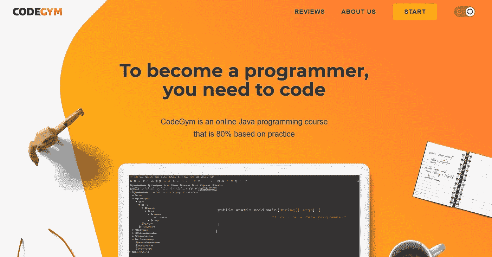
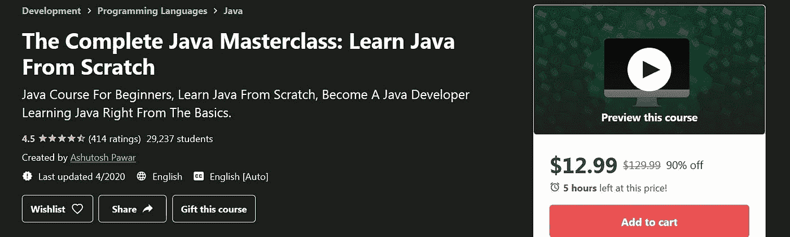
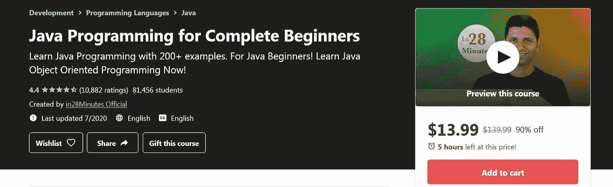
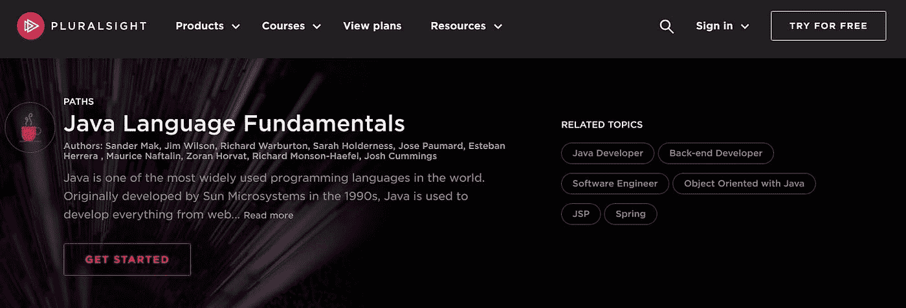
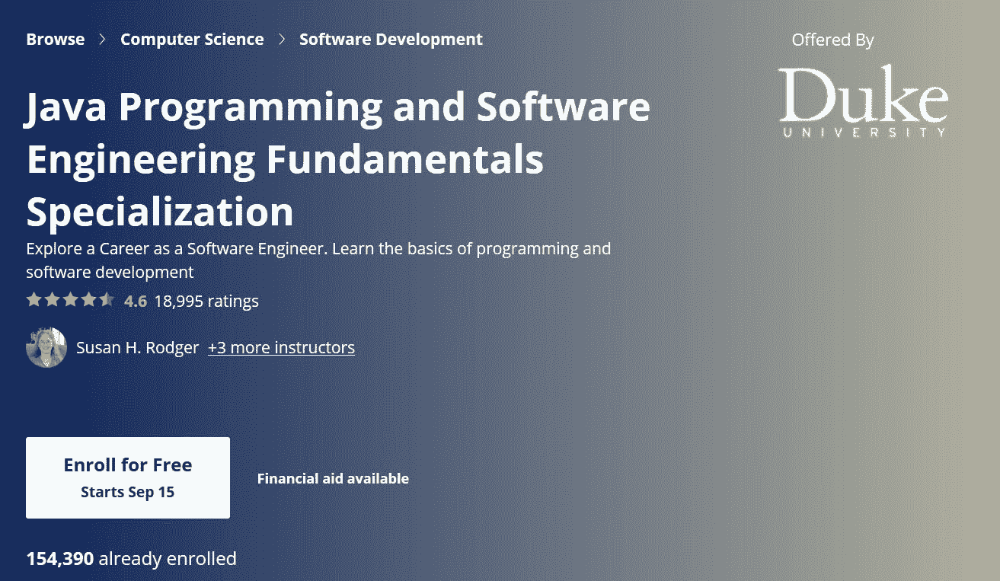

# 从头开始学习 Java 的最佳平台

> 原文：<https://medium.com/javarevisited/the-best-platforms-for-learning-java-from-scratch-b3dd5398993d?source=collection_archive---------0----------------------->


格伦·卡斯滕斯-彼得斯在 [Unsplash](https://unsplash.com/s/photos/learning?utm_source=unsplash&utm_medium=referral&utm_content=creditCopyText) 上拍摄的照片

编程界的共识是 Java 是启动你的软件开发生涯的主要语言之一。然而，许多初学者很难找到合适的学习平台。如果你穿着这双鞋，你会很高兴知道这件作品是专门为你准备的。

基于几年的学习经验，我精心策划了一份学习 Java 的[顶级平台/课程列表。但是在深入课程之前，我想分享一些我希望在开始我的旅程时就知道的编程技巧。所以，请和我一起带您进入学习 Java 的世界。](/javarevisited/top-5-java-online-courses-for-beginners-best-of-lot-1e1e240a758)

# 如何让 Java 学习过程变得有效

在我深入研究学习 Java 的最佳平台之前，我想分享一些关于初学者如何学习 Java 的简单技巧。

## 创建一致的学习计划和代码

如果你把学习 Java 看作一次旅程而不是一个目的地，那将是最好的。你不可能在几周内掌握 Java 的所有方面。但是通过持续的学习和练习，你可以在这段时间内取得显著的进步。

制定学习计划时，设定现实的目标和合理的时间表非常重要。列出你希望学习的 Java 的各个方面，并参加与你的目标一致的课程。切记短时间内不要过多的死记硬背；否则，你会变得不知所措，想着所有你要学的东西。

## 不要只写代码，要阅读！

阅读代码和写作一样是学习 Java 不可或缺的一部分。如果你想成为一名伟大的 Java 程序员，你应该养成阅读由专业开发人员编写的完美开源代码的习惯。首先，我推荐阅读 Java 类。你可以直接在你的 IDE 上做，比如说， [IntelliJ IDEA](/javarevisited/7-best-courses-to-learn-intellij-idea-for-beginners-and-experienced-java-programmers-2e9aa9bb0c05) 。例如，您有一段代码:

```
StringBuffer s = new StringBuffer(“my String Buffer is here”);
```

将光标放在 [StringBuffer](https://javarevisited.blogspot.com/2017/08/10-differences-between-stringbuffer-and-StringBuilder-in-java.html) 上，按 Ctrl+LMB——Java 开发人员编写的 StringBuffer 类的代码将在一个新的选项卡中打开。

此外，您可以使用 [GitHub](/javarevisited/7-best-courses-to-master-git-and-github-for-programmers-d671859a68b2) 和 StackOverflow 作为您的首选平台。

检查专家如何解决问题极大地增加了你作为程序员的多样性，因为你将学习多种方法来解决一个问题。作为一名开发人员，您的大部分时间很可能会花在检查现有的代码并找出改进它们的方法上。早点开始会给你带来明显的优势。

## 与其他学习者和开发者建立联系

如果你想更快地学习 Java，你应该加入一个或几个志同道合的社区。当你在正确的社区时，你将获得教程可能无法提供的知识。

您还可以与其他初露头角的开发人员交流，分享您的经验，并获得有助于学习的宝贵技巧。重要的是，学习伙伴以及你网络中的其他成员可以激励你更加认真地学习。

以下是我为新手开发者推荐的一些顶级论坛和社区:

Reddit 频道

*   [r/java](https://www.reddit.com/r/java/)
*   [r/javahelp](https://www.reddit.com/r/javahelp/)
*   [r/编程](https://www.reddit.com/r/programming/)
*   [r/learn 编程](https://www.reddit.com/r/learnprogramming/)
*   [r/codetogether](https://www.reddit.com/r/codetogether/)
*   [r/编程工具](https://www.reddit.com/r/programmingtools/)
*   [r/webdev](https://www.reddit.com/r/webdev/)

萧条的社区

*   标签开发者
*   欧洲发展探索者

[堆栈溢出](https://stackoverflow.com/)

[站点点](https://www.sitepoint.com/)

## 永远不要停止学习

当试图学习 Java 或任何其他编程语言时，敏捷性是一种无价的技能。你应该努力学习新事物或做旧事情的新方法。我为我的学生设定了每天的学习目标，这非常有效。每天学习一些新的东西——一个新的语法、一个新的 API、一个新的设计或者架构模式，很快你就会成为一名专家。

## 不要在一个问题上花太多时间

即使是最好的程序员也会时不时地被[编码问题](/javarevisited/20-array-coding-problems-and-questions-from-programming-interviews-869b475b9121)所困扰。然而，他们解决问题的方法将他们与学习者区分开来。当你遇到一个编码问题或 bug 时，不要花太多时间去试图找出它。

时不时地给自己一点休息时间，甚至继续做其他项目。你在某一点上花的时间越多，你的效率就会越低。此外，您应该始终记住，开发人员的社区是非常强大的，帮助几乎总是指日可待。利用你的关系网，每当你遇到另一个不可逾越的障碍时，就问问题。

# 2020 年学习 Java 的最佳平台

## CodeGym



**价格**:从免费选项到每月 50 美元

**主要特点**

*   80%基于实践
*   用户友好的移动应用程序允许您在旅途中学习编码
*   自动代码验证
*   成为活跃的 Java 学习者网络的一员
*   精心设计和组织的课程
*   超过 1200 个引人入胜的练习
*   已完成任务的即时评分
*   讲座分成更小的部分以简化学习过程
*   涵盖初学者和中级学习者的不同主题

**课程描述**

[CodeGym](https://codegym.cc/) 坚信“如何快速学习 Java？”就是实践，这一点在他们的 Java 课程结构中显而易见。超过 1200 个任务允许学习者广泛实践课堂上讨论的每一个原则。此外，作业会立即评分，以提高学习热情和学习速度。

CodeGym 的另一个令人兴奋的特性是课程被分成不同的级别。当你完成一关，你就可以进入下一关。游戏化的结构显著增加了学习者的热情和投入。此外，还有一个移动应用程序，方便随时随地学习。

## 2.面向软件开发人员的 Java 编程大师班



**价格**:129.99 美元

**主要特点**

*   讲师利用反馈来改进课程
*   在开始新的讲座之前，先回顾一下以前讲座中分享的知识
*   教授开发人员用来提高生产力的一般技术和工具
*   大约 80 小时的内容
*   36 个编码练习
*   每一个话题之后你都会遇到挑战
*   竣工证明
*   在电视或智能手机上观看视频

**课程描述**

这个大师班已经获得了近 50 万的注册人数和同样令人印象深刻的积极评价，拥有巨大的人气和社会证明。Udemy 的一位资深人士负责这门课程，你可以相信学习 Java 再简单不过了。

除了受欢迎之外，这个视频对我来说很突出，因为讲师一直在更新内容以适应新版本的 Java。所有的课程都很简洁，课程组织得很好，有助于学习。

## 3.面向完全初学者的 Java 编程 250 步



**价格**:179.99 美元

**主要特点**

*   理论+实践+解决方案的健康组合
*   强烈推荐新手学习
*   数百个编码任务
*   所有讲座的代码和支持文件已经上传到 GitHub
*   具有全面的故障排除指南

**课程描述**

这个 28 分钟的视频涵盖了初学者学习最流行的编程语言所需的一切。虽然简短，但所提供的知识提供了一个坚实的基础。我特别欣赏这是一门新课程，它敢于打破常规。

课程基于 Java 9，课程以循序渐进的方式组织。该视频的另一个特点是采用了直接的教学风格，讲师使用最新的 Java 工具来教授编码。

## 4.Java 基础知识



价格:每月 29 美元，每年 299 美元，保险费 449 美元

* *还提供团队和企业包。

**主要特点**

*   固体基本概念简明讲座
*   主要基于实践
*   简洁明了
*   互动讲座和实践作业
*   对概念的透彻解释
*   无数近乎实用的例子

**课程描述**

[这堂课](https://www.pluralsight.com/courses/java-fundamentals-language)是我最喜欢的课程之一，因为与大多数其他课程不同，它不仅仅帮助学生掌握 API 和语法。它进一步侧重于理解设计模式，这是大多数学生错过的基础。

根据我的经验，最高效的开发人员是那些精通设计模式的人。所以，这个优秀的复视课程出现在我的名单上也就不足为奇了。内容简短明了，在理论之前更注重实践。

所有的概念被全面地解释，并且真实世界的例子被使用使抽象的术语可联系。定价结构也相当灵活，让预算内学习 Java 变得更容易。

## 5.杜克大学 Java 认证(Coursera)



**价格:**免费

**主要特点**

*   100%以项目为导向，让你在学习的同时建立投资组合
*   有同伴反馈的分级作业
*   细分为 5 个模块，涵盖了 Java 最相关的方面
*   学习设计算法，测试和调试你的程序
*   包括一个顶点项目，帮助你实际应用你所学的一切

**课程描述**

杜克大学的 Java 认证证明了最好的东西不是免费的。该课程教授所有 Java 程序员需要知道的基本概念。此外，你将获得坚实的软件工程背景，因为该课程涵盖了从设计算法到测试到调试程序的所有内容。

在课程结束时，你应该能够通过编程自信地解决现实世界中的问题。由于 100%以项目为导向，学习者还可以在提高 Java 技能的同时建立作品集。这使得项目完成后更容易找到工作。

# 包裹

你有它！我已经分享了学习 Java 的最佳平台，以及一些使学习过程更有效的有用技巧。你已经开始考虑使用这些技巧了吗？为什么不报名参加这份清单上的任何课程呢？当你这样做的时候，请记住，一致性和实践是成为顶级 Java 程序员的关键。