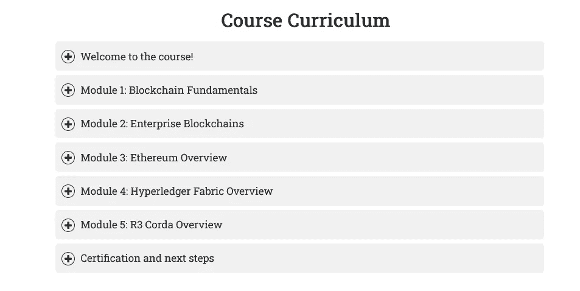
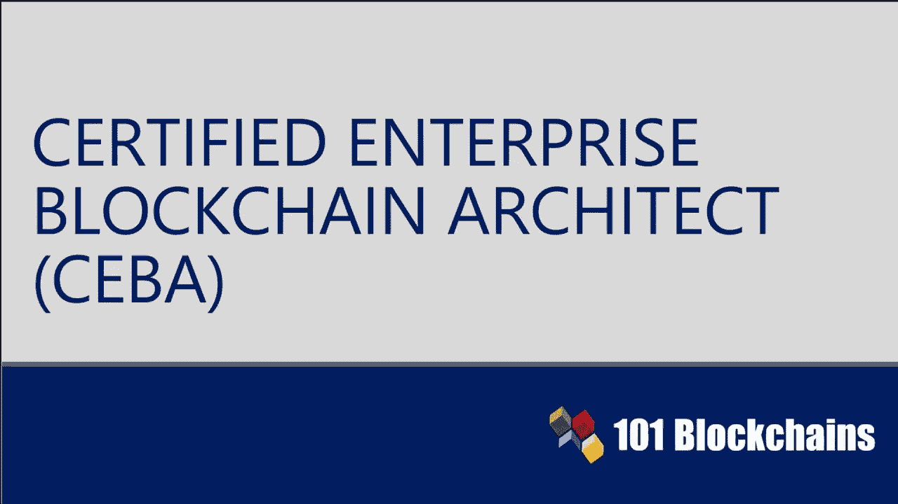
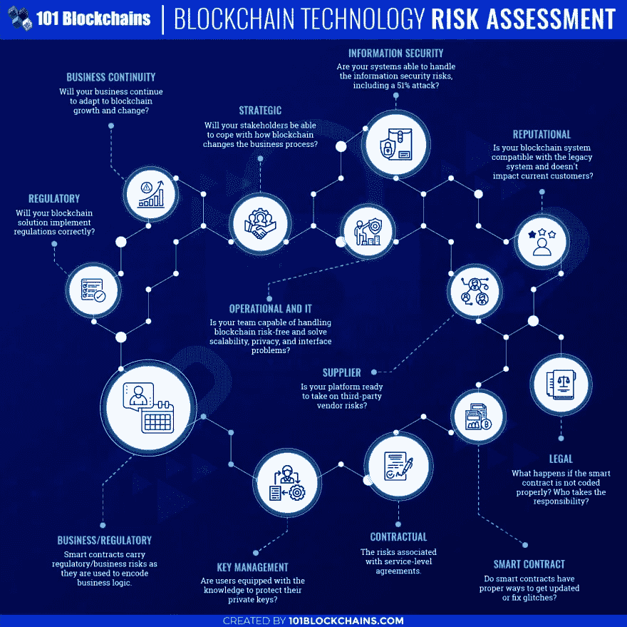
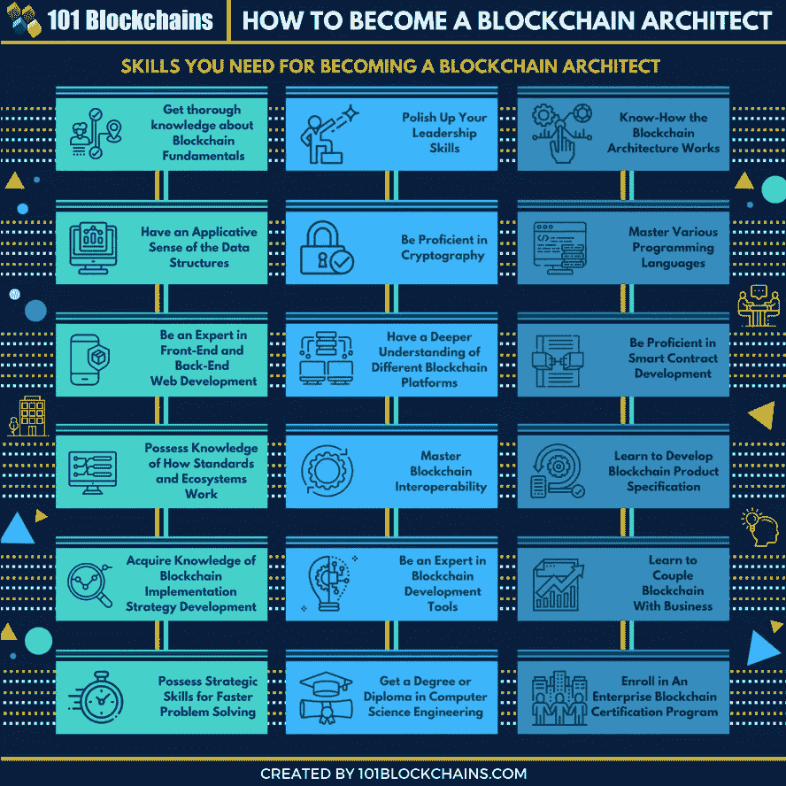

# 区块链开发者/架构师路线图

> 原文：<https://medium.com/javarevisited/the-blockchain-developer-architect-roadmap-d212d3bbbb00?source=collection_archive---------0----------------------->

## 2022 年成为区块链开发者和架构师的完整区块链开发者路线图和指南以及 101 区块链认证区块链架构师课程回顾

101 区块链的区块链开发者路线图

大家好，如果你想成为区块链开发者或架构师，但不知道从哪里开始，那么你来对地方了。在这篇文章中，我将分享你想成为区块链开发者和架构师需要什么，以及如何在 2022 年通过适当的区块链开发者路线图成为成功的区块链开发者。

在过去，我已经分享了[最佳区块链认证](/javarevisited/best-blockchain-courses-and-certification-in-2020-63729f8f04d0)、[课程](https://javarevisited.blogspot.com/2022/01/5-best-blockchain-certifications-and.html)和[学习区块链的最佳网站](/javarevisited/6-best-places-to-learn-blockchain-for-free-dcb20bd92c8f)，在本文中，我将分享如何成为区块链开发者和架构师。一路上，我也会分享我对 101 区块链的[**CEBA 认证**](https://www.shareasale.com/r.cfm?b=1713895&u=880419&m=105464&urllink=&afftrack=) 的想法。

区块链解决方案最近在技术领域制造了很多噪音，理由都很充分。它具有分散、安全和透明的优势。

同时，你也可以注意到用例生态系统增长的可能性。一个**认证的企业区块链架构师**可以作为当今时代企业的一项有前途的资产。

怎么会？架构师的工作重点是通过评估特定用例的需求来设计区块链解决方案。

# 2022 年如何成为区块链开发者/架构师？

区块链架构师帮助定义区块链系统的架构，以及关于部署、操作和维护的决策。架构师在深入了解和评估备选方案后做出一些重要决策。下面的讨论也将帮助你发现区块链 101 的 [**CEBA 认证是否是 2022 年有抱负的区块链建筑师的正确道路。**](https://www.shareasale.com/r.cfm?b=1713895&u=880419&m=105464&urllink=&afftrack=)

## 1.对区块链架构师的需求

在你试图发现由 101 区块链颁发的 [**区块链建筑师认证**](https://www.shareasale.com/r.cfm?b=1713895&u=880419&m=105464&urllink=&afftrack=) 是否值得之前，你必须知道区块链建筑师的前景。区块链建筑师有足够的工作吗？角色和职责是什么？工资多少？

好吧，让我们先从最重要的事情开始。区块链建筑师的平均年薪大约是 165，000 美元。对于追求这份工作的认证来说，这绝对是一个很有希望的薪水估计。

现在，转到下一个问题，区块链领域有很多新的工作机会。区块链和加密相关的工作列表以天文数字的增长率飙升。除此之外，巨大的技能差距也创造了有限竞争的独特机会。

因此，你有很多机会成为****的区块链建筑师，同时还有高薪的承诺。你如何发现认证是否能让你为区块链建筑师的角色做好准备？****

****答案很简单。只需查看区块链建筑师的角色和职责，并找到涵盖相同内容的认证。****

****这是我之前提到的**区块链开发者路线图**:****

****

101 区块链的区块链开发者路线图**** 

## ****2.区块链架构师的角色和职责****

****区块链建筑师的角色和责任的概述可以帮助你毫不费力地找到 [**最佳区块链建筑师认证**](https://learn.block6.tech/6-best-coursera-courses-and-certifications-to-learn-blockchain-1233b23a8952?source=user_profile---------2----------------------------) 。怎么会？任何证明候选人具有处理区块链建筑师的角色和责任所需的技能的证书都是一个好的选择。****

****这里有一个区块链建筑师的角色和责任的概述，你必须计划获得认证。****

*   ****通过利用区块链为客户创建端到端解决方案的架构。****
*   ****制定鼓励参与区块链生态系统的综合战略。****
*   ****在准备风险缓解策略的同时，研究风险/故障分析模型。****
*   ****为区块链项目团队制定最佳实践和指南。****
*   ****制定绩效指标以监控区块链的绩效。****

****它们看起来很容易，但事实并非如此，你需要对区块链生态系统有很好的了解，才能设计和开发出能够经受住生产考验的区块链应用。****

**** [## 2022 年如何成为区块链架构师？区块链架构认证是由 101…

### 区块链解决方案最近在技术领域制造了很多噪音，理由都很充分。它来了…

javarevisited.blogspot.com](https://javarevisited.blogspot.com/2022/07/how-to-become-blockchain-architect-in.html)**** 

## ****3.区块链架构师认证及其价值****

****现在你知道了一个区块链建筑师需要做什么，以及他们期望的薪水，你需要一个合适的证书。由 101 区块链 颁发的 [**CEBA 认证是一种值得信赖的资源，可以帮助您在区块链建筑专业领域建立职业生涯。**](https://www.shareasale.com/r.cfm?b=1713895&u=880419&m=105464&urllink=&afftrack=)****

****你可以浏览课程的细节，了解更多关于它给有抱负的专业人士带来的价值。****

********

## ****4.认证企业区块链架构师认证的目标****

****关于区块链建筑师认证的第一件事是由 101 区块链提到的技能提高。你可以通过深入了解先进的开发理念来学习区块链建筑师的技能。以下是 101 区块链区块链建筑师认证的目标。****

*   ****了解区块链建筑的先进理念，如发展。****
*   ****形成对不同区块链使用案例和最佳实践的深刻印象，以确定适合客户需求的区块链系统。****
*   ****擅长实际的**区块链架构师**任务，例如使用企业区块链平台。****

****[**101 区块链建筑师认证**](https://www.shareasale.com/r.cfm?b=1713895&u=880419&m=105464&urllink=&afftrack=) 的目标表明它非常适合有抱负的区块链建筑师。您可以注意到认证目标是如何与区块链建筑师的角色和职责相一致的。****

********

****此外，该认证还通过认证课程模块中的深入学习资源提供了看似合理的优势。****

## ****5.准备好区块链架构师的工作****

****任何针对区块链建筑师工作的认证的有效性也体现在它如何为实际工作准备候选人。有趣的是，101 区块链提供了区块链建筑师所需的技能和知识的模块式分布。****

****下面是认证培训课程模块的概述，您必须考虑这些模块来评估其有效性。****

*   ****[区块链基础知识](https://dev.to/javinpaul/5-best-courses-to-learn-blockchain-for-beginners-in-2022-2me4)****
*   ****企业区块链平台****
*   ****[以太坊发展](https://javarevisited.blogspot.com/2021/11/top-5-courses-to-learn-ethereum-for.html)****
*   ****[总账架构](https://javarevisited.blogspot.com/2022/02/top-5-courses-to-learn-hyperledger-blockchain.html)用例与开发****
*   ****R3 Corda 使用案例和开发****

****课程集中在区块链建筑师在他们的角色和责任中需要解决的所有主题。所以，101 区块链 [**认证企业区块链架构师**](https://www.shareasale.com/r.cfm?b=1713895&u=880419&m=105464&urllink=&afftrack=) 证书绝对证明了它对你区块链事业的价值。****

********

## ****6.支持有效学习的基础设施****

****[**CEBA** 认证](https://www.shareasale.com/r.cfm?b=1713895&u=880419&m=105464&urllink=&afftrack=)区别于其他认证最重要的亮点，是指 101 区块链本身。这是一个值得信赖的区块链培训和认证平台。****

****成千上万的区块链企业从业者利用了区块链[*101*](http://shrsl.com/349rm)的培训课程和认证，获得了巨大的职业利益。****

****101 区块链针对每个认证课程的培训课程提供了有效的备考工具。同时，认证培训课程的内容质量和见解支持长期技能发展。****

****您还可以在 [*101 区块链*](http://shrsl.com/349rm) 上找到高度响应且可用的专家支持机制的优势。这样一来，你就不太可能在你的准备之旅中遇到任何挫折。****

## ****7.区块链架构师认证适合初学者吗？****

****101 区块链 [**认证企业区块链架构师认证**](https://www.shareasale.com/r.cfm?b=1713895&u=880419&m=105464&urllink=&afftrack=) 是区块链架构师最好的凭证之一。另一方面，认证培训课程中涵盖的主题的复杂性可能会给初学者带来一些挫折。该认证详细介绍了企业区块链平台上的模块及其工作原理。****

****随后，培训课程还思考了受欢迎的企业区块链平台的不同例子。此外，通过演示强调区块链架构和企业区块链开发使认证适合专业人士。初学者可以上这门课吗？事实上，是的！****

****初学者也可以用 101 区块链认证 成为 [***认证区块链建筑师*** *。101 区块链认证培训课程的亮点是深入思考与建筑相关的区块链基础知识。*](http://shrsl.com/349rm)****

****作为一个初学者，你可以熟悉所有的基本概念，你需要了解区块链建筑。****

****随后，您可以转向企业区块链平台的高级概念，如价值创造、成本建模和架构优化。最重要的是，初学者可以从演示和互动练习中学习，以确保更好的学习体验。****

********

## ****8.成为区块链架构师需要多长时间？****

****由 101 区块链颁发的**最佳区块链建筑师认证**对每个候选人来说都是相当具有挑战性的。由于课程中广泛的主题及其不同的复杂性，许多考生将很难完成所有的目标。****

****然而，当谈到学习区块链建筑和证明你的技能时，没有理由着急。您可以按照自己的进度完成认证培训课程，培养您在区块链建筑方面的技能。****

****课程持续时间定为 5 周，每周大约学习 3 到 4 个小时。另一方面，你可以花多长时间为考试目标学习，并详细关注每个主题。****

****你必须记住，你的目标是成为一名专家**区块链建筑师**,并证明在区块链发展的基本和先进的概念的流畅性。利用 [*101 区块链认证*](https://www.shareasale.com/r.cfm?b=1713895&u=880419&m=105464&urllink=&afftrack=) 的灵活性，通过一系列有意义的技能获得行业认可的证书。****

********

## ****9.成为认证区块链架构师的最佳途径是什么？****

****101 区块链认证不仅帮助你学习**区块链建筑师技能**还帮助你实现这些技能。然而，许多考生普遍对准备认证考试的最佳做法感到困惑。****

****以下是一些你在准备 CEBA 101 区块链认证时必须遵循的方法。****

*   ****使用 101 区块链提供的学习资源，只关注考试目标。****
*   ****专注于您的准备计划，并及时完成目标。****
*   ****在区块链技术的社区和论坛中寻找解决方案。****
*   ****了解区块链建筑领域的最新消息、更新和趋势。****

****正如你所注意到的，你不必尝试任何复杂的措施来确立你作为区块链建筑专家的身份。相反，简单的练习可以帮助你在认证考试中取得巨大的成功。****

## ****结论****

****任何想成为区块链注册建筑师的人都可以选择 101 区块链作为他们的认证提供者。区块链 101 号的区块链建筑师证书是一个简单有效的资源，可以帮助你在区块链建筑领域建立职业生涯。****

****顺便说一下，当谈到加入这个认证时，你可以单独加入，或者你可以获得一个 [**101 区块链会员资格**](https://shareasale.com/r.cfm?b=1696402&u=880419&m=105464&urllink=https%3A%2F%2F101blockchains%2Ecom%2Fmembership%2F&afftrack=) ，它不仅可以让你获得这个认证，还可以获得其他几个强大和受欢迎的区块链和 Web3 认证和课程，每月只需 25 美元的年度计划(现在有 50%的折扣)。****

********

****您可以成为寻求区块链数字化转型的企业的重要资产。但是，您必须小心准备计划的先决条件和责任，以确保成功。****

****对区块链建筑师所需技能的精确强调和课程的灵活组织。 **CEBA 认证**的所有价值优势以及 101 区块链的行业认可度确保您拥有最佳认证。****

****您可以在这里了解更多关于区块链架构师认证[的信息，并了解如何利用这一独特的资源构建您未来的区块链职业生涯。加入本课程时，您还可以使用折扣代码 BCHAIN30 获得 30%的折扣。](https://www.shareasale.com/r.cfm?b=1713895&u=880419&m=105464&urllink=&afftrack=)****

****祝您的区块链学习和开发一切顺利。****

****其他**区块链文章和教程**你可能喜欢:****

*   ****[2022 年十大区块链认证](https://javarevisited.blogspot.com/2020/07/top-5-online-courses-to-learn-blockchain.html)****
*   ****[深度学习区块链的 6 大网站](https://dev.to/javinpaul/6-best-websites-to-become-a-blockchain-developer-in-2022-3han)****
*   ****[如何从零开始学习 2022 年的元宇宙？](https://javarevisited.blogspot.com/2022/07/how-to-learn-metaverse-from-scratch-is.html)****
*   ****[我最喜欢的学习以太坊的在线课程](https://javarevisited.blogspot.com/2021/11/top-5-courses-to-learn-ethereum-for.html)****
*   ****[开发者 10 大最佳区块链课程](/javarevisited/best-blockchain-courses-and-certification-in-2020-63729f8f04d0)****
*   ****[2022 年免费学习区块链的 5 个最佳地点](https://javarevisited.blogspot.com/2022/06/top-5-websites-to-learn-blockchain-in.html)****
*   ****[认证 NFT 专业认证值得吗？](https://javarevisited.blogspot.com/2022/06/review-is-certified-nft-certification-worth-it.html)****
*   ****[2022 年 10 门元宇宙在线初学者课程](https://javarevisited.blogspot.com/2022/06/best-courses-to-learn-metaverse-online.html)****
*   ****[101 区块链认证区块链开发者值得吗？](https://javarevisited.blogspot.com/2022/05/review-is-certified-enterprise-blockchain-professional-certification-worth.html)****
*   ****[我最喜欢的学习不可替换代币的课程](https://javarevisited.blogspot.com/2021/12/top-5-courses-to-learn-about-nfts-non.html)****
*   ****[学习区块链 HyperLedger Fabric 的 5 门课程](https://javarevisited.blogspot.com/2022/02/top-5-courses-to-learn-hyperledger-blockchain.html)****
*   ****[2022 年区块链 5 个最佳 Coursera 课程](https://javarevisited.blogspot.com/2022/01/5-best-blockchain-certifications-and.html)****
*   ****[20 大区块链面试问题及答案](https://javarevisited.blogspot.com/2022/07/blockchain-interview-questions-answers.html)****
*   ****[2022 年学习区块链的前 5 本书](https://javarevisited.blogspot.com/2022/06/top-5-books-to-learn-blockchain-for.html)****
*   ****[3 门 Coursera 课程让你在 2022 年成为区块链开发者](https://javarevisited.blogspot.com/2022/06/best-coursera-courses-for-blockchain.html)****
*   ****[2022 年 10 门免费 NFT 初学者课程](https://javarevisited.blogspot.com/2022/07/free-nft-non-fungible-tokens-courses.html)****

****感谢您阅读本文。这些*2022 年最佳区块链在线课程及初学者认证*如果你觉得有用，请分享给你的朋友和同事。如果您有任何问题或反馈，请留言。****

******P. S. —** 如果你正在寻找一个免费的课程来开始你的区块链职业生涯，那么你也可以查看 [**企业区块链基础**](http://shrsl.com/34mvm) ，这是一个来自 101 Blockchain 的免费区块链课程，是一个很好的开始。我向想要开始区块链职业生涯的初学者和有经验的开发者强烈推荐这门课程。如果需要更多选择，也可以看看这些 [**最好的免费区块链课程**](/javarevisited/7-free-courses-to-learn-blockchain-in-2020-764e66b47ebe) 。****

**** [## 2022 年要学习的 5 门免费区块链开发人员课程和认证-最好的

### 大家好，如果你想学习区块链开发，并且正在寻找一些免费的区块链课程，你来了…

www.java67.com](https://www.java67.com/2018/02/5-free-blockchain-technology-courses.html)****