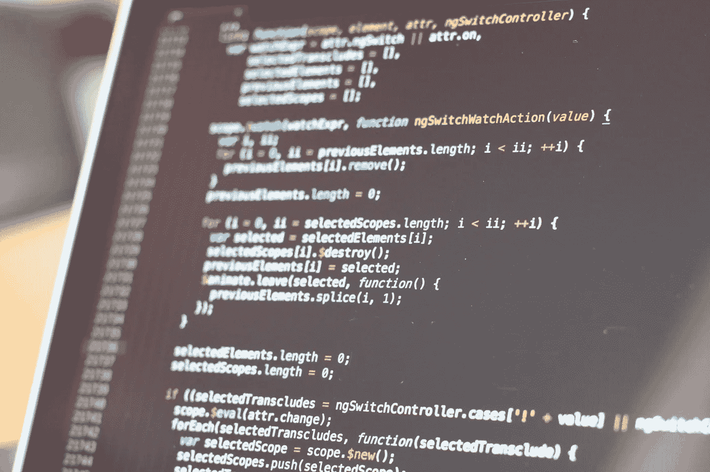

# 掌握 C++编程语言所需的书籍

> 原文：<https://medium.com/javarevisited/the-books-you-need-to-master-c-programming-language-ec4f53750c30?source=collection_archive---------0----------------------->

C++是编程史上最著名和最通用的编程语言之一。它非常古老，在 1985 年首次出现，但它仍然是许多程序员最喜欢的语言之一，这也要归功于它的各种应用领域。

有大量的书籍可以帮助你学习这种编程语言，本文的目标是…