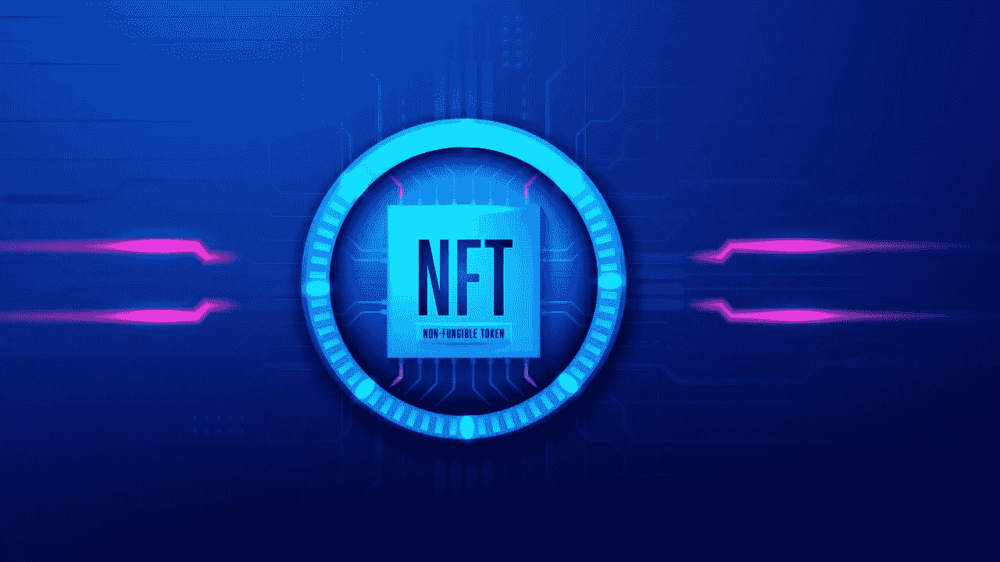
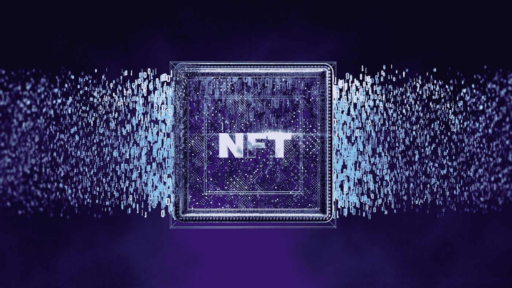

# NFTs 完全指南-品牌如何使用 NFTs？

> 原文：<https://medium.com/javarevisited/the-complete-guide-to-nfts-how-brands-can-use-nfts-c584c1fb5309?source=collection_archive---------2----------------------->

品牌总是寻找创新的营销手段来提高消费者的参与度。难怪他们试图利用颠覆性的当代趋势。其中一个趋势是 NFT(不可伪造的代币)。那么，NFT 是什么？NFT 能成为一种新型品牌故事的闸门吗？

NFT 代表“不可伪造的令牌”它是区块链本地的数字资产，标记有唯一的元数据。作为一种不可兑换的资产，NFT 不能等价交换，这意味着你不能交换一个 NFT 或另一个 NFT。钻石是一种不可兑换的资产，但美元是一种可替代的资产，因为一美元可以与另一美元交换，因为它们的价值是相同的。

非传统艺术已经存在了一段时间，但当 NFT 艺术收藏品开始以令人难以置信的高价售出时，它们才变得流行起来。在佳士得百年老拍卖行，毕普的《每一天:最初的 5000 天》(数字艺术)的 NFT 以近 7000 万美元的价格售出。

NFT 适用于各种项目，包括艺术，推文，视频，网络域名，书籍，文章，虚拟房地产和几乎任何东西。《纽约时报》记者凯文·卢斯(Kevin Roose)将其文章作为 NFT 作品以 56 万美元的天价售出。

# 为什么 NFT 有价值？

NFT 作为独特数字资产所有权的无可争议的记录是有价值的，这意味着如果你购买了 NFT 或数字资产，你可以普遍证明你对该资产的所有权。

拥有独一无二的数字艺术 NFT 是否意味着你是唯一拥有该数字资产的人？就资产所有权而言，答案是肯定的。

但你可能会争辩说，同一件艺术品的 n 个数字拷贝和截图可以在网上制作和分发。是的，那也是真的！那么 NFT 的意义是什么？为此，你首先需要了解 NFT 的基本知识。

NFT 本身不是资产；它代表一种资产。NFT 存储在以太坊这样的分散式[区块链](https://javarevisited.blogspot.com/2020/07/top-5-online-courses-to-learn-blockchain.html#axzz6tFYADc00)中，而实际的资产，可以是一件艺术品、一段视频或一篇文章，则存储在其他一些离线数据库中，如服务器、计算机系统等。

每个 NFT 都包含一个唯一的识别码，编码在区块链中。购买 NFT 意味着购买基础代码，这确认了你对资产的所有权。因此，任何人都可以拥有数字资产的图像、截图或副本，但他们不会是该资产的所有者。您将成为该资产的所有者，因为您拥有该资产的 NFT。NFT 独特的元数据编码在[区块链](/javarevisited/best-blockchain-courses-and-certification-in-2020-63729f8f04d0)中，保护您的所有权免受任何类型的欺诈和假冒。NFTs 一次只能有一个所有者。此外，非金融资产具有货币价值，可以在 NFT 市场交易。作为所有者，只有你可以出售 NFT 并获得利润。

## 是什么决定了 NFT 的价值？

NFT 就像实物收藏家的物品，但它们是数字化的。就像现实世界的收藏品一样，即使是 NFT 的感知价值也与 NFT 背后的创作者或品牌的感知价值相关联。因此，可以说这是一种双向关系:如果创作者或品牌的知名度上升，其 NFT 价值也上升，如果 NFT 变得受欢迎，它有助于品牌建设。

## **如何创建和销售 NFT？**

有专门的以区块链为动力的交易非金融交易市场；这些被简称为 NFT 市场。交易通过加密货币完成，所有的交易数据都在区块链上进行编码。一些受欢迎的 NFT 市场有 OpenSea、Raible、SuperRare、Foundation、AtomicMarket 等。

你可以选择这些市场中的任何一个，在那里建立一个账户，按照简单明了的步骤创建 NFT，然后将 NFT 挂牌出售。然而，在大多数 NFT 市场，在建立账户之前，必须建立一个数字钱包。

## NFT 是用来做什么的？

艺术家和内容创作者可以使用 NFT 来赚钱。例如，艺术家通常依靠拍卖行或画廊来出售他们的艺术作品，但现在他们可以作为 NFT 直接卖给消费者。同样，甚至作家也可以把他们的文章作为非功能性文章出售；作家可以卖他们的书，音乐家可以卖他们的广告歌。NFL 的创造者也可以为他们的 NFT 编程版税，每次他们的 NFT 从一个所有者交易到另一个所有者时，他们将继续收到版税。

NFT 不仅仅是为了艺术家个人和内容创作者赚钱；甚至品牌也参与 NFT 拍卖，目的是为慈善事业筹集资金，当然还有提高品牌资产和认知度的目标。例如，塔可钟拍卖了其主题 NFT，几分钟内销售一空，价值相当于 3723.83 美元。

## 品牌如何使用 NFT？

NFT 是一种新潮流，非常现代和新时代的东西。因此，企业可以利用它们来提供独特和专属的品牌体验。可以作为与客户互动的新方式，增加品牌知名度和亲和力。

NFTs 可以成为一种媒介，为产品、书籍或活动的预发布制造声势。此外，一个品牌可以通过销售数字商品来利用 NFTs 建立一个全新的收入流。NFT 代币销售是为慈善事业筹集资金的一种方式。也可以是奖励众筹的一种方式。

# 结束语

许多品牌，尤其是优质品牌，因稀缺而繁荣。他们试图以各种可能的方式建立自己的独特性，而 NFTs 可能是一个理想的媒介。根据古驰品牌的说法，奢侈品牌发布自己的 NFT 只是“时间问题”。

NFTs 可以被视为品牌创造知识产权的新钥匙，就像 1999 年互联网一样。