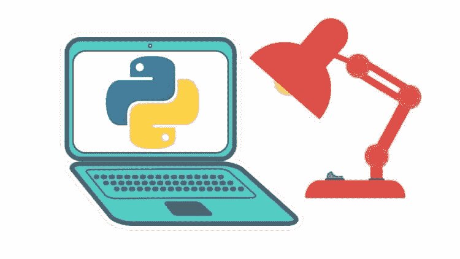
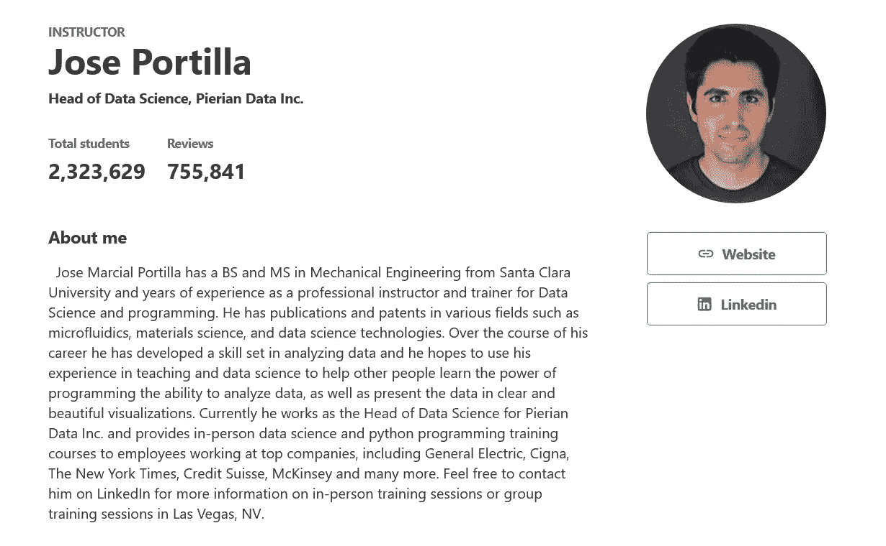

# 回顾——2023 年完整的 Python 训练营从零到英雄(由何塞·波尔蒂利亚在 Udemy 上撰写)值得吗？

> 原文：<https://medium.com/javarevisited/the-complete-python-bootcamp-udemy-course-review-b1ab69f232b5?source=collection_archive---------0----------------------->

## 我对 Udemy 上何塞·波尔蒂利亚为初学者编写的学习 Python 的最佳课程之一——完整的 Python 训练营——从零到英雄的评论。

image _ credit-Python boot camp Udemy

大家好，如果你正在寻找从零开始学习 Python 编程的最佳 Python 课程，或者想知道 Udemy 上的何塞·波尔蒂利亚课程的 [**完整的 Python 训练营——从零到英雄**](https://click.linksynergy.com/deeplink?id=JVFxdTr9V80&mid=39197&murl=https%3A%2F%2Fwww.udemy.com%2Fcourse%2Fcomplete-python-bootcamp%2F) 是否值得你花费时间和金钱，那么你来对地方了。

早些时候，我已经分享了[最好的初级 Python 课程](/better-programming/top-5-courses-to-learn-python-in-2018-best-of-lot-26644a99e7ec)以及一些[高级 Python 课程](/javarevisited/8-advanced-python-programming-courses-for-intermediate-programmer-cc3bd47a4d19)，在这篇文章中，我将回顾 Udemy 上最受欢迎的 Python 课程。

如果你赶时间，我强烈推荐你加入这个令人惊叹的课程，尤其是如果你正在学习 Python 的话。课程结构良好，课时少且重点突出，何塞·波尔蒂利亚是解释概念的大师。

它也有测验和练习，以确保你可以应用你所学的所有知识，它也有更全面的项目，实践学习。

鉴于你可以在 Udemy 上以 10 美元的价格买到这个 200 美元的课程，你不会后悔的。我从这门课中学到了很多，并向我的许多读者推荐了这门课，除了一两个人，大多数人都非常喜欢它。

现在，如果你还在这里，那么让我们继续这篇文章的其余部分，看看是否值得。

当今世界有各种各样的编程语言，如果你打算从事软件工程师职业，选择你应该学习什么语言变得非常困难，但这实际上取决于你应该擅长什么，比如作为一名前端 web 开发人员，你必须学习 [HTML](https://javarevisited.blogspot.com/2019/05/top-5-html-5-and-css-3-courses-for-web-developers.html) 和 [CSS](https://javarevisited.blogspot.com/2020/09/top-5-css-cascading-style-sheet-courses-for-beginners.html) ，对于 android 应用程序开发，你应该学习 [Java](https://javarevisited.blogspot.com/2020/04/top-5-courses-to-become-full-stack-java-developer-with-Angular-and-Reactjs.html#axzz6Nq9yk7Sc) 或 [Kotlin](/javarevisited/top-5-courses-to-learn-kotlin-in-2020-dfc3fa7706d8) 。

大多数语言都有特定的行业可以使用，但是如果有人告诉你有一种叫做 python 的语言可以在许多行业中使用呢？

Python 是一种高级语言，由一个名叫 Guido Van Rossum 荷兰人于 1989 年作为开源语言创建，但后来不知何故变得如此流行，许多开发人员将其扩展到几乎每个行业。

本文将与您讨论一个名为 [**的精彩在线课程，它是由何塞·波尔蒂利亚在 Udemy 上创建的 2023 年完整 python 训练营课程**](https://click.linksynergy.com/deeplink?id=JVFxdTr9V80&mid=39197&murl=https%3A%2F%2Fwww.udemy.com%2Fcourse%2Fcomplete-python-bootcamp%2F) ，教您从头开始学习 python，您将会看到我对该课程的评论，这样您就可以决定学习该课程还是选择另一门 Python 课程。

 [## Python 训练营:学习 Python 编程和代码培训

### 这是 Udemy 上针对 Python 编程语言的最全面、最直接的课程！你是否…

udemy.com](https://click.linksynergy.com/deeplink?id=JVFxdTr9V80&mid=39197&murl=https%3A%2F%2Fwww.udemy.com%2Fcourse%2Fcomplete-python-bootcamp%2F) 

# Udemy 课程回顾—2023 年完整 Python 训练营从零到英雄

现在，你知道 Python 是多么重要了，在线课程如何帮助你学习 Python，让我们来看看互联网上的[最佳 Python 课程](https://javarevisited.blogspot.com/2018/03/top-5-courses-to-learn-python-in-2018.html)。这也是 Udemy 最畅销的课程，已经有超过 110 万人注册了该课程。

## 1.讲师声誉

[何塞·波尔蒂利亚](https://click.linksynergy.com/deeplink?id=CuIbQrBnhiw&mid=39197&murl=https%3A%2F%2Fwww.udemy.com%2Fuser%2Fjoseportilla%2F)是一名出色的教师、培训师，也是 Udemy 平台上最成功、最著名的讲师之一，该平台有近 200 万名学生注册。

他拥有圣克拉拉大学机械工程领域的学士和硕士学位，在数据科学和 Python 语言以及 web 开发方面拥有多年的经验，如 [HTML](https://www.java67.com/2020/08/5-best-online-courses-to-learn-html-5.html) 、 [CSS](https://javarevisited.blogspot.com/2019/05/top-5-html-5-and-css-3-courses-for-web-developers.html) 、 [Django](/javarevisited/my-favorite-courses-to-learn-django-for-beginners-2020-ac172e2ab920) 和 [AI](/javarevisited/10-best-udemy-and-coursera-courses-to-learn-artificial-intelligence-in-2020-ec77ad13bdc1) 。

目前，他担任 Pierian Data Inc .的数据科学主管，为在顶级公司工作的员工提供面对面的数据科学和 python 编程培训课程，这些公司包括通用电气、Cigna、纽约时报、瑞士瑞信银行、麦肯锡等。

他也是最受欢迎的 Udemy 导师之一，拥有数百万学生和 Udemy 上的热门课程，如 [**SQL BootCamp**](https://click.linksynergy.com/deeplink?id=CuIbQrBnhiw&mid=39197&murl=https%3A%2F%2Fwww.udemy.com%2Fcourse%2Fthe-complete-sql-bootcamp%2F) 和[**Python for Data Science**](https://click.linksynergy.com/deeplink?id=CuIbQrBnhiw&mid=39197&murl=https%3A%2F%2Fwww.udemy.com%2Fcourse%2Fpython-for-data-science-and-machine-learning-bootcamp%2F)课程。

## 2.课程结构和内容质量

该课程非常全面，结构良好，重点是教你 [Python 编程语言](/javarevisited/10-best-python-certification-courses-from-coursera-4576890eb6b3)初学者成为高级编码水平，从设置环境开始，直到你创建一些高级程序，如 web scrappers 和 email sender。

让我们来看看这个令人敬畏的课程涵盖了什么。

## 2.1.概述和设置

每门编程课程都应该从概述课程内容开始，概述注册时您将学习和构建的内容，以及设置环境，例如安装 IDE 和语言本身。

本课程的第一部分通过一些免费的预览视频向您介绍了在您开始学习本课程之前必须了解的一切，甚至在您购买之前。

## 2.2.数据类型和操作

设置 IDE 和环境后，您将开始学习这门语言的基础知识，如简单的数学运算变量数据类型，如 integer 和 float，并通过一些代码测验来增强您的知识，您还将学习比较运算，如逻辑运算符 like AND NOT 或 operations 等等。

## 2.3.语句和函数

学完基础课程后，您将开始学习一些语句，如 for 和 while 循环以及 if、else 语句和列表，这些课程将使您能够创建一些简单的 python 程序，您将学习一些函数，这些函数将使您的程序更短，更易于其他开发人员阅读和开发。

## 2.4.面向对象编程

正如大多数人所知，Python 是一种[面向对象的编程语言](/javarevisited/my-favorite-courses-to-learn-object-oriented-programming-and-design-in-2019-197bab351733?source=---------103------------------)，这意味着它为 python 语言提供了许多优势，如数据冗余代码维护，以及在设计代码方面的一些好处，这将在本节以及其他一些概念(如错误处理和类)中介绍。

## 2.5.Python 模块

众所周知，Python 拥有丰富的库，这使得它能够应用于几乎每个行业，在本节中，您将学习一些可以在小程序中使用的库，如 DateTime 模块和[正则表达式](/javarevisited/7-best-regular-expression-courses-for-developers-to-learn-in-2021-9b8cb37bb3a5)。

## 2.6.Python 项目

现在，您已经在 python 中学习了很多先进的技术和库，可以开始创建一些项目，您将创建一个应用程序来处理图像、pdf 和电子表格，以及使用 python 发送电子邮件等。

# 3.人物评论

几乎**120 万的注册人数**和 4.6 分的评分(满分 5 分)表明，该课程令人难以置信且漫长，超过 21 小时的视频内容教会你掌握 Python 编程语言所需的一切。

每个部分的练习作业视频和语音都很好，复习部分的人很喜欢课程内容，这使得课程真正物有所值。

这里是加入本课程的链接— [**完整的 Python 训练营—从零到英雄**](https://click.linksynergy.com/deeplink?id=JVFxdTr9V80&mid=39197&murl=https%3A%2F%2Fwww.udemy.com%2Fcourse%2Fcomplete-python-bootcamp%2F)

以上就是 2023 年学习 Python 的**最佳课程。何塞·波尔蒂利亚在 Udemy 上发表的《2023 年完整 Python 训练营——从零到英雄》是学习 Python 的绝佳课程。**

它清晰、全面、引人入胜、易于操作，同时非常经济实惠。我强烈推荐这个课程给任何想在 2023 年 [**学习 Python 的人**](/swlh/5-free-python-courses-for-beginners-to-learn-online-e1ca90687caf) 及以后。

Python 已经统治了世界上几乎每一个行业，人们将这种语言用于数据科学、后端 web 开发、人工智能和无人驾驶汽车，并被谷歌和网飞等大公司采用，因此学习这种语言真的值得你为之付出时间和努力。

如果你真的想深入学习 Python，这里有更多的免费和付费资源供你进一步学习

*   [学习数据科学 Python 的 5 个理由](/javarevisited/5-reasons-to-learn-python-for-data-science-16a9d4c44d6d)
*   [面向数据科学和机器学习的 8 大 Python 库](https://javarevisited.blogspot.com/2018/10/top-8-python-libraries-for-data-science-machine-learning.html)
*   [Python vs . Java——初学者应该学习哪种编程语言？](/javarevisited/python-or-java-which-programming-language-beginners-should-learn-in-2020-de992b2650ec)
*   [10+用 Python 学习数据科学的书籍和课程](/javarevisited/top-10-resources-to-learn-data-science-and-machine-learning-best-of-lot-f153e1f44e89)
*   [10 门 Python 课程和程序员认证](https://javarevisited.blogspot.com/2020/02/10-best-coursera-courses--for-python.html)
*   Python 和 JavaScript，从哪个开始比较好？
*   [深入学习 Python 的 10 门免费在线课程](https://javarevisited.blogspot.com/2018/12/10-free-python-courses-for-programmers.html)
*   [适合初学者学习的 10 本最好的 Python 书籍](/javarevisited/my-favorite-books-to-learn-python-in-depth-77465633b46e)
*   [面向程序员的 10 本免费 Python 编程书籍](http://www.java67.com/2017/05/top-7-free-python-programming-books-pdf-online-download.html)
*   [初学 Python 的 8 个 Python 项目](/javarevisited/8-projects-you-can-buil-to-learn-python-in-2020-251dd5350d56)
*   [免费学习 Python 编码的五大网站](https://javarevisited.blogspot.com/2019/09/5-websites-to-learn-python-for-free.html)

感谢您阅读本文。如果你喜欢这篇 *Udemy 最好的 Python 课程和我的评论*，那么请把这篇文章分享给你的朋友和同事。如果您有任何问题或反馈，请留言，如果您有我应该参加或阅读的 Python 课程或书籍，请随时与我们分享。

**P. S. —** 如果你喜欢互动阅读和边做边学，而不是阅读书籍或观看视频，那么你也可以看看 Educative 上的 [**Python 101 课程**](http://bit.ly/2OgKdKH) ，这是一个互动学习平台，允许你在浏览器上运行 Python 代码。这是一门通过实践来学习 Python 的很棒的课程，尤其是对初学者来说。

 [## Python 101:交互式学习如何用 Python 3 编程-交互式学习

### 欢迎学习 Python 101！我创建这个课程是为了帮助你学习 Python 3。我的目的是让你熟悉…

www.educative.io](https://www.educative.io/courses/python-101-interactively-learn-how-to-program-with-python-3?affiliate_id=5073518643380224)