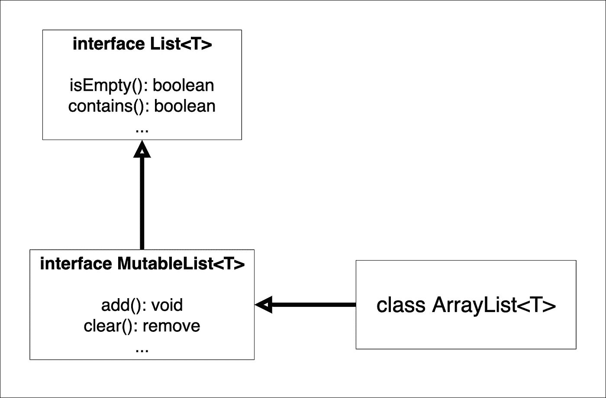
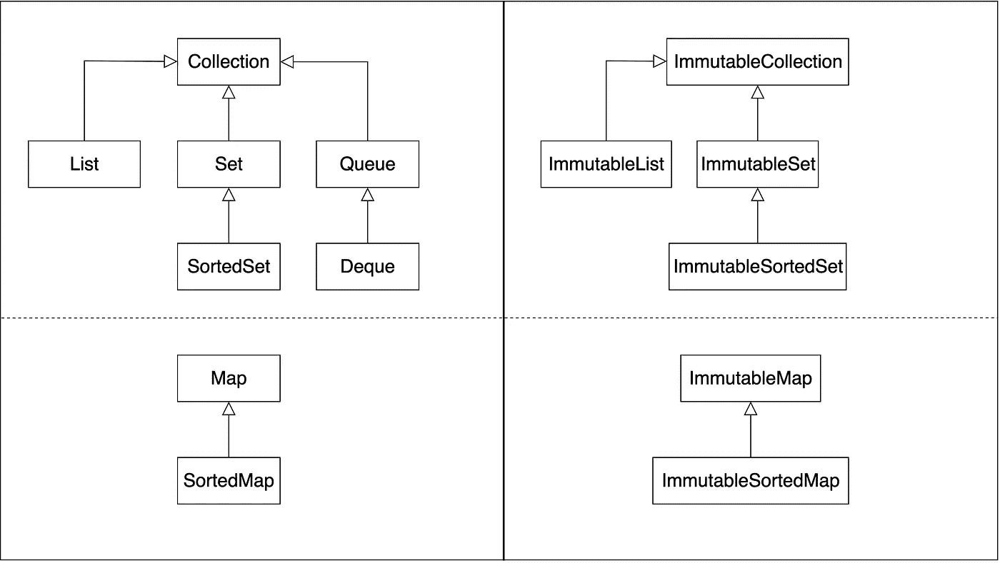

# “Java 集合框架”的阴暗面

> 原文：<https://medium.com/javarevisited/the-dark-side-of-java-collections-framework-881a9f142231?source=collection_archive---------2----------------------->

所有的 Java 开发者几乎每天都会用到`List`、`Set`、`Map`这样的接口。这些集合为我们提供了非常有用的功能，有助于创建和维护复杂的软件。但是你有没有感觉到有些事情不对劲？Java 集合是不是太灵活了？你曾经和你的队友讨论过使用列表的“正确”方式吗？嗯，我想你见过。我认为 Java Collections 框架的核心有一个很大的设计问题。所以，我们来讨论一下。


来自 [Pixabay](https://pixabay.com/) 的[erikawittleb](https://pixabay.com/users/ErikaWittlieb-427626/?utm_source=link-attribution&amp;utm_medium=referral&amp;utm_campaign=image&amp;utm_content=1724901)的图片

# 没有真正的不变性

Java Collections Framework 从一开始就没有考虑过任何只读或不可变的东西，因为即使是`Collection`接口也有像`clear`、`add`和`remove`这样的方法。这种方法本来是可以接受的，但是最近，Java 语言已经通过众所周知的实用程序得到了增强，比如`Arrays.asList<T>(T... element)`、`Collections.emptyList()`、`Collections.singletonList<T>(T element)`和许多其他实用程序。那么，他们怎么了？让我们仔细看看。

```
List<Integer> list = Arrays.asList(21, 22, 23); 
list.add(24) *// UnsupportedOperationException, but why?*
```

什么鬼东西？我们知道`List`是从拥有`add`方法的`Collection`扩展而来的。所以，问题是`Arrays.asList`返回了一个限制添加新项目的实现。现在我们面临着一个奇怪的局面。虽然`List`接口为我们提供了一个方法，但是我们不能调用它。但问题是模糊会变得更糟。看看这个。

```
List<Integer> list = Arrays.asList(21, 22, 23); 
list.set(0, 121);
System.out.println(list); *// [121, 22, 23]*
```

这里没有例外。因此，我们可以修改列表，但不能在其中插入新的项目。我不知道为什么会做出如此奇怪的设计决定。但说实话，这个方法的 JavaDoc 恰当地描述了这种情况。

```
The returned list implements the optional Collection methods, except those that would change the size of the returned list. Those methods leave the list unchanged and throw UnsupportedOperationException.
```

那么，它解决歧义了吗？不完全是。想象一下，你需要写一个接受`List<String>`的方法。我认为猜测您收到了哪个实现或者在每个`set`或`add`调用上写下`try {} catch(Exception e)`都不会令人愉快。不管怎样，我们再看一个例子。

```
List<Integer> list = ...
List<Integer> filtered = filter(list);
```

`filter`方法接受`List`实现并返回一个过滤后的实现，但是结果返回了什么列表呢？它是一个新实例还是同一个修改过的实例？可以修改原来的列表吗，会影响结果吗？顺便问一下，我们如何知道作为参数传递的是什么实现？也许无法添加或删除条目(例如，这种实现会在`Collections.emptyList()`之前返回)。如您所见，即使是简单的代码片段也会产生如此大的混乱。可以说我们可以使用 [Java Stream API](https://docs.oracle.com/javase/8/docs/api/java/util/stream/package-summary.html) 。嗯，这是真的。`Stream`在每次`map`、`filter`或其他方法调用时创建一个新对象。问题解决了吗？不。我们有一个方便的外观来操作集合，但这并不意味着集合摆脱了模糊性和意外的行为。那么，有什么解决办法呢？其实有好几个。

# 遗传可变性

这就是 Kotlin 作为一个新的集合架构所提供的。我们在子接口中定义所有的变异方法，而不是把它们放在一个地方。看起来是这样的。



简化的科特林收藏架构

那看起来很不错。让我们再看一下前面的例子。

```
val list: List<Int> = ...
val filtered: List<Int> = filter(list);
```

事实上，`List`没有任何变异方法。在这种情况下，我们可以确定`filtered`是一个新对象，并且`list`没有被修改。就这样吗？一个让代码干净可维护的绝对公式？再说一次，不是真的。

```
val mutableList: ArrayList<Int> = ArrayList()
mutableList.add(1)
...
someAsyncTask(mutableList) // accepts List<Int>
...
mutableList.clear()
```

虽然已经执行了`someAsyncTask`的线程无权修改列表，但是另一个线程意外地清除了它，因为原始对象实现了`MutableList`。所以，也可以解释为`List`。我必须承认 JavaDoc 对于`List`接口再次有了它的权威性。

```
Creates a new read-only list with the specified **[size]**, where each element is calculated by calling the specified **[init]** function.
```

*只读*不代表*不可变*。这意味着当前线程不能访问任何变异方法，但是不能保证这个列表不能被其他人修改。所以，我们有一些理论上可以被除了我们之外的任何人修改的东西。我认为这样的行为不是我们所要寻找的，但无论如何，这种方法仍然比 Java 实现的要好。

# 分离可变性

我们可以定义一个单独的层次结构，而不是继承只读集合。



真正不可变的集合

如果`Collection`和`ImmutableCollection`没有公共接口，那么就没有办法将一个集合转换为另一个集合，或者将一个可变列表传递给接受不可变列表的方法。这种方法是由一些库开发的，如 [Vavr](https://www.vavr.io/vavr-docs/#_collections) 、 [Eclipse Collections](https://www.eclipse.org/collections/#start) 或 [Java-Useful-Utils](https://github.com/SimonHarmonicMinor/Java-Useful-Utils) 。它允许我们严格区分不可变实体和可变实体。如果你通过了`ImmutableSet`，你可以确定没有人能够意外地修改这个集合。

> 可以注意到，所有这些集合都有一个公共接口。那就是`Iterable<T>`。不仅如此，`Iterable.iterator()`返回的`Iterator`还有`remove`方法，默认抛出异常。然而，这意味着即使是不可变的集合也不是完全不可变的。所以，这是我们想要使用 Java `for-each`循环必须付出的代价，因为实现`Iterable<T>`是唯一的办法。

# 结论

我坚信不变性是一个不应该被忽视的基本要素。也许有一天 [JCP](https://www.jcp.org/en/home/index) 会同意这个观点，但是现在，仅此而已。