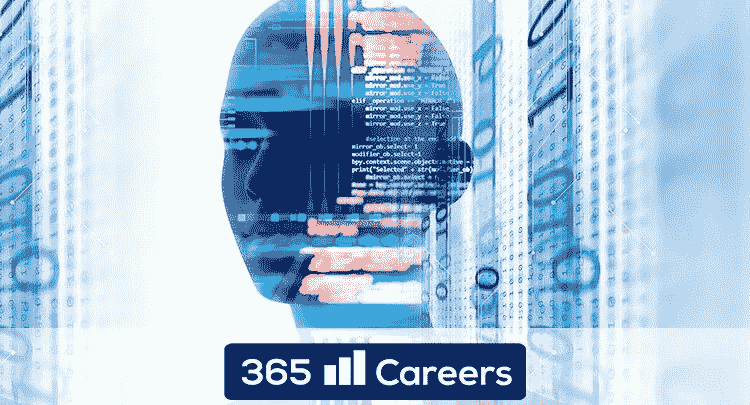
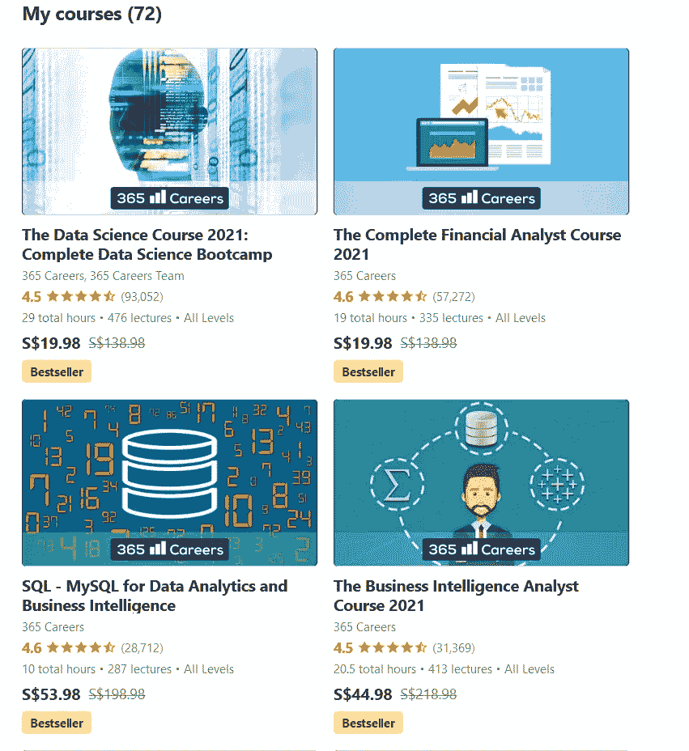

# Udemy 上的《数据科学课程 2023:完整的数据科学训练营课程》值得吗？[综述]

> 原文：<https://medium.com/javarevisited/the-data-science-course-2021-complete-data-science-bootcamp-udemy-course-review-is-it-worth-it-3b8e84166d1f?source=collection_archive---------0----------------------->

## 我对数据科学课程 2023 的评论:通过 365 个职业完成 Udemy 的数据科学训练营课程。

image_credit — Udemy

大家好，如果你想学习数据科学并寻找最好的课程，或者想加入*数据科学课程 2023:在 Udemy* 上完成数据科学训练营课程，但不确定这门课程是否适合你，那么你来对地方了。

此前，我已经分享了 [**最佳数据科学课程**](/javarevisited/my-favorite-data-science-and-machine-learning-courses-from-coursera-udemy-and-pluralsight-eafc73acc73f) ，在本文中，我将在 2023 年回顾这一热门的 Udemy 课程以学习数据科学。

在学习数据科学方面，这是最受欢迎的 Udemy 课程之一，拥有超过 36 万名学生，与我最喜欢的 Udemy 数据科学和机器学习导师基里尔·叶列缅科教授的 [**数据科学 A-Z 课程**](https://click.linksynergy.com/deeplink?id=JVFxdTr9V80&mid=39197&murl=https%3A%2F%2Fwww.udemy.com%2Fcourse%2Fdatascience%2F) 不相上下。

如今，公司比以往任何时候都更多地收集有关客户及其服务的信息，正因为如此，他们需要员工更好地解释这些数据，并将其应用于决策，这就产生了对数据科学家的真正力量和需求。

数据科学是从收集的数据中获得洞察力以做出更好决策的领域。这一领域的认证可以促进你的职业生涯和简历，无论你是该行业的新手还是希望了解更多行业信息的专业人士，数据科学课程肯定会帮助你实现这一切。

有很多课程可以帮助你学习数据科学，但并不是所有的课程都是好的，并教会你在这个领域开始职业生涯所需的一切，我发现了一门课程， [**数据科学课程 2023:完整的数据科学训练营**](https://click.linksynergy.com/deeplink?id=JVFxdTr9V80&mid=39197&murl=https%3A%2F%2Fwww.udemy.com%2Fcourse%2Fthe-data-science-course-complete-data-science-bootcamp%2F) ，它将帮助你学习开始职业生涯所需的所有必要技能。

 [## 数据科学培训课程:数据科学家训练营

### 数据科学家是本世纪最适合蓬勃发展的职业之一。它是数字化的，面向编程的，并且…

udemy.com](https://click.linksynergy.com/deeplink?id=JVFxdTr9V80&mid=39197&murl=https%3A%2F%2Fwww.udemy.com%2Fcourse%2Fthe-data-science-course-complete-data-science-bootcamp%2F) 

# Udemy 课程回顾—数据科学课程 2023:完整的数据科学训练营—值得吗？

既然你已经熟悉了数据科学以及为什么它值得学习，那就让我们从 [Udemy](https://click.linksynergy.com/deeplink?id=CuIbQrBnhiw&mid=39197&murl=https%3A%2F%2Fwww.udemy.com%2F) 开始一步一步地回顾这门热门的数据科学，看看这门课程是否适合你。

## 1.讲师声誉

这门课程的指导老师是一家名为 [365 careers](https://click.linksynergy.com/deeplink?id=JVFxdTr9V80&mid=39197&murl=https%3A%2F%2Fwww.udemy.com%2Fuser%2F365careers%2F) 的公司，其中有许多专家专攻数据科学和人工智能等许多领域。

该公司被评为 udemy 最优秀的讲师之一，有超过 100 万名学生注册，他们有 60 多门课程，涉及金融、项目管理、excel、数据科学、机器学习、python 等等。

以下是他们在 Udemy 上的一些[畅销课程，](https://click.linksynergy.com/deeplink?id=CuIbQrBnhiw&mid=39197&murl=https%3A%2F%2Fwww.udemy.com%2Fcourse%2Fthe-data-science-course-complete-data-science-bootcamp%2F)你可以看到超过 150 万人已经信任 365 职业来学习数据科学和数据分析技能。

## 2.课程结构和内容质量

该课程旨在培养您的技能，如学习[数学](/javarevisited/5-best-mathematics-and-statistics-courses-for-data-science-and-machine-learning-programmers-bf4c4f34e288)、 [python](https://javarevisited.blogspot.com/2019/09/5-websites-to-learn-python-for-free.html) 等，因此，如果您真的对开始数据科学职业生涯感兴趣，您应该参加该课程，现在让我们看看该课程将教会您什么:

## 2.1.数据和数据科学

本节将从理论上教你数据科学，你将知道为什么企业需要它，以及这一科学与其他领域的关系，如[机器学习](/javarevisited/top-10-machine-learning-and-data-science-certifications-and-training-courses-for-beginners-and-a6308497b764)、商业智能、[人工智能](/javarevisited/7-best-courses-to-learn-artificial-intelligence-in-2020-26d59d62f6fe)等等。您还将了解数据科学中用于处理数据的一些技术。

## 2.2.学习概率

在深入了解什么是数据科学以及它与其他领域的关系后，您将开始学习数学和概率，以及如何使用这种技术做出明智的决策和分析数据。

## 2.3.学习统计学

我喜欢这门课程的一点是，它不仅为你提供了像 [python](https://www.java67.com/2020/05/top-5-courses-to-learn-python-in-depth.html) 这样的数据科学家所需的工具，还教会你如何像数据科学家一样思考，这一部分将教你统计学以及如何像科学家一样使用假设。

## 2.4.学习 Python

在本节中，您将开始一堂实践课，学习一门 [python 编程语言](/better-programming/top-5-courses-to-learn-python-in-2018-best-of-lot-26644a99e7ec)，以及如何从头开始使用它，如变量、函数、数据类型、条件等等。本节将使您成为 python 语言的中级用户。

## 2.5.学习机器学习

在学习了 python 的一些课程后，你将在下一节中使用它进行机器学习，你可以让计算机使用数据而不是编程来学习，以及一些算法，如[逻辑回归](https://www.java67.com/2020/07/top-5-machine-learning-algorithms-for-beginners.html)，这将帮助你学习你的数据和更多。

## 2.6.学习深度学习

有时你有大量数据，而机器学习算法无法处理大数据，所以你必须使用一种名为[深度学习](https://www.java67.com/2019/01/5-free-courses-to-learn-machine-and-deep-learning-in-2019.html)的科学，它将创建一个模拟人脑的神经网络来学习这些数据，你将使用谷歌开发的名为 [TensorFlow](https://becominghuman.ai/top-10-courses-to-learn-tensorflow-for-machine-learning-in-2020-39a31e7cd84b) 的库。

## 2.7.个案研究

成为一名优秀的数据科学家不仅需要学习在该领域工作所需的工具，还需要亲自实践，以便了解更多信息。本节将介绍如何获取一些真实世界的数据，并将所学知识应用于这些数据。

## 3.人物评论

这门庞大的课程被评为该平台中最畅销的课程之一，注册人数超过 36 万人，评分为 4.5 分，如果您确实是一名初学者，并且希望成为数据科学领域的专业人士，强烈推荐这门课程。

超过一半的学生给了 5 颗星，内容是为初学者创建的，易于理解。

这里是 Udemy 上参加本课程的链接— [**数据科学课程 2023:完整的数据科学训练营**](https://click.linksynergy.com/deeplink?id=JVFxdTr9V80&mid=39197&murl=https%3A%2F%2Fwww.udemy.com%2Fcourse%2Fthe-data-science-course-complete-data-science-bootcamp%2F)

## **本课程的主要特点:**

*   28.5 小时点播视频
*   90 篇文章
*   500 个可下载资源
*   终身访问
*   通过手机和电视访问
*   需要超过 7 小时的学习时间
*   竣工证明

以上是我对来自 Udemy 的*数据科学课程 2023:完整的数据科学训练营课程*的评论。学习数据科学将在未来给你带来许多机会，因为世界各地的许多公司都在雇用数据科学家来学习他们的数据并做出决策，如果你计划创建自己的企业来研究市场和你的想法中的机会，你也会需要它。

**你可能喜欢的其他数据科学和机器学习资源**

*   [学习数据科学 Python 的 5 个理由](/javarevisited/5-reasons-to-learn-python-for-data-science-16a9d4c44d6d)
*   [面向初学者的 10 门免费数据科学课程](/javarevisited/10-free-data-science-online-courses-for-beginners-a5fe78c2cb7b)
*   [2023 年加入 10 门免费机器学习课程](/javarevisited/10-free-machine-learning-courses-for-beginners-181f83b4c816)
*   [面向数据科学和机器学习的 8 大 Python 库](https://javarevisited.blogspot.com/2018/10/top-8-python-libraries-for-data-science-machine-learning.html)
*   [用 Python 学习数据科学的 10 多本书籍和课程](/javarevisited/top-10-resources-to-learn-data-science-and-machine-learning-best-of-lot-f153e1f44e89)
*   [10 门 Python 课程和程序员认证](https://javarevisited.blogspot.com/2020/02/10-best-coursera-courses--for-python.html)
*   [10 大最佳机器学习认证和课程](/javarevisited/top-10-machine-learning-and-data-science-certifications-and-training-courses-for-beginners-and-a6308497b764)
*   [深入学习 Python 的 10 门免费在线课程](https://javarevisited.blogspot.com/2018/12/10-free-python-courses-for-programmers.html)
*   [适合初学者学习的 10 本最好的 Python 书籍](/javarevisited/my-favorite-books-to-learn-python-in-depth-77465633b46e)
*   [面向程序员的 10 本免费 Python 编程书籍](http://www.java67.com/2017/05/top-7-free-python-programming-books-pdf-online-download.html)
*   [8 个 Python 项目，适合初学者学习 Python](/javarevisited/8-projects-you-can-buil-to-learn-python-in-2020-251dd5350d56)
*   [免费学习 Python 编码的五大网站](https://javarevisited.blogspot.com/2019/09/5-websites-to-learn-python-for-free.html)

感谢您阅读本文。如果你喜欢这篇 *Udemy 最好的数据科学课程——《数据科学课程 2023:完整的数据科学训练营回顾*，那么请把这篇文章分享给你的朋友和同事。如果您有任何问题或反馈，请留言，如果您有我应该参加或阅读的 Python 课程或书籍，请随时与我们分享。

**P. S. —** 如果你更喜欢 Coursera 的课程，那么你也可以去看看约翰霍普金斯大学的 [**数据科学专业**](https://coursera.pxf.io/c/3294490/1164545/14726?u=https%3A%2F%2Fwww.coursera.org%2Fspecializations%2Fjhu-data-science) ，在 2023 年开始你的数据科学职业生涯。这是初学者和有经验的开发人员最喜欢的数据科学资源之一。

 [## 数据科学

### 约翰·霍普金斯大学的使命是教育学生，培养他们终身学习的能力

coursera.pxf.io](https://coursera.pxf.io/c/3294490/1164545/14726?u=https%3A%2F%2Fwww.coursera.org%2Fspecializations%2Fjhu-data-science)