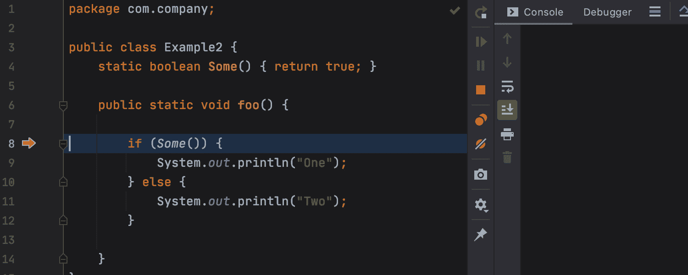

# 调试器清单—第一部分

> 原文：<https://medium.com/javarevisited/the-debugger-checklist-part-i-b5bf56765bb8?source=collection_archive---------4----------------------->

## 通过遵循有组织的过程和利用您已经拥有的工具来赢得调试

我天生就是一个没有条理的人。当我遵循一个过程时，那是出于习惯和直觉。但是，当一个调试问题让我夜不能寐，让我觉得在新西兰养羊似乎是一个很有吸引力的选择时，那就是我需要退后一步，有条不紊地完成这个过程的时候。这个过程从不失败。当你走过它，你可以跟踪任何问题。

现在我要跳过很多常见的建议。大多数调试教程都是从与过程相关的事情开始的:提出一个问题，作为测试用例重现等等。我认为网上有很多这样的文章。人们用它来填充，因为他们认为调试是一个简单的过程。有时候是这样。但是正如我们将在这篇博客中了解到的，这个容易让人误解的简单过程有很大的深度和广度。

我们将跳到这样一个点，您有一个可以重现的 bug(无论是一致的还是不一致的),但是您不理解或者无法证明原因。

这不是一个初学者的教程，这是一个不同的帖子，在其中我将涵盖许多额外的东西，并进入更多的细节。

# 在我的机器上工作

如果这不能在本地重现，您可能需要利用远程调试。这对于大多数现代开发工具来说相当容易，例如[本文](https://lightrun.com/debugging/how-to-debug-remotely-in-intellij/)涵盖了在 IntelliJ/IDEA 中远程[调试 Java 进程的过程](https://javarevisited.blogspot.com/2011/02/how-to-setup-remote-debugging-in.html)。您可以将相同的技术应用于大多数 ide 和语言/平台。

这里的主要问题是这是否只发生在生产环境中。在这种情况下，标准的远程调试是非常危险的。无论是在安全性方面(这是不存在的)，还是在服务器的可靠性方面。注意，有很多方法可以安全、方便地调试远程服务器，比如 [Lightrun](https://www.lightrun.com/) 。

如果没有，你可以试试下面的技巧:

*   在本地运行，但是通过隧道连接到远程数据库——我通常只使用 SSH 隧道，但是我听说过关于[传送](https://goteleport.com/)的好消息
*   记录用户发送的确切入口点凭据，并尝试在本地重现请求

根据我的经验，这是调试远程问题时最难做的事情之一。尤其是在群集/多语言环境中。

# 如果 Bug 不一致

这些是我们最需要帮助的难以追踪的错误。这些也是人们对调试失去信心的 bug。我将把这个问题分为两种不同的情况:

*   很少发生
*   如果我们停在一个断点上，就不会发生

在这两种情况下，最好的解决方案是日志记录，是的，日志记录是调试的一种形式…我们可以添加一个日志，“应用代码更改”(或编辑并继续)，并立即在我们的日志中看到输出。

如果当我们有一个断点时问题没有发生，即使有一个日志，它也可能不会重现。那是因为问题是线程问题。调试一个[竞争条件](http://javarevisited.blogspot.sg/2012/02/what-is-race-condition-in.html#axzz59AbkWuk9)或者一个[死锁](https://javarevisited.blogspot.com/2018/08/how-to-avoid-deadlock-in-java-threads.html#axzz6ccm5KWKs)实际上并不像有时想象的那么痛苦。我将在本文稍后讨论这个问题。请注意，调试这是“容易的部分”，修复它…这是困难的部分…

如果这种情况很少发生，那么我们仍然需要验证这与线程问题没有直接关系。在这种情况下，我经常确保记录当前线程，以查看是否与调用线程相关。我还尝试记录堆栈，看看问题是否因有意义的堆栈而异。一个很酷的技巧是对堆栈进行哈希或校验和处理，以减少噪声。

我们可以在我们的日志中使用这些代码，然后我们可以立即浏览这些代码，以发现错误是否与特定堆栈的调用相关。

# 条件断点

你可能知道[条件断点](https://www.java67.com/2018/01/how-to-remote-debug-java-application-in-Eclipse.html)，但是你最后一次使用它们是什么时候？

如果那是最近的事，那就恭喜你了！你是被选中的少数人之一。

这个特性并没有得到应有的使用。例如，我们可以使用先前校验和当前堆栈代码来验证所有调用都来自同一个堆栈。我们可以使用该方法的输出作为条件。

假设我们正在跟踪的 bug 仅在处理特定用户的数据时发生。在条件为`userId == problematicUser`的地方创建一个断点，可以让我们专注于重要的部分。我们可以使用线程名作为条件来有效地调试竞争条件。

条件断点存在一些问题。例如，它们会影响性能，导致执行速度降低到我们无法正确重现问题的程度。

# 重复冲洗

你知道那种感觉，当你花了很长时间才把所有的事情都做对，然后你走得太远了，你“错过了”！这是最令人沮丧的感觉…它让你想发脾气。

嗯，有一个解决办法。我们都应该知道“运行到光标处”，这很好。但是大多数 ide 也支持 Go to Cursor，它允许你操作指令指针，将执行向后(或向前)移动到一个任意(合法)的位置。

奇怪的是，直到最近 IntelliJ 还不支持这一点。它仍然不是…但是有一个插件！

这个[跳转行插件](https://plugins.jetbrains.com/plugin/14877-jump-to-line)，是为数不多的必须为 [IntelliJ](/javarevisited/7-best-courses-to-learn-intellij-idea-for-beginners-and-experienced-java-programmers-2e9aa9bb0c05?source=---------16------------------) 提供的插件之一，对每个人都有用。它是生命的拯救者和快乐的增强者。有了这个插件，你可以将左边的执行箭头拖动到一个新的位置…太神奇了。

再加上在监视窗口中编辑变量值的能力，您就可以在单步执行代码块的同时在方法中测试您的理论。您可以很容易地模拟许多需要几个小时(如果不是几天)才能重现的场景作为测试用例。

# 待续

下次我将回顾应用程序的调试过程。这是一个非常简单的过程，但像往常一样“细节决定成败”。

你有自己的流程吗？

我很想听听你的想法和调试技巧。