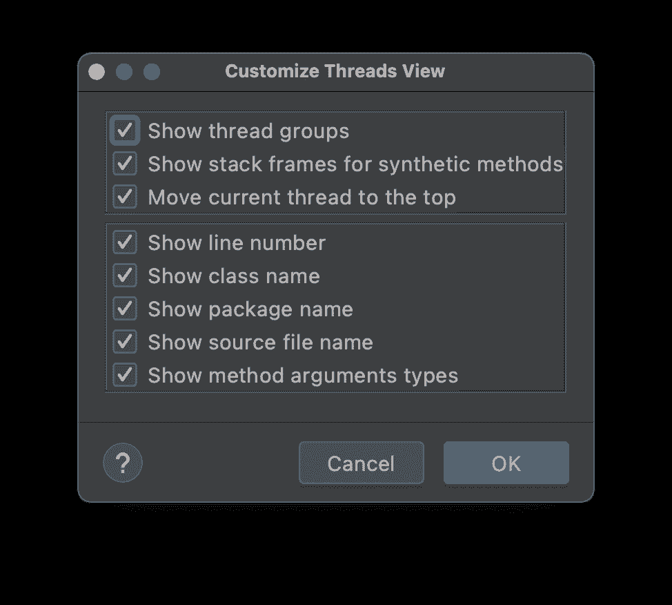

# 调试器清单

> 原文：<https://medium.com/javarevisited/the-debuggers-checklist-ea68fdf4ea68?source=collection_archive---------2----------------------->

在[调试器清单第一部分](https://talktotheduck.dev/the-debugger-checklist-part-i)中，我介绍了一些高级概念，并回顾了一些您可以做的常见事情。在这一部分中，我们将认真研究这个过程。再次强调，这是浓缩的。

我不想讨论问题跟踪器、单元测试和适当的 TDD。我认为有很多资源可以涵盖所有这些内容。这些帖子的焦点是调试过程本身，它作为“工具”经常被忽视。有很多技术可以区分经验丰富的开发人员和初级开发人员。此外，有许多小的进步和变化，我们不可能跟上。我想涵盖所有这些事情(一些在未来的职位)。

说完了，让我们继续…

# 该过程

希望此时您能够在调试器中重现您的问题。甚至可能把它限制在一个你能穿过的小区域。

现在我们需要实际跟踪问题并解决它。人们认为这很难量化，但事实并非如此。归结起来就是将问题分解成我们可以解决的可管理的部分:

*   尽可能做出最简单的假设
*   验证假设
*   当没有发现 bug 时:
    *缩小假设
    *验证缩小的假设

你可能会说:“好吧，好吧…”这是显而易见的……
的确如此。问题是我们没有正确地应用它们，并且不知何故跳过了这些步骤中的许多细微差别。

在这个阶段，橡皮鸭(和鸭子说话)变得有用。这是和某人(或某物)谈论你的问题和假设的过程。当我们大声说出来，甚至试图在脑海中用语言表达出来，这有助于澄清我们被误导的假设。

我将在以后的“技巧和窍门”文章中尝试更多的这类技巧。

# 最简单的假设

(图片来源:[https://weheartit.com/entry/59844817](https://weheartit.com/entry/59844817))

这是我们大多数人失败的地方。我们假设。

我最近偶然遇到了一个 bug。我注意到堆栈跟踪中一个变量的值。很明显已经损坏了。因为我使用的是调试代理，所以我错误地认为这是问题的根源。但是我一次又一次地试图验证。当所有这些都失败后，这让我在代码中发现了一个严重的错误。

显然，我们不能从检验“1 + 1 = 2”的假设出发。所以我们需要把范围缩小到适用的假设。这个“技巧”并不是“最终目的”,但它是验证许多常见假设的一个非常有用的方法。

## 调试“工作代码”

回顾您的假设的最好方法是遍历工作代码。如果您的代码在情况 X 下失败，而在情况 Y 下成功，请首先尝试情况 X。了解代码工作的原因，并单步执行代码块。

然后尝试案例 y。这应该给你两个案例，你可以很容易地比较，以帮助你缩小嫌疑人。

如果这不适用或没有带您到任何地方，您需要查看以下内容:

*   例外
*   状态
*   线程/同步
*   计时和比赛

这些我是按照难度和概率排序的。

## 例外

大多数问题都是状态问题，但是异常相对容易发现。因此，只需为所有的[异常](https://javarevisited.blogspot.com/2013/04/JUnit-tutorial-example-test-exception-thrown-by-java-method.html)设置一个断点，并验证在您调用的某个方法等的幕后没有发生任何“可疑”的事情。随着您在流程中的移动，慢慢地过滤掉“有效的”异常。

典型的异常是“响亮的”和“明显的”,所以除非有人悄悄地捕捉到异常(这种情况会发生),否则您应该是清白的。

我还强烈推荐一个 linter 规则，它可以检查被隐藏/未被记录的异常。例如 checkstyle 支持[这个](https://checkstyle.sourceforge.io/config_blocks.html)检查阻塞空的 catch 块。它仍然不能阻止在那个块中“什么都不做”的愚蠢代码，但至少这是一个开始。

## 状态

虽然线程是棘手错误的来源，但大多数错误都是由糟糕的应用程序状态造成的。尝试将被修改的状态元素和代码块读取的状态分开。

假设可以，在[调试](https://javarevisited.blogspot.com/2011/07/java-debugging-tutorial-example-tips.html#axzz6bYzaddcE)期间，通过设置一个变量值，尝试在断点内覆盖它。这是一项伟大的功能，但大多数开发人员并没有经常使用。如果你能够将一个特定变量的值缩小为问题的原因，你就已经在解决问题的路上了。

如果这没有帮助，请尝试识别可能有问题的特定字段。大多数调试器会让您在字段上放置一个断点，以便观察对所述字段的修改…我在咨询时使用过几次该功能，人们总是很惊讶您可以这样做…

在 [IntelliJ](/javarevisited/7-best-courses-to-learn-intellij-idea-for-beginners-and-experienced-java-programmers-2e9aa9bb0c05?source=---------9------------------) 中，字段断点的图标看起来不同。但是它和其他断点一样，你可以对它应用一个条件，然后查看堆栈等等。

现在，如果问题仍然存在，一切都失败了…尝试更改代码，返回硬编码状态或工作状态。我通常不喜欢需要修改代码进行调试的技术，因为我认为这是两个不同的任务。然而，如果你别无选择，这可能是你唯一的选择。当然，你应该使用“重新加载改变的类”(或者应用代码改变，编辑并继续等)。)如果适用。

请注意，还有一些对调试内存访问有用的低级内存断点。我们将在讨论调试本机代码时讨论这些，我计划在将来讨论这些内容。

## 线程/同步

线程问题很难解决…这不是我们要讨论的内容。我们将只专注于发现和理解 bug，这是一个更容易(可管理)的任务。

检查线程问题最简单的方法就是我之前提到的记录你当前的线程和/或堆栈。在导致问题的代码块中这样做。然后在代码块使用的字段上添加一个类似的日志断点。日志中的线程违规应该非常清楚。

您还可以在断点期间获得线程转储，这是几乎所有调试器的一个特性。例如，在 IntelliJ/IDEA 中，您可以选择“运行”->“调试操作”->“获取线程转储”。这没有遍历堆栈帧有用，但这是一个开始。

特别是在 IntelliJ/IDEA 中，我建议右击 debug 选项卡并启用 thread 视图。然后，通过在选项卡内右键单击并选择“自定义线程视图”来启用线程组，如下所示:

它以层次结构的形式提供了一个更加“干净”的线程视图，而不是 IntelliJ 中的默认外观，后者更适合单线程调试。

**死锁和活锁**

死锁通常很明显。应用程序卡住了，你按下暂停，调试器显示哪个线程卡住了，等待哪个监视器。然后，您可以查看其他线程，看看谁在控制监视器。解决这个问题可能很棘手，但是调试器确实“告诉我们”发生了什么。

对于活锁，我们持有一个监视器，而需要另一个。另一个线程正在占用另一个监视器，并且需要我们占用的那个监视器。因此，从表面上看，似乎两者都在工作，没有卡住。有点像两个人在走廊上跑来跑去，试图给对方让路。不幸的是，活锁可以在线程没有被物理“阻塞”的情况下发生，因此代码可能在表面上看起来很好，而在堆栈跟踪中没有清晰的监视器。

对此进行调试需要在 thread 视图中一次遍历一个线程，并检查每个线程，看它是否在等待潜在的争用资源。这在技术上并不难，但非常乏味。这就是为什么我建议在上面的线程视图中启用线程组。一个典型的应用程序有许多线程(随着 project [Loom](https://inside.java/2021/08/13/new-loom-ea-builds/) 的出现，会有更多线程)。这产生了大量的噪音，我们可以通过将线程分组并集中在重要的部分来减少噪音。

**性能和资源匮乏**

使用调试器跟踪由监视器争用引起的性能问题有点困难。我通常建议随机暂停代码并检查应用程序中正在运行的线程。线程 X 是不是一直拿着显示器？

可能那里有问题。

然后，您可以推导假设，并通过记录锁/ [同步块](https://www.java67.com/2013/01/difference-between-synchronized-block-vs-method-java-example.html)的入口/出口点来证明它们。

请注意，您可以使用分析器，它有时会有所帮助，但在某些情况下可能会将您引入歧途。我计划在以后的文章中讨论分析器。

资源匮乏是性能问题的一个分支。您通常会将其视为一个极端的性能问题，这通常只在您尝试扩展时才会发生。在这种情况下，一个线程需要的资源总是很忙，我们就是无法得到它。例如，我们有太多的线程和太少的数据库连接。或者线程太少而传入的 web 请求太多。这个问题往往根本不需要调试器。您的环境通常会立即指出它用完了给定的资源，因此问题几乎总是简单明了的。

解决方案并不总是那么清晰，例如，您不希望添加太多线程或数据库连接来解决短期问题。你需要理解为什么会发生饥荒…

发生这种情况有两个不同的原因:

*   释放资源的速度不够快
*   不是在所有情况下都释放资源

第一种情况微不足道。你可以进行基准测试，看看是否有什么阻碍了你。

第二种更常见:资源泄漏。在 GC 环境中，这通常被 GC 所掩盖，GC 会在我们之后很好地进行清理。但是在高吞吐量的环境中，GC 对于我们的需求来说可能太慢了。开发人员常犯的一个错误是打开一个他们从未关闭的文件流。GC 将为我们完成这项工作，但是这将花费更长的时间，并且文件锁可能仍然存在，阻碍进一步的进展。

这就是封装派上用场的地方。您的所有资源使用(分配/释放)都必须被封装。如果您这样做了，正确地为分配和释放添加日志应该会很快暴露这些问题。

这对于像 Spring 这样的 DI 框架来说有点难以察觉。是为你注射的。你仍然可以使用这样的技巧，甚至跟踪注入的数据。

## 计时和比赛

这是那些难以捉摸的错误之一，例如竞争条件，通常被归类为线程问题(事实上就是这样)，但在调试会话期间，通常更容易将它们视为一个单独的任务。

当您的代码无意中依赖于性能或时间时，通常会出现这种情况。很多年前，我有一个应用程序，只有在我们的客户使用它的时候才会崩溃。这款应用是一款移动应用，我们的客户是一家本地运营商。原来我们有一个错误，客户站点的网络速度太快，它只是立即返回响应，而其他一切都没有准备好。所以应用程序崩溃了。通常，问题是缓慢的性能和超时。

因此，这是一个例子，我的假设，网络比 CPU 慢是有缺陷的…

我在线程代码中处理竞态条件的方式是这样的:“这是一个状态错误”。

它总是一个状态错误。当我们有一个竞争条件时，这意味着我们要么在状态没有准备好的时候从状态中读取，要么过晚/过早地向状态中写入。在这种情况下，字段断点是您的朋友，可以真正帮助您全面了解正在发生的事情。还可以通过改变变量值来模拟糟糕的状态情况。

# 最后

如果你坚持你的假设，并把错误归类到那些常见的陷阱中，那么你就有 90%的机会去理解根本原因。剩下的就是决定解决问题的正确方法。

我不会去修复 bug、归档问题、构建测试用例等等。你应该这样做，但是有很多关于这方面的文章。

事实上，为了准备这篇博客，我在亚马逊上收集了许多调试书籍。原来大多数都不是**【真的】**调试书籍。是的，他们在一两章中谈到了它。这本书的其余部分总是关于过程、测试用例以及围绕它的一切。如果调试不是一个可以写满一本书的大主题，我认为这是公平的。在我看来，肯定可以，我才刚刚开始。

收听更多内容！