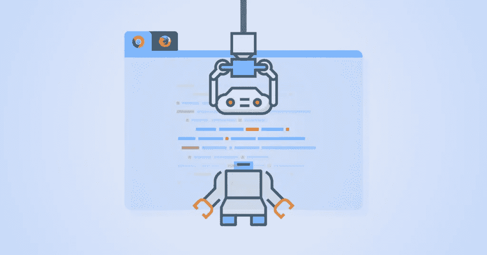
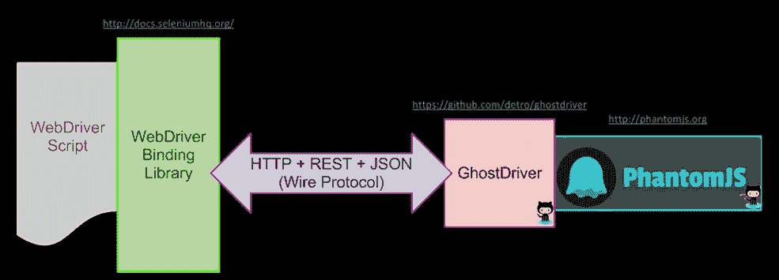

# 使用无头测试，以最佳成本提高测试流程的效率

> 原文：<https://medium.com/javarevisited/the-efficiency-of-our-testing-process-at-optimal-costs-with-headless-testing-87ebaa974ba5?source=collection_archive---------2----------------------->



软件测试行业已经提出了新的技术(比如敏捷方法)来减少交付时间，同时以减少的成本和工作量确保高质量的产品交付。

与各种应用程序测试过程相比，测试 web 应用程序是最棘手的。测试人员需要通过考虑各种参数，如集成、可用性、UI、互操作性和安全性，在不同的浏览器上测试应用程序(这很困难，因为市场上有许多浏览器，没有人能确定用户可能会使用哪种浏览器)。为了提高测试 web 应用的效率和简易性，无头浏览器测试被开发出来。

# 无头浏览器和无头测试

Selenium Web driver 是一个 Web 自动化工具，使您能够在不同的浏览器上运行测试。这些浏览器可以是 Internet Explorer、Firefox 或 Chrome。要在 Selenium 上使用特定的浏览器，您需要相应的驱动程序。

在测试运行时， [Selenium](/javarevisited/my-favorite-free-courses-to-learn-selenium-web-drive-for-automation-testing-2f248c8fe6aa) 启动脚本中调用的相应浏览器，并执行测试步骤。您可以看到运行中的浏览器和测试执行。

但是，无头浏览器是没有图形用户界面的网络浏览器**。这个程序的行为就像一个浏览器，但不会向我们显示任何 GUI， [Selenium](/javarevisited/top-7-courses-to-learn-selenium-for-java-and-c-developers-to-learn-automation-testing-free-and-e91637cd9622?source=---------19------------------) 在后台执行测试**

市场上有几种无头浏览器，以下是最流行的几种:

*   铬
*   火狐浏览器
*   html 单元驱动程序
*   PhoantomJS

## 什么是无头浏览器测试，它有什么作用？

无头浏览器测试是在没有浏览器 UI 或 GUI 类型的情况下运行浏览器测试的过程。在无头浏览器测试中，为了进行跨浏览器测试，测试人员可以准确并成功地运行测试用例，而不需要知道应用程序需要在哪个浏览器上进行测试。

在[持续集成环境](/javarevisited/7-best-courses-to-learn-jenkins-and-ci-cd-for-devops-engineers-and-software-developers-df2de8fe38f3)中，这种测试方法有利于运行测试，因为持续测试的扩展是高效完成的，因为没有人观察视觉效果。

这种类型的浏览器可以访问所有网页，并且无需向用户显示它们，这种浏览器可以将网页内容移动到另一个程序。由于无头浏览器程序在后台运行，像普通浏览器一样，用户在启动无头浏览器时在屏幕上什么也看不到。

即使没有两个浏览器的实现是相同的，无头浏览器也可以分析和解释网页。这允许无头浏览器提供真实的浏览器视角，而不需要内存或实际浏览器 GUI 测试用例中产生的成本。

使用无头浏览器或进行无头测试的原因是它们比普通浏览器更快。由于您没有打开浏览器 GUI，因此您可以忽略普通浏览器加载 [CSS](/javarevisited/10-best-css-online-courses-for-beginners-and-experienced-developers-54aa2e8c0253) 、 [JavaScript](/javarevisited/10-best-online-courses-to-learn-javascript-in-2020-af5ed0801645) 和渲染 [HTML](/javarevisited/10-best-html-and-css-courses-for-beginners-in-2021-6757eec00032) 所花费的时间。

借助无头测试，您可以观察到 2 到 15 倍的性能扩展速度。如果性能是测试过程的关键方面，那么无头浏览器可能是一个不错的选择。

# 无头浏览器测试的局限性

当我们将测试与 CI/CD 管道集成时，无头浏览器测试是有用的，在 CI/CD 管道中，测试脚本自动运行，无需任何人工干预。

在这种情况下，不需要启动 web 浏览器，因为 CI/CD 管道会在晚上或凌晨自动运行，没有人会看到执行过程。

即使我们在一个浏览器上运行一个测试，也需要大量的资源。如果我们并行运行我们的测试，那么可能会导致测试的执行速度变慢。

为了克服这个问题，我们可以在一个无头浏览器中执行我们的测试，在那里不需要打开浏览器就可以执行。它对系统资源的需求要少得多。

结果几乎相同，但没有利用系统的 GPU。

## 所以现在你可以理解无头浏览器测试的优势了

与正常的测试执行相比，执行时间要少得多。这样在测试次数比较多的情况下，可以节省很多时间。

在将我们的测试与 [CI/CD](/javarevisited/top-10-free-courses-to-learn-jenkins-docker-and-kubernetes-for-devops-in-2020-best-of-lot-62a0541ffeb3) 管道集成时，无头模式对于测试的自动执行也很有用。因为它不需要 GUI 来执行测试。

测试的整体性能也更好，因为打开 web 浏览器的开销被消除了。

虽然观察到了无头测试的优势，但是我们可以从无头测试中观察到一些限制

# 缺点无头浏览器测试

我们不能总是使用无头模式来执行。为了从最终用户的角度检查整体用户体验，我们需要以正常的方式执行测试。

如果测试因为某些问题而失败，那么在无头模式下调试这些问题是很困难的。在这些情况下，需要正常执行。

在某些情况下，我们可能会遇到一个只能在 headless 模式下重现的 bug。这些类型的错误不会对产品产生太大的影响。

# selenium 中的无头自动化

如上所述，Selenium web 驱动程序提供了各种驱动程序和配置，有助于在无头模式下运行 selenium TC。

*   使用无头 Chrome 浏览器运行 Selenium 测试用例。
*   使用 headless Firefox 浏览器运行 Selenium 测试用例。
*   使用 HTMLUnitDriver 运行 Selenium 测试用例
*   并使用 PhantomJs 运行 Selenium 测试用例

# 无头 Chrome 浏览器

[***无头 Chrome***](https://developers.google.com/web/updates/2017/04/headless-chrome) 是一种在没有完整浏览器用户界面的无头环境中运行 *Chrome 浏览器*的方式。*无头 Chrome* 为你提供了一个真实的浏览器环境，而没有运行完整版 *Chrome 的内存开销。* *谷歌 Chrome* 从 59 版本开始提供无头执行。 *Selenium WebDriver* 提供了一个名为***“Chrome options”***的类，可以指定某些配置来改变 *Chrome 的默认行为。*其中一个配置是 ***【无头】*** 模式，它在运行测试用例时以*无头*模式启动 *Chrome*

```
if (browserName != null && browserName.equals("chrome"))
{
    Class<? extends WebDriver> driverClass = ChromeDriver.class;
    ChromeDriverManager.*getInstance*(driverClass).setup();
    driver = new ChromeDriver();
}
 else if (browserName != null && browserName.equals("chromeHeadless"))
{
    Class<? extends WebDriver> driverClass = ChromeDriver.class;
    ChromeDriverManager.*getInstance*(driverClass).setup();
    ChromeOptions options = new ChromeOptions();
    options.setHeadless(true);
     //options.addArguments("--headless");
    driver = new ChromeDriver(options);
}
```

# 无头 Firefox 浏览器

对于 ***无头火狐，*** 我们必须以和在无头 Chrome 中一样的方式工作。首先，我们将为 [***Gecko 驱动***](https://www.toolsqa.com/selenium-webdriver/selenium-geckodriver/) *(用于火狐浏览器)*设置路径，然后将选项设置为无头。在这里，我们使用 *Selenium WebDriver 提供的***firfox options***类的***set headless****(true)*方法。*

```
else if (browserName != null && browserName.equals("firefox"))
{
    Class<? extends WebDriver> driverClass = FirefoxDriver.class;
    FirefoxDriverManager.*getInstance*(driverClass).setup();
    FirefoxOptions options = new FirefoxOptions();
    options.setHeadless(true);
    driver = new FirefoxDriver(options);
}
```

# HtmlUnitDriver

为了实现无头测试，Selenium 使用了 *HtmlUnitDriver、*这是 *WebDriver 的另一个实现、*类似于 *FirefoxDriver、ChromeDriver、*等。HTMLUnitDriver 是一个外部依赖项，需要你显式添加库。

***注:*** *在早期版本的*[*Selenium*](https://javarevisited.blogspot.com/2018/02/top-5-selenium-webdriver-with-java-courses-for-testers.html)*(2.53 版之前)中，在 Selenium 库内部就有 HtmlUnitDriver，不需要外部下载 jar。虽然仍然支持这个驱动程序，但它现在是一个独立的依赖项，使用 Html 单元框架。这些依赖项需要像其他 jar 一样添加到项目中，或者您可以添加 maven 依赖项*

下载 *HtmlUnitDriver* 依赖项

1.导航到[***https://github.com/SeleniumHQ/htmlunit-driver/releases***](https://github.com/SeleniumHQ/htmlunit-driver/releases)。

2.点击最新版本的 HTML 单元驱动程序

3.添加到 java 构建路径，或者您可以添加 maven 依赖项

```
<dependency>
    <groupId>org.seleniumhq.selenium</groupId>
    <artifactId>htmlunit-driver</artifactId>
    <version>3.61.0</version>
</dependency>
```

注释 01—

该语法将构造一个新实例，禁用[***JavaScript***](https://www.toolsqa.com/javascript/javascript-tutorial/)，并使用默认浏览器版本。如果您的应用程序需要一些 *JavaScript* 功能，您可以使用下面文章中提到的配置来启用这些功能:

## 用于在 HtmlUnitWebDriver 中启用 JavaScript 支持

*HtmlUnitWebDriver* 默认情况下不启用[***JavaScript***](https://www.toolsqa.com/javascript/javascript-tutorial/)。意思是在上面的代码中，如果你试图执行 *JavaScript* ，就会抛出一个错误，说明 [JavaScript](/javarevisited/5-free-books-to-learn-javascript-for-beginners-4cca79834262) 没有启用。要创建启用了 *JavaScript* 的驱动实例，可以使用构造函数***HtmlUnitDriver****(布尔启用 JavaScript)和*将值设置为 true，如下所示

```
else if (browserName != null && browserName.equals("HtmlUnitDriver"))
{
      driver = new HtmlUnitDriver(true);

}
```

因此，这将创建一个启用了 [*JavaScript*](/javarevisited/my-favorite-free-tutorials-and-courses-to-learn-javascript-8f4d0a71faf2) 的 *HtmlUnitDriver、*的实例。

注释 02 —

现在，当我们使用默认选项 *HTMLUnitDriver，*运行测试用例时，它选择了浏览器。默认情况下，该浏览器位于您的计算机上。如果你也想在一个特定的浏览器版本中执行测试用例，你也可以在 *HTMLUnitDriver 的帮助下做同样的事情。*让我们来了解一下如何实现同样的目标:

*HtmlUnitDriver* 允许你选择你想要运行测试的浏览器版本。主要支持的浏览器有 ***Chrome、Firefox、Internet Explorer。*** 我们可以使用不同版本的浏览器，绕过构造函数中的值，用指定的版本创建新的实例

```
else if (browserName != null && browserName.equals("HtmlUnitDriver"))
{
      driver = new HtmlUnitDriver(BrowserVersion.*EDGE*);

}
```

# 幻象



PhantomJS 是一个带有 JavaScript API 的无头浏览器。它是无头网站测试、访问和操作网页的最佳解决方案&带有标准的 DOM API。

为了使用含硒的幻想曲，必须使用 GhostDriver。 **GhostDriver** 是 web driver Wire protocol is simple JS for PhantomJS 的实现。

最新发布的 PhatomJS 已经集成了**ghost driver**和**不需要单独安装。**

```
else if (browserName != null && browserName.equals("phantomjs"))
{
    System.*setProperty*("phantomjs.binary.path","/Users/preethi/Documents/Presonal/Own Project/phantomjs-2.1.1-macosx/bin/phantomjs");
     driver= new PhantomJSDriver();
}
```

下面是代码的完整实现

```
class BrowserFactory {
    static WebDriver getBrowser(String browserName) {

        WebDriver driver;

        if (browserName != null && browserName.equals("chrome"))
        {
            Class<? extends WebDriver> driverClass = ChromeDriver.class;
            ChromeDriverManager.*getInstance*(driverClass).setup();
            driver = new ChromeDriver();
        }
         else if (browserName != null && browserName.equals("chromeHeadless"))
        {
            Class<? extends WebDriver> driverClass = ChromeDriver.class;
            ChromeDriverManager.*getInstance*(driverClass).setup();
            ChromeOptions options = new ChromeOptions();
            options.setHeadless(true);
             //options.addArguments("--headless");
            driver = new ChromeDriver(options);
        }
        else if (browserName != null && browserName.equals("firefox"))
        {
            Class<? extends WebDriver> driverClass = FirefoxDriver.class;
            FirefoxDriverManager.*getInstance*(driverClass).setup();
            FirefoxOptions options = new FirefoxOptions();
            options.setHeadless(true);
            driver = new FirefoxDriver(options);
        }
        else if (browserName != null && browserName.equals("HtmlUnitDriver"))
        {
              driver = new HtmlUnitDriver(BrowserVersion.*EDGE*);

        }
        else if (browserName != null && browserName.equals("phantomjs"))
        {
            System.*setProperty*("phantomjs.binary.path","/Users/preethi/Documents/Presonal/Own Project/phantomjs-2.1.1-macosx/bin/phantomjs");
             driver= new PhantomJSDriver();
        }
        else {
            Class<? extends WebDriver> driverClass = ChromeDriver.class;
            ChromeDriverManager.*getInstance*(driverClass).setup();
            driver = new ChromeDriver();
        }

        driver.manage().window().maximize();
        driver.manage().timeouts().implicitlyWait(Wait.*EXPLICIT_WAIT*, TimeUnit.*SECONDS*);
        return driver;
    }
}
```

感谢您的阅读…