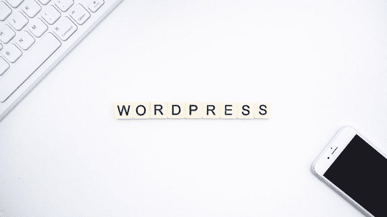
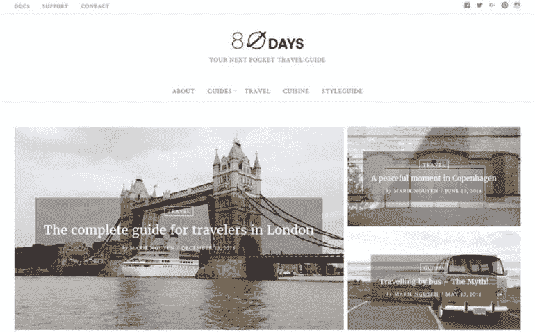
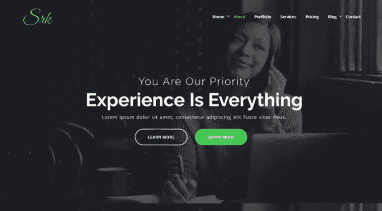
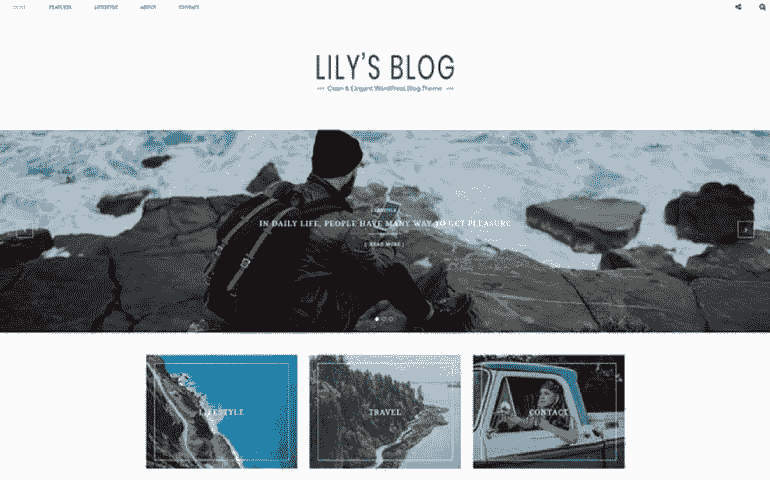
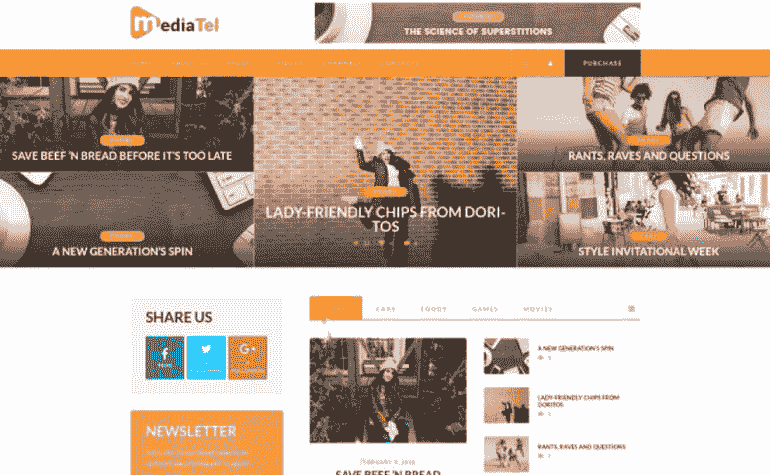
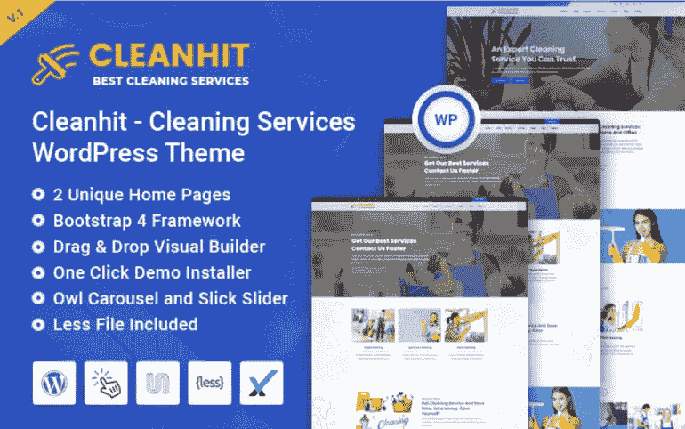
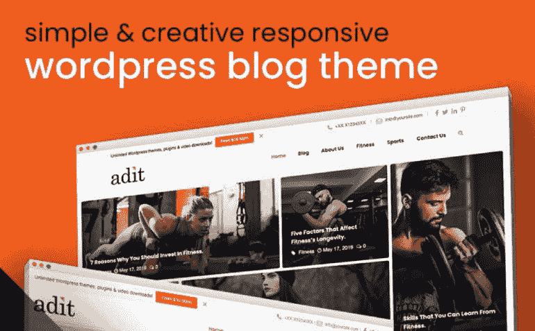
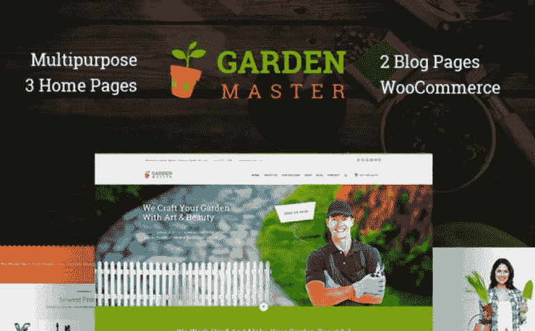
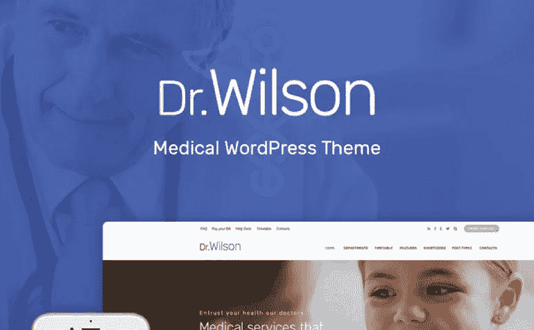

# 最快的 WordPress 主题:赢得每场比赛的前 10 名选择

> 原文：<https://medium.com/javarevisited/the-fastest-wordpress-themes-top-10-choices-to-win-every-competition-race-df0ea798088c?source=collection_archive---------4----------------------->

每个企业主都有多种选择来开发他们的网站。他们每个人都有大量的支持者和多重利益。毫无疑问，企业主希望他们的公司在今天和明天蓬勃发展。

出于这个原因，选择 [WordPress](/javarevisited/5-best-wordpress-courses-for-beginners-and-experienced-website-developers-b45f7976ee40) 将是聪明的。它不仅是最具成本效益的，而且是功能最丰富、适应性最强、经得起未来考验的选择。今天我们要谈论的是[最快的 WordPress 主题](https://www.templatemonster.com/wordpress-themes/recommended/?aff=javarevisited&utm_campaign=tmwordpressthemes&utm_source=mediumjavarevisited&utm_medium=referral)，它能让你获得成功。

# 为什么值得选择 WordPress？

1.  你的网站的主要目标是增加你公司的知名度，让潜在的消费者更容易找到它。在此之后，他们将准备好与你的品牌建立联系，注册一个帐户，购买一些东西，或者了解一些全新的信息。Yoast 是 [WordPress](https://javarevisited.blogspot.com/2020/08/top-5-courses-to-learn-wordpress-in.html) 的一个广受欢迎的插件，可能会帮助你提高访客参与度，从搜索中产生流量，并从社交媒体中带来更多客户。Yoast 插件引导你通过 SEO 过程的每个阶段，并且可以自动分析和增强单个网页。
2.  WordPress 有成千上万的免费插件。插件可以直接修改和自动化公司网站需要执行的几乎所有任务。例如，收集时事通讯注册信息或跟踪你的时间表和活动，你什么都不用做。你也可以自由创建博客，建立会员社区，并提供客户支持。
3.  你也可以选择不同的主题。有了他们，建立一个有吸引力的专业网站就不成问题了。多个布局选项、拖放页面生成器、滑块、图库和一系列其他功能都在它们的包中等待着你。
4.  WordPress 是一个完全免费的平台。唯一需要付费的是一个域名和一个虚拟主机账户。
5.  WordPress 为你的网站和内容提供了完全的灵活性和控制力。它们还通过一键导出器和其他内置功能简化了导出材料的过程。
6.  WooCommerce 是世界上最受欢迎的电子商务平台，可以让你在几分钟内建立一个在线商店。WooCommerce 有自己的生态系统、插件和几十个 WooCommerce 主题可供选择。额外的 WordPress 插件可以帮助你销售各种类型的产品、服务、活动、订阅和其他项目。

# 为什么你需要选择最快的 WordPress 主题？

网站速度对消费者体验和在线资源的生存能力有着重要的影响。术语“加载速度”通常是指网站页面在用户浏览器中完全加载所需的时间。

现场负载速度指示会受到几个变量的影响。这些可能包括以下内容:

*   页面的整体大小；
*   以各种格式加载的文件数量；
*   图形内容；
*   图形文件的数量；
*   Java 脚本的数量；
*   客户端参数；
*   托管参数。

因此，我们为不同的目的和领域选择了最快的 WordPress 主题。你也可以利用你的促销代码"**javarestived "**来购买最想要的 WordPress 主题。所有商品都打九五折。

# 10 个最快的 WordPress 主题永远不会停滞不前

## 八十天——旅游博客主题

你正在为旅游相关领域寻找最好最快的 WordPress 主题吗？在这种情况下，你可能要考虑这个美丽的选择。这将是一个旅行社和博客的绝佳选择。

它采用了移动友好型设计。移动和桌面平台都可以让你的访问者熟悉你的内容。如果你刚刚开始，你不会遇到任何困难。

由于一键导入，安装这个主题及其所有组件并不困难。之后，您可以快速创建、添加和更新您的材料。

主要特点:

*   平铺画廊；
*   Instagram 页脚；
*   无限卷轴；
*   社交媒体整合；
*   联系方式。

[立即购买](https://www.templatemonster.com/wordpress-themes/65640.html?aff=javarevisited&utm_campaign=tmwordpressthemes&utm_source=mediumjavarevisited&utm_medium=referral) | [试玩](http://www.templatemonsterpreview.com/demo/65640.html?aff=javarevisited&utm_campaign=tmwordpressthemes&utm_source=mediumjavarevisited&utm_medium=referral)

## SRK——一页视差主题

SRK 是一个强大的主题，可以为任何想展示自己品牌或企业形象的人创造奇迹。

这将有助于你更有创造力，并引起你的观众更多的兴趣。它配有一个用户友好的可视化编辑器，可以尽可能快地设置您的页面。

拖放功能尽其所能确保新手不会遇到任何问题。你也可以用一些动画效果装饰主页，吸引更多的潜在客户。

主要特点:

*   全响应设计；
*   定价表；
*   谷歌字体；
*   博客功能；
*   联系方式。

[立即购买](https://www.templatemonster.com/wordpress-themes/srk-one-page-parallax-wordpress-theme-100559.html?aff=javarevisited&utm_campaign=tmwordpressthemes&utm_source=mediumjavarevisited&utm_medium=referral) | [演示](https://www.templatemonsterpreview.com/demo/100559.html?aff=javarevisited&utm_campaign=tmwordpressthemes&utm_source=mediumjavarevisited&utm_medium=referral) | [在 MonsterONE](https://www.templatemonster.com/monsterone/tm-membership/?id=100559?aff=javarevisited&utm_campaign=tmwordpressthemes&utm_source=mediumjavarevisited&utm_medium=referral) 免费下载

## lily——干净优雅的博客主题

Lily 是一个突出的模板，旨在突出你最有价值的天赋和能力。它独特的风格会引起人们的兴趣。

感谢不同的选择，你让他们对你即将开展的活动有更多的了解。它配备了一系列复杂的工具，会让你的想象力眼花缭乱。

使用优秀的粘性导航，联系形式，滑块和众多的文章风格。这些功能能够传达您的所有想法并接收反馈。

主要特点:

*   侧边栏控件；
*   跨浏览器兼容设计；
*   一键演示安装；
*   翻译就绪；
*   促销箱。

[立即购买](https://www.templatemonster.com/wordpress-themes/lily-clean-elegant-blog-wordpress-theme-68144.html?aff=javarevisited&utm_campaign=tmwordpressthemes&utm_source=mediumjavarevisited&utm_medium=referral) | [试玩](http://www.templatemonsterpreview.com/demo/68144.html?aff=javarevisited&utm_campaign=tmwordpressthemes&utm_source=mediumjavarevisited&utm_medium=referral)

## MediaTel——Youtube/Vimeo 视频新闻聚合杂志 WordPress 主题

一个引人注目的模板，非常适合展示您的视频材料。对于那些需要使用最快的 WordPress 主题创建令人印象深刻的媒体杂志的人来说，这将是一个完美的匹配。

它可以成为您的视频内容和所有相关内容的可靠基础。为了让你的网站脱颖而出，你会有各种各样的定制选择和面向新闻的小部件。

顺便说一下，只需一次点击就可以安装这个选项和所有组件。不要忘了易用的可视化编辑器的可用性，它不会让新手孤单。

主要特点:

*   针对视频优化；
*   全响应设计；
*   谷歌地图；
*   谷歌字体；
*   社交媒体整合。

[立即购买](https://www.templatemonster.com/wordpress-themes/mediatel-youtube-vimeo-video-news-aggregator-magazine-wordpress-theme-67870.html?aff=javarevisited&utm_campaign=tmwordpressthemes&utm_source=mediumjavarevisited&utm_medium=referral) | [试玩](http://www.templatemonsterpreview.com/demo/67870.html?aff=javarevisited&utm_campaign=tmwordpressthemes&utm_source=mediumjavarevisited&utm_medium=referral)

## 清洁服务 WordPress 主题

最快的 WordPress 主题集合的另一个选择是关于清洁服务的。整个过程不会影响到你。

首先，您将体验到简单的一键安装过程，无需任何努力。在这之后，可以从两种主页风格中进行选择。

还有 20+个预制页面在等你的原创内容。您可以使用令人难以置信的可视化编辑器自定义所有页面并添加您的内容。

主要特点:

*   三种投资组合布局；
*   三个团队布局，三个服务布局；
*   两个关于页面；
*   无限的配色方案；
*   层滑块。

[立即购买](https://www.templatemonster.com/wordpress-themes/cleanhit-cleaning-services-wordpress-theme-110125.html?aff=javarevisited&utm_campaign=tmwordpressthemes&utm_source=mediumjavarevisited&utm_medium=referral) | [试玩](http://www.templatemonsterpreview.com/demo/110125.html?aff=javarevisited&utm_campaign=tmwordpressthemes&utm_source=mediumjavarevisited&utm_medium=referral)

## adit——博客使 WordPress 主题变得简单

Adit 是一个极简主义的主题，有很多有用的选项。它与古腾堡编辑器兼容，可以增强您的整体编辑体验。

该软件包具有所有必需的定制特性。您可以自由地使用页眉设计。例如，可以选择粘性、舒适性或紧凑型割台。

除此之外，还有高级主页定制。选择必要的布局，选择一个轮播设计，选择一个侧边栏位置，这些都不费吹灰之力。

主要特点:

*   自定义排版；
*   Ajax
*   博客格式选项；
*   过滤器选项；
*   博客列表布局。

[立即购买](https://www.templatemonster.com/wordpress-themes/82526.html?aff=javarevisited&utm_campaign=tmwordpressthemes&utm_source=mediumjavarevisited&utm_medium=referral) | [试玩](https://www.templatemonsterpreview.com/demo/82526.html?aff=javarevisited&utm_campaign=tmwordpressthemes&utm_source=mediumjavarevisited&utm_medium=referral)

## 教育博客 WordPress 主题

毫无疑问，教育是一个需要激发信心的特殊领域。再加上这个来自最快的 WordPress 主题的现代和创造性的变体，你可以增加你的读者数量。它为不同的目标提供了一系列的选项、样式、布局和小部件。您将获得四种布局风格和多种帖子类型。例如，你可以在你的博客中展示视频、图片、音乐和其他内容。不要忘记视觉定制，它不需要你的任何编码技能。

主要特点:

*   脸书部件；
*   Instagram widget
*   与接触形式 7 兼容；
*   跨浏览器兼容设计；
*   翻译就绪。

[立即购买](https://www.templatemonster.com/wordpress-themes/65465.html?aff=javarevisited&utm_campaign=tmwordpressthemes&utm_source=mediumjavarevisited&utm_medium=referral) | [演示](http://www.templatemonsterpreview.com/demo/65465.html?aff=javarevisited&utm_campaign=tmwordpressthemes&utm_source=mediumjavarevisited&utm_medium=referral) | [在 MonsterONE](https://www.templatemonster.com/monsterone/tm-membership/?id=65465?aff=javarevisited&utm_campaign=tmwordpressthemes&utm_source=mediumjavarevisited&utm_medium=referral) 免费下载

## Kokit — SaaS 软件和数字机构 WordPress 主题

在最快的 WordPress 主题中发现的专业外观和显著的选择。这个软件包将会用一个广为人知的元素或页面生成器来取悦所有的潜在网站所有者。这个拖放式构建器提供了一个瞬间构建内容的机会。你可以自由选择三种主页布局。有更多的选择可以最大限度地增加您的客户数量。其中包括社交媒体整合和 WooCommerce 商店页面。

主要特点:

*   一键演示导入；
*   可自定义的页脚小部件区域；
*   联系表 7 准备好了；
*   全响应设计；
*   包括儿童主题。

[立即购买](https://www.templatemonster.com/wordpress-themes/kokit-saas-software-digital-agency-wordpress-theme-85245.html?aff=javarevisited&utm_campaign=tmwordpressthemes&utm_source=mediumjavarevisited&utm_medium=referral) | [试玩](http://www.templatemonsterpreview.com/demo/85245.html?aff=javarevisited&utm_campaign=tmwordpressthemes&utm_source=mediumjavarevisited&utm_medium=referral)

## 园艺大师——最快的园艺主题

这个明亮的模板是推销你的园艺服务的最好方法之一。它包括三个主页版本。他们中的每一个都会给你的核心观众和临时访客留下印象。还有两个博客部分，你可以在那里写一些有趣的文章来吸引更多的注意力。你还会收到一个神奇的旋转滑块。它允许你创建最吸引人的旋转木马和画廊。

主要特点:

*   视觉作曲；
*   多语言支持；
*   WooCommerce 支持；
*   高级搜索；
*   图库功能。

[立即购买](https://www.templatemonster.com/wordpress-themes/garden-master-wordpress-theme-67136.html?aff=javarevisited&utm_campaign=tmwordpressthemes&utm_source=mediumjavarevisited&utm_medium=referral) | [试玩](http://www.templatemonsterpreview.com/demo/67136.html?aff=javarevisited&utm_campaign=tmwordpressthemes&utm_source=mediumjavarevisited&utm_medium=referral)

## 威尔逊博士——WordPress 主题

威尔逊医生是为私人诊所或大医院建立网站的绝佳主题。它有很多功能来介绍每个人都可以信任的医疗服务。这些包括医生简介，以建立对你的专业团队的信心。此外，还有专门的职位类型来突出你的医疗保健服务。移动布局也很关键。这是因为大部分用户将通过智能手机熟悉你的内容。

主要特点:

*   与旋转滑块兼容；
*   WPML 支持；
*   团队成员；
*   社交媒体整合；
*   时间表。

[立即购买](https://www.templatemonster.com/wordpress-themes/doctor-wilson-wordpress-theme-69101.html?aff=javarevisited&utm_campaign=tmwordpressthemes&utm_source=mediumjavarevisited&utm_medium=referral) | [试玩](http://www.templatemonsterpreview.com/demo/69101.html?aff=javarevisited&utm_campaign=tmwordpressthemes&utm_source=mediumjavarevisited&utm_medium=referral)

# 几句话作为结论

毫无疑问，没有人喜欢等待网站加载。它会影响用户体验，提高跳出率，降低转化率和收入。

谷歌和脸书都强调了网页快速加载的重要性。根据 Google 的说法，页面速度是 SEO 必不可少的搜索引擎排名标准。

所有这些变化将确保你的网络资源不会让你的观众失望。选择最快的 WordPress 主题将使你的网站在任何时候都快速、安全和值得信赖。

不要忘记你也可以求助于免费的 WordPress 主题 best 来寻找额外的选择。感谢阅读！