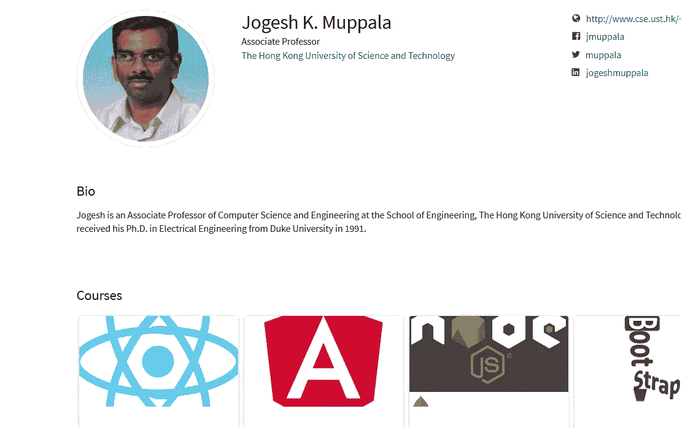
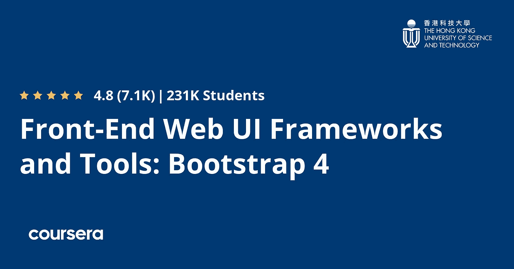
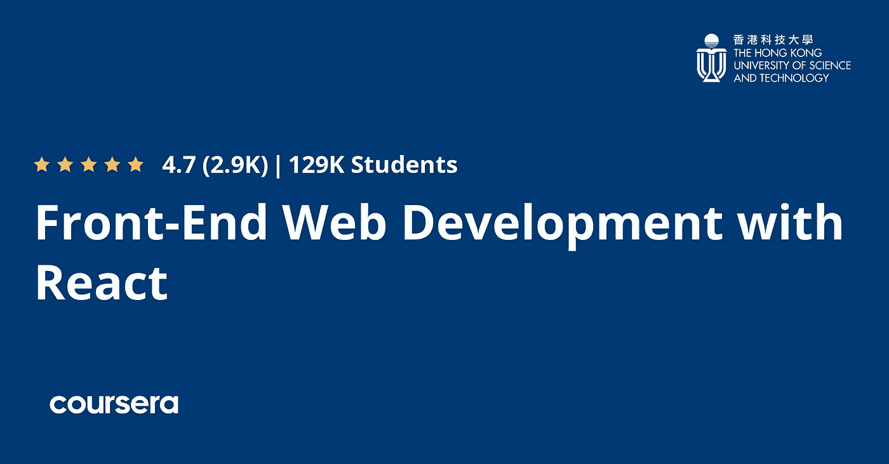
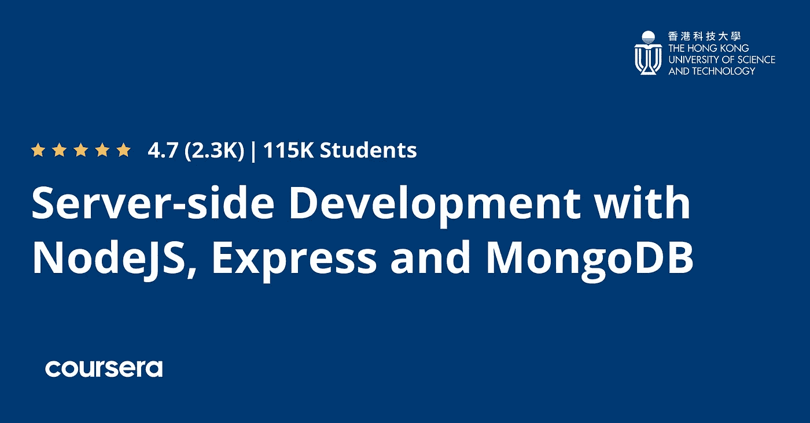

# 回顾 React Coursera 专业化的 Fullstack Web 开发值得吗？[2023]

> 原文：<https://medium.com/javarevisited/the-fullstack-web-development-with-react-coursera-specialization-review-7c878131d9f0?source=collection_archive---------1----------------------->

## 这是 Coursera 上最好的全栈 web 开发人员专业之一，如果你想在 20232 年成为全栈开发人员，这是一个很好的开始资源。

大家好，如果你正在寻找 2023 年使用 React.js 学习全栈开发的最佳 Coursera 课程，或者只是想加入 Coursera 中 React Specialization 的 [*全栈 Web 开发，但不确定是否值得，那么你来对地方了。*](https://coursera.pxf.io/c/3294490/1164545/14726?u=https%3A%2F%2Fwww.coursera.org%2Fspecializations%2Ffull-stack-react)

此前，我已经分享了[最佳 React 书籍](/javarevisited/5-best-react-js-books-for-beginners-and-experienced-web-developers-e7b90b1ab9d2)、React 开发者路线图和[网站](/javarevisited/6-best-websites-to-learn-react-js-coding-for-free-ba7ec5c43433)，在本文中，我将回顾 Coursera 最受欢迎的 React 课程。

全栈 web 开发是软件开发的新领域，一个人被要求创建整个网站，对全栈开发者有巨大的需求。

这是一份困难的工作，但是薪水的提高和职业机会使它非常有吸引力，这就是为什么许多开发人员正在学习 Fullstack 开发。

人们期望 Fullstack 开发人员具备扎实的前端技术知识，通常是 HTML[和 CSS](https://javarevisited.blogspot.com/2019/05/top-5-html-5-and-css-3-courses-for-web-developers.html)[使用 JavaScript 定制网站的外观，并学习后端开发，网站的不同操作如认证和搜索，并学习开发数据库解决方案来存储用户的数据。](https://javarevisited.blogspot.com/2020/09/top-5-css-cascading-style-sheet-courses-for-beginners.html#axzz6rtXMHF8g)

大多数学习者都没有找到合适的编程语言来用服务器端解决方案从头开始开发整个网站。

网站应该简单、快速，以提供出色的用户体验，而且这个框架应该有丰富的库和算法，这样你就可以在你的 web 应用程序中实现任何你想要的东西，所以很多人使用 JavaScript 语言及其框架，如 Express 和 Node.js 作为后端，React 作为前端来构建网站。

成千上万的在线课程教你如何使用 JavaScript 及其框架来创建从前端到后端的完整网站。

尽管如此，他们中的许多人是由业余爱好者创建的，也许可以给你所有你需要知道的关于这一发展的信息，所以我找到了一个由香港大学创建的名为 [**的在线课程，名为 React Specialization** 的全栈 Web 开发。](https://coursera.pxf.io/c/3294490/1164545/14726?u=https%3A%2F%2Fwww.coursera.org%2Fspecializations%2Ffull-stack-react)

# Coursera 上 React Specialization 的全栈 Web 开发值得吗？

既然你知道这是 Coursera 上最好的 React 课程之一，而且已经有成千上万的开发者加入了这个课程来学习，掌握 React，那么就不用费脑子去说它值不值得了。

这绝对是值得的，初学者和有经验的 web 开发人员都可以通过这门课程[学习 React.js for web development](https://javarevisited.blogspot.com/2020/10/top-5-websites-to-learn-react-for-free.html#axzz6nTA4tfFM) 。

现在，让我们深入本次课程回顾，从三个重要的角度来审视本次课程，讲师声誉和风格，课程结构和内容质量，以及其他人的评价。这是你在参加任何在线课程之前可以用来复习的三个标准。

## 1.教员回顾

这种专业化是由香港大学计算机科学系副教授 Jogesh K. Muppala 创立的。1991 年 Jogesh K. Muppala 从杜克大学获得博士学位，该课程由香港大学提供。

Jogesh 已经在 Coursera 上创建了一些非常好的 web 开发课程，如[*Frontend JavaScript Framework:Angular*](https://coursera.pxf.io/c/3294490/1164545/14726?u=https%3A%2F%2Fwww.coursera.org%2Fspecializations%2Ffull-stack-mobile-app-development)和 [*使用 Node JS、Express 和 Mongo DB*](https://coursera.pxf.io/c/3294490/1164545/14726?u=https%3A%2F%2Fwww.coursera.org%2Flearn%2Fserver-side-nodejs) 进行服务器端开发。

他有详细解释事情的诀窍，这使得学习更容易，并提供了独特的视角。我真的很喜欢他一步一步解释每一个 React 概念的方式，我认为中级和初级开发人员都会发现它很有用。

# 2.专业化课程、内容和结构

这个专业的结构非常好，可以教你使用 React 进行全栈开发。该专业有 3 门课程，在使用 [Node JS](/javarevisited/top-10-online-courses-to-learn-node-js-in-depth-8ef0e31ca139) 、 [Express](https://www.java67.com/2020/06/top-5-courses-to-learn-mern-stack-for-web-development.html) 和 [Mongo DB](/javarevisited/5-best-mongodb-courses-to-learn-nosql-for-beginners-in-2020-42df5af5496c) 进入后端开发之前，您将首先探索前端和 GUI 开发部分。

现在，让我们快速看一下你将在这 3 门课程中学到什么，这 3 门课程是 Coursera React 专业化的一部分。

## 2.1.[前端 Web UI 框架和工具:Bootstrap 4](https://coursera.pxf.io/c/3294490/1164545/14726?u=https%3A%2F%2Fwww.coursera.org%2Flearn%2Fbootstrap-4)

这是 Coursera 全栈开发专业化的第一门课程。在开始这个专业之前，你必须先了解前端开发的基础知识: [HTML](/javarevisited/10-best-html-and-css-courses-for-beginners-in-2021-6757eec00032) 、 [CSS](/javarevisited/10-best-css-online-courses-for-beginners-and-experienced-developers-54aa2e8c0253) 和 [JavaScript](/javarevisited/my-favorite-free-tutorials-and-courses-to-learn-javascript-8f4d0a71faf2) 。

您将获得全栈 web 开发的概述，了解用于开发响应式网站的 CSS 框架 [Bootstrap](/javarevisited/6-best-bootstrap-online-courses-for-web-designers-and-developers-a688e192b2e2) 的基础知识，并了解关于 [Node.js 框架](/javarevisited/7-free-courses-to-learn-node-js-in-2020-2f1dd6722b49?source=---------24------------------)的一些事情。

稍后，您将了解引导组件，如导航栏、制作按钮、添加图像、媒体等。

接下来，您将了解 Bootstrap 的基于 JavaScript 的组件，如选项卡、账单和选项卡式导航。最后，学习使用 NPM 脚本和任务运行程序(如 Grunt 和 Gulp)构建和部署 web 项目。

## 2.2.[使用 React 进行前端 Web 开发](https://coursera.pxf.io/c/3294490/1164545/14726?u=https%3A%2F%2Fwww.coursera.org%2Flearn%2Ffront-end-react)

本课程将要求您完成上一个课程，或者对使用 Bootstrap 4 有所了解，然后再学习更多关于前端开发的知识。

您将了解如何使用 React 框架，这是一个用于创建网站前端的 [JavaScript 框架](/javarevisited/10-javascript-frameworks-and-libraries-to-learn-in-2020-best-of-lot-5f61f86c60b4)，还将了解其组件以及如何使用 React Router 来设计和创建一个单页面应用程序 SPA，该应用程序将允许用户在不刷新浏览器的情况下导航网站页面。

稍后，您将在 [React 框架](/javarevisited/top-10-free-courses-to-learn-react-js-c14edbd3b35f)上了解受控和非受控表单以及表单验证。

此外，了解模型视图控制器框架，flux 架构，这是一种管理 React 应用程序中数据流的模式，并了解应用程序状态管理中大多数时间使用的 [Redux](https://javarevisited.blogspot.com/2018/08/top-5-react-js-and-redux-courses-to-learn-online.html#axzz5r06B3egD) 。

最后一节将进一步探索 Redux 和客户机-服务器通信以及部署您的应用程序。

## 2.3.[使用 NodeJS、Express 和 MongoDB 进行服务器端开发](https://coursera.pxf.io/c/3294490/1164545/14726?u=https%3A%2F%2Fwww.coursera.org%2Flearn%2Fserver-side-nodejs)

专门化的前两个部分是关于前端和客户端开发的。不过，现在我们将学习后端开发和为您的应用程序开发数据库解决方案。您将了解 Node.js 及其模块，并创建一个 Node HTTP 服务器。

您还将探索 Express 框架以及如何使用该框架设置 REST API。接下来，您将使用 [MongoDB](/javarevisited/10-free-online-courses-to-learn-mongodb-and-nosql-942609611664) 创建一个 [NoSQL 数据库](https://javarevisited.blogspot.com/2019/03/top-5-nosql-database-web-developers-should-learn.html#ixzz64aBvbXQ4)，并将该数据库与 Node.js 框架进行交互。

稍后，您将开发一个基本的用户身份验证，允许设备验证连接到网络的用户。

最后，学习使用 HTTPS 协议建立安全连接、上传文件，以及将 OAuth 与 passport 和脸书一起用于身份验证目的。

# 3.人民评论

这是参加在线课程前要检查的另一件重要的事情。谈到人们对这门课的评价，我们有一些惊人的数字。

近 6000 名开发人员对 5 的平均评分为 4.7，更重要的是，超过 16，000 人已经在 [Coursera](/javarevisited/10-best-coursera-courses-for-web-development-and-web-design-9ec54ed92dd9) 上加入了 React 认证，这是这门课程的一个巨大证明。

大多数人对 Jugesh 教授的教学风格和这门课程的结构非常满意。初学者和中级开发人员似乎都喜欢这个课程，因为它帮助他们学习并填补了他们对 React 的理解中的空白。

这里是加入本课程的链接—[**React 专业化认证**的全栈 Web 开发。](https://coursera.pxf.io/c/3294490/1164545/14726?u=https%3A%2F%2Fwww.coursera.org%2Fspecializations%2Ffull-stack-react)

总之，在 Coursera 上学习 React JS 和 Fullstack 开发是一门很棒的课程。您可以单独参加该课程，每月费用约为 39 美元，或者您也可以参加 [**Coursera Plus**](https://coursera.pxf.io/c/3294490/1164545/14726?u=https%3A%2F%2Fwww.coursera.org%2Fcourseraplus) 订阅，每月 59 美元即可无限制访问认证和规范。

 [## Coursera Plus |无限制访问 7，000 多门在线课程

### 用 Coursera Plus 投资你的职业目标。无限制访问 90%以上的课程、项目…

coursera.pxf.io](https://coursera.pxf.io/c/3294490/1164545/14726?u=https%3A%2F%2Fwww.coursera.org%2Fcourseraplus) 

以上就是复习 **Coursera 最受欢迎的 Fullstack Web 开发课程**和认证——香港大学与 React 合作的 Fullstack Web 开发。该课程介绍了使用 React 框架和 bootstrap 进行前端的全栈 web 开发，并使用 Node.js 和 Express 等其他 JavaScript 框架进行后端开发。

尽管如此，您必须进行更多的实践，才能构建更复杂的应用程序。

您可能想探索的其他 **Web 开发文章和资源**

*   [全栈开发者路线图](/javarevisited/the-2019-web-developer-roadmap-ab89ac3c380e)
*   [学习 Learn RESTful Web 服务的 3 本书和课程](http://www.java67.com/2018/02/3-books-and-courses-to-learn-restful-web-services-with-spring.html)
*   [面向初学者的 10 门 Python Web 开发课程](/javarevisited/top-10-courses-to-learn-python-for-web-development-in-2020-best-of-lot-efe11fb6d212)
*   [2023 年学棱角的 5 门免费课程](https://javarevisited.blogspot.com/2018/06/5-best-courses-to-learn-angular.html)
*   [2023 年 React JS 开发者路线图](https://javarevisited.blogspot.com/2018/10/the-2018-react-developer-roadmap.html#axzz5dPh5g7tg)
*   [前端和后端开发者路线图](https://javarevisited.blogspot.com/2019/02/the-2019-web-developer-roadmap.html)
*   [面向 Java 和 DevOps 工程师的 5 门免费 Docker 课程](http://www.java67.com/2018/02/5-free-docker-courses-for-java-and-DevOps-engineers.html)
*   [2023 年学习 JavaScript 的 13 门免费课程](/javarevisited/12-free-courses-to-learn-javascript-and-es6-for-beginners-and-experienced-developers-aa35874c9a32)
*   [2023 年学习打字稿的 10 门免费课程](/javarevisited/top-10-free-typescript-courses-to-learn-online-best-of-lot-44bce9da41d1)
*   [我最喜欢的初学者学习棱角的课程](/javarevisited/10-courses-to-learn-angular-for-web-development-6da1bd2856dc)
*   [Web 开发人员学习 PHP 和 MySQL 的 5 门课程](http://www.java67.com/2018/02/5-free-php-and-mysql-courses-for-web-developers.html)
*   [免费学习 Ruby 和 Rails 的 5 门课程](http://www.java67.com/2018/02/5-free-ruby-and-rails-courses-to-learn-online.html)
*   [5 门学习 Servlet、JSP 和 JDBC 的免费课程](http://www.java67.com/2018/02/5-free-servlet-jsp-and-jdbc-online-courses-for-java-developers.html)
*   【Fullstack 开发者应该学习的 10 个框架

感谢您阅读本文。如果你喜欢香港大学在 Coursera 上发表的关于 React Specialization 全栈 Web 开发的*课程评论，请与你的朋友和同事分享。如果您有任何问题或反馈，请发表评论。

**P. S. —** 如果你是 Udemy 课程的爱好者，并且正在寻找最好的 React.js 课程，以便在 Udemy 上从头开始学习 React，我强烈推荐你查看这本由 Maximilian Schwarz muller 编写的 [**React 完全指南课程。说到教 web 开发，他是个天才，我从他的 React.js 和 Angular 开发课程中学到了很多。参加 Udemy 上的 React 课程，你不会后悔。**](https://click.linksynergy.com/deeplink?id=CuIbQrBnhiw&mid=39197&murl=https%3A%2F%2Fwww.udemy.com%2Fcourse%2Freact-the-complete-guide-incl-redux%2F)*

 [## 2023 年新手在线学习的 5 门最佳 React.js 课程

### 大家好，如果你想在 2023 年学习 React.js 并寻找书籍、在线课程等最佳资源…

www.java67.com](https://www.java67.com/2022/03/top-5-reactjs-courses-for-beginners-to.html)