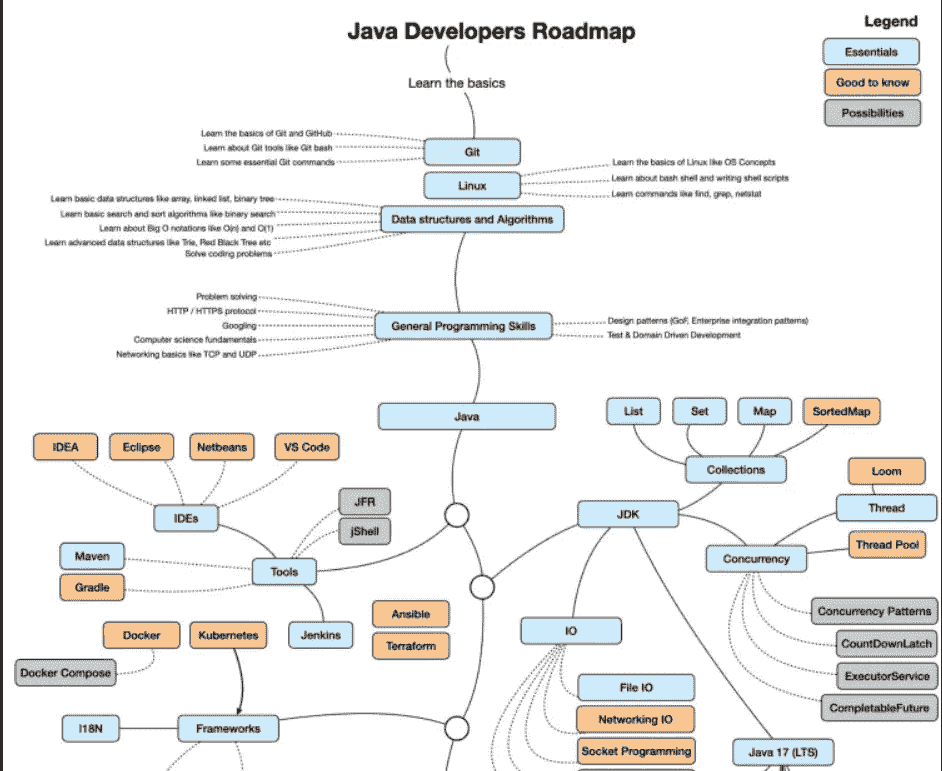
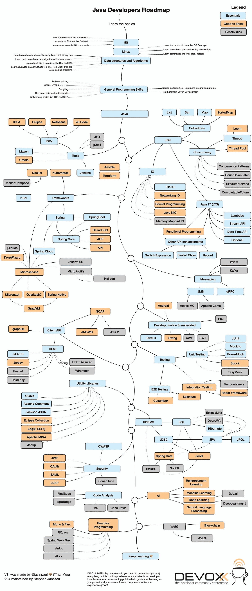
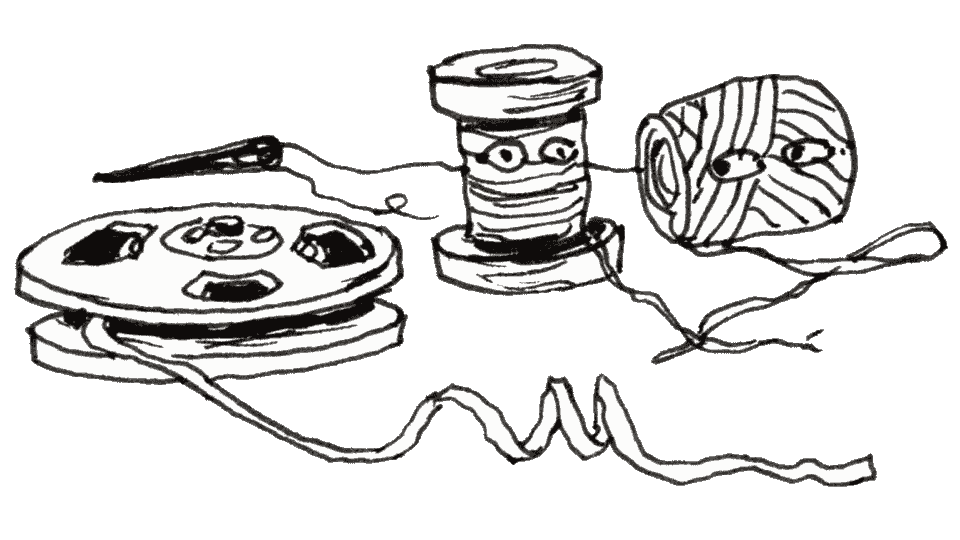
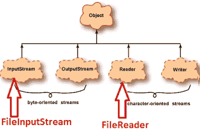
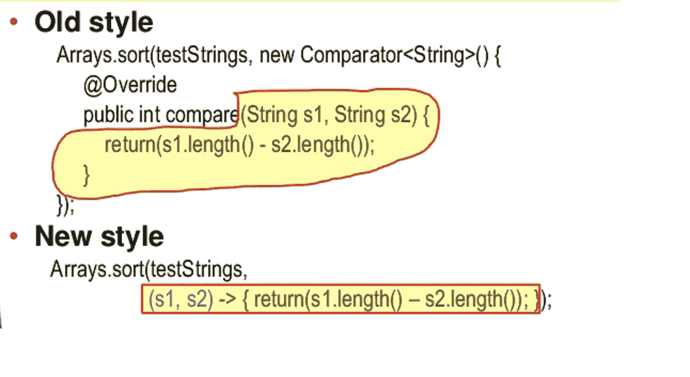
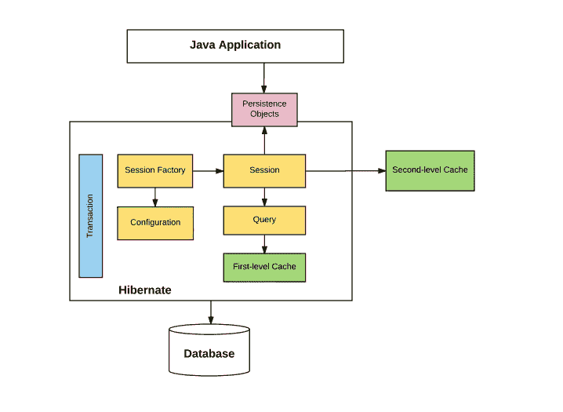
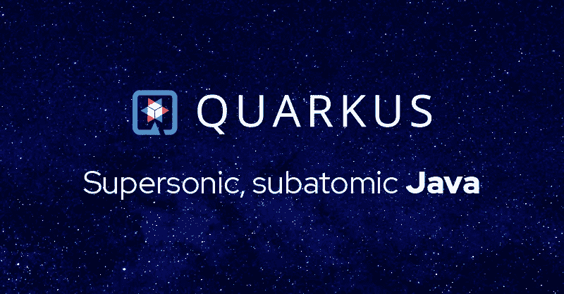
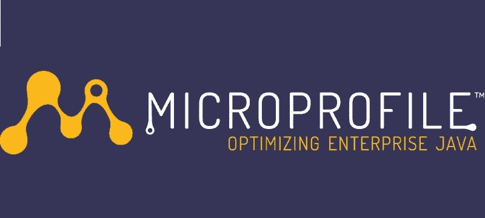
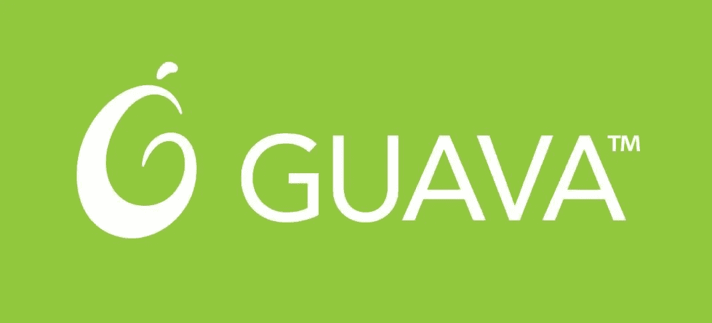
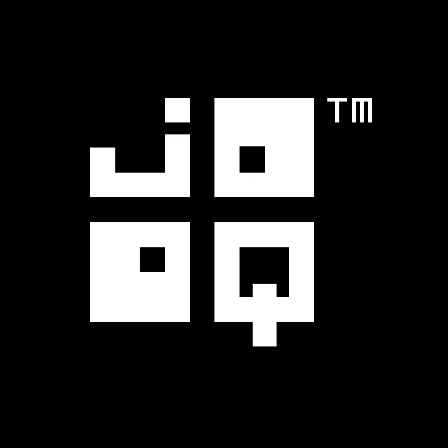

# 2023 年 Java 程序员路线图[更新]

> 原文：<https://medium.com/javarevisited/the-java-programmer-roadmap-f9db163ef2c2?source=collection_archive---------0----------------------->

## 2023 年成为 Java 开发人员的图解指南，包含相关课程的链接

你好，伙计们，如果你想成为一名专业的 Java 开发人员，或者想把你的 Java 技能提高到一个新的水平，但是不确定你可以学习哪种技术、工具、框架和库，那么你来对地方了。我一直在分享很多路线图像 [**Web 开发者路线图**](/javarevisited/the-2019-web-developer-roadmap-ab89ac3c380e)[**devo PS 工程师路线图**](/hackernoon/the-2018-devops-roadmap-31588d8670cb)**[**react . js 开发者路线图**。](/javarevisited/the-2019-react-js-developer-roadmap-9a8e290b8a56)**

**我收到的许多读者的请求之一是创建一个 Java 开发者路线图。因为 Java 是我的专长，所以创建一个 Java 开发人员路线图不成问题，但是由于时间有限，我花了稍长的时间来创建一个。**

**无论如何，我终于准备好与你分享我的 Java 开发者路线图了。这个路线图包含了我多年的经验，以及如何成为 Java 专家的通畅途径。**

**你会发现这个 Java 路线图回答了许多棘手的问题，比如*Java 开发人员应该学习哪些技术？* *哪些工具让你成为更好的 Java 开发者？*还有，*Java 开发者绝对要学习的框架*。**

**我在这个路线图中尝试的一件事是尽可能缩短曝光时间，我已经避免提及许多替代方案，特别是当涉及到库和工具时，并且坚持使用行业标准的工具和库。

我把它保持得很简单，这样大多数人都可以理解，并且只包括必要的东西，但是如果有足够的愿望，我想发布**Java 开发者路线图 2.0** 来添加一些高级的东西，比如 [JVM 内部](https://javarevisited.blogspot.com/2019/04/top-5-courses-to-learn-jvm-internals.html)、概要分析、Java 9 模块、 [Cloud Native Java](https://javarevisited.blogspot.com/2018/02/top-5-spring-microservices-courses-with-spring-boot-and-spring-cloud.html) 、不同的云平台，比如 [AWS](/javarevisited/5-best-aws-courses-for-beginners-and-experienced-developers-to-learn-in-2021-563212409fbd?source=rss-bb36d8439904------2&utm_source=dlvr.it&utm_medium=linkedin) 、 [GCP](/javarevisited/5-best-gcp-associate-cloud-engineer-certification-courses-in-2021-c93d7e35228a) 或 [Azure](/javarevisited/10-best-microsoft-azure-courses-for-beginners-and-experienced-developers-d41a454834c0) ，以及更高级的工具，比如

如果你有兴趣，你可以找到一个更详尽的单独博客锅列表，我已经在进一步学习部分列出了。无论如何，让我们通过这个 *Java 开发者路线图来了解如何在 2023 年成为一名 Java 开发者。顺便说一句，要成为一名 rockstar 开发人员，你不需要理解这个路线图上的所有内容。事实上，如果你不愿意，你甚至不需要把它们看得那么严重。相反，使用这些地图作为起点来帮助指导你的学习。***

> **如果你不是媒体成员，我强烈推荐你加入媒体，阅读不同领域伟大作家的精彩故事。你可以在 这里**加入中等****

********

# ****任何 Java 开发人员的必备技能****

****现在，让我们一步一步地浏览这个 Java 开发人员路线图，看看如何学习成为 2023 年 Java 开发人员所需的基本技能:****

## ******1。Git & Github******

****最流行的版本控制系统之一。没有 Git 的生活已经不可能了。作为一名程序员，你应该熟悉 git 和 Github，基本的 Git 概念，如分支、主、检验、检查、推和拉，以及基本的 Git 命令，如 git diff、git commit 等。****

****我强烈建议 Java 程序员学习 Git 和 Github，如果你已经使用过 Git，那么你也可以提升你的 Git 技能，如果你需要资源，那么你可以从 Udemy 上的[**Git 完整指南**](https://click.linksynergy.com/deeplink?id=JVFxdTr9V80&mid=39197&murl=https%3A%2F%2Fwww.udemy.com%2Fgit-complete%2F) 开始。****

**** [## Git 完整教程:Git 权威指南

### Git 完成这一课程的目的是一个全面的 Git 方法，这意味着没有事先的知识或…

udemy.com](https://click.linksynergy.com/deeplink?id=JVFxdTr9V80&mid=39197&murl=https%3A%2F%2Fwww.udemy.com%2Fgit-complete%2F)**** 

## ******2。Linux******

****不仅仅是 web 开发人员，对于任何程序员来说，Linux 命令行都是非常非常重要的，我强烈建议您花些时间学习它们。因为大多数 Java 应用程序都是服务器端的，所以您经常会发现它们运行在 Linux 服务器上。****

****这就是为什么 Java 开发人员必须熟悉与文件、磁盘空间检查、进程管理以及网络命令相关的基本 Linux 概念和命令。****

****如果你需要一个资源来提升你的 Linux 技能，我推荐你去看看 Udemy 上的[**Linux Mastery:11.5 小时掌握 Linux 命令行**](https://click.linksynergy.com/deeplink?id=CuIbQrBnhiw&mid=39197&murl=https%3A%2F%2Fwww.udemy.com%2Fcourse%2Flinux-mastery%2F) 课程。对于任何想从头开始学习 Linux 命令的人来说，这是一门很棒的课程。****

**** [## 精通 Linux:掌握 Linux 命令行

### 感言= = = = = = = = = = = = = = = = = = = = = = = = = = = = = = =“迄今为止 Udemy 上关于 Linux 的最佳课程，我绝对推荐”…

udemy.com](https://click.linksynergy.com/deeplink?id=CuIbQrBnhiw&mid=39197&murl=https%3A%2F%2Fwww.udemy.com%2Fcourse%2Flinux-mastery%2F) 

如果你需要更多的资源，那么你可以使用这些免费的 Linux 课程开始学习 Linux。**** 

## ****3.**数据结构和算法******

****这些是任何程序的组成部分，对算法和数据结构的良好了解对你的下一份工作或在当前情况下做得好是至关重要的。你至少应该熟悉基本的数据结构，如数组、链表、哈希表、二叉树、队列、堆栈和图，以及解决问题的技术，如动态编程。

如果你知道像 Trie、B 树、AVL 树这样的高级数据结构，那就再好不过了。但是，如果你不知道，那么我建议你参加一个综合课程，比如 [**数据结构和算法:使用 Java**](https://click.linksynergy.com/fs-bin/click?id=JVFxdTr9V80&subid=0&offerid=323058.1&type=10&tmpid=14538&RD_PARM1=https%3A%2F%2Fwww.udemy.com%2Fdata-structures-and-algorithms-deep-dive-using-java%2F) 的深度学习，它会教你所有这些基础知识。****

**** [## 数据结构和算法:使用 Java 进行深入研究

### Tim 从事专业软件开发已经超过 35 年了。在他的职业生涯中，他曾为几家大公司工作过…

udemy.com](https://click.linksynergy.com/fs-bin/click?id=JVFxdTr9V80&subid=0&offerid=323058.1&type=10&tmpid=14538&RD_PARM1=https%3A%2F%2Fwww.udemy.com%2Fdata-structures-and-algorithms-deep-dive-using-java%2F)**** 

## ******4。HTTP / HTTPS******

****HTTP 协议是 web 的主干，对于 web 开发人员来说，很好地了解 HTTP 和 HTTPS 是必不可少的。至少你应该知道 HTTP 是如何工作的，不同的 HTTP 方法和它们的目的等等。****

## ****5 **。计算机科学基础******

****如果您正在创建用世界上许多不同语言显示信息的全球应用程序，那么您应该对字符编码有很好的了解。****

****它基本上告诉你的浏览器如何显示你的数据。如果你想了解更多关于计算机科学的知识，你也可以查看 Udemy 上的计算机科学 101:掌握编程课程背后的理论。****

**** [## 计算机科学理论 101:编程背后的理论

### 我是一个自学成才的多媒体设计师和计算机科学家，帮助客户实现创造性的愿景…

udemy.com](https://click.linksynergy.com/deeplink?id=CuIbQrBnhiw&mid=39197&murl=https%3A%2F%2Fwww.udemy.com%2Fcourse%2Fcomputer-science-101-master-the-theory-behind-programming%2F)**** 

## ****6.结构化查询语言****

****这是每个 Java 开发人员都应该学习的另一项常见技术技能，因为它将帮助您解决后端问题。如果你懂 SQL，你就能理解存储过程，查询数据库，并找出问题是出在 Java 层还是数据库层。****

****我强烈推荐每一个编程人员，无论是 Java 开发人员还是 Python 开发人员，学习 SQL，这是一种容易学习的技能，并且在你的程序员或开发人员职业生涯中会为你服务很长时间。****

****如果你需要资源，我建议你去看看 Andrei Negaoie 在 ZTM 学院开设的 [**完整的 SQL +数据库训练营:零到精通**](https://academy.zerotomastery.io/p/complete-sql-database-bootcamp-zero-to-mastery?affcode=441520_zytgk2dn) 课程。****

**** [## 完整的 SQL +数据库训练营:零到精通

### 成为 SQL 和数据库概念的专家将 SQL、PostgreSQL、MySQL、Redis、数据库管理/设计添加到您的…

academy.zerotomastery.io](https://academy.zerotomastery.io/p/complete-sql-database-bootcamp-zero-to-mastery?affcode=441520_zytgk2dn)**** 

## ****7 **。设计模式******

****毫无疑问，每个程序员都应该知道 Git 和 Github，因为它们是版本控制和代码库方面的标准。如果你想学习和掌握设计模式，尤其是 OOP 设计模式，那么我建议你参加由 Dmitri Nestruk 在 Udemy 上开设的 Java 课程中的 [**设计模式。这是学习经典设计模式在 Java 中的现代实现的绝佳课程。**](https://click.linksynergy.com/deeplink?id=CuIbQrBnhiw&mid=39197&murl=https%3A%2F%2Fwww.udemy.com%2Fcourse%2Fdesign-patterns-java%2F)****

**** [## 面向工程师、设计师和架构师的 Java 设计模式

### 本课程从实用的角度全面概述了 Java 中的设计模式。

udemy.com](https://click.linksynergy.com/deeplink?id=CuIbQrBnhiw&mid=39197&murl=https%3A%2F%2Fwww.udemy.com%2Fcourse%2Fdesign-patterns-java%2F) 

如果你需要更多的资源，你也可以查看我之前关于最佳设计模式的文章[书籍](https://www.java67.com/2016/10/top-5-object-oriented-analysis-and-design-patterns-book-java.html)和[课程](https://javarevisited.blogspot.com/2018/02/top-5-java-design-pattern-courses-for-developers.html)来深入学习面向对象设计模式。

# 2023 年 Java 开发者路线图

现在，让我们一起来探索一下这个 Java 开发者路线图，了解一下在 2023 年，要成为一名专业的 Java 开发者，你可以学习哪些工具、框架、库、API、工具和技能。

# 1.工具

工具部分分为不同的部分。首先，您的 IDE 是您的主要工具，它可以完成您要求的几乎所有事情，如编译、运行、调试、分析、测试、比较文件和代码、重构等等。

## 1.1 IDEs

对于 Java 开发人员来说，有两个主要的 ide， [Eclipse](/javarevisited/6-free-best-eclipse-ide-courses-for-java-programmers-1229ee9e5d87) 和 [IntelliJIDEA](/javarevisited/7-best-courses-to-learn-intellij-idea-for-beginners-and-experienced-java-programmers-2e9aa9bb0c05) ，你可以选择其中的任何一个，因为我一生中使用 Eclipse 最多，但我目前在 IntelliJIDEA 工作，所以我喜欢这两个 ide，但我认识的大多数 Java 开发人员都在 IDEA 中工作。

我建议你掌握 IDEA 快捷方式、视图和它提供的所有其他特性，成为一名真正的 Java 高手，如果你需要资源，我认为 IntelliJ IDEA Tricks to Boost Productivity for Java Devs 是一个很好的起点。

 [## 提高 Java 开发人员生产力的 IntelliJ 点子

### 如果你想成为一名真正的专业 Java 程序员，你需要掌握你的键盘和 IntelliJ 思想。你需要…

udemy.com](https://click.linksynergy.com/deeplink?id=CuIbQrBnhiw&mid=39197&murl=https%3A%2F%2Fwww.udemy.com%2Fcourse%2Fintellij-idea-secrets-double-your-coding-speed-in-2-hours%2F) 

## 1.2 构建工具

第二部分是构建工具，你需要它来构建和部署你的项目，比如 [Maven](/javarevisited/top-10-free-courses-to-learn-maven-jenkins-and-docker-for-java-developers-51fa7a1e66f6) 和 [Gradle](/javarevisited/5-best-gradle-courses-and-books-to-learn-in-2021-93f49ce8ff8e) 。这些中的任何一个都足够了。我刚刚列出了 ANT，但那是针对遗留项目的。对于所有新的 Java 项目，首选 Gradle，它比 Maven 简洁得多。

如果你既想学 Maven 又想学 Gradle，可用的资源并不多。要我说，我推荐 Udemy 上约翰·汤姆逊的 [**阿帕奇 Maven:初学者到宗师**](https://click.linksynergy.com/deeplink?id=CuIbQrBnhiw&mid=39197&murl=https%3A%2F%2Fwww.udemy.com%2Fcourse%2Fapache-maven-beginner-to-guru%2F) 。

 [## Apache Maven:Java 和 Spring Boot 应用程序的初学者到大师

### Apache Maven 是最流行的 Java 构建工具。世界各地的公司和开源社区，请考虑…

udemy.com](https://click.linksynergy.com/deeplink?id=CuIbQrBnhiw&mid=39197&murl=https%3A%2F%2Fwww.udemy.com%2Fcourse%2Fapache-maven-beginner-to-guru%2F) 

而且，如果你热衷于学习 Gradle，我建议你去看看另一位伟大的 UDemy 导师 Bharat Thippireddy 为 Java 开发人员编写的 Gradle。

 [## 面向 java 开发人员的 Gradle

### 样本评论:课程内容丰富，基础知识用真实世界的例子很好地解释了…

udemy.com](https://click.linksynergy.com/deeplink?id=CuIbQrBnhiw&mid=39197&murl=https%3A%2F%2Fwww.udemy.com%2Fcourse%2Fgradle-for-java-developers%2F) 

## 1.3 容器和开发工具

第三个也是最关键的部分包括像 Docker 和 Kubernetes 这样的容器，像 Jenkins 和 TeamCity 这样的 CI/CD 工具，以及像 Ansible 和 T21 这样的基础设施自动化工具。

其中 Docker 是最重要的，因为它使设置开发环境变得容易，也使 Java 微服务的部署变得容易。

Kubernetes 是一个下一级工具，并不是所有的 JAva 开发人员都真正需要它，特别是如果您不在开发运维团队中，并且不管理诸如扩展和部署之类的事情，但是从知识的角度来看了解它是有好处的。

我建议对 Docker 有很好的了解，对 Java 开发人员有 Kubernetes 的基础知识，如果你需要资源，我推荐 Maximillian SchwaurzMuller 在 Udemy 上的 [**Docker & Kubernetes:实用指南**](https://click.linksynergy.com/deeplink?id=CuIbQrBnhiw&mid=39197&murl=https%3A%2F%2Fwww.udemy.com%2Fcourse%2Fdocker-kubernetes-the-practical-guide%2F) 课程。您可以在一门课程中学习这两种工具。

 [## Docker & Kubernetes:实用指南

### 从 13 岁开始，我从未停止学习新的编程技能和语言。早期我开始创作…

udemy.com](https://click.linksynergy.com/deeplink?id=CuIbQrBnhiw&mid=39197&murl=https%3A%2F%2Fwww.udemy.com%2Fcourse%2Fdocker-kubernetes-the-practical-guide%2F) 

如果您对学习这些工具感兴趣，这里有一些有用的课程，可以用来学习构建工具和 ide

# 2.Java APIs

接下来要学习的重要的东西是 JDK API，这对任何 Java 开发者来说都是非常非常重要的。这是一个相当大的部分，这就是为什么它被分为核心区域，如 [Java 集合框架](/javarevisited/7-best-java-collections-and-stream-api-courses-for-beginners-in-2020-3ad18d52c38?source=extreme_sidebar---------0-2----------------------)、 [Java 并发性](/javarevisited/8-best-multithreading-and-concurrency-courses-for-experienced-java-developers-8acfd3b25094)、Java IO 和 Java 8 APIs，让我们来探索它们中的每一个

## 2.1 Java 集合框架

这是每个 Java 开发人员都应该学习的最基本的 Java API 之一。这个 API 提供了标准数据结构在 Java 中的实现，比如链表、集合、堆栈、队列、哈希表、优先级队列等等。

至少你应该知道所有的日常事物，比如`ArrayList`、`HashMap`、`HashSet`、`LinkedHashSet`、`TreeSet`等。它们中的每一个都有不同的属性，比如 ArrayList 是一个可以增长的动态数组，HashMap 是哈希表的标准实现，可以用来存储键值对。

同样，`HashSet` 是不允许重复元素的集合实现。强烈建议大家查看 Pluralsight 上 Richard Warburton 的 [**Java 基础:集合**](https://pluralsight.pxf.io/c/1193463/424552/7490?u=https%3A%2F%2Fwww.pluralsight.com%2Fcourses%2Fjava-fundamentals-collections) 课程，深入学习 Java 集合框架。

## 2.2 Java 并发

在 Java 集合之后，Java 中下一个最重要的 API 是关于多线程和并发的，我坚信如果你想成为一名合格的 Java 开发人员，你必须对 Java 并发 API 有一个扎实的理解和掌握。

你不仅要深入理解`Thread`、`Runnable`、对象锁定、同步等基本概念，还要熟悉死锁、活锁、竞争条件等概念，以及如何处理它们。

你还应该学习高级的 Java 概念，比如在 Java 5 和后续版本中增加的同步器，我指的是`CyclicBarrier`、`CountDownLatch`、`Phaser`和`CompleteableFuture`等。，以及未来和如何在 Java 中执行异步操作。我知道，这是一大堆东西，这就是为什么我建议你参加一个深入的课程，比如 Java 冠军 Heinz Kabutz 的[**Java Concurrency in Practice bundle**](https://learning.javaspecialists.eu/courses/concurrency-in-practice-bundle?affcode=92815_johrd7r8)，他是并发和设计模式方面的权威。这门课有点贵，但是你会学到很多更深入的概念，这让你的时间和金钱完全值得。

另一方面，如果价格是一个问题，你也可以查看这个 Udemy 课程—[**Java 中的并发性、多线程和并行计算**](https://click.linksynergy.com/deeplink?id=CuIbQrBnhiw&mid=39197&murl=https%3A%2F%2Fwww.udemy.com%2Fcourse%2Fmultithreading-and-parallel-computing-in-java%2F) ，如果你在每个月举行的 Udemy flash sales 上购买，花费不会超过 10 美元。这也是学习 Java 并发和 Java 多线程的一门极好的课程。

 [## Java 中的并发、多线程和并行计算

### 本课程是关于多线程和并发编程的基础知识以及一些并行概念。在 21 世纪…

udemy.com](https://click.linksynergy.com/deeplink?id=CuIbQrBnhiw&mid=39197&murl=https%3A%2F%2Fwww.udemy.com%2Fcourse%2Fmultithreading-and-parallel-computing-in-java%2F) 

## 2.3 Java IO

我采访过 100 多名 Java 程序员，我注意到一个模式；与 Java 集合和 Java 多线程 API 相比，他们对 Java IO 和 NIO APIs 知之甚少。我可以理解很多人花了很多时间学习这两个 API，但是你不能把这些关键的 API 丢在一边。

如果你必须编写一个真实世界的核心 Java 应用程序，你将需要使用`java.io`包中的`File`、`InputStream`、`OutputStream`、`Reader`、`Writer` 等类，这是 Java IO API 的核心。同样，如果你想写一个基于 socket 的应用程序，你还需要了解`ByteBuffer`、`FileChannel`、`Selector`和其他来自`java.nio` API 的关键类。

遗憾的是，关于教授 Java IO 和 Java NIO API 的专用资源并不多，但是 [**完整的 Java Masterclass**](https://click.linksynergy.com/fs-bin/click?id=JVFxdTr9V80&subid=0&offerid=323058.1&type=10&tmpid=14538&RD_PARM1=https%3A%2F%2Fwww.udemy.com%2Fjava-the-complete-java-developer-course%2F) 是掌握这个 API 的绝佳资源。在本课程中，您将从该 API 中找到许多基本概念。

## 2.4 Java 8 特性

现在，Java 程序员应该学习的下一个也是另一个必要的 API 是 Java 8 特性，它完全改变了当今 Java 的编码和编程方式。要想在 2023 年成为一名 Java 开发者，你必须知道如何使用一个 [Lambda 表达式](/javarevisited/7-best-java-tutorials-and-books-to-learn-lambda-expression-and-stream-api-and-other-features-3083e6038e14?source=---------14------------------)、 [Stream API](/javarevisited/8-best-lambdas-stream-and-functional-programming-courses-for-java-developers-3d1836a97a1d) ，可选类，以及一个新的日期和时间 API。

不知道这些 API，在 2023 年写一个 Java 应用会非常艰难。大多数库现在也停止支持低于 Java 8 的版本，这意味着你必须现在就学习 Java 8 的特性。Java 8 发布已经 5 年了，所以你真的没有借口了。

说到学习 Java 8 特性，市面上有很多优秀的资源可以利用。尽管如此，如果你已经了解 Java，我建议你选择只关注 Java 8 特性的资源，比如面向有经验开发人员的[**Java 8:Lambdas，Stream API&Beyond**](https://www.educative.io/courses/java-8-lambdas-stream-api-beyond?affiliate_id=5073518643380224)Educative 课程。这样，你很快就能学会 Java 8。

虽然 Java 8 的特性对于核心 Java 开发人员来说是必不可少的，但是如果可以的话，请学习从 Java 9 到 Java 13 引入的所有其他新特性，如 [**模块**](/javarevisited/5-courses-to-learn-java-9-features-in-depth-373f7afcf9fa) 、`var` 局部变量、集合的静态工厂方法、文本块、Switch 中的字符串等等。如果你需要更多的资源，你可以查看这个课程列表，在 2023 年[学习所有新的 Java 特性](/javarevisited/top-5-courses-to-learn-new-features-of-java-8-to-java-13-107eb51d2a13)。

# 3.结构

Java 最好的一点是它有一个充满活力的生态系统，这意味着几乎任何东西都有很多框架和库。通常，我不建议 Java 开发人员学习一个框架，除非他需要在他的项目中使用它。尽管如此，还有一些框架和库，我相信每个 Java 开发者都应该知道，比如 [Spring](/javarevisited/10-best-spring-framework-books-for-java-developers-360284c37036) 、 [Spring Boo](/javarevisited/top-10-courses-to-learn-spring-boot-in-2020-best-of-lot-6ffce88a1b6e) t、 [Hibernate](/javarevisited/top-5-hibernate-online-training-courses-for-beginners-and-advance-java-programmers-469460596b2b) 、Log4j、 [JUnit](/javarevisited/top-10-courses-to-learn-eclipse-junit-and-mockito-for-java-developers-4de1e8d62b96) 等。

## 3.1 个弹簧框架

如果你想在 2023 年成为一名 Java 开发者，我强烈推荐你先学习 Spring 框架。这是最流行的 Java 框架之一，实际上，我在过去 5 年中开发的几乎每一个 Java 应用程序都使用这个框架。Spring Framework 鼓励编写干净的代码，通过为您提供依赖注入和控制反转等功能，这些代码更易于测试和维护。它还为大多数日常任务提供了丰富的 API，这就是为什么每个 Java 开发人员都应该学习 Spring 框架。

还有，如果你想学习 Spring 框架，没有比 [**Spring 框架 6:初学者到宗师**](https://click.linksynergy.com/fs-bin/click?id=JVFxdTr9V80&subid=0&offerid=323058.1&type=10&tmpid=14538&RD_PARM1=https%3A%2F%2Fwww.udemy.com%2Fspring-framework-5-beginner-to-guru%2F) 更好的课程了。它涵盖了 spring 6 的最新版本 Spring 6，并以一种比其他任何课程都更具实践性的方式教授 Spring。

## 3.2 休眠

我推荐每个 Java 开发人员学习的第二个框架是 Hibernate，它是基于 JPA (Java 持久性 API)的。准确的说，Hibernate 是在 JPA 之前出现的，但是因为 [JPA](https://javarevisited.blogspot.com/2018/01/top-5-hibernate-and-jpa-courses-for-java-programmers-learn-online.html) 是用 Java 实现持久层的标准 API，所以 Hibernate 实现了它。

现在，你为什么要学习冬眠？嗯，因为你将使用的大多数 Java 应用程序都将与数据库进行交互，而使用 [JDBC](http://www.java67.com/2018/03/top-5-free-jdbc-courses-for-java.html) 并且没有像 [Hibernate](/javarevisited/top-5-books-to-learn-hibernate-for-java-developers-b2cb4b16ccd6?source=---------14------------------) 这样合适的框架，在 Java 中处理数据库是非常痛苦的。

它提供了一些基本特性，如缓存和事务开箱即用，这意味着您有更多的时间关注您的应用程序逻辑，而不是在您的应用程序中实现缓存。这极大地提高了 Java 应用程序的性能，也是迄今为止我使用 Hibernate 的最重要的原因。现在，谈到学习 Hibernate，市场上有许多很好的资源，但我更喜欢初学者的 Spring Hibernate 课程，因为你可以一举两得，你可以在一个班里学习 Spring 和 Hibernate，而不是加入它们的单独课程。

顺便说一句，如果你真的想精通 Hibernate 或者寻找高级 Hibernate 课程，那么 Vlad Mihalcea 的 [**高性能 Java 持久性**](https://vladmihalcea.teachable.com/p/high-performance-java-persistence-mach-1?utm_source=javarevisited&utm_medium=web&utm_campaign=hpjpmach1&affcode=172599_kuoszt8s) 书和课程是任何人的最佳资源。

 [## 高性能 Java 持久性- Mach 1 -下载版

### Vlad Mihalcea 是 Java 的拥护者，也是 Hibernate ORM 项目的主要成员之一。他创造了超持续性…

vladmihalcea.teachable.com](https://vladmihalcea.teachable.com/p/high-performance-java-persistence-mach-1?utm_source=javarevisited&utm_medium=web&utm_campaign=hpjpmach1&affcode=172599_kuoszt8s) 

## 3.3 Spring Boot

这是我推荐每个 Java 开发人员在 2023 年及以后学习的另一个框架。Spring Boot 继承了 Spring 的简化哲学，让 Spring 本身的工作变得简单。就像 Spring 使得创建 Java 应用程序更容易一样，Spring Boot 使得创建基于 Spring 的 Java 应用程序更容易。

像自动配置这样的特性消除了与配置 Spring 应用程序相关的大部分痛苦。类似地，starter POM 特性将常用的依赖项组合成简单的可重用 POM。

现在，如果你想学习 Spring Boot，我强烈建议你通过[**100 步学习 Spring Boot**](https://click.linksynergy.com/fs-bin/click?id=JVFxdTr9V80&subid=0&offerid=323058.1&type=10&tmpid=14538&RD_PARM1=https%3A%2F%2Fwww.udemy.com%2Fspring-boot-tutorial-for-beginners%2F)课程；这是最好的和最新的之一，也为 Spring Boot 开发者需要知道的日常事情提供了一步一步的指南。

## 3.4 Java 微服务框架— MicroProfile、Micronaut 和 Quarkus

虽然学习 Spring Boot 和 Spring Cloud 对于用 Java 开发微服务来说已经足够了，但是还有一些更高级的框架可以探索，比如 Eclipse 的 Microprofile、 [Micronaut](https://javarevisited.blogspot.com/2020/09/top-5-courses-to-learn-dropwizard-Micronaut-Quarkus-Java-Microservices.html) 和 [Quarkus](/javarevisited/10-best-free-dropwizard-vert-x-micronaut-and-quarkus-online-courses-for-java-developers-9c2b4161f17) 。

## 3.4.1 [夸尔库斯](https://quarkus.io/)

Quarkus 是 Java 开发人员有前途的框架之一。这是一个为 OpenJDK HotSpot 和 GraalVM 量身定制的 Kubernetes 原生 Java 堆栈，由同类最佳的 Java 库和标准精心制作而成。Quarkus 为 GraalVM 和 HotSpot 定制您的应用程序，以获得惊人的快速启动时间和难以置信的低 RSS 内存(不仅仅是堆大小！).

它还使用一种称为编译时引导的技术，在 Kubernetes 等容器编排平台中提供即时可伸缩性和高密度内存利用率。在为 Quarkus 开发应用程序时，您也可以同时使用熟悉的命令式代码和非阻塞反应式风格。

简而言之，这是 2023 年 Java 开发人员创建应用程序和值得学习的东西的最佳平台之一，如果你想学习 Quarkus 并需要资源，那么用 Java 和 GraalVM 进行 Quarkus 后端开发是一个很好的开始。

## **3.4.2** [**Eclipse 微文件**](https://microprofile.io/)

这是一项旨在为微服务架构优化企业 Java 的计划。它是由 Eclipse 驱动的，Eclipse 是 Java 的领先组织之一，也是流行的 Eclipse IDE 的幕后公司。

MicroProfile Eclipse 的目标是为构建微服务定义标准 API，并在多个 micro profile 运行时交付可移植的应用程序。Eclipse Microprofile 的当前版本是 3.2，这是 2023 年要学习的一个有用的 Java 框架。

## **3 . 4 . 3**[**Micronaut**](https://micronaut.io/)

这是 2023 年你可以学习的另一个 Java 框架。Micronaut 是一个现代的、基于 JVM 的全栈框架，用于构建模块化的、易于测试的微服务和无服务器应用程序。

这是一个多语言框架，允许你使用 Java、Kotlin 或 Groovy 创建应用程序。Micronaut 的一些关键论点是减少启动时间、极快的吞吐量和最小的内存占用。

如果你想了解更多关于 MicroNaut 的知识，也可以查看 Udemy 上的[**Learn micro naut—cloud-native micro services with Java**](https://click.linksynergy.com/deeplink?id=CuIbQrBnhiw&mid=39197&murl=https%3A%2F%2Fwww.udemy.com%2Fcourse%2Flearn-micronaut%2F)课程。虽然课程不多，但本课程和 MicroNaut 文档足以让您开始使用 MicroNaut 开发应用程序。

# 4.测试

测试是任何 Java 开发人员的基本技能，尤其是单元测试、集成测试和自动化测试。最起码，每个 Java 开发人员都应该熟悉 [JUnit](https://dzone.com/articles/top-5-junit-and-unit-testing-courses-for-java-prog) 和 [Mockito](/javarevisited/5-courses-to-learn-junit-and-mockito-in-2019-best-of-lot-f217d8b93688) ，这是两个最流行的单元测试和模拟库。如果你知道这两个，并且知道如何有效地使用它们来创建单元测试，你将会是一个比没有它们好得多的 Java 开发人员。还有更高级的库，比如用于业务驱动测试的 Cucumber，用于集成测试的 Robot Framework，但是 JUnit 是不可替代的，你将永远需要它。谈到嘲讽库，你有几个选择，比如 PowerMock、Mockito 和 EasyMock。尽管如此，我还是强烈建议您学习 Mockito，因为它是一个庞大的库，而且许多 Java 开发人员和公司都在这么做。它正慢慢成为用 Java 创建模拟对象的标准库。

如果你想从头开始学习 JUnit 和 Mockito，那么我也建议你在 Udemy 上的 28 分钟内加入 [**用 Junit & Mockito 学习 Java 单元测试的 30 步**](https://click.linksynergy.com/deeplink?id=CuIbQrBnhiw&mid=39197&murl=https%3A%2F%2Fwww.udemy.com%2Fcourse%2Fmockito-tutorial-with-junit-examples%2F) 课程。这是一门实用的动手课程，可以帮助您开始使用这两个库。

如果你需要比你更多的选择，我已经分享了很多资源，如[书籍](https://javarevisited.blogspot.com/2014/08/top-5-books-to-learn-unit-testing-junit-tdd-Java-programmers.html#axzz5E2uHdG3w)和[课程](https://hackernoon.com/5-courses-java-programmers-can-join-to-learn-junit-and-mockito-in-2019-h74t38r4)，你可以查看这些来了解更多。

# 5.实用程序库

Java 的真正力量在于它充满活力的开源库生态系统。你会发现 Java 中的库几乎可以做任何事情，从日志记录到机器学习，从发送 HTTP 请求到解析 JSON，等等。

除此之外，Java 还幸运地拥有像 Apache Commons 和 Google Guava 这样的实用程序库，这两个库有效地补充了 JDK 库。我也为 Java 开发者分享过一个 [**20 个 Java APIs 和库**](/javarevisited/20-essential-java-libraries-and-apis-every-programmer-should-learn-5ccd41812fc7) 的列表。我建议你浏览一下这个列表，很可能你已经有了其中的一半，但是如果你没有学习它们，它们会非常非常有用，帮助你编写更好的 Java 程序，并且交付得更快。

# 6.数据库ˌ资料库

数据库访问是许多 Java 应用程序的重要组成部分，幸运的是 Java 附带了 JDBC([Java Database Connectivity](/javarevisited/top-5-courses-to-learn-jdbc-and-database-connectivity-for-java-developers-free-and-best-of-lot-7945156fcc3?source=---------9------------------))API，它为连接任何关系数据库提供了一组标准的 API。

作为应用程序开发人员，您只需要了解 API，因为所有供应商都提供了这些 API 的实现。您只需要将他们的 JAR 文件包含到类路径中，您的代码就会运行良好。

顺便说一下，JDBC 并不是与数据库交互的唯一选择，还有像 JOOQ 这样的开源库可以帮助你用 Java 编写 SQL 查询。

jOOQ 从您的数据库生成 Java 代码，并允许您通过其流畅的 API 构建类型安全的 SQL 查询

## 7.桌面和前端

Java 为开发 GUI 客户机提供了很好的 API，如 Swing 和 Java FX。Swing 在几年前确实很流行，但 C#现在已经领先，但 Java FX 是另一种流行的 Java API，用于用 Java 开发 GUI 应用程序。

如果你想开发一个像 NetBeans 一样的 GUI 应用程序，NetBeans 是著名的 Java 编辑器之一，也是用 Java 编写的，那么你可以在 2023 年学习 Java FX。我不建议你学习 Swing，除非你所在的银行每月付给你数千美元来维护他们基于 Swing 的交易 GUI。

如果你想在 2023 年学习 Java FX 并需要资源，那么你也可以在 Udemy 上查看[**Java FX Concepts boot camp 2023**](https://click.linksynergy.com/deeplink?id=CuIbQrBnhiw&mid=39197&murl=https%3A%2F%2Fwww.udemy.com%2Fcourse%2Fjava-fx-concepts-with-practical-examples%2F)课程。

 [## Java Fx 概念训练营 2023

### 在 2023 年，学习 JavaFx 的概念和实际例子，创建令人敬畏的图形，然后参加本课程。

udemy.com](https://click.linksynergy.com/deeplink?id=CuIbQrBnhiw&mid=39197&murl=https%3A%2F%2Fwww.udemy.com%2Fcourse%2Fjava-fx-concepts-with-practical-examples%2F) 

您还可以在 Raspberry PI 上构建和部署 Java FX 应用程序，Raspberry PI 是一种小巧但功能强大的计算机。如果你对此感兴趣，[弗兰克·德尔博特](https://medium.com/u/a6ee926d3fc8?source=post_page-----f9db163ef2c2--------------------------------)有一个很棒的课程[为初学者提供在树莓平台上使用 Java 和 Java FX](https://click.linksynergy.com/deeplink?id=CuIbQrBnhiw&mid=39197&murl=https%3A%2F%2Fwww.udemy.com%2Fcourse%2Fuse-java-11-and-java-fx-11-on-a-raspberry-pi%2F)。你可以先看一下那门课程。

这就是关于 **2023 Java 程序员和开发者路线图的全部内容。**这是 2023 年学习 Java，成为更好的 Java 开发者的绝佳资源。我把它保持得很简单，这样大多数人都能理解，并且只包括重要的内容。

Java 是巨大的，但仍然有几个领域我没有触及，如消息传递，但如果有足够的愿望，我在考虑发布 Java 开发者路线图 2.0，以添加一些高级的东西，如 JVM 内部、概要、模块、云原生 Java、容器、消息传递、JNI 等等。

其他**编程文章**你可能喜欢的
[2023 年 Java 程序员应该学会的 10 件事](/javarevisited/9-things-java-programmers-should-learn-in-2018-3f0b2207dfc4)
[2023 年你可以学会的 10 种编程语言](/hackernoon/10-best-programming-languages-to-learn-in-2019-e5b05af4a972)
[每个 Java 开发者都应该知道的 10 个工具](http://www.java67.com/2018/04/10-tools-java-developers-should-learn.html)
[学习 Java 编程语言的 10 个理由](http://javarevisited.blogspot.sg/2013/04/10-reasons-to-learn-java-programming.html)
[2023 年 Java 程序员应该学会的 5 个必备框架](/javarevisited/5-essential-frameworks-every-java-developer-should-learn-6ed83315f1fb)
[10 个技巧要 2023 年学习 Java 框架](http://javarevisited.blogspot.sg/2018/05/10-tips-to-become-better-java-developer.html)
[2023 年学习 Python 的 10 个理由](https://javarevisited.blogspot.com/2018/05/10-reasons-to-learn-python-programming.html)
[10 个测试库每个 Java 开发者都应该知道的](/javarevisited/10-test-automation-libraries-for-java-developers-e40cb61dcd49)
[2023 年如何破解 Spring 专业认证](https://javarevisited.blogspot.com/2018/08/how-to-crack-spring-core-professional-certification-exam-java-latest.html#axzz5j90KOik7)

如果你想在每篇新文章发布时都得到通知，请考虑订阅这个博客，并且不要忘记在 Twitter 上关注**[**Java revisited**](https://twitter.com/javarevisited)！

祝您的 Java 开发之旅一切顺利！！**

****P. S. —** 如果你是一个完全的 Java 初学者，并且正在寻找一个免费的在线课程来学习 Java，那么你也可以在 Udemy 上查看 [**完全初学者 Java 教程(免费)**](http://Java Tutorial for Complete Beginners(FREE)) 课程。它是完全免费的，超过 120 万人加入了这个在线学习 Java 的课程。**

** [## 免费 Java 教程-免费 Java 教程-完全初学者学习 Java

### 在作为软件开发人员和承包商为包括 CSC 在内的许多公司工作了 14 年后…

bit.ly](http://bit.ly/2zO3AHT) 

> 如果你不是 Medium 会员，我强烈推荐你加入 Medium，阅读来自真实领域的伟大作家的伟大故事。你可以在 这里**加入介质********