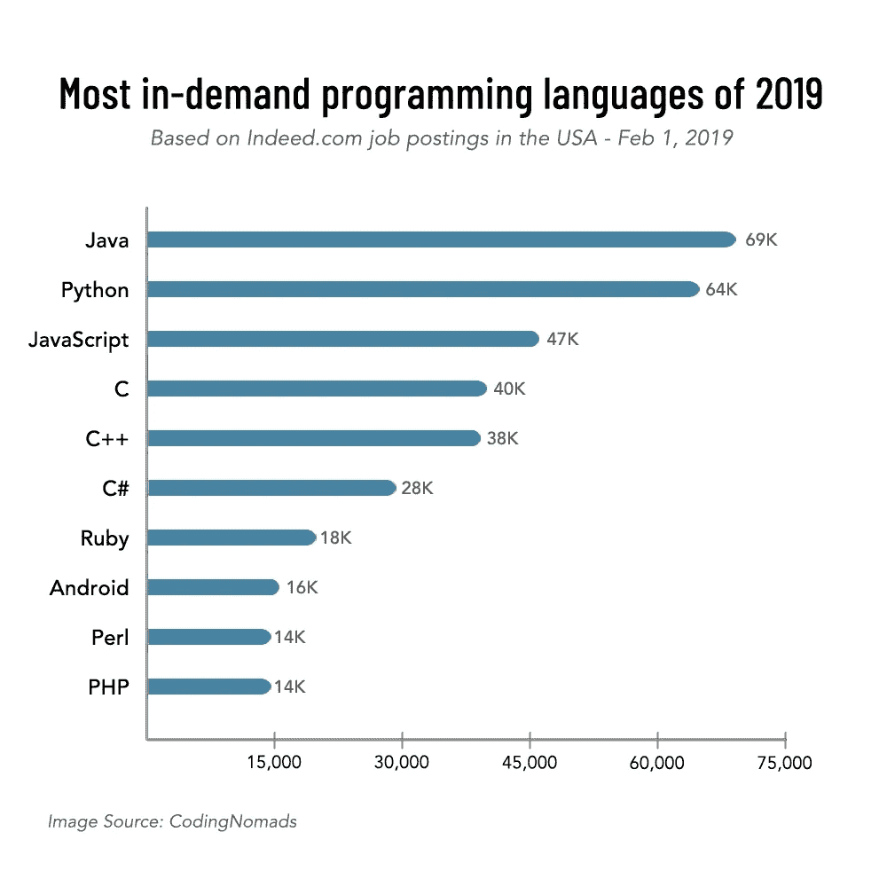

# Java 编程环境

> 原文：<https://medium.com/javarevisited/the-java-programming-environment-1bdc7833870e?source=collection_archive---------0----------------------->

Java 是一种强大的通用编程语言，自 1996 年问世以来，已经存在了 23 年。Java 编程环境包括—

1.  Java 语言 —程序员用来编写应用程序的语言
2.  **Java 虚拟机(JVM)** —用于执行应用程序
3.  **Java 生态系统**——为使用编程语言的开发者提供额外的价值

