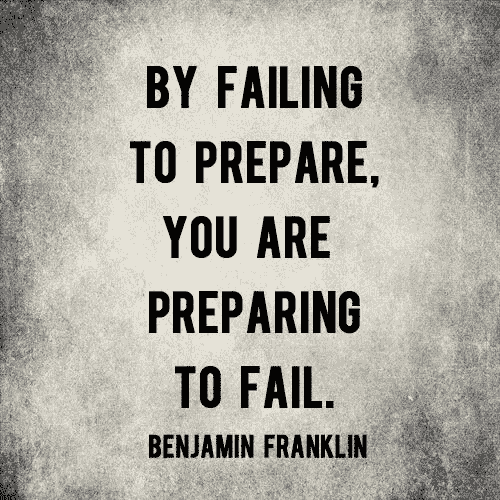

# 开球

> 原文：<https://medium.com/javarevisited/the-kick-off-edbb4309155d?source=collection_archive---------5----------------------->

挑选一个故事是一个在*敏捷*软件开发中常用的术语。但这到底意味着什么呢？似乎很多人并不真正理解，这是如何做到的，或者为什么要这样做。今天我想深入探讨一下这个话题，因为我认为这是一个重要的话题，不仅程序员需要理解，软件项目中的每个人也需要理解。

在[软件开发](/javarevisited/top-10-pluralsight-courses-to-learn-programming-and-software-development-during-covid-19-stay-at-30b7d8a4f88f)中，有许多活动发生在开始写代码之前。这些活动中的一些是有价值的准备工作，可以使编码会话顺利进行。这就是**开球**关于**的内容。**

**开球背后的想法和动机是什么？**

*   确保团队一致/理解即将开发的故事。
*   提取业务分析师给团队的需求，并在早期发现其中的错误。
*   如有必要，重新审视并调整故事的范围。
*   创建一个强制性的可重复的流程，以降低过早引入问题的风险
*   就需要完成的工作达成一致

**如何着手？** **开球**是另一种*敏捷*仪式，它并没有一个指定的配方，可能会因团队而异。接下来的只是一个关于在一个[敏捷软件开发](https://javarevisited.blogspot.com/2017/06/top-5-books-to-learn-agile-and-scrum-methodology.html)团队中启动过程的建议。

1.  **独立阅读故事描述**
    不管我们是否在结对编程环境中工作，我们都会花一些时间自己去阅读写在票证管理工具 [JIRA](https://javarevisited.blogspot.com/2020/08/top-5-courses-to-learn-jira-for.html) 中的需求。在一些公司，有时吉拉甚至什么都没有写，有的只是对话。在这种情况下，我们会写下我们对所听到的需要做的事情的理解。第一眼看到“大画面”的时间大约是 5 分钟到 20 分钟。试着想想你认为需要做什么，但不要花太多时间在不必要的细节上。
2.  写一些笔记，收集问题、疑问和假设。
    我们必须明白，开球 ***是团队活动*** 。我们 ***而不是*** 期望 100%理解需求中的一切，也不确切知道需要做的一切以及应该如何做。将你所有的顾虑、疑虑、假设、问题等记录在一个列表中，并在项目启动时保存。如果你没有准备好挑战，别人会替你做决定，在[编码](/javarevisited/7-best-coding-course-to-learn-programming-with-zero-experience-in-2020-52f7d0d9cb80)的时候，你会面临困难。所以不要只是坐在那里巡游，尽可能多的收集。
3.  **精心制作一份任务建议清单**
    现在和你的搭档程序员一起回来，或者如果我们没有，自己动手，你需要做的是为你的故事写下一份建议任务清单。运用你所有的知识和理解。如果有些事情你还不知道答案，不要担心。这份名单只是一份草稿，不是最终决定。这个草稿的目的是:
    ——让别人看到我们对手中故事的看法/感觉。
    -让开发人员更容易发现任务并行化的机会。
4.  **空验收测试**
    编写一个空验收测试(只是以给定的 When Then 格式的文本)将作为开始时的对话。真正失败的验收测试的正确创建将在以后作为一个独立的任务来完成。因为只有当所有关于需求的东西都被阐明时，我们才能编写一个准确且有意义的验收测试。在开始编码之前编写验收测试的过程被称为 ATDD(验收测试驱动开发)。
5.  **开球**终于，开球的时刻到了。现在，所有团队成员聚在一起，一起看这个故事。广管局将首先简要介绍这个故事。然后[开发人员](/javarevisited/top-10-online-courses-to-become-a-fullstack-web-developer-in-2020-d608a6b63232)将展示他们编写的空白验收测试。现在是使用我们最初收集的问题和假设的时候了。如果存在任何差异，将由团队澄清，验收测试将当场纠正。此时，故事被认为是从团队开始的(但还没有正式标记为开始)。
6.  **Dev 的演讲** 当启动完成后，我们确切地知道需要做什么，我们将与其他同事一起提炼我们制定的建议任务列表，并就我们可以同时完成的任务达成一致。很有可能在开球后，最初的草稿不再 100%准确，所以开发者将重新访问它并提炼出最终版本。这个最终的任务将在最初发布需求的地方发布，所以故事的进展对每个人都是透明的。
7.  **开始开发**
    开发者现在将准备他们的开发工具(例如重建本地数据库，同步 VCS，唤醒僵尸……)。当这完成时，开发人员将把故事移到“开发进行中”，开发就开始了。现在是喝咖啡的好时机；p

你喜欢这个故事吗？请跟随我们的[媒体简介](/@javing.uk)给一些掌声。
*最初我是在 2016 年 6 月*www.javing.blogspot.com*贴的这篇文章*