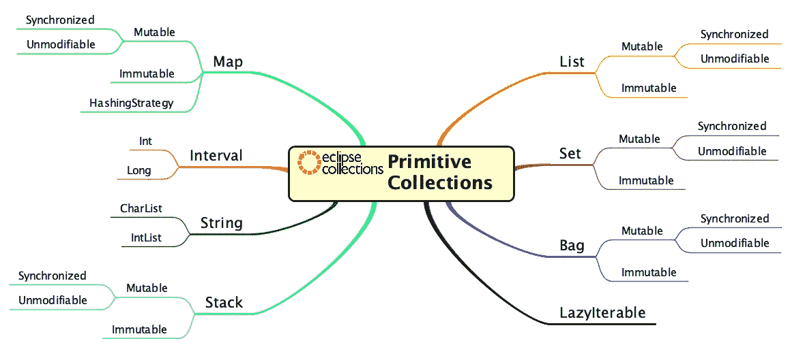
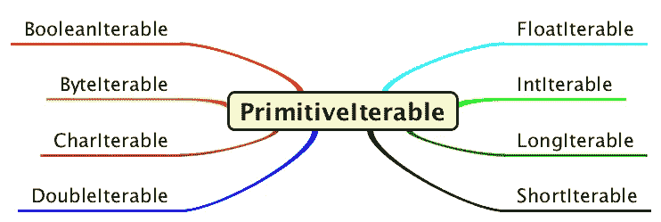
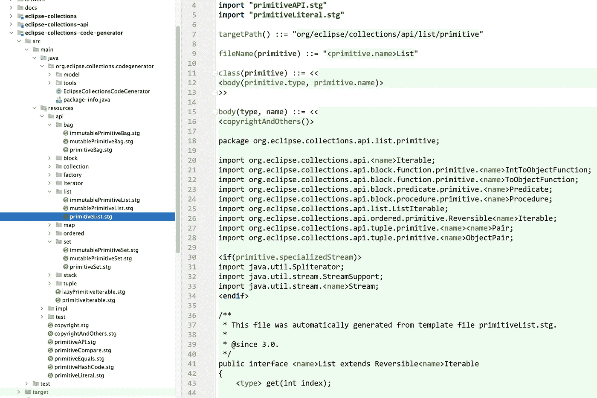

# 没有人告诉过你的缺失的 Java 数据结构——第 3 部分

> 原文：<https://medium.com/javarevisited/the-missing-java-data-structures-no-one-ever-told-you-about-part-3-d26387b9e66e?source=collection_archive---------4----------------------->

在 [Eclipse 集合](https://github.com/donraab/eclipse-collections)中了解原语集合支持。

照片由 [Alfonso Navarro](https://unsplash.com/@poncho_nj?utm_source=medium&utm_medium=referral) 在 [Unsplash](https://unsplash.com?utm_source=medium&utm_medium=referral) 拍摄

# 爪哇拳击的弊端

Java 有八种基本类型。分别是`boolean`、`byte`、`char`、`short`、`int`、`float`、`long`和`double`。每个基本类型都有相应的对象包装器。分别是`Boolean`、`Byte`、`Character`、`Short`、`Integer`、`Float`、`Long`和`Double`。装箱是获取原始值并将其存储在相应包装类型的实例中的过程。自动装箱是 Java 5 中添加的一个特性。自动装箱使得在相应的包装类的实例中自动包装原始值成为可能，而不需要开发人员显式地编写任何代码来执行包装。

原始值、包装类型、自动装箱和显式装箱

有关自动装箱和拆箱的更多信息，请参考 Java 教程中关于[自动装箱和拆箱](https://docs.oracle.com/javase/tutorial/java/data/autoboxing.html)的章节。

[“测量 JVM 中的对象大小”](https://www.baeldung.com/jvm-measuring-object-sizes)是一篇很好的文章，介绍了如何使用 [Java Object Layout](https://openjdk.java.net/projects/code-tools/jol/) ，这是一个 OpenJDK 代码工具项目。

## 为什么拳击是邪恶的？

Java 的拳击几乎是纯粹的浪费。开发人员最关心的是包装器中的原始值，而不是包装器本身。包装器的存在主要是为了让开发人员可以在集合中使用原始值。自动装箱的便利是邪恶的，因为它使开发人员能够悄悄地生成包装垃圾，这对他们的应用程序的性能有负面影响。

# 谢谢，请不要隐藏盒子！

[Eclipse Collections](https://github.com/eclipse/eclipse-collections) 通过提供完整的原始集合给开发者完全的控制权，帮助他们避免在 Java 堆中创建隐藏的盒子。今天，Eclipse Collections 有几种原始数据结构，可以处理所有八种原始类型。

原始集合高级视图

API 中支持对象和原语集合之间的转换。

类似于对象集合上的实现，返回类型是共变的，并且由子类型特殊化。我将通过展示可变和不可变类型的 API 示例来演示这一点。

# 可视化原始集合类型层次结构

PrimitiveIterable 是所有基元集合类型的父类型

单一基元类型(int)的可迭代类型层次结构

# 构建时代码生成

如果复制和维护上述图表的源代码八次似乎是一项不可能的任务，那么您是正确的。诀窍是我们从模板文件中代码生成基本的集合类型。Eclipse Collections 使用 [**StringTemplate**](https://www.stringtemplate.org/) 为其原始集合生成大部分 Java 源代码。这发生在构建时。所以你不会看到。GitHub 中原始集合的 java 源文件。然而，您会在`eclipse-collections-code-generator`模块中看到扩展名为. stg 的模板。

StringTemplate 模板文件:primitiveList.stg

# 给我看看代码

我将给出一种原始类型的所有原始数据结构的例子。有一个非常丰富的原始集合 API，我将在代码中演示相当多的方法。准备滚动，因为有很多例子。

## 目录

单击下面的链接跳转到某个部分。单击每个部分底部的目录链接返回此处。

*   [列表](#cb4c)
*   [设置](#6157)
*   [袋子](#2364)
*   [堆栈](#0bb8)
*   [地图](#de1c)
*   [懒惰](#0454)
*   [同步](#c66c)
*   [不可修改](#3e6a)
*   [字符串](#8f09)
*   [内存成本](#6f97)

## 原始列表

Eclipse 集合中的原语`List`实现是基于数组的。有可变和不可变的原始列表。下面的代码将演示可变和不可变类型上可用的 API。包层次结构中将出现一种模式，这将使在 IDE 中发现不同的类型变得更加容易。

**注:** `IntInterval`是一个`ImmutableIntList`。

[TOC](#d57c)

## 原始集合

Eclipse 集合中的原语`Set`实现是基于数组的，并且使用开放式寻址。有可变的和不可变的原语集合。下面的代码将演示可变集和不可变集上可用的 API。

[TOC](#d57c)

## 原始包

Eclipse 集合中的原语`Bag`实现由原语`Maps`提供支持。例如，`IntBag`将由`IntIntMap`支持。其中第一个`int`是`Bag`的类型，第二个`int`是`Bag`中每个值的计数。有可变和不可变的原始包。下面的代码将演示可变和不可变包上可用的 API。

[目录](#d57c)

## 原始堆栈

Eclipse 集合中的原语`Stack`实现由一个原语数组支持。有可变和不可变的原始堆栈。下面的代码将演示可变和不可变堆栈上可用的 API。

**注意:** `Stack`不是`Collection`，所以`Stack`没有`add`、`addAll`、`remove`、`removeAll`或`retainAll`这样额外的变异方法。在 Eclipse 集合中，`Stack`确实有丰富的可迭代方法集(例如，`select`、`reject`、`collect`等)。).

[TOC](#d57c)

## 原始地图

Eclipse 集合中的原语`Map`实现支持键类型和值类型的所有组合。在键和值类型相同的情况下，键和值都存储在一个数组中。如果键和值类型不同，它们将存储在不同的数组中。有可变和不可变的原始地图。下面的代码将演示可变和不可变映射上可用的 API。

注意:Eclipse 集合中的`Map`类型在值上是`Iterable`。所以一个`IntIntMap`也是一个`IntIterable`，支持`IntIterable`上可用的全套方法。

[目录](#d57c)

## 原始惰性可迭代

每个原始集合都可以通过调用`asLazy`返回一个惰性视图。下面的代码将展示一些在`LazyIntInterable`上可用的惰性操作。

[目录](#d57c)

## 原始同步集合

每个可变的原始集合都可以通过调用`asSynchronized`返回一个同步视图。在没有显式锁定的情况下，同步集合与`iterator`一起使用是不安全的。但是，在方法内部获取锁的类型上有大量不同的原子操作。

[目录](#d57c)

## 原始不可修改集合

每个可变的原始集合都可以通过调用`asUnmodifiable`返回一个不可修改的视图。不可修改的集合与`add`、`remove`等可变方法一起使用不安全。因为他们会扔一个`UnsupportedOperationException`。然而，集合中有大量的只读方法可用。

[TOC](#d57c)

## 原始字符串

Eclipse 集合有三个原始的`String`适配器— `CharAdapter`、`CodePointAdapter`、`CodePointList`。这些类型为`String`中的字符或代码点提供了丰富的原始协议。`CharAdapter`和`CodePointAdapter`是一个`String`上的纯视图。`CodePointList`实际上将来自`String`的代码点缓存在一个`ImmutableIntList`中。

[目录](#d57c)

## 内存成本

将原语打包成包装器会带来巨大的内存开销。下表显示了在原始数据结构和装箱数据结构中存储 100 万个 int 值的内存比较成本。我可能需要一段时间来把它绘制成图表，但是我想我应该早点分享这些原始的比较，以及我用来计算它们的代码。

原始集合和装箱集合的内存开销比较表

**注**:最容易收集的垃圾是从未产生的垃圾。

# 等待瓦尔哈拉

我对 Valhalla 项目给 Java 带来的希望感到兴奋。你可能正在等待项目 [Valhalla](https://openjdk.java.net/projects/valhalla/) 来提高你正在编写的代码的性能。我真希望我能等到瓦尔哈拉。这可能会为我和许多其他从事 Eclipse 集合和其他原始集合库工作的人节省大量工作。不幸的是，等待编程语言未来版本的高级功能并不是每个人都可以选择的。

大约九年前，我们将具有丰富 API 的原始集合添加到了 Eclipse 集合中。我们看到的好处是显著的。对这些好处的认识有望帮助维持 [JEP 218:泛型优于原语类型](https://openjdk.java.net/jeps/218)的持续关注和发展。

我很高兴我们没有等。我们在原始收藏领域学到的和继续学到的经验可以帮助我们了解瓦尔哈拉工程的设计和开发。

# 关于 Java 中缺失数据结构的思考

即使到了 Java 的 Valhalla 之后，Java 中也会有很多缺失的数据结构。去年，我写了一篇关于 Java 收藏领域需要复兴的文章。一个全面的 Java 集合库的潜在特性空间是巨大的。基于[月食收藏](https://github.com/eclipse/eclipse-collections)的规模，这一点显而易见。无论如何，我们将继续 Eclipse 集合，并帮助发展 Java 集合空间。

我希望您喜欢我对一些没有人告诉过您的缺失的 Java 数据结构的三部分概述。现在你可以说有人告诉了你其中的一些。

*特别感谢*[*Siri sha Pratha*](https://medium.com/u/8fe7c47c374f?source=post_page-----d26387b9e66e--------------------------------)*校对本博客的草稿版本。*

*我是*[*Eclipse Foundation*](https://projects.eclipse.org/projects/technology.collections)*的*[*Eclipse Collections*](https://github.com/eclipse/eclipse-collections)*OSS 项目的项目负责人。* [*月食收藏*](https://github.com/eclipse/eclipse-collections) *为* [*投稿*](https://github.com/eclipse/eclipse-collections/blob/master/CONTRIBUTING.md) *打开。如果你喜欢这个库，你可以在 GitHub 上让我们知道。*

其他 **Java 编程文章**你可能喜欢:
[完整的 Java 开发者路线图](https://javarevisited.blogspot.com/2019/10/the-java-developer-roadmap.html)
[Java 程序员应该学习的 10 件事](/javarevisited/9-things-java-programmers-should-learn-in-2018-3f0b2207dfc4)
[你可以学习的 10 种编程语言](/hackernoon/10-best-programming-languages-to-learn-in-2019-e5b05af4a972)
[10 种工具每个 Java 开发者都应该知道的](http://www.java67.com/2018/04/10-tools-java-developers-should-learn.html)
[2021 年学习 Java 编程语言的 10 个理由](http://javarevisited.blogspot.sg/2013/04/10-reasons-to-learn-java-programming.html)
[我最喜欢的初学者免费编程课程](/javarevisited/top-10-free-interactive-programming-courses-from-educative-for-beginners-to-learn-in-2021-713cbf96d4eb)
7 最佳数据结构与算法初学者课程
[50+数据结构与算法面试题](/hackernoon/50-data-structure-and-algorithms-interview-questions-for-programmers-b4b1ac61f5b0)

 [## 2021 年 Java 程序员路线图

### 2021 年成为 Java 开发人员的图解指南，包含相关课程的链接

medium.com](/javarevisited/the-java-programmer-roadmap-f9db163ef2c2)