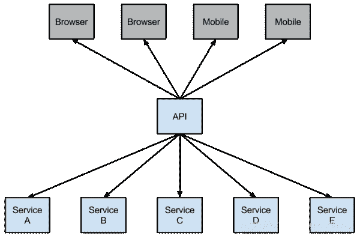

# 有史以来最简单的春云教程|第四章:断路器(Hystrix)(芬奇利版)

> 原文：<https://medium.com/javarevisited/the-most-easiest-springcloud-tutorial-ever-chapter-4-circuit-breaker-hystrix-finchley-version-680c3117fb9e?source=collection_archive---------0----------------------->


在微服务架构中，按照业务逐一划分服务，服务之间可以互相调用(RPC)。在[春云](/javarevisited/5-best-courses-to-learn-spring-cloud-and-microservices-1ddea1af7012)中，可以使用 RestTemplate+Ribbon 和 Feign 进行调用。为了保证其高可用性，通常在集群中部署单个服务。

由于网络原因或自身原因，无法保证服务 100%可用。如果单个服务有问题，调用这个服务时会发生线程阻塞。此时，如果大量请求涌入，servlet 容器的线程资源就会被消耗。，导致服务瘫痪。

服务之间的依赖性，故障会向整个微服务系统传播并造成灾难性的严重后果，这就是服务故障的“雪崩”效应。

为了解决这个问题，业界提出了断路器模型。

1.  **断路器简介**

```
Netflix has created a library called Hystrix that implements the circuit breaker pattern. In a microservice architecture it is common to have multiple layers of service calls.
```

网飞开源了 Hystrix 组件来实现断路器模式，而 [Spring Cloud](/hackernoon/top-5-spring-boot-and-spring-cloud-books-for-java-developers-75df155dcedc) 集成了这个组件。在微服务架构中，一个请求调用多个服务是很常见的，如下图所示:

[](https://javarevisited.blogspot.com/2018/04/top-5-spring-cloud-courses-for-java.html)

如果较低级别的服务出现故障，可能会导致级联故障。当对特定服务的呼叫的不可用性达到阈值(Hystric 是 5 秒内 20 次)时，断路器将被打开。

[](https://javarevisited.blogspot.com/2018/02/top-5-spring-microservices-courses-with-spring-boot-and-spring-cloud.html)

断路器分闸后可以避免连锁故障，回退法可以直接返回定值。

**2。准备工作**

本文基于上一篇文章的项目，先启动上一篇文章的项目，启动 eureka-server 项目；启动 service-hi 项目，它的端口是 8762。

**3。使用色带中的断路器**

要转换 serice-ribbon 项目的代码，首先将 spring-cloud-starter-网飞-hystrix 的起始依赖项添加到 pox.xml 文件中:

```
<dependency>
            <groupId>org.springframework.cloud</groupId>
            <artifactId>spring-cloud-starter-netflix-hystrix</artifactId>
  </dependency>
```

将 [@EnableHystrix 注释](https://www.java67.com/2018/12/top-5-spring-cloud-annotations-for-java.html)添加到程序的启动类 ServiceRibbonApplication 中，以启用 Hystrix:

```
[@SpringBootApplicatio](http://twitter.com/SpringBootApplicatio)n
[@EnableEurekaClient](http://twitter.com/EnableEurekaClient)
[@EnableDiscoveryClien](http://twitter.com/EnableDiscoveryClien)t
[@EnableHystrix](http://twitter.com/EnableHystrix)
public class ServiceRibbonApplication {public static void main(String[] args) {
        SpringApplication.run( ServiceRibbonApplication.class, args );
    }[@Bean](http://twitter.com/Bean)
    [@LoadBalanced](http://twitter.com/LoadBalanced)
    RestTemplate restTemplate() {
        return new RestTemplate();
    }}
```

修改 HelloService 类，将 [@HystrixCommand](http://twitter.com/HystrixCommand) 批注添加到 hiService 方法中。此注释为此方法创建了断路器的功能，并指定了 fallbackMethod 断路器方法。断路器方法直接返回一个字符串，字符串是“hi，”+name+“，对不起，错误！”，代码如下:

```
[@Service](http://twitter.com/Service)
public class HelloService {[@Autowired](http://twitter.com/Autowired)
    RestTemplate restTemplate;[@HystrixCommand](http://twitter.com/HystrixCommand)(fallbackMethod = "hiError")
    public String hiService(String name) {
        return restTemplate.getForObject("[http://SERVICE-HI/hi?name=](http://SERVICE-HI/hi?name=)"+name,String.class);
    }public String hiError(String name) {
        return "hi,"+name+",sorry,error!";
    }}
```

开始:服务丝带项目，当我们访问 [http://localhost:8764/hi？name=forezp](http://localhost:8764/hi?name=forezp) ，浏览器显示:

```
*hi forezp,i am from port:8762*
```

此时，关闭 service-hi 项目。当我们访问 [http://localhost:8764/hi？同样，浏览器将显示:](http://localhost:8764/hi?name=forezp)

```
hi ,forezp,orry,error!
```

这意味着当 service-hi 项目不可用时，service-ribbon 调用 service-hi API 时，会快速失败，直接返回一组字符串，而不是等待响应超时，很好地控制了容器。线程被阻止。

**4。在佯装中使用断路器**

Feign 自带断路器，D 版[春云后，](https://www.java67.com/2021/01/spring-cloud-interview-questions-with-answers-java.html)默认不开启。您需要在配置文件中配置它。要打开它，请将以下代码添加到配置文件中:

```
*feign.hystrix.enabled=true*
```

要基于 service-feign 项目进行转换，您只需将指定的 fallback 类添加到 FeignClient 的 ScheduleServiceHi 接口的注释中:

```
[@FeignClient](http://twitter.com/FeignClient)(value = "service-hi",fallback = SchedualServiceHiHystric.class)
public interface SchedualServiceHi {
    [@RequestMapping](http://twitter.com/RequestMapping)(value = "/hi",method = RequestMethod.GET)
    String sayHiFromClientOne([@RequestParam](http://twitter.com/RequestParam)(value = "name") String name);
}
```

ScheduleServiceHiHystric 需要实现 ScheduleServiceHi 接口，并将其注入 Ioc 容器。代码如下:

```
[@Component](http://twitter.com/Component)
public class SchedualServiceHiHystric implements SchedualServiceHi {
    [@Override](http://twitter.com/Override)
    public String sayHiFromClientOne(String name) {
        return "sorry "+name;
    }
}
```

启动四个 servcie-feign 项目，打开浏览器 [http://localhost:8765/hi？name=forezp](http://localhost:8765/hi?name=forezp) ，注意此时 service-hi 项目没有启动，网页显示:

```
*sorry forezp*
```

打开 service-hi 项目，再次访问，浏览器显示:

```
hi forezp,i am from port:8762
```

这证明断路器是工作的。